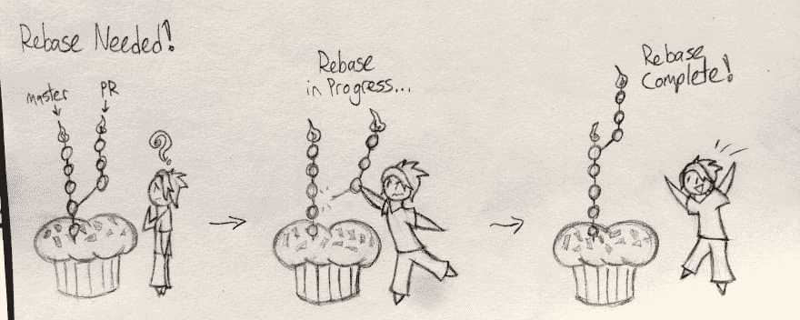

# 我希望我有 Git Rebase 介绍

> 原文:[https://dev . to/Maxwell _ dev/the-git-rebase-introduction-I-wish-id-had](https://dev.to/maxwell_dev/the-git-rebase-introduction-i-wish-id-had)

在我的新工作中，最重要的(也是最令人困惑的)git 特性之一是重定基础。现在回想起来，最糟糕的部分是没有找到一个清晰的初学者指南。所以对于过去的我，以及任何未来的开发者，比如过去的我，这篇介绍是给你的！

给大学时代的过去的我的另一个小提示:用 Jekyll 做你的个人网站。不要把你微薄的大学预算浪费在托管一个 WordPress 网站上...

无论如何，请欣赏！本文假设您对 git 和版本控制有基本的了解，并且喜欢纸杯蛋糕。你会明白为什么。

### 首先，为什么我需要重定基础？

假设你是一名初级开发人员，在一家名为丘比特纸杯蛋糕的纸杯蛋糕店工作。它做了大量的在线销售，并有许多经验丰富的开发人员不断改进它。你主要负责前端工作。

您的第一个任务是更新卡组件。当人们寻找要购买的纸杯蛋糕时，每个纸杯蛋糕都在这些卡片中。所以你去回购，拉最新版本的主分支，从那个创建一个新的分支，并开始工作！

几次提交之后，您就万事俱备了。卡片看起来更好，所有的测试都通过了，你甚至改进了移动布局。剩下的就是将你的功能分支合并回主分支，这样它就可以运行了！

但是等一下！

不出所料，当你制作这个卡片组件时，其他人也在网站上工作。

*   一个开发者改变了导航
*   其中一个调整了数据库字段，删除了不需要的信息
*   另一个添加了每个纸杯蛋糕的额外信息
*   有人通过商店的银行记录偷偷挪用了钱

所有这些变化都让你担心。如果有人合并了影响您所做的更改或与您所做的更改重叠的更改，该怎么办？这可能会导致纸杯蛋糕网站出现漏洞！如果你看看不同的变化，有一个！(另一个变化应该报警，但那其实没那么重要)。有没有一种安全的方法来合并您的更改，而不会有任何冲突的风险，也不会错过所有其他的更改？

类似这样的情况是你想改变基础的好例子。

### 重基础有哪些细节？

假设当您从主分支创建分支时，主分支处于提交#1。分支中的每个提交都位于提交#1 之上。当您准备合并您的分支时，您发现其他开发人员进行了更改，并且最近的提交是提交#5。

重置基础是**获取分支的所有提交，并将其添加到提交#5 的顶部，而不是提交#1** 。如果您将提交#1 视为您的分支的“基础”,那么您正在将该基础更改为最新的基础，即提交#5。因此，为什么它被称为 rebasing！

[T2】](https://res.cloudinary.com/practicaldev/image/fetch/s--InTOasci--/c_limit%2Cf_auto%2Cfl_progressive%2Cq_auto%2Cw_880/https://thepracticaldev.s3.amazonaws.com/i/7qzryt6xov0hcsmek83n.jpg)

### 好的，那么我如何重定基数呢？

所以你得到了丘比特纸杯蛋糕的卡片组件。既然你知道什么是重定基准*什么是*，让我们更详细地看看*如何*。

首先，**确保你有最新版本的分支。**让我们继续假设在这个例子中是主分支。运行`git checkout master`来检查它，然后运行`git pull`来获得最新版本。然后再次检查你的分支——这是与`git checkout updated-card`或类似的东西。

一个简单的 rebase 有一个非常简单的命令结构:`git rebase <branch>`。`branch`是你对*重新设定基数的人。*所以在这里你可以运行`git rebase master`。假设没有冲突，这就是 rebase 所需要的！

rebase 本身在技术上删除了您的旧提交，并使新提交与它们相同，重写了 repo 的提交历史。这意味着将重组推至远程回购将需要一些额外的动力。使用`git push --force`可以很好地完成这个任务，但是更安全的选择是`git push --force-with-lease`。后者会提醒你任何你没有注意到的上游变化，并阻止这种推动。这样你可以避免覆盖其他人的工作，所以这是更安全的选择。

至此，你的 rebase 就完成了！然而，rebases 不会总是如此顺利...

### 如何处理重置基础冲突？

还记得我们担心我们的新卡会和其他人的变更冲突吗？事实证明，确实有一个！一名开发者在新的纸杯蛋糕卡上添加了额外的信息，比如卡路里计数或者晚上需要多少个精灵来制作它。来自两组变更的更新的标记在相同的行中——这意味着重定基础不能自动发生。Git 不知道哪些部分的更改要保留，哪些要删除。必须解决！

谢天谢地，git 让这变得非常容易。在重建基础的过程中，git 将每个提交逐个添加到新的基础上。如果它遇到一个冲突，它会暂停重建基础并在修复后继续。

如果你在处理之前已经处理过[合并冲突，那么重定基础冲突的处理方式基本相同。运行`git status`将告诉你冲突在哪里，两个冲突的代码段将紧挨着，这样你就可以决定如何修复它们。](https://help.github.com/articles/resolving-a-merge-conflict-using-the-command-line/)

一旦一切都被修复，`add`和`commit`的变化就像你会一个正常的合并冲突。然后运行`git rebase --continue`,这样 git 就可以重新设置你提交的其他内容。它会暂停任何更多的冲突，一旦它们被设置，你只需要`push --force-with-lease`。

您还可以使用两个较少使用的选项。一个是`git rebase --abort`，它会把你带回到你开始重定基数之前。这对于你不能仓促做出决定的意外冲突很有用。另一个是`git rebase --skip`，它跳过了导致冲突的提交。除非这是一个不必要的提交，并且你觉得很懒，否则你可能不会经常使用它。

### 我可以获得重定基数过程的额外控制吗？

如您所见，Git Rebasing 非常强大。正如某些有商标的英雄告诉我们的那样，强大的力量带来巨大的责任。令人欣慰的是，重置基础让您可以更好地控制这个过程。

为此，只需在命令中包含`--interactive`或`-i`标志即可！对于我们的蛋糕 rebase，它会是`git rebase -i master`。

这显示了您将要重新排序的所有提交的列表。你可以选择哪些停下来编辑，哪些跳过，甚至可以把一些合并在一起！在这里我不会讲太多的细节，但是这篇文章是一个很好的阅读起点。

还要注意:所有这些都是通过一个 VIM 接口完成的，这个接口非常有用，甚至更难学。要按原样运行重设基础，请按`esc + : + w + q + enter`。我将把解释这是什么意思的教程和 VIM 的其余部分留给其他人。

### 最后，一个有用的重置技巧:自动撤销！

在交互式 rebases 中，我想分享的一个有用的技巧是自动撤销提交。这是将两个提交合并在一起，并重命名新的提交。如果您有许多小的、相似的提交可以合并，或者需要修改旧的提交，这是一个很好的技巧。使用奇妙的“自动撤销”功能，重置基础可以很容易地做到这一点

假设我们的分支中有五个丘比特纸杯蛋糕新卡的提交。然后我们意识到我们在第二次提交时错过了一个小细节！如果我们想保持我们的提交历史干净，我们需要将这个更改合并到第二次提交中。

我们使用一个`fixup`提交来完成这个任务，它是这样完成的:

1.  做出并实施你的改变。
2.  获取提交的 ID，您也要添加它们。对于我们的例子，假设它是 123456ABCD。你可以通过运行`git log`找到这个。
3.  修正提交的公式是`git commit --fixup <commitID>`。在这种情况下，我们将使用`git commit --fixup 123456ABCD`。这将像平常一样提交更改，但是名称将与我们的第二次提交相同，并有“fixup！”预先考虑。
4.  接下来我们运行一个 rebase，但是包含正确的参数是很重要的！我们会跑`git rebase -i --autosquash master`。
5.  我们将看到交互式 rebase 的普通页面，所有提交都列在 VIM 接口中。但是我们的修正提交将在我们的第二个提交的正下方，被设置为自动合并到它里面！
6.  运行 rebase，您的提交将自动合并！如果有冲突，它会像平常一样要求你去解决，然后 rebase 会继续。

这对于更新提交非常有用，不会因为大量的“小修正”更改而污染历史，使其变得乏味和混乱。最好的提交历史讲述一个可以理解的故事。自动撤销使它不会被讨厌的脚注淹没。所以好好利用吧！

### 享受你的纸杯蛋糕吧！

希望这篇文章有助于解释 git rebasing 的基础知识，它做什么，以及如何开始使用它。最后，我自己对 rebases 的理解使它们成为我工作中经常使用的重要工具。我希望其他初级开发人员也能这样做，而不会有我在这个过程中遇到的一些挫折/后推恐慌。

毕竟，我们都想帮助更多的人购买和食用纸杯蛋糕，不是吗？当然啦！Git Rebasing，像所有好东西一样，让我们更接近那个目标。

[T2】](https://res.cloudinary.com/practicaldev/image/fetch/s--qunsXjeG--/c_limit%2Cf_auto%2Cfl_progressive%2Cq_auto%2Cw_880/https://thepracticaldev.s3.amazonaws.com/i/m0k03vwnvd76m5uj4vos.jpg)