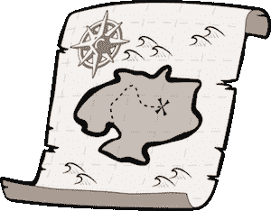
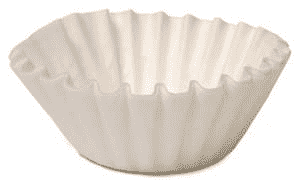

# Javascript 冒险第 1 部分

> 原文：<https://dev.to/triplejdev/adventures-in-javascript-pt1>

我一直在考虑写更多的东西，但我想得越多，做得就越少。所以今天我停止了思考，开始写作。

从这里只能走下坡路了…

主要是，我想不出有什么可写的。我所知道的大多数事情都是关于死亡的。但是今天，我意识到:没关系！每个人学习东西的方式都不一样(顺便说一下，这也没什么)，所以可能有人不理解某些东西，因为它只是没有以适合他们学习方式的方式进行演示或解释。

除此之外，他们说巩固你所学知识的最好方法是把它写下来，或者传递下去。也许这能帮助某人，即使那个人只是我！

<figure>[](https://res.cloudinary.com/practicaldev/image/fetch/s--gKKeNc85--/c_limit%2Cf_auto%2Cfl_progressive%2Cq_auto%2Cw_880/https://cdn-images-1.medium.com/max/888/1%2Agj0PczAJKxzDtNf7aMrLFg.png) 

<figcaption>某种冒险型的纨绔子弟</figcaption>

</figure>

今天早上，我在思考 Javascript 中函数的组合链接——随着我们转向更函数化的风格，我们越来越多地在工作中这样做(是的，是的——我知道这不是真正的函数式编程，但这是朝着正确方向迈出的一步。注意，我说的是风格。我们还没有完全成熟的哈斯克尔和 twiddly 胡子…)。

无论如何，我想我会把我的想法放在老的最爱上——贴图、过滤和减少。这些让我绞尽脑汁。我读了很多书，看了很多视频(感谢弗里斯比教授)，但就是坚持不下来。它们并不难，但我的大脑就是无法处理，不管是什么原因。

首先是**地图**:

可以对数组调用 Map，然后对第一个数组中的每一项调用传递给它的函数。

```
const addOne = num => num + 1;
let nums = [1,2,3,4,5,6,7,8,9];
let jsMap = nums.map(addOne); // [2, 3, 4, 5, 6, 7, 8, 9, 10] 
```

Enter fullscreen mode Exit fullscreen mode

您可以将它粘贴到您的编辑器或 IDE 中，并使用 Node 运行来亲自查看(所有这些示例都是如此)。

记住这不一定是传入的函数也是有用的(尽管，这可能在 filter 和 reduce 中更有用):

```
let nums = [1,2,3,4,5,6,7,8,9];

let jsMap = nums.map(num => num>= 5);
// [false, false, false, false, true, true, true, true, true] 
```

Enter fullscreen mode Exit fullscreen mode

关于 map 重要的是**原数组未修改:**

```
const addOne = num => num + 1;
let nums = [1,2,3,4,5,6,7,8,9];
let jsMap = nums.map(addOne); // [2, 3, 4, 5, 6, 7, 8, 9, 10]
console.log(nums); // [1, 2, 3, 4, 5, 6, 7, 8, 9] 
```

Enter fullscreen mode Exit fullscreen mode

在我看来，这是函数式编程的主要优点之一- **不变性**。基本上，这意味着原来的*的东西*保持不变。没有变异。通过辐射或其他东西。

<figure>[](https://res.cloudinary.com/practicaldev/image/fetch/s--IHrXBePW--/c_limit%2Cf_auto%2Cfl_progressive%2Cq_auto%2Cw_880/https://cdn-images-1.medium.com/max/300/1%2AF4bhZugZLbxJtVcYXPknuw.png) 

<figcaption>地图。不是吗。</figcaption>

</figure>

所以，回到我的开场白——这个解释有什么不同？如果你试图理解这些“纯函数”,我相信你已经看过 addOne 函数无数次了。嗯，没什么。目前为止。

但是现在，我想我会写一个手动地图功能。对循环使用好的、老式的 JavaScript(虽然，这些现在几乎是魔鬼)。每个人都理解孤独。如果你没有，我会回到一些更基本的东西…

所以，开始了(使用我们之前的 addOne 函数):

```
const map = (arr, func) => {
  let results = [];
  for(let i = 0; i < arr.length; i++) {
    let result = func(arr[i]);
    results.push(result);
  };

// Note that results is returned -
  // the original array that was passed in is non-radioactive

return results;
  }

let ourOwnVerySpecialMapResults = map(nums, addOne);
// [2, 3, 4, 5, 6, 7, 8, 9, 10]

// Nums is still unchanged
console.log(nums); // [1, 2, 3, 4, 5, 6, 7, 8, 9] 
```

Enter fullscreen mode Exit fullscreen mode

需要注意几件事——原始的 nums 数组没有变得有放射性(或者以任何方式改变)。当 addOne 函数被传递到我们的地图时，只有名字被传递，而没有函数被调用——这是在我们写的手动地图中完成的。

但是最重要的是**这只是一个 for 循环！！**

传递给函数的数组值的每个结果都被推送到一个返回的新数组中。

我想接下来的问题是:如果有这么简单，我们为什么要使用 JS 地图？嗯，我们可以很容易地将其他函数链接到映射结果的末尾。稍后会详细介绍。第 2 部分，也许(如果有的话)…

接下来，**过滤器:**

与 map 一样，filter 实际上只是另一个伪装的 for 循环。它遍历一个数组，检查每个值，如果值符合预期，就把它传递给一个新的数组。像这样:

```
let nums = [1,2,3,4,5,6,7,8,9];
let jsFilter = nums.filter(num => num > 5); // [6, 7, 8, 9] 
```

Enter fullscreen mode Exit fullscreen mode

因此，它遍历 nums，检查每个值，看它是否大于 5:

`num => num > 5`

如果是，则在数组中返回它。简单。

<figure>[](https://res.cloudinary.com/practicaldev/image/fetch/s--1YHwGkY0--/c_limit%2Cf_auto%2Cfl_progressive%2Cq_auto%2Cw_880/https://cdn-images-1.medium.com/max/300/1%2A-5TVKUIC9xGONGkqGYl5Zw.jpeg) 

<figcaption>滤镜。不是吗。</figcaption>

</figure>

我们有了它，一个简单的 JS 过滤器。和以前一样，我们自己写:

```
const moreThanFive = num => {
  if (num > 5) {
    return num;
  }
}

const filter = (arr, check) => {
  let results = [];
  for(let i = 0; i < arr.length; i++) {
    if (check(arr[i])) {
      results.push(arr[i]);
    }
  };
  return results; // nums is still non-mutant
};

let ourOwnVerySpecialFilterResults = filter(nums, moreThanFive);
// [6, 7, 8, 9] 
```

Enter fullscreen mode Exit fullscreen mode

和以前一样，它只是一个 for 循环，但是内部有一个 if 语句，用于控制将哪些内容推送到结果数组。

这有道理吗？你和我在一起吗？我希望如此…

最后，**还原:**

所以。Reduce 需要两样东西:一个函数和一个“3.5 英寸软盘”(或者你选择的存储设备)。它遍历被调用的数组，将每个值传递给函数，然后保存到软盘(Minions USB 记忆棒)。软盘不一定是数字，也可以是数组等。-只要记住它将坚持它的类型:如果你的软盘(64gb Sandisk micro SD 卡)是一个数组开始，函数的结果将被推送到该数组。如果它是一个数字，你可以指定做什么——加，减，等等。

```
let jsReduce = nums.reduce((sum, num) => {
  if (moreThanFive(num)) {
    return sum + num;
  } else {
    return sum; // nums is unaffected still
  }
// The floppy disk here is the (number) 0 passed after the function:
}, 0);
// 30 (6 + 7 + 8 + 9) 
```

Enter fullscreen mode Exit fullscreen mode

这将通过我们的 nums 数组，检查值是否大于 5。如果是，它将把它保存到软盘(螺旋装订、有线条的笔记本)。

你可以把它想象成一种地图功能，但是所有的结果都被简化成一个。

<figure>[](https://res.cloudinary.com/practicaldev/image/fetch/s--x5MDoQXp--/c_limit%2Cf_auto%2Cfl_progressive%2Cq_auto%2Cw_880/https://cdn-images-1.medium.com/max/300/1%2AXdsk3ImRVrfZ_KZB-qtAVA.jpeg) 

<figcaption>降格。Geddit？</figcaption>

</figure>

这可能是三个中比较复杂的一个。花些时间确保你得到了它做了什么，而不一定是 T2 如何做的。

所以，让我们试着编写自己的 reduce 函数:

```
const reduce = (floppyDisk, arr) => {
  for(let i = 0; i < arr.length; i++) {
    if (arr[i] > 5) {
      floppyDisk += arr[i];
    }
  };
  return floppyDisk; // nums is still not a mutant/zombie/whatever
} 
```

Enter fullscreen mode Exit fullscreen mode

这是一个非常简单的版本——它只适用于数字，但你会明白的。JS 版本更强大——它可以推进到数组等。

但是，你可以看到它仍然是一个带有 if 检查的 forloop。

我希望这已经澄清了这三个高阶函数。我认为我在使用它们之前相当自信，但是写这篇文章让我真正明白了。

给他们一个尝试，看看它如何为你工作。

如果有帮助，请告诉我——发表评论、转发或其他方式。

如果错了，告诉我。

可能有比这更好的方法，但是我已经尽力保持它的清晰和简单。

记住孩子们:当他们试图学习的时候，把变量减少到一个字母真的对任何人都没有帮助。