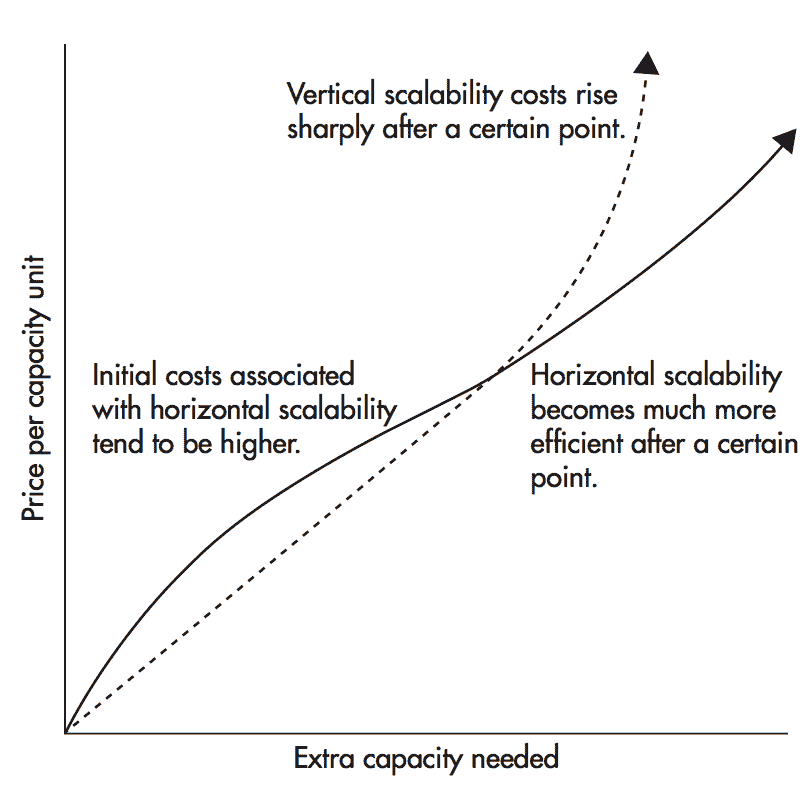

# 软件工程师——可伸缩性介绍

> 原文:[https://dev.to/tomerbendavid/for-software-engineers-可扩展性-简介](https://dev.to/tomerbendavid/for-software-engineers---scalability-introduction)

**简介**

可伸缩性不仅是一个有趣的话题，而且也是一个很难找到组织良好的资源进行适当研究的话题。要找到必要的可伸缩性资源，从零开始教你，让你成为这方面的软件工程专家，即使不是不可能，也是非常困难的。你需要收集你的资源。这就是为什么我们对推进和尝试评估什么是可伸缩性以及如何通过最终确定和组织主题来实现它非常感兴趣。

**可扩展性——不仅仅是架构/服务器的问题**

关于可伸缩性，首先要问的问题是它是业务问题还是技术问题。嗯，你可以把可伸缩性看作仅仅是一个高科技问题，你需要扩展你的数据库或服务。但是，您需要记住，可伸缩性问题在人类历史上一直存在。我们需要知道如何扩大我们的食物增长。我们需要知道如何扩大我们的汽车制造规模。你看，可扩展性发生在硅谷挤满程序员之前。

在您的高科技企业中，您可以将扩展 it 挑战视为真实物理流程扩展的反映，这些物理流程也需要扩展。当我们讨论可伸缩性时，它不仅仅是一个技术方面，也不仅仅是您在白板上绘制的一组图表或方框，或者仅仅是将请求扩展到多个服务器。

这是一个现实生活中的情况，也是一个你在低技术和高技术行业中以惊人的相似方式解决的问题。当你有了一个组织，你就有了人。其中一些人负责创建您的架构，可能是架构师或高级开发人员，或者，如果您是一家小公司，那么所有开发人员都在做架构！当然，最好是在一个大公司里，所有的开发人员都能够创建他们的架构，但是仍然有一些人或者一些架构师在高层。因此——可伸缩性首先是人和业务要处理的“事情”!人们正在创建体系结构，因此我们需要通过让我们的人员创建可扩展的体系结构来扩展我们的业务，我们首先需要让人们能够！

**人类创造建筑**

当我们谈论可伸缩性时，我们应该看到在我们眼前的人正在创造技术。在开发人员的眼中，一个组织结构是如此的遥不可及，以至于它实际上是相当重要的。结构问题，比如团队规模应该是多少？如果考虑和回答得当，将会使您能够创建更好的 an 架构。现在，当你选择你的组织结构时，你需要考虑几个因素，其中一些是你需要多少与人之间的交流。你需要最少的交流来让人们做好工作。

显然，如果人们之间需要过多的交流，那么不仅您的业务不会快速增长、不可扩展，而且他们创建的架构也不会与您想要的解决方案保持最佳一致。

**打破规则**

另一个要问的问题是，你是否应该有规则。你所拥有的严密的规则系统会产生影响。您可以选择非常严格的规则和流程，但这也会阻碍您的扩展能力。这是因为，**如果你对人们施加太多的规则，**他们的起飞空间就会减少，而且，当你扩大规模时，你需要打破一些规则。现在，你可以说你应用了一个规则，使人们能够打破规则。但通常这是一个告密者，你需要能够以更自然的方式打破你的规则。**为了扩大规模，你需要有创造性思维，而创造性思维需要打破规则**。

CEO 是不是软件工程师？

让我们以五大 IT 公司为例，比如亚马逊、谷歌、脸书、推特和微软。你看到首席执行官们都来自技术背景，这让你认为一个有技术背景的人可以在今天的氛围中创建一个更具可扩展性的解决方案或想法，现在，对任何人来说，了解你的员工做出的架构决策确实非常重要，这非常重要，但不是必须的，airbnb 创始人不是技术人员。我们在这里只是说，这是一个非常高的建议，如果首席执行官来自技术背景，当然是最好的，但营销、财务和更多方面也非常重要，我们是开发人员，我们倾向于忽略这些方面，但他们很重要，首席执行官应该非常熟悉这些方面。这种说法是，对一个软件工程师来说，学习金融比反过来更容易。首席执行官至少应该理解核心概念，作为一名工程师，你可能会轻视这些概念，市场营销、财务，对首席执行官来说非常非常重要。

**缩放的开始**

当您采用任何解决方案或您创建的任何产品时，要问的基本问题是，当您有多种方法来完成该过程时，您如何扩展它。首先，你可以**复制**，我的意思是，如果你有一个人来服务客户的要求，那么，你可以简单地复制，或雇用更多的人。

**服务器**也是如此，如果您主要有一个无状态服务器，那么扩展解决方案的基本方法就是简单地创建该服务器的副本。这是最简单的解决方案，它有缺点，但也有很多优点。主要的优势是实现起来非常非常简单，但是，这也是一个有限的优势——因为你不能总是这样做，你需要首先设计你的服务来支持它。所以我们的第一条规则是，如果你有一个解决方案或者一个服务或者一个你创建的服务器，它基本上是无状态的，那么你可以简单地复制它。数据库也是如此，它是另一种服务，或者文件系统也是另一种服务。如果服务是为它而构建的，那么您可以简单地复制任何内容！这将允许服务更多的请求-很容易。

**当你有状态**时。现在，人们通常做的是，如果你需要存储一些状态，那么如果你有一个专门用于状态存储的数据库，那么你更喜欢将状态存储在那里，而不是在应用程序层，因为如果你将它存储在应用程序服务器中，那么你就有了访问哪个服务器以获取或存储该状态的问题。因为如果我们有一个叫 John 的用户，我们想更新他的名字，那么如果我们访问一个服务器并更新它的名字，同时我们有另一个进程更新它的地址并访问一个服务器，那么问题可能是一个更新一个我的状态用另一个更新变戏法。

您可能会简单地覆盖其他更改，因此许多解决方案要求您联系一台服务器来完成所有写入，所有写入都通过一台服务器，即所谓的“主服务器”。单个服务器，然后通过复制进行委托和复制。你为奴隶们朗读。如果您不想这样做，那么根据您的具体情况，您可能需要应用一些能够以更分布式的方式做到这一点的解决方案——它们被称为 raft 或 Paxos 之类的协议协议，但它们更符合配置而不是实时数据，使用它们会产生协议开销。

通过这种方式，您可以联系多个服务器进行更新，因为我们可以联系几个服务器中的一个，以获得我们扩展系统后的响应。对于协议协议，服务器需要就结果达成一致，它们为此进行一些处理和通信。因为在他们同意之前，他们会问自己是否实际上使用了最后一个值进行了更新，但是，从这个简单的第一条规则中，重要的是要理解我们只是复制了我们的服务，这是一个相当微不足道的权利——假设您是为此而设计的。

**你的钱还是横向伸缩！**
基本可伸缩性**技术**问题就是让你的服务为更多资源的更多工作单元服务。在当今世界中，我们在大多数情况下使用水平缩放，我们更喜欢水平缩放，而不是垂直缩放，虽然我们将在未来的帖子中详细说明这一点，但让我们为您呈现垂直与水平缩放成本的基本图！

下图显示了垂直可伸缩性与水平可伸缩性的成本差异。

 
图片摘自:[创业工程师的 Web 可扩展性](https://techblog.planetizer.com/book-review-web-scalability-for-startup-engineers)

作者展示了横向扩展(例如使用 CDN)不仅经济高效，而且通常非常透明！您产生的流量越多，提供商向您收取的费用就越多，但每单位容量的成本保持不变。

**选择简单的解决方案**

我们简单地复制我们的服务，这样我们就可以为更多的请求提供服务，你可以像我们在任何组件中所说的那样做——我们简单地复制数据库的实例——你复制服务的实例。现在，这是**非常天真**但是这很好，实际上这很好，因为它迫使你**选择简单的解决方案**。只要你聪明地选择简单的解决方案来恰当地回答你的问题，那么你就可以把它应用到所有的扩展问题上。现在我们将在以后的文章中看到**当你不能应用这样一个简单的规则**或者当你的尺度太高时，你就不能简单地使用这个方法。你需要将更多的方法应用到你的可伸缩性和解决方案中，所以第一条规则就是简单地重复它是非常愚蠢的。如果你不能做到这一点，你将需要应用其他缩放方法，如**分片**等，但让我们把这留给下一篇文章。

**我们只是触及了表面**

嘿，我们在这里只是触及了表面，但这已经够长了，我将在以后的帖子中回到更有趣的主题和内部。这篇文章的底线是，扩展不仅仅是一个技术问题，扩展更多的是关于您是否可以找到一个简单的复制模式，扩展是关于按功能划分，扩展是关于数据和服务的分片，最后但同样重要的是，尝试以横向扩展的方式使用商用硬件！