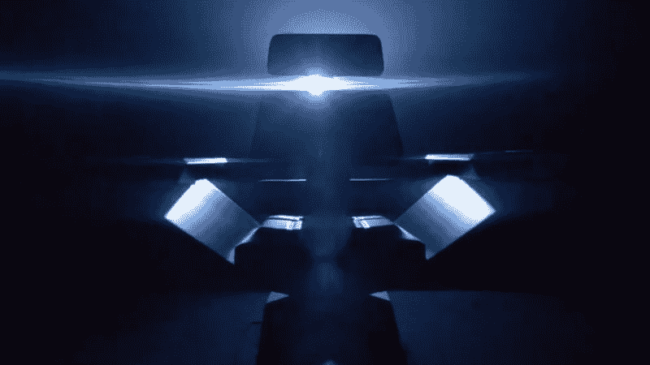

# 《星际迷航》带着发现号回来了

> 原文:[https://dev . to/funkysi 1701/star-trek-is-back-with-discovery-4 lab](https://dev.to/funkysi1701/star-trek-is-back-with-discovery-4lab)

2015 年 11 月宣布新的《星际迷航》系列将会推出。经过多次延迟的漫长等待，星际迷航发现号终于来了。

《星际迷航探索》将于 9 月 24 日在美国上映，9 月 25 日在英国上映。

让我们回顾一下我们是如何走到这一步的。

《星际迷航》是吉恩·罗登伯里在 20 世纪 60 年代创作的。他设想了一个节目，我们将探索银河系，同时也探索人类的状况。他把它描述成一列开往星星的马车。然而，由于预算削减和低收视率，该剧在播出 79 集和三季后被取消。

取消后，它的受欢迎程度在重播。20 世纪 70 年代中期，一个动画系列诞生了。但是对《星际迷航》的需求一直持续到新的《星际迷航》节目《第二阶段》开播。

1977 年《星球大战》上映，第二阶段的想法被取消，变成了一部电影。1979 年，我们有了电影《星际迷航》。它大大超出了预算，没有真正抓住《星际迷航》的精神。

1982 年的《星际迷航 2:可汗之怒》制作了一部便宜得多的续集，罗登伯里更多地退居二线。一部被广泛认为是最佳旅行电影之一的电影。又制作了四部由原班人马主演的故事片。

然而，在 1987 年，吉恩·罗登伯里与里克·伯曼合作，下一代演员阵容焕然一新。这部连续剧在柯克和斯波克历险记后大约一个世纪播出了七季。

《星际迷航》的受欢迎程度下降，这导致里克·伯曼帮助创作了衍生系列《深空九号》、《航海家》和《最后的企业号》,以及继续 TNG 演员冒险的四部故事片。2005 年企业号被取消时，《星际迷航》在电视上播放了 18 年后似乎已经死亡。

然而，在 2009 年，电影创作者 JJ·艾布拉姆斯为大银幕重新选择了经典的工作人员。这部电影是大动作，但发生在一个替代的时间线，允许熟悉的角色有新的冒险，而不干扰电视节目中描述的事件。

这部电影的两个续集已经制作完成，并使《星际迷航》重新受到欢迎。这导致了新的发现。《星际迷航》将重返电视荧屏，而且会很棒。

[T2】](https://res.cloudinary.com/practicaldev/image/fetch/s--_6p4yERY--/c_limit%2Cf_auto%2Cfl_progressive%2Cq_auto%2Cw_880/https://storageaccountblog9f5d.blob.core.windows.net/blazor/wp-content/uploads/2017/09/gqojtfz1dhmxoiri7g8p.png%3Fresize%3D662%252C372%26ssl%3D1)