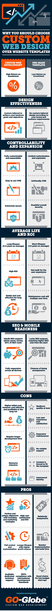

# 定制网站设计与模板网站设计-[信息图]

> 原文：<https://dev.to/asadali/custom-website-design-vs-template-website-design---infographic>

中东的经济以现金交易为主。阿联酋的大部分支付都是现金支付，而不是在线交易。据估计，全球近一半的人口都是互联网用户，迪拜已决定加入这股潮流，在电子商务领域留下自己的印记。迪拜是第二大酋长国，拥有中心位置和开放的经济，保证了贸易市场的繁荣。由于迪拜是高旅游活动和各种各样的企业的所在地，它具有成为蓬勃发展的电子商务中心的巨大潜力。大多数在线企业都在使用 [SEO 优化网站](https://www.go-gulf.ae/seo-dubai.php)来扩展他们的目标受众。因为网页设计被认为是在线业务成功的关键工具，所以在预制模板和定制设计之间做出选择是网站整体有效性的决定性时刻。下面由 GO-Gulf 编辑和设计的[信息图](https://www.go-gulf.ae/blog/custom-web-design-vs-website-templates/)清楚地解释了为什么选择定制网页设计是一个更聪明的选择。

[T2】](https://res.cloudinary.com/practicaldev/image/fetch/s--_3RSRHaz--/c_limit%2Cf_auto%2Cfl_progressive%2Cq_66%2Cw_880/https://www.go-gulf.ae/wp-content/uploads/2016/07/custom-web-design-vs-website-templates.gif)

定制的网页设计可以根据品牌、商业目标和访问者需求进行优化。使用专门为目标受众设计的网站，而不是使用为普通受众设计的模板，可以获得更好的用户体验。此外，定制网站的使用寿命是模板的两倍，即定制设计的使用寿命为 3 年，而模板的使用寿命为 1.5 年。定制的网页设计通常带有一个内置的搜索引擎优化支持系统，这是模板所缺乏的。由于这个因素，从长远来看，一个模板需要更高的 SEO 投资，不可避免地增加了整个项目的成本。最终，一切都归结于投资回报率。定制网站一直被证明可以提供更高的投资回报，而模板往往没有能力产生大量的业务，导致投资回报率低。定制网站有一个定制的 CMS，能够在不危及您的安全的情况下进一步扩展，这是一个预先制作的模板通常缺乏的功能。