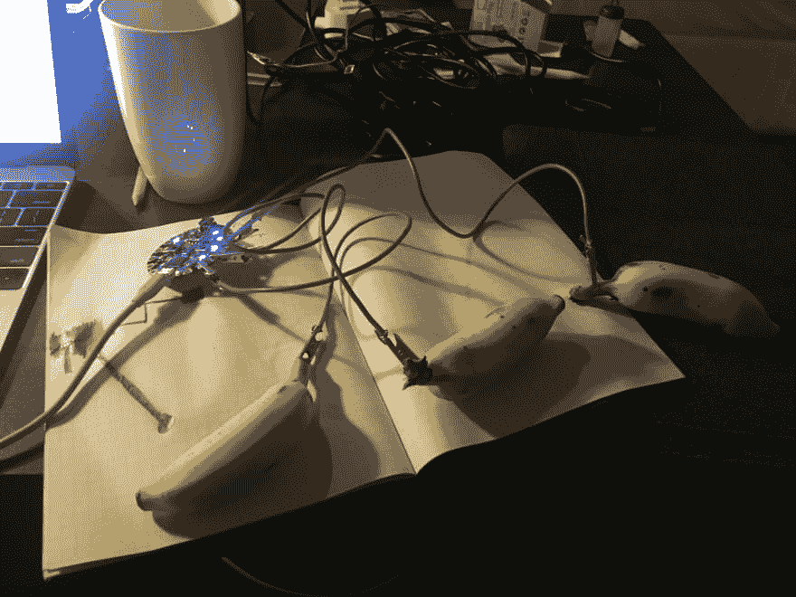

# 原生运行 JavaScript 的微型计算机

> 原文:[https://dev . to/georgemandis/tiny-computers-the-run-JavaScript-native](https://dev.to/georgemandis/tiny-computers-that-run-javascript-natively)

[T2】](https://res.cloudinary.com/practicaldev/image/fetch/s--XjyFvM_L--/c_limit%2Cf_auto%2Cfl_progressive%2Cq_auto%2Cw_880/https://s3-us-west-2.amazonaws.com/george.mand.img/banana-computers.jpg)

我已经把 Johnny-five . io 收藏了很长时间，作为一种探索，今天早些时候我休息了一下。如果你不熟悉这个项目，它允许你用 JavaScript 编写单板计算机和控制器，比如 Arduino，Rasperry Pi 和许多其他的。

对于某些平台，它直接在设备上运行，但对于其他平台，它需要主机来运行您的 JavaScript，并通过串行连接与您的微型计算机进行硬件交互。根据你要构建的内容，这可能没问题，但是我最近对允许你直接运行 JavaScript 的硬件更感兴趣。

幸运的是，他们的硬件列表很容易过滤！本质上，这个列表包含了运行某种 Linux 环境并允许您安装 Node 的所有 SBC。不过，为了子孙后代，这里列出了我所知道的所有可以直接运行 JavaScript 的小型电脑:

*   [比格犬骨黑](http://beagleboard.org/bone) ( [亚马逊](http://amzn.to/2fGnXuL))
*   [惠普计算机](https://getchip.com/)
*   [埃斯皮里诺](http://www.espruino.com/)
*   [英特尔伽利略一代& 2](https://ark.intel.com/products/78919/Intel-Galileo-Board)
*   [英特尔爱迪生 Arduino](https://www.arduino.cc/en/ArduinoCertified/IntelEdison) ( [亚马逊](http://amzn.to/2wIuEXP))
*   [英特尔爱迪生迷你](https://www.intel.com/content/www/us/en/support/boards-and-kits/000005574.html) ( [亚马逊](http://amzn.to/2xZ8qkO))
*   [SparkFun Edison GPIO 模块](https://www.sparkfun.com/products/13038)
*   [SparkFun Arduino Block](https://www.sparkfun.com/products/retired/13036)
*   [英特尔焦耳 570x(载板)](https://ark.intel.com/products/96414/Intel-Joule-570x-Developer-Kit) ( [亚马逊](http://amzn.to/2xuGqnz))
*   [Linino One](http://www.linino.org/portfolio/linino-one/) ( [亚马逊](http://amzn.to/2xuqiCw))
*   [洋葱ω2](https://onion.io/omega2/)
*   [pcDuino3 开发板](https://www.sparkfun.com/products/retired/12856)
*   [树莓派 3 B 型](https://www.raspberrypi.org/) ( [亚马逊](http://amzn.to/2yx8p4A))
*   [树莓 Pi 2 型](https://www.raspberrypi.org/)
*   [树莓派零点](https://www.raspberrypi.org/)
*   [树莓派 A 型 Plus](https://www.raspberrypi.org/)
*   [树莓 Pi 型 Plus](https://www.raspberrypi.org/)
*   [Raspberry Pi 型号 B 版本 1](https://www.raspberrypi.org/)
*   [Raspberry Pi 型号 B 第二版](https://www.raspberrypi.org/)
*   [镶嵌 2](https://tessel.io/)

这份名单遗漏了什么吗？我特别好奇的是其他项目，比如 Espruino，它们不运行某些 Linux 风格，而是允许您在板上本地运行 JavaScript。所有这些都将成为我的一些 MIDI 项目的好电脑。

我错过什么了吗？请让我知道——给我发电子邮件或在 Twitter 上给我发短信。