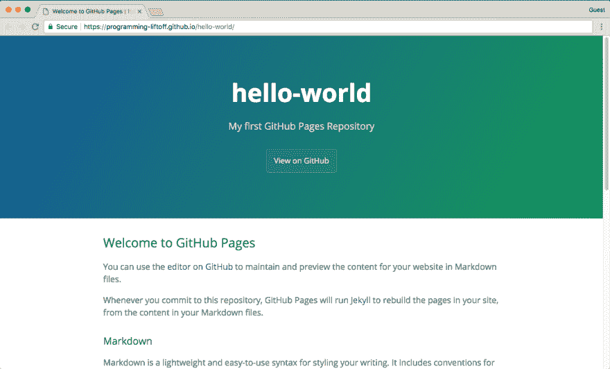

# 在 GitHub 页面上创建您的第一个网站

> 原文:[https://dev . to/program lift off/create-your-first-website-on-github-pages](https://dev.to/programliftoff/create-your-first-website-on-github-pages)

*这篇文章最初发表在[programmingliftoff.com](http://programmingliftoff.com/)上，名为[在 GitHub Pages](http://programmingliftoff.com/create-your-first-website-on-github-pages/) 上创建你的第一个网站。*

[T2】](https://res.cloudinary.com/practicaldev/image/fetch/s--Db9y8RKv--/c_limit%2Cf_auto%2Cfl_progressive%2Cq_auto%2Cw_880/https://thepracticaldev.s3.amazonaws.com/i/76nkqy3fobe6u9h31mes.png)

我最近花了大部分时间在 web 开发项目上。在这个过程中，我发现的最神奇的工具之一是 GitHub Pages。本文将带您创建一个托管在 GitHub 页面上的“Hello，World”网站。这里的一切都是 100%免费的。如果您从视频中学到了更多，请向下滚动到本文的底部，观看视频演示。

## 步骤 1 -创建 GITHUB 账户

如果你已经有了一个 GitHub 账户，那太好了！请随意跳到第 2 步。如果没有，不用担心！创建一个 GitHub 账户很容易，而且会提高你作为开发者的知名度和可信度。在某种程度上，GitHub 账户就像是开发者的 LinkedIn 账户。GitHub 允许你将代码置于版本控制之下，并将其存储在服务器上(也称为“云中”)，这样即使你丢失了电脑或硬盘，你的所有代码仍然可以通过你的 GitHub 帐户访问。有许多不同类型的版本控制系统，比如 subversion (svn)、mercurial 和 git。GitHub，你可能已经猜到了，使用的是 git。它们都有不同的优点和缺点，但是总的来说 git 可能是最容易上手的，并且是大多数开发人员的首选 vcs 系统。版本控制系统超出了本教程的范围，但是您可以在这里找到一些最流行的版本控制系统的简短比较。GitHub 发布的包含 git 介绍视频的 Youtube 播放列表可以在这里找到。

要在 GitHub 上创建账户，请访问他们的网页，地址是[https://github.com/](https://github.com/)。他们有一个非常简单的创建账户的过程，所以只需选择一个用户名，输入你的电子邮件地址，然后选择一个(强)密码，你就可以开始了！

## 步骤 2 -创建存储库

接下来，我们将创建用于 GitHub Pages 站点的存储库。首先，简单而重要地说明一下用 GitHub 创建的存储库。GitHub 有免费计划和付费计划。GitHub 上免费和付费计划的主要区别在于创建私有存储库的能力。有了免费计划，你创建的所有库都将是公开的。这意味着任何人都可以看到代码/文件/等等。您在存储库中上传或创建的。因此，不要把任何私人信息放在公共的 GitHub 存储库中是非常重要的。无论你在一个公共的 GitHub 库中放了什么，你都是在与世界分享。使用免费计划非常适合本教程，因为我们将向我们的资源库添加一个简单的“Hello，World”网页，但请记住，如果你想成为唯一一个可以访问 GitHub 资源库的人，你需要升级到付费帐户，目前每月 7 美元。如果你是大学生，GitHub 会给你无限的免费私有库和许多其他好处；你可以在这里找到更多信息[。](https://education.github.com/pack)

创建存储库的步骤:

1.  单击“新建存储库”按钮

2.  输入如下所示的存储库详细信息，然后单击绿色的“创建存储库”按钮。

## 步骤 3 -为存储库启用 GITHUB 页面

1.  单击存储库主页上的“设置”按钮。

2.  进入设置页面后，向下滚动到“GitHub 页面”部分，选择源的主分支。

## 步骤 4 -创建 HELLO WORLD 网站

1.  为存储库启用 GitHub 页面后，下一步是创建您的网站！返回 GitHub 中的“代码”标签，如下所示。

2.  要为您的网站创建主页，请单击“创建新文件”按钮。

3.  接下来输入如下所示的信息来创建 index.html 文件。

## 第五步——访问你的网站！

1.  太好了！现在是时候访问你的新网站了！返回“设置”标签，点击 GitHub 页面部分的 GitHub 页面 URL。注意:链接可能需要 5-10 分钟才能显示您更新后的网站。

2.  恭喜你！你的网站应该在互联网上直播！现在你可以利用你的 web 开发技能来创建一个很棒的网站，而不必为托管支付一分钱！

最终站点

## 奖励——使用哲基尔主题

如果你在查看 GitHub 页面部分的选项，你会发现你可以选择一个主题。主题是一种很容易的方法，可以让一个漂亮的网页立刻运行起来！选择主题后，您需要删除您创建的 index.html 文件才能看到主题生效。

这就是 GitHub 页面的基础。总而言之，GitHub Pages 允许你免费托管你的静态网站。如果你希望你的网站源代码是私有的，你可以升级到一个付费的 GitHub 账户来获得无限的私有库。静态网站非常强大。这些站点可以构建得非常好，以至于一个站点是静态站点还是使用服务器的动态站点并不明显。本教程旨在帮助您了解 GitHub 对静态网站的支持为您带来的可能性。为了充分利用 GitHub 上的静态站点，您需要练习 HTML、CSS 和 JavaScript 技能！有了 GitHub Pages，(几乎)一切皆有可能，所以今天就开始建立你的网站吧！

你在 GitHub 上创建了一个静态站点吗？如果是这样，请在下面的评论中发布一个链接，这样其他人就可以看到它并获得一些灵感！

决定看这个教程不看了？太好了！点击下面的播放。