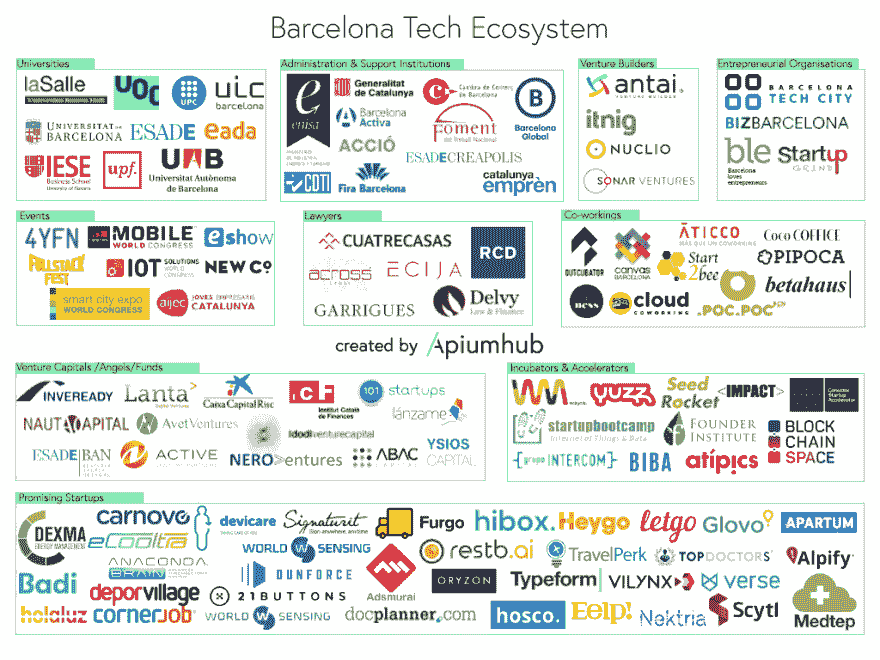

# 巴塞罗那科技生态系统:主要参与者地图

> 原文:[https://dev . to/Apium _ hub/Barcelona-tech-ecosystem-map-of-the-main-players-4a 8](https://dev.to/apium_hub/barcelona-tech-ecosystem-map-of-the-main-players-4a8)

巴塞罗那的科技生态系统多年来一直在持续增长。巴塞罗那已经成为许多令人兴奋的初创企业的家园。巴塞罗那拥有全球增长最快的创业生态系统之一，根据一些排名，巴塞罗那是欧洲第五大创业地区。

## 为什么巴塞罗那被命名为创新科技中心？

许多企业家和公司选择巴塞罗纳作为[创新&科技中心](https://dev.to/apium_hub/barcelona-makes-it-to-the-top-5-of-innovation-hubs)的几个原因:

*   生活质量
*   像 MWC 一样引领世界科技会议
*   获得商业天使和[风险资本](https://dev.to/apium_hub/a-list-of-20-most-active-venture-capital-investors-in-spain-temp-slug-1500144)
*   国际孵化器和加速器
*   竞争激烈的环境
*   优越的城市位置和交通基础设施
*   领先的商学院
*   本地和国际人才
*   成熟的成功模式
*   战略位置的优秀基础设施
*   低工资

## 巴塞罗那充满活力的科技生态系统

巴塞罗那排在伦敦、巴黎、柏林和阿姆斯特丹之后，是欧洲最具活力的创业生态系统之一，尤其是在互联网、电子商务、[移动软件&服务](/)、大数据、[电子医疗](https://dev.to/apium_hub/digital-health-ecosystem-in-barcelona)等新技术领域，当然还有旅游业。由于多种因素，这座城市有了成千上万家雄心勃勃、具有全球视野的初创企业。

想象一下，创业经济雇佣了一万多人。在欧洲，这已成为创建新公司的一个明显基准，尤其是那些拥有技术基础的公司。今天，加泰罗尼亚首府有超过 1100 家创业公司，这种增长归因于各种因素:当地的基础设施既能满足这些项目，也能从中受益；公共和私人创业支助方案和服务；帮助创建孵化器网络的成功企业家；保护新公司的加速器和投资工具；以及[世界移动通信大会](https://apiumhub.com/tech-blog-barcelona/mobile-world-congress-in-barcelona/)、 [4YFN](https://apiumhub.com/tech-blog-barcelona/mobile-insight/) 、[智慧城市博览会](https://apiumhub.com/tech-blog-barcelona/smart-city-projects-leaders-barcelona/)、 [IOT](https://apiumhub.com/tech-blog-barcelona/iot-projects-will-change-world/) 等众多国际知名展会的出席。

巴塞罗那不仅是一个支持性的地区，也是一个不断发展的地区，时刻准备着联系和壮大初创企业。有一些公共和私人组织已经准备好加速创业，帮助创业公司建立国际联系，并普遍为[创业公司的生态系统](https://apiumhub.com/tech-blog-barcelona/promising-startups-in-barcelona/)注入活力。在我们制作的地图上，你可以找到每个创业公司的基本&支持组件，以及有前途的创业公司的最新列表:

[T2】](https://res.cloudinary.com/practicaldev/image/fetch/s--SW-7ufTr--/c_limit%2Cf_auto%2Cfl_progressive%2Cq_auto%2Cw_880/https://apiumhub.com/wp-content/uploads/2017/09/bcn-tech-ecosystem.jpg)

### 如果你喜欢这篇文章，你可能也会感兴趣…

[西班牙 20 大风险投资者](https://dev.to/apium_hub/a-list-of-20-most-active-venture-capital-investors-in-spain-temp-slug-1500144)

[巴塞罗那有前途的初创公司](https://apiumhub.com/tech-blog-barcelona/promising-startups-in-barcelona/)

[巴塞罗那的数字健康生态系统](https://dev.to/apium_hub/digital-health-ecosystem-in-barcelona)

[巴塞罗那是欧洲主要的智能城市之一](https://apiumhub.com/tech-blog-barcelona/barcelona-smart-cities/)

[巴塞罗那跻身创新中心前五名](https://dev.to/apium_hub/barcelona-makes-it-to-the-top-5-of-innovation-hubs)

[2017 年巴塞罗那最有前途的 20 家初创公司](https://apiumhub.com/tech-blog-barcelona/promising-startups-in-barcelona/)

[2017 年智慧城市项目及领导者](https://apiumhub.com/tech-blog-barcelona/smart-city-projects-leaders-barcelona/)

帖子[巴塞罗纳科技生态系统:主要玩家的地图](https://apiumhub.com/tech-blog-barcelona/barcelona-tech-ecosystem-map/)首先出现在 [Apiumhub](https://apiumhub.com) 上。