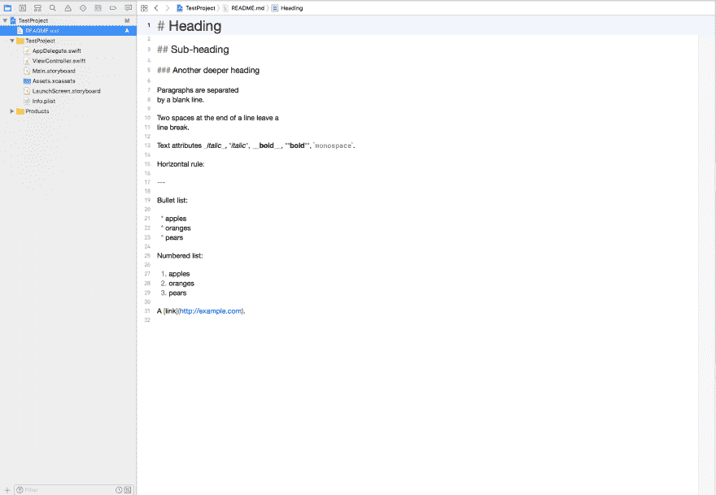
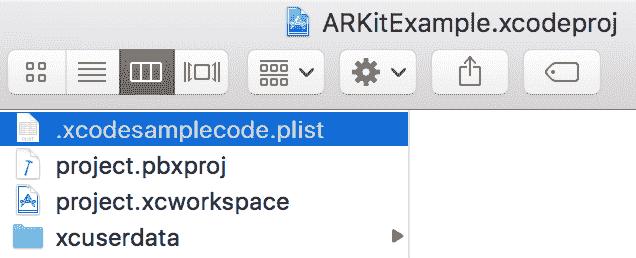
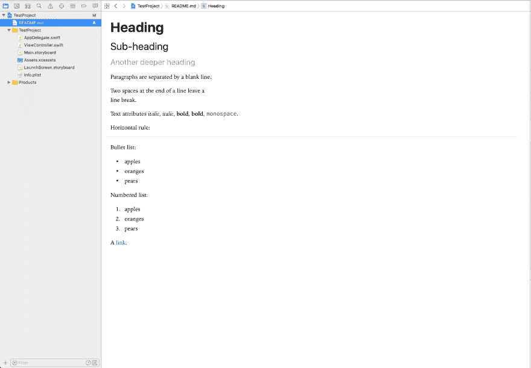

# Xcode 9 中的渲染降价

> 原文：<https://dev.to/danielinoa/rendering-markdown-in-xcode-9>

最近在探索苹果 iOS 11 的新样本项目时，我偶然发现了这个样本 [ARKit 项目](https://developer.apple.com/sample-code/wwdc/2017/PlacingObjects.zip)。除了很酷的 ARKit 之外，我还看到了 README.md 的渲染效果。

[T2】](https://res.cloudinary.com/practicaldev/image/fetch/s--JwG-bAo0--/c_limit%2Cf_auto%2Cfl_progressive%2Cq_auto%2Cw_880/https://thepracticaldev.s3.amazonaws.com/i/whg3gr4nnggi1dp4mhml.png)

这在 Playgrounds 中已经有一段时间是可能的，但是直到现在还没有在实际的 Xcode 项目中实现。这种降价格式与广告中的不同，广告中的降价是部分呈现的，并且包含语法(见下图)。
[T3】](https://res.cloudinary.com/practicaldev/image/fetch/s--2ttrGgQI--/c_limit%2Cf_auto%2Cfl_progressive%2Cq_auto%2Cw_880/https://thepracticaldev.s3.amazonaws.com/i/y7b0k3blno9kvq0urncu.png)

经过一些“广泛”的研究和挖掘，我发现`.xcodesamplecode.plist`是触发 Xcode 渲染降价的原因，就像在他们的示例中看到的那样。该文件可以在`.xcodeproj`下找到(在包内容中)。

[T2】](https://res.cloudinary.com/practicaldev/image/fetch/s--f9E_0rcO--/c_limit%2Cf_auto%2Cfl_progressive%2Cq_auto%2Cw_880/https://thepracticaldev.s3.amazonaws.com/i/39z1rz97zgxeqo31b7hz.png)

看起来苹果打算只在样本项目下渲染降价文件。理想情况下，应该有一种方法在渲染时进行切换，类似于 Playgrounds，但目前最简单的方法是将`.xcodesamplecode.plist`文件放在`.xcodeproj`项目下。
将`.xcodesamplecode.plist`放到我创建的 TestProject.xcodeproject 下后，它现在会像预期的那样显示 Markdown。[此处下载`.xcodesamplecode.plist`](http://danielinoa.com/assets/xcodesamplecode.plist.zip)。

TADA!!!

我认为在 Xcode 中提供可渲染的 README.md 文件可以大大有助于使大型项目更容易文档化和解包，而不需要外部的 Markdown 渲染器。除了代码注释之外，只要你的项目结构良好，这可以极大地提高新人进入你的项目的可发现性。

感谢阅读！

有什么问题吗？在推特上问我。

*本帖最初发表于[danielinoa.com](http://danielinoa.com/xcode/2017/09/19/markdown-in-xcode9.html)T3】*