# 谈论谈论 CSS

> 原文:[https://dev.to/huijing/talking-about-talking-css-23c2](https://dev.to/huijing/talking-about-talking-css-23c2)

*这几乎是我本月(2017 年 9 月)东南亚(和香港)之旅的现场回顾，并将随着事情的进展而更新。还有一篇很长的关于公众演讲的介绍性文章，如果你不感兴趣，可以跳过。*

### 15 天，7 次会谈，5 个国家

*   🇵🇭8 级表单功能
*   Mozilla 开发者路演@ 🇸🇬
*   Mozilla 开发者路演@ 🇻🇳
*   Mozilla 开发者路演@ 🇲🇾(吉隆坡)
*   Mozilla 开发者路演@ 🇲🇾(槟城)
*   Mozilla 开发者路演@ 🇭🇰
*   🇭🇰港湾

## 关于在会议上发言

如果你有机会在一大群人面前谈论你最喜欢的事情之一，你会有什么感觉？对于参加过[讲座的一小群人来说。之前(我爱你们大家)，看起来我对公开演讲很满意，老实说，我通常都很满意。但是一个“官方”事件，比如一个会议(或者任何有预算的事情)，确实感觉不同。](https://singaporecss.github.io)

我知道克里斯和我经常开玩笑说，当我们谈到盲目飞行。CSS，这在很大程度上是正确的，我们为此做了很多即兴创作，但会面通常是非常随意和放松的。会议(和有预算的活动)，至少对我来说，伴随着更大的责任和专业的氛围。

你通常不会把我和专业联系在一起。如果你见过我，你会知道的。猴子大概是更近的联想。但是我有一个“成人模式”开关，当需要的时候，我可以并且愿意打开它。会议(和有预算的活动)是需要一些认真的调整的情况。

我的第一次长篇大论发生在今年的首届[网络会议上。亚洲](https://webconf.asia)早在六月的香港。演讲者阵容包括知名和经验丰富的演讲者，如[布鲁斯·劳森](http://www.brucelawson.co.uk/)、[海登·皮克林](http://www.heydonworks.com/)和[安德鲁·贝茨](https://trib.tv/)(仅举几例)。我想我是在迪特里希·阿亚拉(另一位权威演讲者)之后来的，我比我想象的要紧张得多。

幸运的是，一旦我开始，神经开始消退。我认为对 CSS 的紧张让我如此高兴，以至于它超越了我当时可能感受到的任何其他情绪。这几乎和你打篮球时“进入状态”一样。

我第一次坐飞机离开亚洲去演讲是去圣彼得堡参加 pitercss 会议。我以前从来没有去过离欧洲很近的地方，所以我选择在会议前一周飞到那里，只是为了在那里多呆些时间。

会议组织得非常好，出席人数也非常多。文字不足以描述这种体验，但稍后会有视频发布，请回来查看链接。在这里我遇到了很多很棒的人，像瓦迪姆·马克耶夫、T2、阿加·纳普洛查和维也纳黑手党 T4 的伊娃·莱特纳、安德烈·奥科内奇尼科夫和马努埃尔·马图佐维奇。

今年，我有幸做了相当多的演讲，我非常感谢每一位组织者，他们选择了我这个名不见经传的演讲者，以及所有在演讲结束后走过来和我聊天并告诉我他们喜欢我的演讲的观众。这对我真的很重要。

有很多来自东南亚的开发人员做了很棒的工作，只是他们的知名度没那么高。我很少在国际会议上看到来自我们地区的发言者，我确实感到有额外的责任来尽可能好地代表我们。

## 🇵🇭 @表单函数类 8

说 [FFC8](http://2017.formfunctionclass.com/) 肯定会成为我有史以来最棒的经历之一。首先，FFC5 是我第一次作为与会者参加会议，我真正体验到了菲律宾人的热情好客。这一次，我作为一个演讲者出席，提出了一个关于 CSS 布局的全新演讲，我有了一个荒谬的想法，在舞台上做一小段现场编码。

想知道当我认为现场编码是个好主意时，过去的我在想什么，哈哈(开玩笑...一点点) [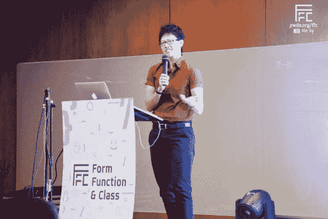](https://res.cloudinary.com/practicaldev/image/fetch/s--0depPdm8--/c_limit%2Cf_auto%2Cfl_progressive%2Cq_auto%2Cw_880/https://www.chenhuijing.cimg/posts/talking-css/ffc8-640.jpg)

即使我排练了很多次，也不能保证事情不会出错，而且在设置方面也有点小问题。但是我在最后一分钟改变了代码的显示方式，这样就减少了打字的工作量。真的松了口气事情没有变糟😌。

我没有预料到的是，当我结束我的课程时，得到了压倒性的回应(后面的几个人真的站了起来😍).我只是希望观众不会觉得我的演讲很无聊(因为我曾经有人在我面前睡着过，🤷)所以这是惊人的。也可能是因为我设法将碧昂斯融入了谈话😎，所以我也要感谢贝伊女王这次成功的演讲。

有很多关于脸书会议的照片，这里有一段精彩视频。

## 🇸🇬 @ Mozilla Dev 路演新加坡

回国呆了几天，这也是 Mozilla 开发者路演的第一站。因为新加坡是我的大本营，我自然会强迫我认识的每个人都来参加。为什么我还有朋友，对我来说是个谜😈。

新加坡站的观众爆满，我们请到了杰里米·基思(Jeremy Keith)做我个人认为是我听过的最鼓舞人心的技术评估演讲。现场聆听是如此美妙的经历。

我的会议实际上卡在了 web 开发中的两个最大的名字之间，Jeremy Keith 和 Smashing Magazine 的 Vitaly Friedman，所以如果我有一点压力，请原谅我。我的 iPad 是我谈话设置的一个非常关键的部分，它认为这是硬件故障的最佳时机。

但是呆在家里的好处是，我被熟悉的面孔包围着，并设法凑成了一个临时的解决方案，这要感谢我的师傅，迈克尔·程，他慷慨地把他的 iPhone 借给了我。迈克尔，你真棒！

杰里米没有参加我们剩下的旅行，我们不得不在活动结束时说再见。但是前一天晚上，我确实设法和每个人都出去逛了逛，聊了聊网络。我们甚至有一个行动项目来报告一个错误，因为 Vitaly、 [Markus Seyfferth](https://twitter.com/indysigner) 和我得出结论，Chrome 在打印样式表的 CSS 网格方面有一个错误。

Jeremy 还建议对路演经历进行总结，所以我写了这篇博文🙆。这次我做的演讲是我在 FFC 做的演讲的变体，但是李小龙取代了碧昂斯。我也认为这是我的很多朋友第一次看到我打开“成人模式”，所以这有点有趣。 [Elisha Tan](http://elishatan.com/) (运行 [TechLadies](http://www.techladies.co/) 的女超人)说得最好:

当陈设计她的发型并说不要闽南语时，你就知道这是件大事了(图片鸣谢:以利沙) [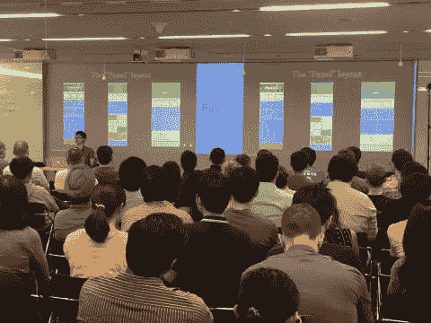](https://res.cloudinary.com/practicaldev/image/fetch/s--Q-BA_cMB--/c_limit%2Cf_auto%2Cfl_progressive%2Cq_auto%2Cw_880/https://www.chenhuijing.cimg/posts/talking-css/moz-sin.jpg)

还有一个出色的团队致力于捕捉整个路演的最佳部分。我认为完整长度的谈话也将被释放，所以保持关注。[订阅 Mozilla Hacks Youtube 频道](https://www.youtube.com/channel/UCijjo5gfAscWgNCKFHWm1EA?sub_confirmation=1)！

## 🇻🇳 @ Mozilla 开发者路演胡志明

下一站，越南！在此之前，我只在胡志明市呆了总共 6 个小时，所以能在这里多呆一会儿真好。我告诉每一个愿意听的人的一件事是，越南有许多有才华的开发人员，他们正在利用尖端技术从事非常酷的项目，只是没有人真正关注这个地区。还没有。

我们有机会与从事虚拟现实项目的团队会面，尽管我们玩的是原型，但他们感觉比我以前见过的一些商业产品更加精致。观众比新加坡少，但这也给了每个人更多的时间互相联系，试用网络虚拟现实工具，和 A-Painter 一起玩。

我第一次尝试绘画，感觉很棒。引用杨奇煜·贝内图的话:

> 你可能认为你了解 VR，但直到你戴上耳机，你才知道。

作为一个从小玩很多电子游戏的人，使用控制器非常直观。想想任天堂 Wii 风格的双截棍(但不是真的)，双手握着。能够在三维空间中绘画和创作真的很有趣。但我最喜欢的东西(因为我很奇怪)是传送功能，在你画了一堆东西后，你可以把自己传送到一段距离以外去欣赏你的作品。

<figcaption>不知道我在地板上发现了什么如此迷人虽然</figcaption>

[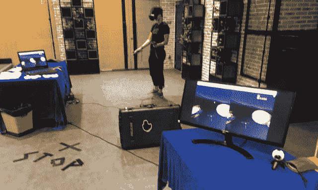](https://res.cloudinary.com/practicaldev/image/fetch/s--amkyCkGC--/c_limit%2Cf_auto%2Cfl_progressive%2Cq_auto%2Cw_880/https://www.chenhuijing.cimg/posts/talking-css/moz-hcm-640.jpg)

现在我已经在我的幻灯片上做了两次半现场编码，我不太担心设置不会按计划进行，因为我的扩展屏幕再次出现故障，我不得不看着主屏幕用一只手打字(因为麦克风)。原来第一次在马尼拉是最成功的尝试🤣。

我还遇到了一位马来西亚人，Ondris Pui(T1)，他目前正在墨尔本皇家理工大学的胡志明校区讲课，以及 Jolanda Tromp(T3)，他是 Duy Tan 大学的一名研究人员，专注于以用户为中心的 AR/VR。很多有趣的对话，有趣的人在做有趣的事情。

## 🇲🇾 @ Mozilla 开发者路演

尽管活动据说是在吉隆坡举行，但一个当地人会告诉你，严格来说，赛城并不是真正的吉隆坡。但是托马托，托马托🤷。这是唯一安排的周末活动，而且是一整天的事情，上午有 3 个讲座，一个悠闲的午餐休息，然后下午还有 3 个。

<figcaption>真高兴这次有时间听大卫说话</figcaption>

[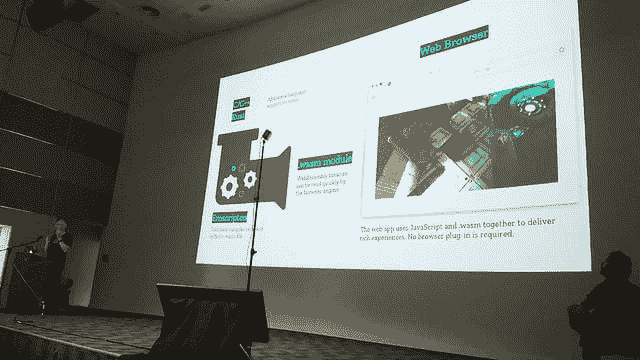](https://res.cloudinary.com/practicaldev/image/fetch/s--OhqcQqJ8--/c_limit%2Cf_auto%2Cfl_progressive%2Cq_auto%2Cw_880/https://www.chenhuijing.cimg/posts/talking-css/moz-kl2-640.jpg)

David Bryant 重新加入了我们混杂的团队，并给出了一个更长版本的新兴技术演讲，其中包括关于 [WebAssembly](http://webassembly.org/) 的精彩部分，以及来自 Mozilla 的关于[语音界面的研究](https://research.mozilla.org/machine-learning/)。此外，迪特里希加入了我们的这一站路演！不知何故，我又被安排在他之后🤣。

<figcaption>班级合影时间！</figcaption>

[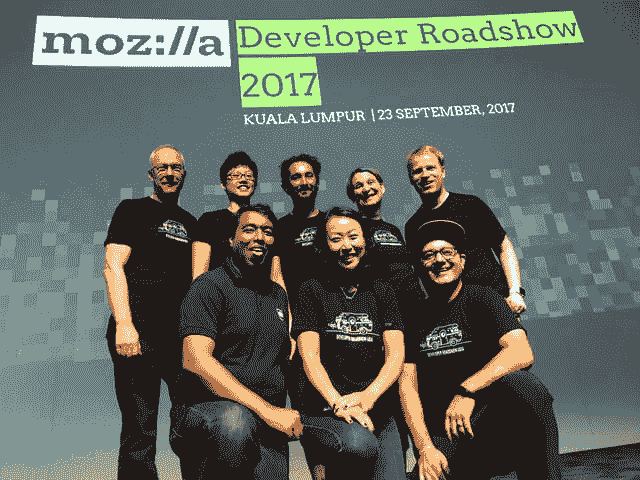](https://res.cloudinary.com/practicaldev/image/fetch/s--CT4CYuh5--/c_limit%2Cf_auto%2Cfl_progressive%2Cq_auto%2Cw_880/https://www.chenhuijing.cimg/posts/talking-css/moz-kl-640.jpg) (有人失踪)

我完全没有预料到这一点，但在我自己的国家❤️.演讲时，有一种温暖而模糊的感觉这是我第一次在马来西亚做演讲。我不指望每个人都明白这一点，但当我提到“赛亚裙邦嘎贾迪安纳克马来西亚”，观众鼓掌的那一刻，对我来说将是这次路演的亮点之一。

作为一生中有幸代表过一次马来西亚女子篮球队的人，我想作为你们国家的代表这个想法对我来说比其他大多数人更激动。也许吧。(或者我只是一个古怪的人)

<figcaption>喂猫...</figcaption>

[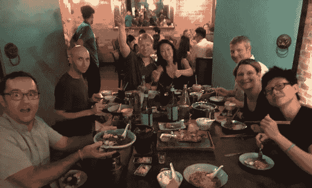](https://res.cloudinary.com/practicaldev/image/fetch/s--PXL1ThP_--/c_limit%2Cf_auto%2Cfl_progressive%2Cq_auto%2Cw_880/https://www.chenhuijing.cimg/posts/talking-css/moz-kl3-640.jpg)

无论如何，我过于复杂的通话设置又出了问题，这一次，iPad 的分辨率太差了，我无法阅读我的演讲者笔记中的一个字。我想这是件好事，我已经做过几次这样的演讲了。但是盲目飞行意味着我可能没有那么严格地遵守时间。我只想让这个装置完美运行一次。在这次紧张的旅行中只有一次🤞。

## 🇲🇾 @ Mozilla Dev 路演槟城

槟城在我心中有着特殊的地位，并将永远如此。虽然我 4 岁的时候我们家就搬离了槟榔屿，但我们家完全是槟榔屿人。我记得跟我妈妈学读英语，跟我奶奶学写中文，但是我从娘胎里出来就说槟榔屿闽南语。

槟榔屿的闽南语非常独特，因为在槟榔屿以外的地方很少听到，所以我很适应任何说这种语言的人。想象一下，你一直被和你说话方式不同的人包围着，然后突然发现自己被和你说话方式完全相同的人包围着。那是一种无法形容的感觉。

<figcaption>槟城最讲究的就是美食</figcaption>

[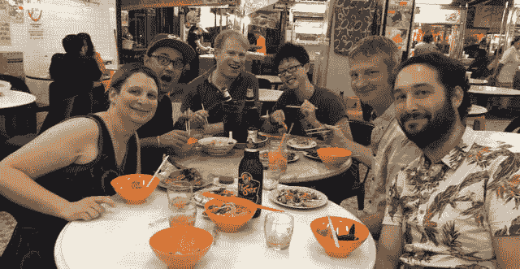](https://res.cloudinary.com/practicaldev/image/fetch/s--9CO4BXkJ--/c_limit%2Cf_auto%2Cfl_progressive%2Cq_auto%2Cw_880/https://www.chenhuijing.cimg/posts/talking-css/moz-pen3-640.jpg)

我们有一位新朋友加入了我们的行程，他是 Mozilla 的代表和信息安全研究员，Mijanur Rahman Rayhan，他住在孟加拉国。他以一场关于隐私和安全的精彩演讲拉开了序幕。一定要看看[的博客](https://rayhanroot.wordpress.com/)！

还记得我的通话设置从未正常工作过吗？从来没有？好吧，看来第四次是个好机会！🙆这一次，屏幕分辨率非常完美，没有任何东西在我讲话的中途死机，而且讲话进行得相当顺利。我确保织进去我是庇能出世的孩子」(当然说的是槟城闽南语)进入我的介绍。*(翻译过来就是“我出生在槟城”)*

Charis 在行动！

迪特里希像往常一样超级有趣，我们不得不在这之后说再见，因为他接下来要去印度。我们还有一位超级酷的本地艺术家，Charis Loke 正在现场演示一位画家，她的作品棒极了。而且都是现场直播！

<figcaption>来参加活动的可爱的人</figcaption>

[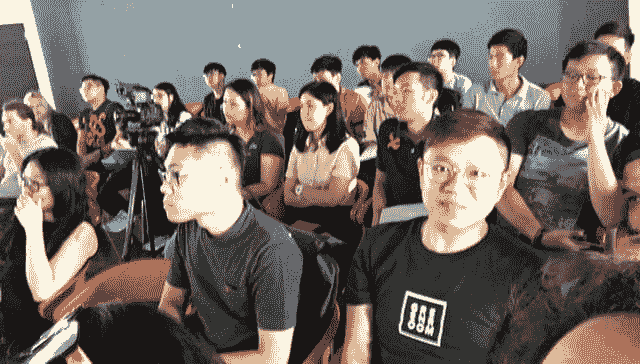](https://res.cloudinary.com/practicaldev/image/fetch/s--B05A8Ym7--/c_limit%2Cf_auto%2Cfl_progressive%2Cq_auto%2Cw_880/https://www.chenhuijing.cimg/posts/talking-css/moz-pen2-640.jpg)

会谈结束后，我也有机会和许多可爱的槟榔屿人聊天，关于槟榔屿，关于演讲，关于槟榔屿和马来西亚的科技，以及其他各种各样的事情。我可能也是 11 月份槟城发展节(我想这就是它的名字)的一部分。我们会看到事情的发展🙃。

## 🇭🇰 @ Mozilla Dev 路演港

这是 Mozilla 亚洲开发者路演的压轴戏，与一些了不起的人在一起，这是一次令人惊叹的经历。六月份，我最近去了香港，参加了第一次完整的技术演讲。那次谈话进行得相当顺利，我很高兴再次回到这里。

<figcaption>得在与杨奇煜</figcaption>

[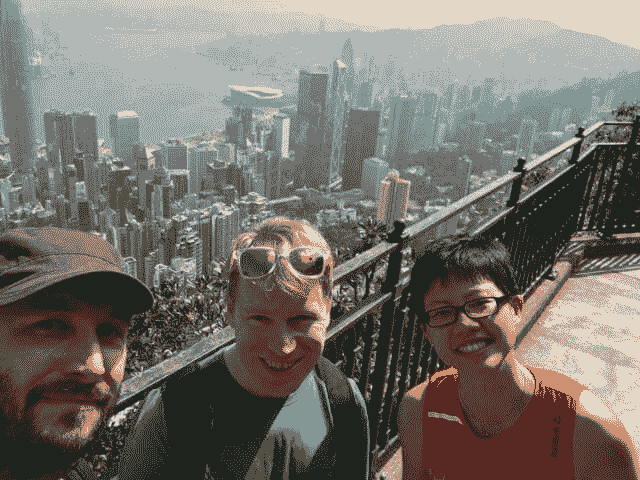](https://res.cloudinary.com/practicaldev/image/fetch/s--d5dX8ZJP--/c_limit%2Cf_auto%2Cfl_progressive%2Cq_auto%2Cw_880/https://www.chenhuijing.cimg/posts/talking-css/moz-hk-640.jpg) 的比赛中得到一些锻炼

因为一些预订问题，这次我们一伙人没有住在同一家酒店，但我们仍然离得很近。如果你从未去过亚洲，听说香港和新加坡是一样的，那你就大错特错了。亚洲(公平地说，几乎是世界上其他任何地方)就像 VR 一样，直到你亲身经历过，你才知道它是什么。

我从香港得到的感觉是，这是一个繁忙的现代城市，但它保留了许多独特的风味，从狭窄的小巷，霓虹灯广告牌和商店招牌。它比新加坡有更多的有机感，新旧并存。如果我是一个更好的作家，我会有更好的词来解释这一点，但我不是，所以🤷。

在这一站，我们请到了布莱恩·比特莱斯和 T2·景岛乐·阿卡苏卡，他们展示了网络动画和 Firefox Devtools，让我们可以解决这些问题。完全出乎我的意料。我从去年开始使用 Nightly，所以我感觉自己一直生活在岩石下，因为我总是无视*动画*面板，直接进入*布局*面板。

<figcaption>真正的资讯性和趣味性谈网络动画</figcaption>

[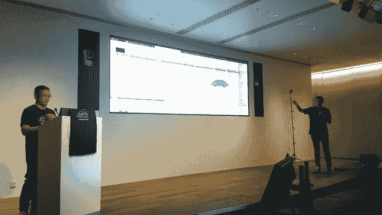](https://res.cloudinary.com/practicaldev/image/fetch/s--Yv5xkNlq--/c_limit%2Cf_auto%2Cfl_progressive%2Cq_auto%2Cw_880/https://www.chenhuijing.cimg/posts/talking-css/moz-hk2-640.jpg)

这次路演最棒的部分之一是有机会见到真正有趣的人，香港绝对没有让人失望。活动结束后，我们和[李杰森](http://www.hongkonggong.com/)和[崔茜卡凌](http://www.tricialing.com/)一起出去吃东西喝饮料。杰森是一名漫画家和设计师，目前在香港工作，他正在创作一部名为《马山上的房子》的漫画小说。他还对整个事件做了非常酷的笔记😍！

<figcaption>胜利的草图笔记！</figcaption>

[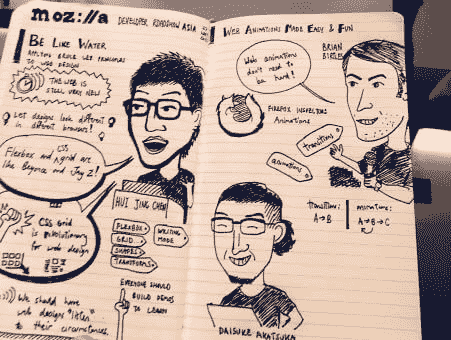](https://res.cloudinary.com/practicaldev/image/fetch/s--_y_w8PDd--/c_limit%2Cf_auto%2Cfl_progressive%2Cq_auto%2Cw_880/https://www.chenhuijing.cimg/posts/talking-css/sketchnotes.jpg)

随着路演接近尾声，我必须说这是一次奇妙的经历。这很紧张，有点忙乱，但我学到了很多东西，不仅是网络虚拟现实和动画等技术方面的东西，还有视频编辑、组织活动、如何让你的演讲更有吸引力等等。

我真的很感谢有机会成为这次路演的一部分，能够认识这个团队的每一个人是我的荣幸。巴里·蒙斯特泰格，他用我们得到的所有镜头创造了电影的魔力。[桑德拉·珀欣](https://twitter.com/SandraPersing)和[阿里·斯皮瓦克](https://twitter.com/alispivak)，他们组织了整个事件。Markus Seyfferth ，他在改进我的演讲和演示幻灯片方面给了我很好的建议。所有其他的演讲者，法比安·贝内图，杰里米·基思，我很高兴见到你们，❤️❤️❤️.

## 🇭🇰 @海滨

如果 Mozilla 亚洲开发者路演是一场巡回演唱会，那么海港聚会就是一场不插电的会议。没有摄制组，没有大张旗鼓，只有你，我和一些 CSS。我重新做了我在表单函数课上做的演讲，但是增加了一些关于[视窗百分比长度](https://www.w3.org/TR/css3-values/#viewport-relative-lengths)的内容。

这不是那次演讲经过精心排练、精确到分钟的完美版本。我只是把幻灯片上出现的东西一笔带过，然后像闲聊一样谈论 CSS 和网页布局。气氛更轻松了，在紧张的路演之后有这种感觉真好。

<figcaption>不顾设定，双手连枷</figcaption>

[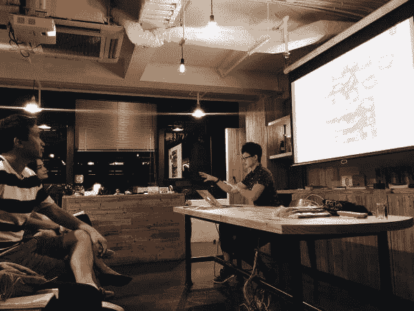](https://res.cloudinary.com/practicaldev/image/fetch/s--su8w1DbO--/c_limit%2Cf_auto%2Cfl_progressive%2Cq_auto%2Cw_880/https://www.chenhuijing.cimg/posts/talking-css/harbourfront.jpg)

场地在[湾仔的蜂巢](http://thehive.com.hk/)，不是很大的空间，整体感觉比较亲切。使用别人的笔记本电脑进行演示也很有趣，因为在我的幻灯片中有几个浏览器不一致错误的例子😌。

我还与一些设计师和开发人员进行了愉快的交谈，并设法帮助了一些人，他们试图开发一个音乐应用程序，在歌词上显示和弦。结果是 [HTML ruby 元素](https://www.w3.org/wiki/HTML/Elements/ruby)可能是他的用例的潜在解决方案。

不管怎么说，这是我在香港的最后一个晚上，也是这次旋风式巡演的最后一个晚上。没有比在世界上最高的天空酒吧(至少现在是这样)结束旅行更好的方式了，那里有很棒的风景和更好的陪伴😘。

<figcaption>从 490 米高空俯瞰</figcaption>

[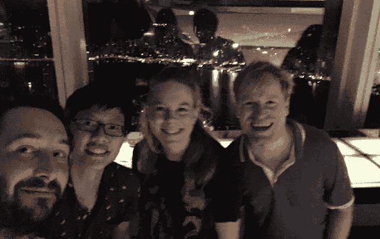](https://res.cloudinary.com/practicaldev/image/fetch/s--_ZCG6u-n--/c_limit%2Cf_auto%2Cfl_progressive%2Cq_auto%2Cw_880/https://www.chenhuijing.cimg/posts/talking-css/ozone-640.jpg)

## 包装完毕

原来如此。激动人心的 15 天就这样飞逝而过。这是一次超级有益的经历，肯定会成为我 2017 年的亮点之一。我现在有点心不在焉，但不要担心，在短暂的冬眠之后，我会带着更多的兴趣再次回到这里(因为杰里米认为我“带着兴趣出席了”😆。

*最初发表于 2017 年 9 月 21 日[www.chenhuijing.com](https://www.chenhuijing.com/blog/talking-about-talking-css/)。*