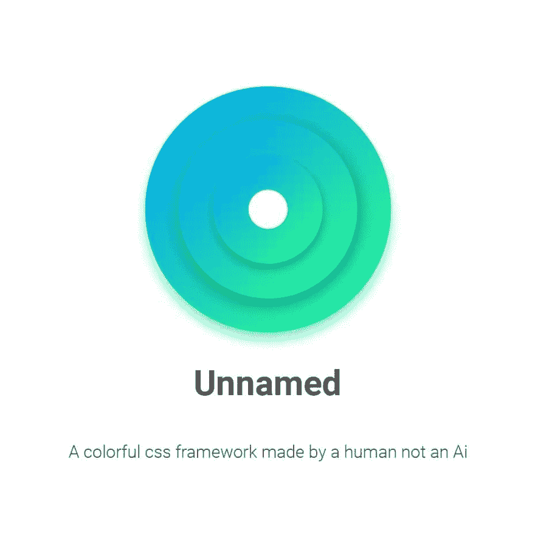

# 为什么我不命名？

> 原文:[https://dev.to/smakosh/why-i-made-unnamed-jom](https://dev.to/smakosh/why-i-made-unnamed-jom)

> 这篇文章最初发表在我的个人博客 [Smakosh](https://smakosh.com/blog) 上。

[T2】](///static/unnamed_blog-f08c898f6c12d7c0fe89b6eb3fb974ed-f7d78.jpeg)

我讨厌当我使用一个已知的 css 框架，如骨架或布尔玛…特别是框架，如引导或基础…

因为很多原因，但这里有一个主要原因:“因为我也是一名 UI 设计师，我总是不得不重写 UI 元素的整个 css 代码，比如按钮、表单、卡片……”

所以我开始深入研究 css，比如设计单选按钮或复选框按钮的技巧(隐藏输入和设计 span 标签)，学习了很多关于 flexbox 的知识，关于制作网格系统的标准方法(浮动和宽度)，flexbox 网格&还有 cssgrid &还有更多…， 所以我开始在我的 [codepen](https://codepen.io/smakosh) 上张贴每种风格元素的钢笔，直到有一天我在凌晨 2 点设计 UI 套件——哈哈——我想编码每个元素&那是我开始编码框架的时候，我没有想过共享它或开源它，但后来我想为什么不呢？ 有些人喜欢用它，对吗？&所以，我发布了它，让它开源&包括了 github 仓库中的所有东西，供前端开发者编辑。

未命名易于使用和编辑！，还有一个 npm 模块

```
$ nmp i unnamed 
```

<svg width="20px" height="20px" viewBox="0 0 24 24" class="highlight-action crayons-icon highlight-action--fullscreen-on"><title>Enter fullscreen mode</title></svg> <svg width="20px" height="20px" viewBox="0 0 24 24" class="highlight-action crayons-icon highlight-action--fullscreen-off"><title>Exit fullscreen mode</title></svg>

如果您使用 webpack
，请导入它

```
import 'unnamed' 
```

<svg width="20px" height="20px" viewBox="0 0 24 24" class="highlight-action crayons-icon highlight-action--fullscreen-on"><title>Enter fullscreen mode</title></svg> <svg width="20px" height="20px" viewBox="0 0 24 24" class="highlight-action crayons-icon highlight-action--fullscreen-off"><title>Exit fullscreen mode</title></svg>

如果你不习惯 node 生态系统，还有一个 CDN

```
https://unpkg.com/unnamed 
```

<svg width="20px" height="20px" viewBox="0 0 24 24" class="highlight-action crayons-icon highlight-action--fullscreen-on"><title>Enter fullscreen mode</title></svg> <svg width="20px" height="20px" viewBox="0 0 24 24" class="highlight-action crayons-icon highlight-action--fullscreen-off"><title>Exit fullscreen mode</title></svg>

我在产品搜索中得到了正面和负面的反馈，这真的让我前进，做出更多有用的产品，所以期待更快！

文件:[https://unnamed.smakosh.com](https://unnamed.smakosh.com)

在 github 上:[https://github.com/smakosh/unnamed-css-framework](https://github.com/smakosh/unnamed-css-framework)