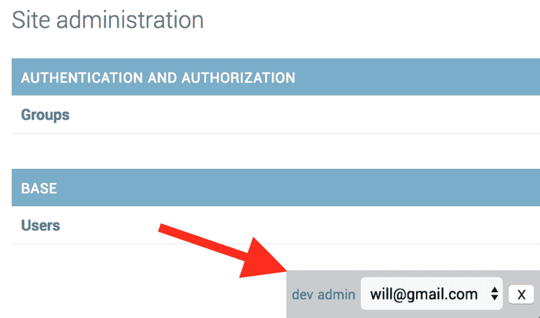

# dev-toolbar 是 web 开发人员最好的朋友！

> 原文：<https://dev.to/ariera/dev-toolbar-a-web-developers-best-friend>

**开发工具栏**是我们多年前提出的一个简单概念。这个想法是为开发者提供一个隐藏在前端的充满技巧(快捷方式，切换，登录等)的工具箱。它是我工作流程中不可或缺的一部分，通常是我在任何项目中首先设置的。

在这个条目中，我们将看到如何在 Django web 应用程序中设置它。我们将关注**每个人都喜欢的特性**:以任何用户身份登录数据库的能力(非常节省时间)。我们称之为**模仿**，它看起来是这样的:

[T2】](https://res.cloudinary.com/practicaldev/image/fetch/s---87anmZX--/c_limit%2Cf_auto%2Cfl_progressive%2Cq_auto%2Cw_880/http://ariera.github.io/assets/dev-toolbar.png)

数据库中所有用户的简单选择。点击其中一个，你就会以他/她的身份登录。

让我们继续吧！

### 1。创建开发应用程序

我们将从创建一个名为`dev`的新应用程序开始。它将保存我们所有的模拟逻辑，但也是一个有用的地方，可以为开发人员保存一个风格指南，或者在团队中共享一些方便的片段，或者只是存放一个临时实验。

```
python manage.py startapp dev 
```

Enter fullscreen mode Exit fullscreen mode

别忘了把它添加到你的`INSTALLED_APPS`

```
# ./your_app/settings.py INSTALLED_APPS = [
  'dev.apps.DevConfig',
  # ... ] 
```

Enter fullscreen mode Exit fullscreen mode

### 2。视图和 URL

在这里，我们将控制是否允许当前用户模拟，并执行实际的模拟。在这种情况下，我们允许任何超级用户作为任何其他用户登录，但是您可以选择任何其他标准，例如仅在开发环境中，或者仅当`DEBUG`是`True`时。

```
# ./dev/views.py
from django.shortcuts import redirect, render, get_object_or_404
from django.contrib.auth import get_user_model, login
from django.http import Http404

def impersonate(request, user_id):
  current_user = request.user
  if current_user.is_superuser:
    user = get_object_or_404(get_user_model(), pk=user_id)
    login(request, user)
    return redirect('/dev')
  else:
    raise Http404("Impersonate is only available for superusers") 
```

Enter fullscreen mode Exit fullscreen mode

```
# ./dev/urls.py
from django.conf.urls import url
from . import views

app_name = 'dev'
urlpatterns = [
    url(r'^$', views.index, name='index'),
    url(r'^impersonate/(?P<user_id>[0-9]+)/$', views.impersonate, name='impersonate'),
] 
```

Enter fullscreen mode Exit fullscreen mode

```
# ./your_app/urls.py
from django.conf.urls import include, url
from django.contrib import admin

urlpatterns = [
    url(r'^dev/', include('dev.urls')),
    url(r'^admin/', admin.site.urls),
] 
```

Enter fullscreen mode Exit fullscreen mode

### 3。模板标签

我们希望在许多模板中重用我们的工具栏，因此我们将使用 [Django 的 inclusion-tags](https://docs.djangoproject.com/en/1.11/howto/custom-template-tags/#inclusion-tags) 功能将它提取到它自己的模板标签中。

为此，您需要创建这个目录:`./dev/templatetags`和一个空的`__init__.py`文件。

在我们的 templatetags 文件夹中，我们将创建以下文件，它的行为类似于我们新的`dev_toolbar` templatetag 的视图。注意两件事:

1.  首先，我们将它链接到稍后将定义的模板`dev/toolbar.html`。
2.  其次，我们使用`takes_context=True`来访问当前用户。这将允许我们做一些基本的授权(即。仅允许超级用户使用该功能)。对于我们之前定义的逻辑来说，这是多余的，但是在处理敏感数据时有一个安全网是很好的。

```
# ./dev/templatetags/dev_toolbar.py
from django.contrib.auth import get_user_model
from django import template

register = template.Library()

@register.inclusion_tag('dev/toolbar.html', takes_context=True)
def dev_toolbar(context):
  request = context['request']
  current_user = request.user
  if current_user.is_superuser:
    users = get_user_model().objects.all()
  else:
    users = []
  return {'users': users, 'current_user': current_user} 
```

Enter fullscreen mode Exit fullscreen mode

模板文件包含自己的 css、javascript 和 html。一些简单的定位和样式和 css+js 逻辑位，使酒吧更微妙。

我们将呈现一个包含数据库中所有用户的选择框，每当我们选择其他用户而不是我们自己时，javascript 将负责调用 impersonate 操作。包含两个更方便的链接到`/dev`和`/admin`区域。

最后，但并非最不重要的，我通常包括一个小的关闭按钮，它有时在做 CSS 工作时会派上用场，你只是想摆脱酒吧。

```
<!-- ./dev/templates/dev/toolbar.html -->

<style>
  #dev-toolbar{
    background-color: #ccc;
    position: fixed;
    bottom: 0;
    right: 0;
    padding: 5px;
  }
  #dev-toolbar.subtle {
    opacity: 0.2;
  }
</style>
<script>
  window.dev = {
    closeToolbar: function closeToolbar(){
      var toolbar = document.getElementById("dev-toolbar")
      toolbar.parentElement.removeChild(toolbar)
    },
    showToolbar: function showToolbar(){
      var toolbar = document.getElementById("dev-toolbar")
      toolbar.classList.remove("subtle");
    },
    impersonate: function impersonate() {
      var select = document.getElementById("dev-impersonate")
      window.location = select.value
    }
  }
</script>
<div id="dev-toolbar" class="subtle" onmouseover="dev.showToolbar()">
  <small><a href="/dev">dev</a></small>
  <small><a href="/admin">admin</a></small>

  
    <select id="dev-impersonate" onchange="dev.impersonate()">
      
         <option value=""
             selected="selected">
             {{user.email}}
         </option>
      
    </select>
  

  <button id="dev-close-toolbar" onclick="dev.closeToolbar()">X</button>
</div>
 
```

Enter fullscreen mode Exit fullscreen mode

### 4。使用它

我们的功能已经完成，随时可以使用。只需在任何视图中加载并调用它。

```

 
```

Enter fullscreen mode Exit fullscreen mode

### 5。在管理面板中显示它

我们将覆盖默认的`admin/index.html`模板，并包含新的`dev_toolbar`片段。为此，我们需要在项目的根目录下创建一个通用的`./templates`目录，并将其添加到项目设置中的`TEMPLATES['DIRS']`中。

```
# ./your_app/settings.py TEMPLATES = [
  {
    'DIRS': [os.path.join(BASE_DIR, 'templates')],
    # ...
  }
] 
```

Enter fullscreen mode Exit fullscreen mode

现在创建一个新文件来覆盖默认的管理索引 tempalte。

```
<!-- ./templates/admin/index.html -->
    
    

    
        {{block.super}}
        
     
```

Enter fullscreen mode Exit fullscreen mode

#### 参考文献

*   [Django Http404](https://docs.djangoproject.com/en/1.11/topics/http/views/#the-http404-exception)
*   [Django 包含标签](https://docs.djangoproject.com/en/1.11/howto/custom-template-tags/#inclusion-tags)
*   [SO:处理 django 包含模板标签中的请求](https://stackoverflow.com/questions/6713022/handling-request-in-django-inclusion-template-tag)
*   那么:如何覆盖和扩展基本的 Django 管理模板？

*本帖最初发表于[ariera . github . io](http://ariera.github.io/2017/09/20/dev-toolbar-a-web-developers-best-friend.html)T3】*