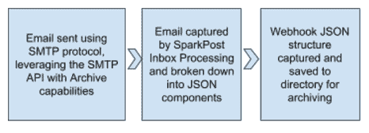

# 归档电子邮件:跟踪已发送邮件的操作指南

> 原文：<https://dev.to/sparkpost/archiving-emails-a-how-to-guide-for-tracking-sent-mail>

并非每个电子邮件发件人都需要能够归档他们的电子邮件，但对于某些领域，如金融或医疗保健，跟踪发送的电子邮件通常是一项要求。所以我决定创建一个样本程序来完成这个任务。和我的大多数博文一样，我有一个[对应的 Github 库](https://github.com/jeff-goldstein/SparkPost-Archive-Tools)如果你感兴趣的话可以看看。

非常欢迎您使用这个存储库作为项目的起点，或者修改和更新存储库以供他人使用。

有几种不同的方法来支持归档。在这篇文章中，我决定只关注一种方法，即 SparkPost SMTP 调用中的“存档功能”。另一种方法是存储模板和合并到该模板所需的数据。在以后的文章中，我可能会用一些示例代码来解决这个问题。

但是，让我们回到今天讨论的方法上来。下图显示了这一过程中的三个不同步骤；从电子邮件创建开始，一直到电子邮件正文和支持组件的归档。

[T2】](https://res.cloudinary.com/practicaldev/image/fetch/s--eB7oWLAq--/c_limit%2Cf_auto%2Cfl_progressive%2Cq_auto%2Cw_880/https://media.sparkpost.com/uploads/2017/09/Screen-Shot-2017-09-11-at-2.54.02-PM.png)

在 32，000 英尺的高度，这些步骤表现为三个发展步骤:

1.  在 SparkPost 中设置入站中继 Webhook。中继 Webhooks 是一种指示 SparkPost 代表你接受入站电子邮件并通过 HTTP 转发给你供你自己使用的方法。
2.  创建一个工具，以 JSON 有效负载的形式接收中继 Webhook 信息(入站电子邮件)。
3.  通过 SMTP 协议发送电子邮件，添加 SparkPost SMTP API 标头。SMTP API 头将包含您将用于归档域的电子邮件地址。

第一步和第二步都有“先有鸡还是先有蛋”的问题。它们交织在一起，不能缺一不可，所以先做哪一个并不重要，但我会先解决设置问题，因为没有 DNS 和 Webhooks 就不能进行完整的单元测试。

"[启用入站电子邮件中继&中继网页挂钩](https://www.sparkpost.com/docs/tech-resources/inbound-email-relay-webhook/)将引导您完成中继网页挂钩的设置过程，但我有一些有用的提示要补充。我将在较高的层次上浏览文档的各个步骤，然后添加一些您可能会觉得有用的示例。

### 设置收件箱中继 Webhook

上面提到的文档中的第一步是设置 mx 记录，将给定域的电子邮件转发到 SparkPost 进行处理。上述文档的第二步是使用 SparkPost*Inbound-Domain*RESTful API 创建一个入站域。调用的主体很简单，只有一个*键/值*对，键名为“域”。对于我的例子来说，*值*匹配我的 MX 条目，域名为*geekwithapersonality.com*(请不要对域名进行判断)。因此 API 调用的主体很简单:

```
{  "domain":  "geekwithapersonality.com"  } 
```

Enter fullscreen mode Exit fullscreen mode

SparkPost 中没有 UI 功能来设置这一点，所以您必须使用 Postman 之类的客户端或 CURL 之类的应用程序。SparkPost 确实有一个可以利用的 [Postman 集合](https://app.getpostman.com/run-collection/81ee1dd2790d7952b76a)，这使得这一步非常容易。接下来，您需要将入站域绑定到应用程序运行的位置。作为脚注，每个入站域只能有一个 relay-webhook 应用程序。在这一步中，您将调用*relay-web hooks*RESTful API，其主体类似于下面这个:

```
{  "name":  "Replies Webhook",  "target":  "http://www.geekwithapersonality.com/cgi-bin/inbox-relay.php",  "auth_token":  "",  "match":  {  "protocol":  "SMTP",  "domain":  "geekwithapersonality.com"  }  } 
```

Enter fullscreen mode Exit fullscreen mode

注意域键/值对如何使用相同的域值*geek with personality*，作为 RESTful API inbound-domain 调用中使用的条目。这一步是将两者联系在一起的一步。因此，任何发送到 geekwithapersonality.com*域名*的电子邮件都将被定向到 SparkPost，然后被转换成 JSON 结构进行处理。同样，这个步骤没有 SparkPost UI 组件，所以需要使用类似 Postman 或 CURL 的东西来执行这个步骤。除非您是为许多客户处理入站消息的 ESP，否则这通常是一项非常罕见的任务。

### 创建一个收集器来处理和存储归档电子邮件

尽管代码在 [Github](https://github.com/jeff-goldstein/SparkPost-Archive-Tools) 中，我将描述每一部分的组件和逻辑。总的来说，这段代码写起来相当简单。我决定将每封电子邮件的以下部分归档到单独的文件中:

1.  用于发送电子邮件的所有标题。因为存档电子邮件与原始电子邮件位于不同的位置，所以这些邮件头并不完全等同于原始电子邮件，但也很接近。
2.  完整的 JSON 结构。
3.  带有原始*到*电子邮件地址的文本正文，连同来自的*和追加到文本文件顶部的*主题*。*
4.  带有原始的*到*电子邮件地址的 HTML 正文，以及来自的*和追加到 HTML 文件顶部的*主题*。*
5.  符合 rfc822 的电子邮件。这允许应用程序获取整个文件，并在必要时重新发送。

在这个示例代码中，我将每组文件放在它们自己的目录中，并记录处理的每个归档电子邮件。除了将数据放在一个目录中，我没有将这些项目归档到像 S3 或惠普 Autonomy 这样的更企业级的地方。我将在下一次讨论这个过程，但是现在有如此多的 CMS 或归档工具，创建十几个不同的归档工具只是皮毛。我还希望该过程尽可能快，因此我认为归档工具应该只是松散耦合的，或者运行已处理项目的索引/队列/堆栈，或者归档工具可能只是寻找新的目录并将它们重新定位到一个更永久的位置。

为了为每个归档创建一个唯一的目录，我创建了包含原始电子邮件收件人地址名称和时间戳的目录。

入站 webhook 结构的结构可能会随着时间而改变，但目前可以在 SparkPost 的[中继 Webhooks 示例有效负载](https://developers.sparkpost.com/api/relay-webhooks.html)文档中找到当前结构。

以下是我获取的 json 值，以便单独存储它们或进一步处理它们:

1.  msys/relay_message/content/to:这是内容的原始目标的电子邮件地址。
2.  msys/relay_message/rcpt_to:这是用于发送存档消息的电子邮件地址。
3.  msys/relay _ message/friendly _ from:这是原始电子邮件地址中显示的发件人地址。
4.  msys/relay _ message/content/Subject:邮件的主题。
5.  msys/relay _ message/content/headers:一旦拉出来，我就把它们格式化成一个很好的 html(好的，半好的)格式，以便存储和参考。
6.  msys/relay _ message/content/html:邮件的 HTML 正文。
7.  msys/relay _ message/content/text:邮件的正文。
8.  msys/relay _ message/content/email _ RFC 822:RFC 822 标准中的完整邮件正文。它保存为 eml 文件，允许大多数电子邮件客户端直接打开。

一旦我得到了所有这些数据，我就把标题处理成 html 格式。从那里，我将*添加到*，将中的*和*主题*添加到 HTML 和文本主体中，并保存所有内容。最后，我为该特定条目创建一个日志条目。*

### 发送电子邮件的存档副本

存档功能只能通过使用 [SMTP API](https://developer.sparkpost.com/api/smtp-api.html) 来启动(顺便说一句，这是一个为 SMTP 调用添加一个标题的可怕的行业标准)。对于 SparkPost 来说，SMTP API 实际上是一个 JSON 格式的头，名为 *X-MSYS-API* 。在该标题中，除了归档电子邮件地址列表之外，您还可以设置活动 id、元数据、IP 池、抄送和密件抄送电子邮件地址等项目。这里有一个示例 *X-MSYS-API* 头:

```
X-MSYS-API:  {  "campaign_id":  "Jeffs BBQ Campaign",  "metadata"  :  {  "home_address_region":  “West”,  "smoker":  "SMB"  },  "archive":  [  “archive@mail.geekwithapersonality.com”  ],  "options"  :  {  "open_tracking":  false,  "click_tracking":  true,  "transactional":  false,  "ip_pool":  "sp_shared",  }  } 
```

Enter fullscreen mode Exit fullscreen mode

这并不是一个包含所有可用选项的完整示例，而是展示了一个典型的标题。请注意，原始收件人的电子邮件地址不在 *X-MSYS-API* 头中，但是您将在回复 Webhook 中获得它。

在 Github 存储库中，我添加了一个测试 PHP 应用程序，它使用 PHPMailer 框架调用 SMTP。虽然调用 SMTP 并在 X-MSYS-API 头中添加一个归档电子邮件地址可能是彻底的单元测试的最佳方法，但这并不是完全必要的。发送到您的目标域的任何电子邮件都将得到与存档电子邮件相同的处理方式。因此，我通过向我的*geek with personality*域发送电子邮件来完成我的大部分单元测试，要么通过邮递员传输 SparkPost API 调用，要么只是通过我的 MAC 电子邮件客户端发送电子邮件。两者都不是真正的存档，但收件箱中继并不关心，对所有电子邮件都一视同仁。

### 瞧！归档电子邮件很简单！

这是建立归档的三个步骤。如果您正在使用 SMTP 向 SparkPost 发送电子邮件，您可能已经使用了 X-MSYS-API 头，因此只需添加归档条目对您来说将很容易。然后，您需要做的只是将归档域的电子邮件指向 SparkPost，并创建一个简单的应用程序来捕获数据。

我希望这有所帮助——如果您对归档电子邮件、电子邮件模板等有任何疑问，请随时[直接联系我](//mailto:jeff.goldstein@sparkpost.com)。

幸福的结局

帖子[存档邮件:跟踪已发送邮件的操作指南](https://www.sparkpost.com/blog/archiving-emails/)最先出现在[的 SparkPost](https://www.sparkpost.com) 上。