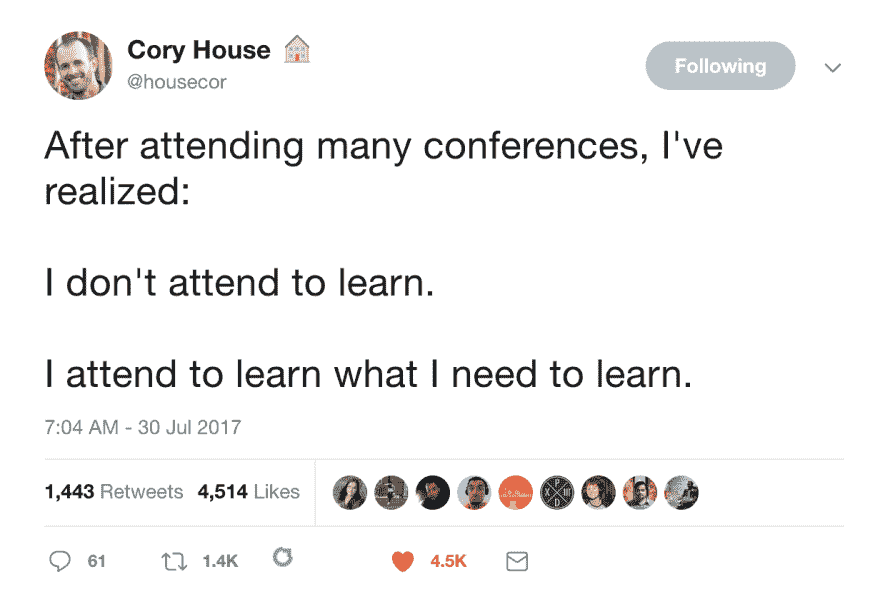
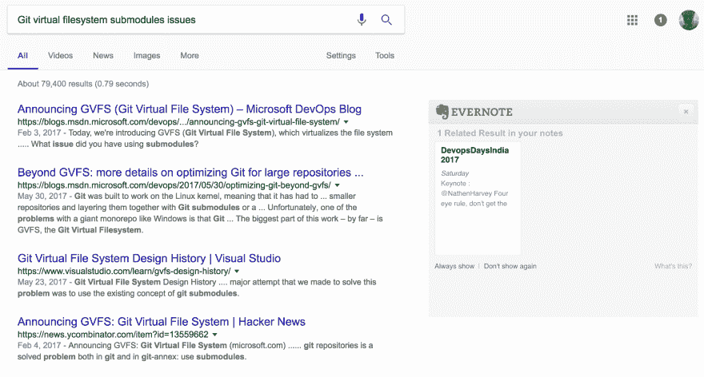

# 你为什么要在科技会议上发言？或者至少定期去参加

> 原文：<https://dev.to/dudewhocode/why-should-you-speak-at-tech-conferences-or-at-least-attend-them-regularly-part-1>

我第一次在专业人士面前演讲是大约三年前，在 ThoughtWorks 举办的一个名为极客之夜的聚会上。这是一个每月一次的聚会，来自当地社区的软件开发人员在这里发表演讲，通过相互交流来分享他们的想法。

那段时间，我刚从大学毕业，是一名嵌入式工程师，这意味着我对软件(I.T)一无所知，我所知道的一切就是微控制器、Jtag 调试器和嵌入式 c。此外，我从未参加过聚会，当我听到这个消息时，我很兴奋。除了参加那个聚会，我还想在那里展示一些东西，也就是做一个演讲。但是等等，观众是软件人，我对软件一无所知，我是一个电子人(至少我是，现在我是一个后端/产品工程师，帮助一个人工智能初创公司扩展他们的产品)。所以，我必须选择一个既能让观众受益，又能让我舒服地交谈和回答问题的话题。
最后，我想到了一个可以在开发者和制造者之间架起桥梁的话题，那是印度 [raspberrypi 板](https://www.raspberrypi.org/)的早期，所以我决定谈论它，因为我拥有一个，并将其用于业余爱好电子产品。我精心起草了我的主题:“一个信用卡大小的 ***linux*** 机器”，这样我的提议就不会被选择它的开发者认为是不相关的。

我出现了，我说话了，一切都很顺利。事实上，据我所知，3%的听众在我演讲后购买了 raspberrypi，我在第二次创业时与其中 2 人合作，在第三次创业时仍与其中一人合作。

好了，我的故事讲完了，现在我定期在当地的集会上演讲，我也作为演讲者去了一些大型会议。鉴于我不是公开演讲的专家，当我站在舞台上时，我的心跳会加快，偶尔会语塞。但是，我还是会给你一些理由，为什么你应该在会议上发言或者至少参加会议。

### 这不是关于学习，而是关于“学习什么”

[T2】](https://res.cloudinary.com/practicaldev/image/fetch/s--R2lDIN7z--/c_limit%2Cf_auto%2Cfl_progressive%2Cq_auto%2Cw_880/https://thepracticaldev.s3.amazonaws.com/i/vbogga63l390nw11xu8s.png)

一位来自微软的有影响力的人在推特上说，参加会议将会告诉你接下来要学习什么。他是对的，因为老实说，人们不可能记住所有演讲的所有内容(至少对我来说是这样)。通常在任何给定的会议上，一天都会有 6 到 8 场演讲，所以当你在一天内面对这么多不同主题的信息时，你不会学到太多，因为你的大脑会被信息淹没。这就是为什么所有的会议都提供一个记事本和一支笔作为他们物品的一部分。你可以记下重要的要点，以后再重温。现在你有了所有演讲和演讲者细节的笔记，你可以随时浏览它们，或者如果你决定在特定领域进一步学习，你将知道参考哪个会议笔记，因为笔记最终会包含该领域的趋势技术和其他人的经验。

##### 💡提示:

这个我一般用 Evernote。在数字笔记中搜索、给幻灯片拍照并随时添加到笔记中更容易。除此之外，作为一名花一半时间使用谷歌搜索技能的程序员，Evernote 会在搜索页面旁边显示相关注释。

[T2】](https://res.cloudinary.com/practicaldev/image/fetch/s--ZNP69p-a--/c_limit%2Cf_auto%2Cfl_progressive%2Cq_auto%2Cw_880/https://thepracticaldev.s3.amazonaws.com/i/qif3r7o78uvj31axv2w1.png)

如你所见，我的 evernote 显示了我在搜索某个术语时从一次会议上获得的相关笔记。现在我可以回忆起那次会议上发生了什么，接下来我可以了解什么，甚至可以通过 twitter 向演讲者寻求帮助。

### 营销

[T2】](https://res.cloudinary.com/practicaldev/image/fetch/s--a4pC2-w0--/c_limit%2Cf_auto%2Cfl_progressive%2Cq_auto%2Cw_880/https://thepracticaldev.s3.amazonaws.com/i/lrx321d1ftr0ju0pswgq.png)

想象一下，两个创业公司 A 和 B 正在开发类似的产品，他们正在相互竞争。创业公司 A 每周工作 80 小时，雇佣高技能的开发人员，所有人都投入到快速开发产品中。相反，创业公司 B 和开发人员一起雇佣了很少的销售和市场人员。在营销上投入时间和金钱。当开发人员专注于产品时，营销团队专注于获得线索，向客户推销产品，并在社区中传播关于创业公司及其产品的信息。在市场中的某个时间之后，当两家创业公司都推出他们的产品时，最终人们的目光会集中在创业公司 B 上，因为他们已经让社区知道他们在做什么工作，收集了市场上正在发生的信息，反馈了他们的产品，并在此基础上迭代了他们的产品开发。而创业公司 A 只是简单地开发产品，假设产品推出后人们会购买/使用它。

现在你应该已经明白我想表达的意思了。没错，你就是你的营销团队。看看创业公司 B 如何传播消息，从社区获得反馈，了解市场上发生的事情，并在此基础上迭代他们的产品？。同样，如果你参加会议，你会了解到在你的领域发生了什么，你的同行工程师拥有什么样的技能，你需要学习什么技能来赶上市场等等。如果你在会议上发言，那将是一大优势，因为你所在领域的人会了解你，你有什么技能，你做什么工作，等等。谁知道呢，一位首席执行官可能正坐在观众席里，秘密地计划着为她的下一个项目雇用你。但如果你像创业公司 A 一样，每周拼命工作 80 个小时，犹豫是否要投资会议，即使你最终拥有良好的技能，人们也不会知道你。你不会知道你的市场或领域发生了什么。当你的市场和社区走向不同的方向时，你可能一直在学习一套错误的技能。

### 回馈社会

你知道吗，在某个地方，一些程序员花费了大量的时间来编写你日常使用的库或编程语言？。这样你就可以做`from numpy import array`并以此为业了？。最突出的部分是程序员免费发布她的作品(就像免费啤酒一样)供社区使用。如今，初创公司的大部分技术都使用开源软件。不像那些靠金钱运作的创业公司或企业，开源软件主要是在社区上运行的。

社区是无私地创造开源软件、为其做出贡献并支持其发展的人。你可以通过贡献给你免费使用的项目来回馈社区，但是嘿！我知道，我们都有很多借口。我们没有时间为它做贡献，我们的老板用办公室项目填满了我们所有的时间表。但是还是有办法的。

参加会议的人也是社区的一部分。所以，如果你站在舞台上，分享你经验中的一些有用的东西，传播知识，那么你实际上是通过“回馈社区”在自由/开源软件世界中尽了自己的一份绵薄之力。

### 走出你的舒适区

[T2】](https://res.cloudinary.com/practicaldev/image/fetch/s--t5i2hXiZ--/c_limit%2Cf_auto%2Cfl_progressive%2Cq_auto%2Cw_880/https://thepracticaldev.s3.amazonaws.com/i/icp1us7vis0x8o5778mw.png)

广场恐惧症——害怕开放或拥挤的空间。

根据互联网，农业恐惧症是世界上五大恐惧症之一。坐在你的私人房间里或者听播客会更容易阅读一篇博客文章，而不会流汗。你不必在上传 YouTube 视频时闲聊。

但是去参加会议并在观众面前演讲是另一回事。即使你没有说话，在社交活动中开始相关的对话，而不是尴尬的盯着别人，这是一个人在市场中生存应该学会的基本技能。有些人天生就有社交技能，但那些没有这种技能的人(比如我)，他们应该自己学习，他们应该置身于人群中，走出自己的舒适区。

如果你已经走了这么远，也许你应该在推特上关注我: [@DudeWhoCode](https://twitter.com/DudeWhoCode)