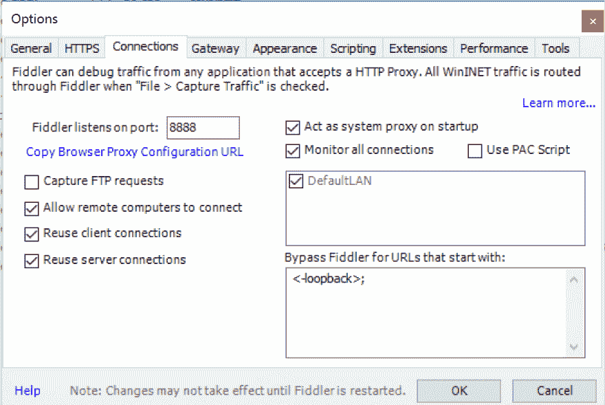
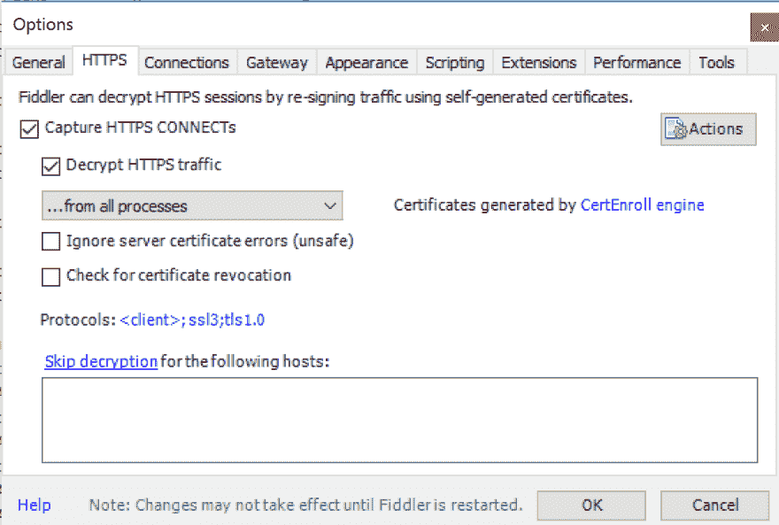

# 用小提琴进行网络嗅探

> 原文:[https://dev.to/kaydacode/network-sniffing-with-fiddler](https://dev.to/kaydacode/network-sniffing-with-fiddler)

偶尔当你遇到问题时，你必须穿上你的黑客连帽衫，勇往直前。我就是这样发现 Fiddler 的一些调试能力的。

作为一名 iOS 开发人员，很难捕捉你的应用程序发出的网络呼叫来确定为什么会发生奇怪的事情。在您确定这不是您的代码之后，下一步是确定它来自哪里。进入网络嗅探。

Fiddler 是一个免费的 HTTP 代理服务器应用程序。Fiddler 是一个应用程序，你可以把你的设备连接到它上面(通过一个代理),并观察来回的网络流量。还有其他工具，比如用于 Mac 的 Charles，但今天我们讨论的是 Fiddler。

首先，[在你的 PC 上下载 Fiddler](http://www.telerik.com/fiddler) 。

## 配置

您需要做一些配置来将另一个设备连接到代理。

1.  点击**工具**->-**提琴手选项**->-**连接**-
    选择**复选框允许远程计算机连接**-
    -[--](https://res.cloudinary.com/practicaldev/image/fetch/s--d8AL8JVQ--/c_limit%2Cf_auto%2Cfl_progressive%2Cq_auto%2Cw_880/https://thepracticaldev.s3.amazonaws.com/i/xi75eh4zuid6cgwnjaei.png)

2.  对于 HTTPS 连接，点击 Fiddler 选项下的 **HTTPS** 选项卡。
    选中**捕捉 HTTPS 连接**复选框，**解密 HTTPS 流量**复选框。

您还必须为 Fiddler 启动 SSL 证书。
点击**动作**->-**信任根证书**

1.  点击**确定**

2.  重启 Fiddler。在任何改变之后，你必须重启 Fiddler。

注意:你可能需要让 Fiddler 通过防火墙。

## 连接信息

在 Fiddler 窗口的右侧，您会看到一个“在线”状态。如果您不知道，请参考 Telerik 的文档。太棒了！如果你将鼠标悬停在你的在线状态上，你会在窗口底部看到 IP 地址。这是下一步需要的 IP 地址。

[T2】](https://res.cloudinary.com/practicaldev/image/fetch/s--tn6yOWVl--/c_limit%2Cf_auto%2Cfl_progressive%2Cq_auto%2Cw_880/https://thepracticaldev.s3.amazonaws.com/i/k4w4n2gb5y62lwsarjb4.png)

## 设备设置

1.  转到设备的网络设置，并启用代理。

2.  对于服务器，输入来自 Fiddler 的 IP 地址。

3.  对于端口，输入“8888”(或在**拨号器选项**->-**连接**菜单中的任何内容)。)

4.  对于 HTTPS:
    进入网络浏览器，输入“[IP address]:8888”
    你应该会看到一个“Fiddler Echo Service”页面。
    下载证书
    安装&信任证书

*注意:完成后建议删除证书*

## 哒哒！

您现在应该已经准备好了。现在，您可以捕获详细的网络流量、请求和响应，并找出问题所在。把你的力量用在好的方面，而不是坏的方面。

*最初发布于[KaydaCode](http://kimarnett.com/blog/index.php/2017/09/19/network-sniffing-with-fiddler/)T3】*