# 在图中变宽:BFS 遍历

> 原文:[https://dev . to/vaidehijoshi/going-broad-in-a-graph-bfs-traversal](https://dev.to/vaidehijoshi/going-broad-in-a-graph-bfs-traversal)

在这个系列的整个过程中，我们在事物之间建立了联系。我们看到了链表是堆栈和队列的基础，树是图的子集。事实证明，在计算机科学的世界里，所有看起来超级复杂的事情，至少并不像看起来那么复杂。相反，一切都是由更小、更小的东西组成的。

认识到这一点是揭开计算机科学神秘面纱的一大步，以及所有看起来很难的事情。令人生畏的大创意实际上只是为了另一个目的而构建、扩展和重组的小创意。一旦我们能把一个问题分解成最小的活动部分，这个问题就变得不那么难以理解(和解决！).

我们今天将使用同样的方法，因为我们要向有点复杂的图形遍历算法世界迈出第一步。上周，通过将理论转化为实践，我们尝试了图形问题的实践方面。然而，仅仅了解数据结构是不够的；我们需要知道如何使用它，如何操作它，以及在许多情况下，如何在它里面搜索某些东西！既然如此多的计算机科学问题实际上[只不过是图搜索问题](https://dev.to/vaidehijoshi/knigsberg-seven-small-bridges-one-giant-graph-problem)，了解如何在实际层面上搜索图是很有用的。

所以，让我们开始吧！

### 在图形中搜索

如果你有一种严重的似曾相识的感觉，并对自己说我们已经在本系列的前面*讨论过*广度优先搜索[，那么你是对的！事实上，我们已经在这个系列中介绍了](https://dev.to/vaidehijoshi/breaking-down-breadth-first-search)[深度优先搜索](https://dev.to/vaidehijoshi/demystifying-depth-first-search)！既然我们已经是这两种算法的专家，为什么它又出现了呢？

当我们在本系列中第一次学习广度优先搜索(BFS)和深度优先搜索(DFS)时，它们都是在[树遍历](https://dev.to/vaidehijoshi/leaf-it-up-to-binary-trees)的上下文中。虽然树是图的子集，但它们肯定是非常不同的结构。因此，图遍历的过程*与树遍历的*非常不同，它实际上保证了在图的上下文中而不是在树的上下文中重新审视这两种搜索技术。

首先，当我们说“遍历”时，我们指的是什么？先说一个定义。

<figure>[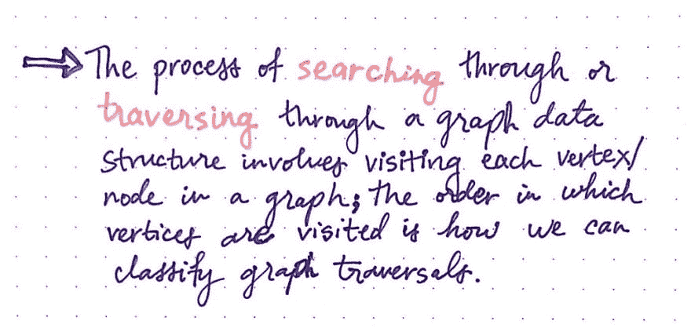](https://res.cloudinary.com/practicaldev/image/fetch/s--Xff5YZ9H--/c_limit%2Cf_auto%2Cfl_progressive%2Cq_auto%2Cw_880/https://cdn-images-1.medium.com/max/1024/1%2AYBnTkrtFXZIAhD9HVEq8ZA.jpeg) 

<figcaption>图遍历:一个定义</figcaption>

</figure>

***在图数据结构中搜索*** 或 ***遍历*** 的行为相当简单:这意味着我们可能正在访问图中的每一个顶点(并通过代理访问每一条边)。最核心的是，通过宽度或深度遍历一个图的唯一区别是*我们访问图中顶点的顺序。换句话说，图的顶点被访问的顺序实际上是我们如何对不同的图遍历算法进行分类。*

既然我们已经在树的上下文中熟悉了 DFS 和 BFS，那么让我们在深入 BFS 之前快速地比较一下这两者。

<figure> 

<figcaption>DFS 和 BFS:快速回顾</figcaption>

</figure>

类似于如何在树数据结构上实现， ***深度优先搜索*** 通过在访问兄弟——或相邻的——节点之前访问子节点来深入遍历图结构。在树和图遍历中，DFS 算法都使用堆栈数据结构。相比之下， ***广度优先搜索算法*** 通过在访问子节点之前访问相邻的兄弟节点，广泛地遍历到一个结构中。在树和图的遍历中，BFS 算法实现了队列数据结构。

我们将看到这两种算法之间有相当多的区别，基于它们是应用于树结构还是图结构。但是，让我们回到我们手头的任务:理解 BFS 应用于图表的内部工作原理！

为了理解 BFS 图遍历，我们将使用一个例子:这里显示的无向图。

<figure>[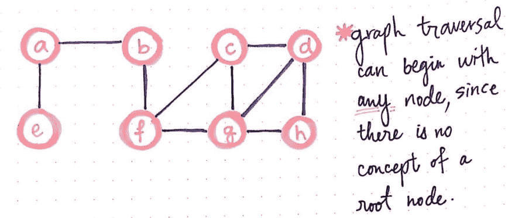](https://res.cloudinary.com/practicaldev/image/fetch/s--_8KKB4aU--/c_limit%2Cf_auto%2Cfl_progressive%2Cq_auto%2Cw_880/https://cdn-images-1.medium.com/max/1024/1%2A8qUQMVxne0Rx9OJi4lJnBQ.jpeg) 

<figcaption>图的遍历可以在任何地方开始！</figcaption>

</figure>

在我们决定如何遍历这个图之前，我们需要一个起点。事实证明，图遍历和树遍历的第一个——可能也是主要的——区别是决定从哪里开始搜索！在树的遍历中，我们总是从根节点开始，对于 BFS，我们一层一层地向下遍历树结构。但是，当处理一个图时，没有明显的开始，因为没有“根节点”的概念。

图的遍历可以从图中的任何顶点开始，所以我们将任意选择一个顶点。对于我们的示例，使用上面所示的八节点图，我们可以随机选择节点 b 作为我们的起点。

### 按部就班的 BFS 遍历

一旦我们选择了寻找的起点，我们还有一件重要的事情要做。在图中通过宽度实际搜索*的过程可以归结为几个步骤，我们将继续一次又一次地重复这个过程，直到我们不再需要检查节点。*

广度优先图遍历的主干由以下基本步骤组成:

1.  将图中的节点/顶点添加到要“访问”的节点队列中。
2.  访问队列中最顶端的节点，并将其标记为这样。
3.  如果该节点有任何邻居，检查它们是否被“访问过”。
4.  将仍然需要“访问”的任何相邻节点添加到队列中。
5.  从队列中删除我们访问过的节点。

对图中的每个节点不断重复这五个步骤，直到我们的队列中不再有节点需要检查。当然，看到这些步骤被写出来并没有那么强大(或者有帮助！)来看一个 BFS 的例子，所以让我们使用我们的示例图并在其上运行广度优先搜索，从节点 b 作为“我们搜索的父节点”开始。

<figure>[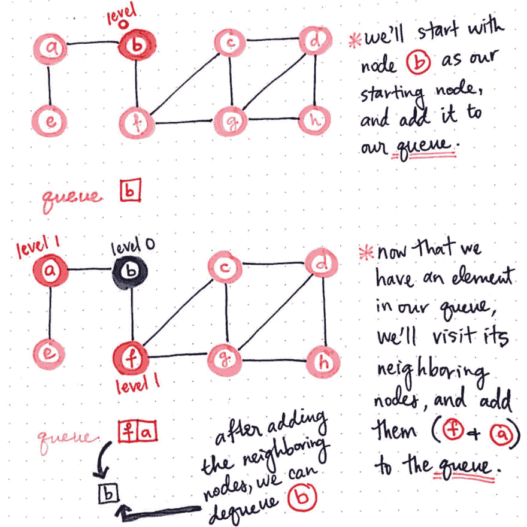](https://res.cloudinary.com/practicaldev/image/fetch/s--0TH0yM4A--/c_limit%2Cf_auto%2Cfl_progressive%2Cq_auto%2Cw_880/https://cdn-images-1.medium.com/max/1024/1%2AuwLddOZZksio58lCixU-Dw.jpeg) 

<figcaption>BFS，part 1</figcaption>

</figure>

一旦我们将节点 b 作为起点，我们将把它添加到我们需要检查的节点队列中。这是重要的第一步，因为我们将系统地遍历我们的队列并“访问我们添加到队列中的所有顶点”。

一旦我们的队列中有了一个元素(节点 b ),我们将“访问它，并将其标记为“已访问”。访问一个节点的过程实际上意味着我们注意到它的存在，并检查它的邻居节点。在这种情况下，b 的相邻节点是节点 f 和 a；因此，我们将把它们添加到我们的队列中。

一旦我们访问了节点 b 并将它的邻居添加到队列中，我们就可以让节点 b 出列了，因为我们已经做了所有需要做的事情。实际上，我们将节点 b 出队，将节点 f 和 a 出队。注意，节点 a 或 f 可能已经被首先添加到队列中；因为它们都是邻居，所以它们被添加到队列中的顺序并不重要，只要它们被一起添加。

我们还会注意到，我们添加到这个队列中的每一组邻居都会使我们离我们任意选择的“父节点”越来越远。例如，如果我们的“父节点”,节点 b 在我们的图中处于第 0 层，那么它的相邻节点离父节点有一层的距离，使它们在图中处于第 1 层。

现在，我们在队列中有两个元素:f 和 a。我们将对它们重复相同的步骤。由于下一个元素是顶点 f，我们将访问它的相邻节点，将节点 f 标记为已访问，用蓝色表示。我们还将把它的邻居(顶点 c 和 g)添加到队列中。

<figure>[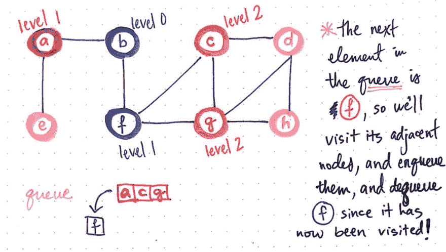](https://res.cloudinary.com/practicaldev/image/fetch/s--oa8pdOlI--/c_limit%2Cf_auto%2Cfl_progressive%2Cq_auto%2Cw_880/https://cdn-images-1.medium.com/max/1024/1%2AWCK3Hsd5k2ysYDKbH6gMZg.jpeg) 

<figcaption>BFS，partβ2</figcaption>

</figure>

一旦我们添加了 c 和 g(以我们选择的任何顺序)，我们就可以从队列的顶部让节点 f 出列，因为我们已经完成了访问它的工作！我们可以看到，节点 c 和 g 都离“父节点 b”两步远；换句话说，它们距离节点 b 两个节点，这使它们与主“父节点”的距离为 2 级。

<figure>[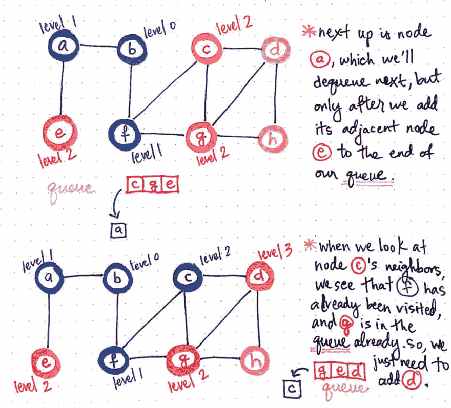](https://res.cloudinary.com/practicaldev/image/fetch/s--Jengb2_s--/c_limit%2Cf_auto%2Cfl_progressive%2Cq_auto%2Cw_880/https://cdn-images-1.medium.com/max/1024/1%2AkS-IL-XQCavRjxgvu8jnng.jpeg) 

<figcaption>BFS，partβ3</figcaption>

</figure>

接下来是节点 a，它在队列的最前面。我们知道该怎么做，对吗？

我们将把它的相邻节点——它只有一个，节点 e——添加到我们队列的末尾。我们将通过将节点 a 涂成蓝色来将其标记为“已访问”,然后我们可以将它从队列的前面出队。现在，我们的队列中有对顶点 c、g 和 e 的引用。

同样，我们将对位于队列前面的节点 c 重复相同的步骤。这就是有趣的地方！

当我们查看节点 c 的相邻邻居节点时，我们会看到它的邻居之一是节点 f。但是，我们已经*已经* *访问过*节点 f 了！类似地，节点 c 的另一个邻居是节点 g，它已经在队列中。因此，我们知道它已经在队列中等待被访问，所以我们不需要再将它添加到队列中。这留下了节点 c 的第三个也是最后一个邻居:节点 d。这个节点既没有被访问过，也没有被排队，所以我们实际上可以*对这个相邻的节点做一些事情*。好吧，更具体地说，我们可以把它加入到队列中。

一旦我们检查了节点 c 的所有邻居，我们就可以让它出列，继续我们的生活！我们将继续查看队列中的下一个元素，即节点 g。这里也有类似的情况。它的邻居节点 c 已经被访问过，而另一个邻居节点 d 刚刚入队，所以这两个顶点都不用做什么。

<figure>[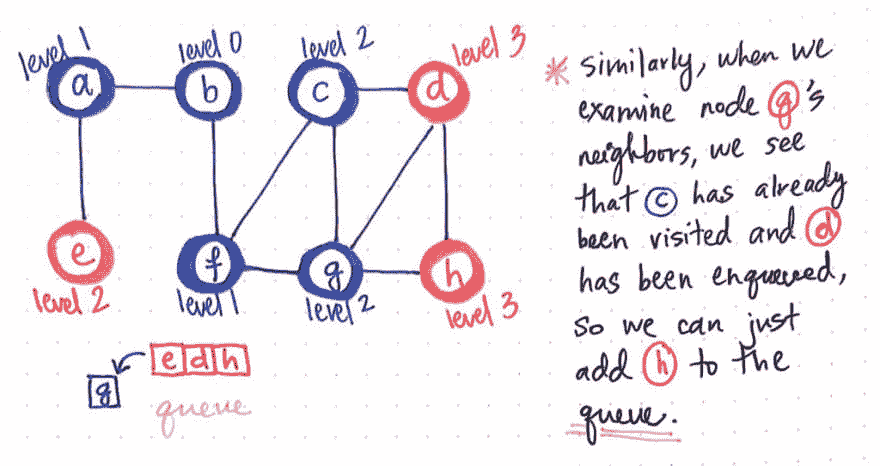](https://res.cloudinary.com/practicaldev/image/fetch/s--obDdZIW3--/c_limit%2Cf_auto%2Cfl_progressive%2Cq_auto%2Cw_880/https://cdn-images-1.medium.com/max/1024/1%2ANLG1tGpThkWr8A84nzU88A.jpeg) 

<figcaption>BFS，part 4</figcaption>

</figure>

唯一需要处理的邻居是节点 h，我们将把它添加到队列的末尾。一旦我们完成了这些，我们就可以让节点 g 从队列的前面出列。

<figure>[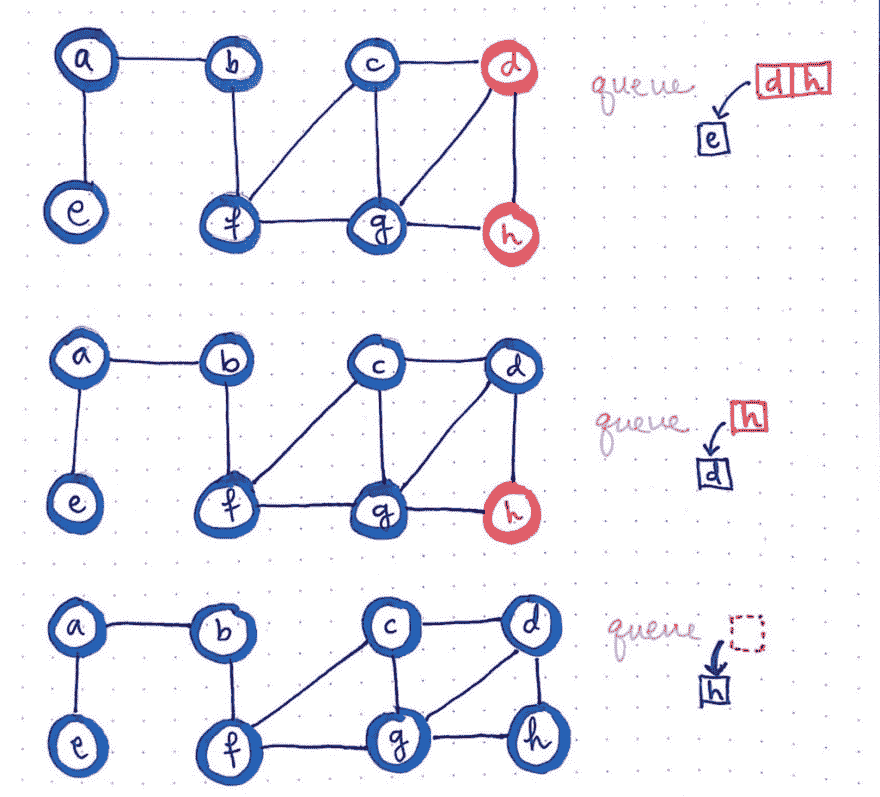](https://res.cloudinary.com/practicaldev/image/fetch/s--BrRjqWkN--/c_limit%2Cf_auto%2Cfl_progressive%2Cq_auto%2Cw_880/https://cdn-images-1.medium.com/max/1024/1%2AN651ddMq3TlVayiROpeYZQ.jpeg) 

<figcaption>BFS，partβ5</figcaption>

</figure>

我们现在会注意到，我们刚刚加入队列的节点 h 距离“父节点”有三层；也就是说，它是一个 3 级节点，因为它距离我们的起始节点 b 有 3 个节点。

我们的队列现在包含节点 e、d 和 h。当我们访问节点 e 时，我们看到它有一个已经被访问过的邻居节点 a。因此，除了将 e 标记为已访问，并将其出队之外，我们在这里无能为力。

节点 d 和 h 的情况类似。在这两种情况下，这两个节点的邻居要么 1)已经被访问，要么 2)已经在队列中，等待*被*访问。

最终，我们发现我们不仅将图中的所有节点都添加到了队列中，而且还遍历了队列中的所有节点。此时，我们只是访问一个 more，将其标记为已访问，并将其出队。最终，我们完成了整个队列的迭代，当队列为空时，我们就完成了遍历！

<figure>[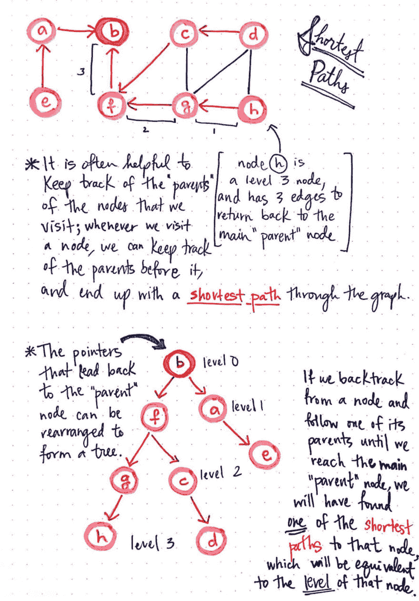](https://res.cloudinary.com/practicaldev/image/fetch/s--ZYKmEKsy--/c_limit%2Cf_auto%2Cfl_progressive%2Cq_auto%2Cw_880/https://cdn-images-1.medium.com/max/1024/1%2AhUVFsOzehynVr1JNWWhzaQ.jpeg)

<figcaption>BFS 最短路径图遍历</figcaption>

</figure>

BFS 的独特之处在于，它非常适合于确定图中任何节点和“父节点”之间的最短路径*。事实上，大多数 BFS 实现都会跟踪每个节点的“父节点”。这很有帮助，因为我们可以使用从起始节点到某个节点的路径指针来确定图中的最短路径。*

 *回到起始节点的 ***父指针*** 可以重新排列形成树。当我们将这些父指针想象成一个树形结构(而不是一个图形)时，我们可以开始看到每个相邻节点的层次开始发挥作用，并且变得更加明显。此外，如果我们*从一个节点回溯*，并沿着它的父指针回到主起始节点，我们将看到树中节点的级别与其在图中的级别相对应，并且节点的级别告诉我们需要采取多少步骤才能从该节点回到起始“父节点”,节点 b。指针实际上向我们显示了这些“最短路径”中的至少一个，尽管对于我们将要处理的大多数图来说，很可能有许多不同的“最短路径”。

例如，节点 h 是一个 3 级节点，并且具有 3 条边/指针，我们可以沿着这些边/指针返回到父节点节点 b。从节点 h 到 b 也可能有一条比 3 步长得多的路径，或者从节点 h 到 b 可能有多条 3 步“最短路径”。重要的是，我们至少有一条*最短路径可以轻松访问，这是因为我们通过 BFS 图遍历进行了回溯和查找。*

<figure>[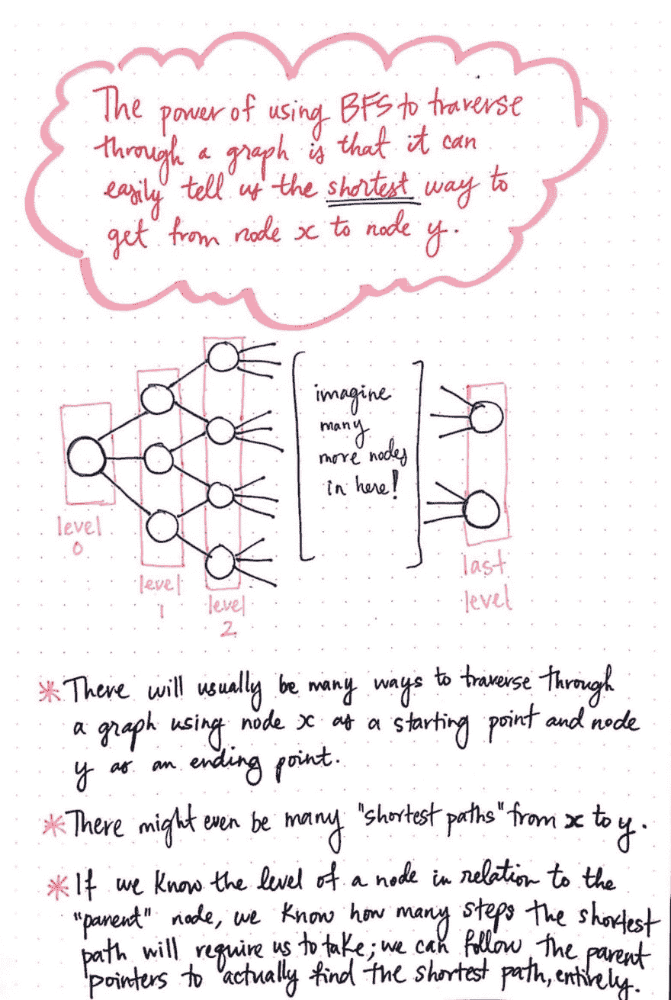](https://res.cloudinary.com/practicaldev/image/fetch/s--Ft4HXxcV--/c_limit%2Cf_auto%2Cfl_progressive%2Cq_auto%2Cw_880/https://cdn-images-1.medium.com/max/1024/1%2AxZZVfdG9KMkxeGe4BqXr2w.jpeg)

<figcaption>BFS 之力遍历</figcaption>

</figure>

> 使用广度优先搜索遍历一个图的强大之处在于，它可以很容易地告诉我们从一个节点到另一个节点的最短路径。

这对于巨大的图形特别有帮助，这在计算机科学问题中相当常见。例如，在此处展示的图像中，我们可能有许多节点和许多级别，并且希望能够知道从级别 0 到最后一个级别(无论是什么级别)有多少步。在解决这个问题时，很容易获得这个图中的最短路径是非常有用的。

当然，这取决于我们*跟踪父指针的*；在 BFS 的大多数实现中，我们会看到一个列表数组(或类似的东西)被用来跟踪路径中起始“父节点”和每个结束节点之间的最短路径。同样值得注意的是，在更大的图中，从一个节点到另一个节点总是有许多途径，并且在一个节点和另一个节点之间可能有许多“最短路径”。但是，如果我们知道节点相对于我们开始的“父节点”的级别，通过代理，我们也知道为了找到从任何一个节点返回到我们开始的“父节点”的最短路径而要采取的最少步骤数。

### 广度优先搜索的复杂性

了解像广度优先搜索图这样的算法是令人兴奋的，但如果不知道它在遍历图时的实际效率，这就不那么有趣了！理解 BFS 图遍历的运行时复杂性的最佳方式是通过检查它如何实际操作一个*图表示—*——换句话说，通过检查该算法如何以其编程格式在一个真实的图上运行。

上周，我们学习了一些关于图的实用点，[包括图的表示](https://dev.to/vaidehijoshi/from-theory-to-practice-representing-graphs)。表示图的最常见形式之一是使用 ***邻接表*** ，我们知道它是*边表*和*邻接矩阵*的混合。下图是我们的图在邻接表中的样子。

<figure>[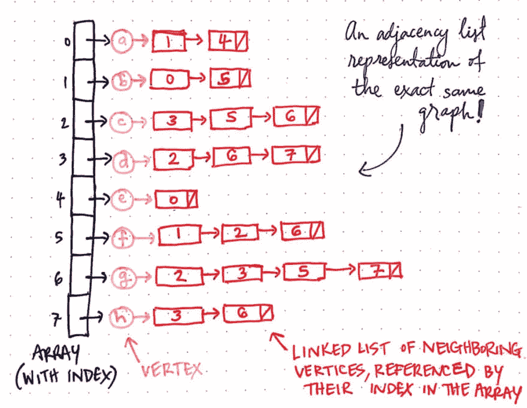](https://res.cloudinary.com/practicaldev/image/fetch/s--0KR4u1yR--/c_limit%2Cf_auto%2Cfl_progressive%2Cq_auto%2Cw_880/https://cdn-images-1.medium.com/max/1024/1%2AaOCvuDauXWO_8UQnXjd0EQ.jpeg) 

<figcaption>用 BFS</figcaption>

</figure>

表示图的邻接表

我们会注意到有一个索引数组，每个数组都引用了图中的一个顶点。每个顶点依次引用相邻顶点的链表。顶点的链表包含对该顶点的相邻节点的索引的引用。

因此，例如，顶点 e 只有一个相邻节点 a。因此，顶点 e 的相邻链表包含对数组中索引 0 的引用，这是节点 a 所在的位置。如果我们快速浏览一下这个邻接表，我们会发现它直接映射到我们一直在处理的同一个图。

<figure>[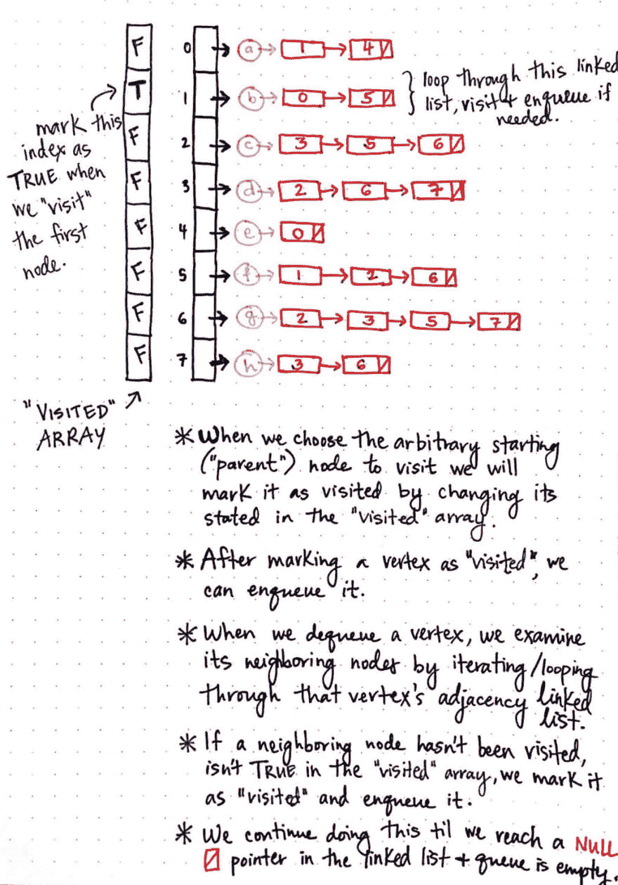](https://res.cloudinary.com/practicaldev/image/fetch/s--H5Fz-xdY--/c_limit%2Cf_auto%2Cfl_progressive%2Cq_auto%2Cw_880/https://cdn-images-1.medium.com/max/1024/1%2AoIpFcsezFmre4c9Fun3acw.jpeg) 

<figcaption>将顶点标记为“到访过”</figcaption>

</figure>

当我们在这个邻接表图形表示上实现 BFS 时，我们将需要一个额外的数据结构:一个“访问过的数组”,我们将使用它来跟踪哪些顶点已经被访问过(哪些没有被访问过)。这个数组将只包含假布尔值开始。但是，当我们访问第一个节点时，我们会将其标记为 TRUE，最终在 BFS 算法结束时，整个数组都将填充 TRUE 值。

如果我们考虑算法如何在这个邻接表上操作，我们可以开始理解在一个图上运行 BFS 实际需要多少时间。

例如，让我们采取第一步，将节点 b 添加到队列中，并实际访问它；那会涉及到什么？

1.  当我们选择 b 的任意起始“父节点”时，我们会通过在“已访问数组”中改变它的状态来将其标记为已访问。
2.  然后，在“已访问数组”中将它的值从 FALSE 更改为 TRUE 后，我们将对它进行排队。
3.  接下来，当对顶点进行出队时，我们需要检查它的相邻节点，并迭代(循环)它的相邻链表。节点 b 有两个相邻节点，分别位于索引 0 和 5 处。
4.  如果这些相邻节点中的任何一个没有被访问过(在“已访问数组”中没有 TRUE 状态)，我们会将其标记为已访问，并将其排队。
5.  最后，在移动到队列中的下一个节点之前，我们将继续这样做，直到到达链表中的一个空指针。一旦队列完全空了，我们就知道算法运行完毕了。

<figure>[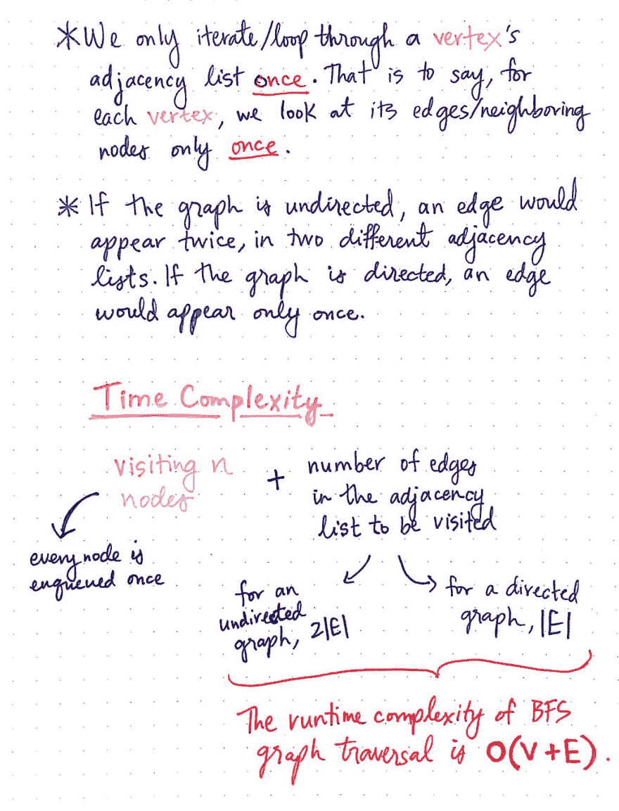](https://res.cloudinary.com/practicaldev/image/fetch/s--S-LPNTOr--/c_limit%2Cf_auto%2Cfl_progressive%2Cq_auto%2Cw_880/https://cdn-images-1.medium.com/max/1024/1%2Acbf3KkVnodOnJep6-BzE_g.jpeg)

<figcaption>BFS 图遍历的运行时复杂度</figcaption>

</figure>

想想我们需要为单个节点做什么，运行时的复杂性就变得更加明显了。对于图中的每一个顶点，我们将遍历该顶点的邻接表*一次*。也就是说，我们只需要查看它的相邻节点(在邻接表中，它实际上是它所有边的表示)一次——当我们让它出列，并让任何必要的邻居入队时。

然而，我们会回忆起，如果图是*无向的*，那么每条边会在邻接表中出现两次，每条边对应一个与之相连的节点。但是如果图是*定向的*，那么每条边只出现一次，只出现在一个节点的邻接表中。

> 如果我们必须访问每个节点一次，并检查其邻接表中的每条边，则有向图和无向图的运行时复杂性都是由邻接表表示的图所表示的顶点和它们的边的总和，或 O(V + E)

对于一个*无向图*，这意味着我们访问所有的顶点( *V* )和 2| *E* |边。对于一个*有向*图，这意味着我们访问所有的顶点( *V* )和| *E* |边。图的邻接表表示的大小直接关系到我们使用广度优先搜索遍历它需要多少时间，这使它成为一种 ***线性*** 算法！

BFS 图遍历算法是一种流行的搜索解决方案，对于快速确定图中两个位置之间的最短路径特别方便。然而，更让我感兴趣的是这种搜索算法的奇怪和有点可悲的起源。

它实际上是由德国工程师康拉德·楚泽发明的，他发明了世界上第一台可编程计算机，通常被认为是现代计算机的发明者。Zuse 于 1945 年首次将 BFS 图遍历算法理论化，作为查找图数据结构的连通分量或两个连通顶点的解决方案。他在他的博士论文中写到了 BFS 算法，这篇论文直到 1972 年才发表。这个故事的情节转折是，当祖泽第一次在论文中写 BFS 时，他的想法实际上被*拒绝了*！

BFS 算法后来“在 14 年后的 1959 年被美国数学教授 Edward F. Moore 重新发明”,他(重新)创造了该算法作为寻找迷宫中两点间最短路径的解决方案。仅仅几年后，在 1961 年，它被当时在贝尔电话实验室工作的一位名叫 C.Y. Lee 的研究员独立发现。李的论文， [*一种用于路径连接的算法及其应用*](http://ieeexplore.ieee.org/document/5219222/?arnumber=5219222) ，将 BFS 描述为在 IBM 704 计算机的[上寻找两点之间的最佳路径的布线算法。](https://www.youtube.com/watch?v=DKaVvv15Heo)

第一个将广度优先搜索作为图遍历的解决方案的人因为他的创新思想而被拒绝，这种想法很荒唐。如果有什么不同的话，这是一个关于坚持的教训，并且提醒我们，有时，即使是计算机科学中最著名、最复杂和最广泛使用的解决方案也必须为自己的生存权利而斗争。

### 资源

因为 BFS(还有 DFS！)都是众所周知的算法，找到深入研究它们如何运行的资源并不太困难。如果你想了解更多，或者想了解这个算法的更复杂的方面，这里有一些很好的资源可以开始！

1.  [图形遍历可视化](https://visualgo.net/en/dfsbfs)，VisuAlgo
2.  哈佛大学计算机科学系，广度优先搜索
3.  [图的广度优先搜索(BFS)第二部分“实施”](https://www.youtube.com/watch?v=ZVJFOrsHxMs) , Sesh Venugopal
4.  [广度优先搜索(BFS)](https://www.youtube.com/watch?v=s-CYnVz-uh4) ，麻省理工学院开放式课程
5.  [图形遍历-广度优先和深度优先](https://www.youtube.com/watch?v=bIA8HEEUxZI)，学院查询

* * *

*本帖最初发表于[medium.com](https://medium.com/basecs/going-broad-in-a-graph-bfs-traversal-959bd1a09255)T3】**