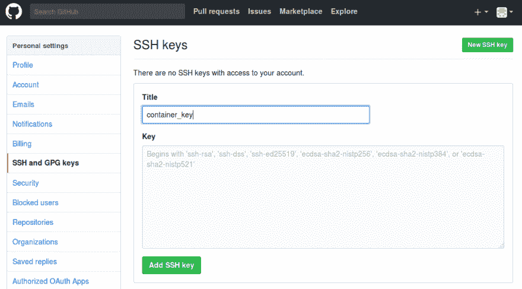

# 同一台电脑上的多个 GitHub 帐户

> 原文：<https://dev.to/ech0server/multiple-github-accounts-in-the-same-computer>

由于工作原因，我需要使用两个或更多的 GitHub 账户，有时我需要在同一台机器上使用这些账户。我一直在尝试使用以下解决方案:

[https://code . tuts plus . com/tutorials/quick-tip-how-to-work-with-github-and-multi-accounts-net-22574](https://code.tutsplus.com/tutorials/quick-tip-how-to-work-with-github-and-multiple-accounts--net-22574)

然而，我不能让它工作，当我用 Docker 做实验的时候，我有了用一个容器来推送我的改变的想法。到目前为止，我还没有发现任何与安全相关的问题，显然从来没有将容器暴露在互联网上，只是启动它，推送您的更改并停止它，或者编写脚本来启动它，向 github 推送添加新的 ssh 密钥，然后销毁容器。

解决方案很简单，从我在之前的文章中创建的图片开始一个新的容器:[创建 Docker 图片](https://dev.to/ech0server/creating-a-docker-image-and-upload-it-to-docker-hub)

首先拉图像:

```
docker pull drverboten/multigitaccount 
```

Enter fullscreen mode Exit fullscreen mode

然后从映像创建一个新的容器，但是使用-v 选项:
添加源代码的路径或者任何其他想要添加到 repo 中的资源

```
docker run -it --name gitpub -v /home/[user]/[path to workspace]:/workspace drverboten/multigitaccount /bin/sh 
```

Enter fullscreen mode Exit fullscreen mode

在容器运行之后，使用下面的命令创建一个新的 ssh 密钥:

```
ssh-keygen -t rsa -b 4096 -C "[email]" 
```

Enter fullscreen mode Exit fullscreen mode

将您的密钥复制到剪贴板上您可以直接复制文本:

```
cat ~/.ssh/id_rsa.pub 
```

Enter fullscreen mode Exit fullscreen mode

将密钥添加到 GitHub

[T2】](https://res.cloudinary.com/practicaldev/image/fetch/s--1Zyo3nSr--/c_limit%2Cf_auto%2Cfl_progressive%2Cq_auto%2Cw_880/https://thepracticaldev.s3.amazonaws.com/i/5dog61f5ni00cie1dnc5.png)

回到容器中配置 git:

```
git config --global user.email "[email]"
git config --global user.name "[username]" 
```

Enter fullscreen mode Exit fullscreen mode

而且你都设置好了，就像平时一样推 GitHub，它会以配置好的用户发布。

-眼睛