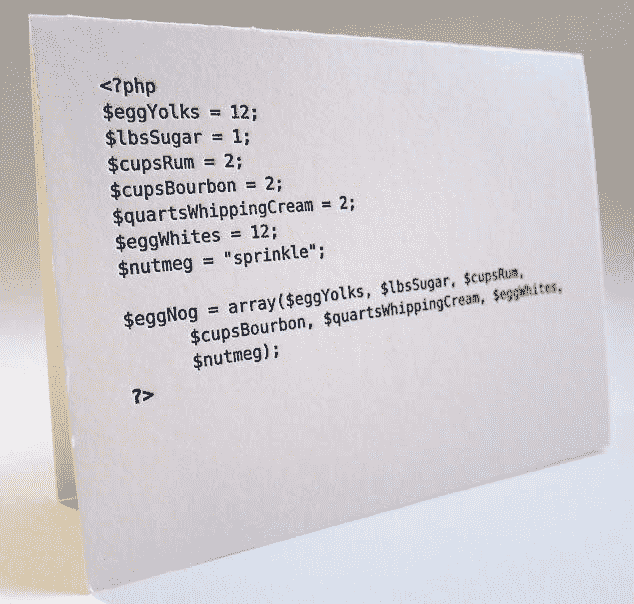

# HtC: SD 第 1b 周和第 2 周

> 原文：<https://dev.to/monicaleep/htc-sd-weeks-1b-and-2-54d9>

**第 1b 周**介绍了我们第一份如何设计功能的设计方案。设计方案有五个部分，应该或多或少按顺序完成。虽然对于一个小函数来说，它们看起来有些多余，但我确信它们将有助于编写大型复杂的程序。在尝试模块评估之前，我复习了一周的所有练习题，这有助于巩固成功完成课程所需的步骤、语法和风格。

语言本身，球拍，有很多很多东西，我们需要在服务台查找。例如，虽然它有 Number 类型，但也有 Natural 类型，它是 Number 的子集，如果适合程序，就应该使用它。对教师来说，复习语言的每一点都是没有意义的。首先，这是不可能的，其次，这种方式迫使我们自学和探索文档。

<figure> 

<figcaption>不太</figcaption>

</figure>

**第 2 周**从函数转移到数据。如果我们可以定义并限制函数接收的数据类型，那么设计函数就更容易了。前半周介绍了三种新的数据结构:区间、枚举和明细。每个都有一个例子，我们设计了一个正式的数据定义(根据食谱)。起初通读食谱有点让人不知所措，但经过一点实践后，它就相当直观了。

下半周将展示如何基于这些新的数据类型设计函数。有很多事情要记录，这就是为什么遵循食谱是关键。我有点害怕接下来会发生什么，看起来这个过程发展得相当快！