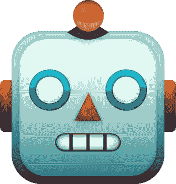
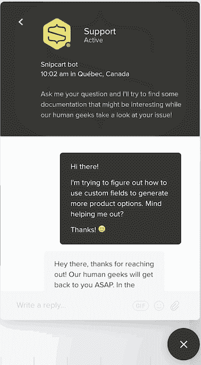
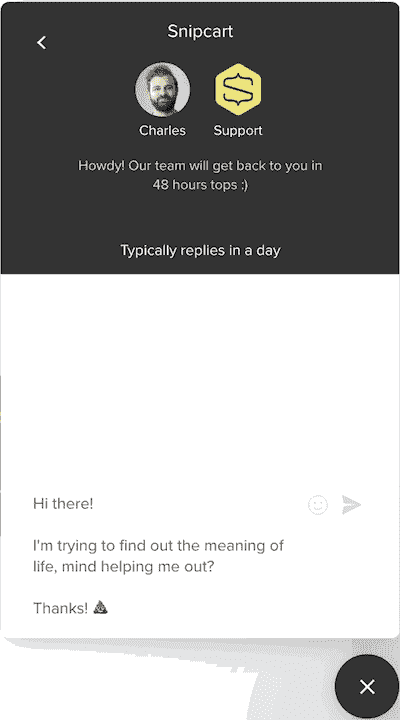
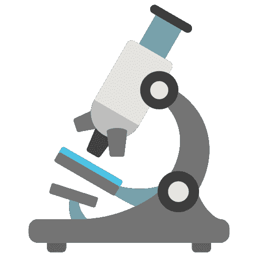
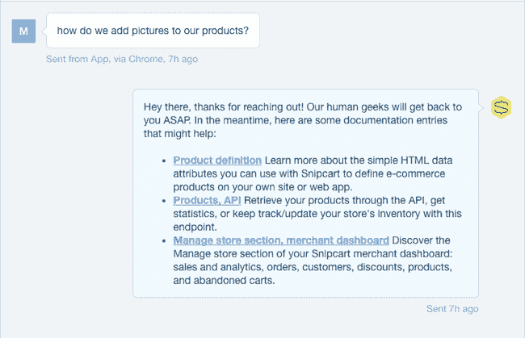
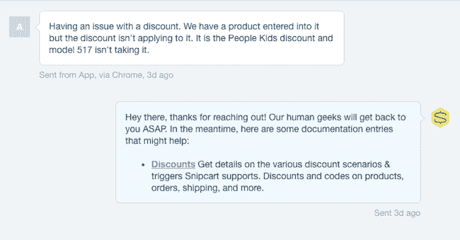
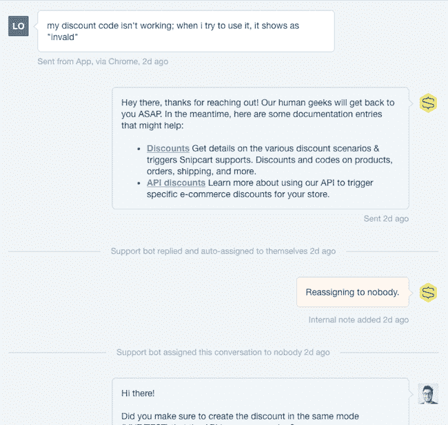
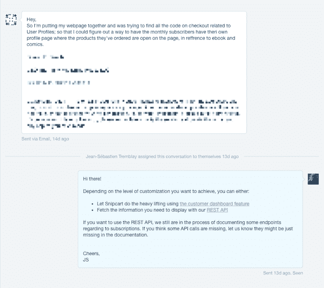

# 我们如何试图通过聊天机器人摆脱支持危机

> 原文：<https://dev.to/the_fln/how-we-tried-to-chatbot-our-way-out-of-a-support-crisis>

你的客户支持有没有感觉像是西西弗斯神话的重演？

**40 开的票。**

你吸气，卷起袖子:“拿着我的咖啡杯，我要进去了！”

*5 小时后*

**15 开的票。**

你对自己在临时待办事项中解决的所有问题进行自我评价。内容，你退出系统，吃点零食，然后睡觉。

第二天早上。

**40 开的票。**

“什么#$@&%*！”

* * *

几个月前，我们 SaaS 的支持变成了这种共享的西西弗现实。不管我们怎么努力，票还是…不断堆积。

我以前读过“大型创业公司支持恐怖故事”。

“天啊，我们很幸运，在 Snipcart 中支持并不那么困难！我记得 2013 年的时候想。

我曾经相信，对于我们这个小小的、卑微的 SaaS 来说，这从来都不是问题。

但是谦逊的 SaaS 有点过分了。随着支持力度的加大，情况开始发生变化。

发展速度直线下降。营销计划放缓。士气下降了一个档次。我开始理解为什么整个产品和博客都是围绕支持而建立的。

我们不得不做一些事情。

经过几轮毫无结果的调查，我们想出了一个主意:**建立一个支持聊天机器人**。

## 语境&期望

[T2】](https://res.cloudinary.com/practicaldev/image/fetch/s--ryFk_5BZ--/c_limit%2Cf_auto%2Cfl_progressive%2Cq_auto%2Cw_880/https://snipcart.com/media/171935/support-chatbot-experiment-expectations.jpeg)

我们的直觉是，大多数用户想要的答案——尤其是技术性的——已经在我们的文档中了。好像人们并没有真正读完它。现在，我们知道它需要一点爱，但我们潜意识里忽略了这个事实。

“为什么，哦，为什么我们所谓的精通技术的用户没有阅读我们为他们写的所有信息！我们合唱了吗？

最重要的是，我们仍然被呆滞的 UX 的用户之声计划所束缚。

所以我们的计划很简单:

1.  切换到对讲机。
2.  使用他们的 API 构建一个聊天机器人，将用户重定向到文档。

我们的期望:

*   使用自动化和新的系统来减少支持工作，并重新获得开发速度。

现在，我们知道聊天机器人还不够成熟，不足以取代我们的整个支持基础设施。考虑到这一点，我们没有试图重新发明聊天机器人的轮子，或者在我们的聊天机器人中注入核心的机器学习。我们只是去摘挂在最低处的果子，建造了我们亲切地称之为“我们的哑巴机器人”的东西

 
*哔哔哔，我是机器人！*

首先，我们用相关关键字标记我们的文档(Node.js 应用程序)条目。

然后，我们在 Node/Express 中构建了一个 webhook 处理程序。它的功能很简单:对内部通信票据进行语义分析，将它们与相关条目进行匹配，并在内部通信中提供给它们。

[T2】](https://res.cloudinary.com/practicaldev/image/fetch/s--Lk7PvuF6--/c_limit%2Cf_auto%2Cfl_progressive%2Cq_66%2Cw_880/https://snipcart.com/media/175828/chatbot-conversation1.gif)

如果机器人没有找到匹配的条目，它会简单地问候用户，并通知他即将到来的人类响应。

[T2】](https://res.cloudinary.com/practicaldev/image/fetch/s--Fz3oqzhC--/c_limit%2Cf_auto%2Cfl_progressive%2Cq_66%2Cw_880/https://snipcart.com/media/171931/chatbot-conversation2.gif)

如你所见，我们正在做典型的[机器人到人类的交接](https://blog.sendsonar.com/2016/12/19/how-to-nail-the-bot-to-human-handoff/)。如果我们的哑巴机器人不能回答，我们会接管。换句话说，我们只是**在支持的基础上应用了一层自动化来改善我们和我们客户的生活**。

对我们来说，将这些答案注入到我们认为客户经常使用而不参考文档的渠道中是非常关键的。首先，它回答了“优质快速的服务，有价值的答案，而不仅仅是“请等待”占位符”的期望。第二，它实现了我们静态文档的潜在帮助。

你可能在想:“当然，很酷的东西，但是它起作用了吗？”

嗯，实际上，有点像！

## 结果:弄懂数字的意义&单词

[T2】](https://res.cloudinary.com/practicaldev/image/fetch/s--3up_B3Gh--/c_limit%2Cf_auto%2Cfl_progressive%2Cq_auto%2Cw_880/https://snipcart.com/media/175829/chatbot-experiment-results.png)

我们在四个月的时间里追踪了以下结果。

### 支持指标

*   6.5%的门票完全由机器人回答(只有人类输入=友好的再见，关闭门票)
*   10%的票证由机器人部分回答(快速人工跟进)
*   83.5%的问题没有被机器人回答(人为解决的问题)

综合前两点，我们看到我们的哑机器人使我们的支持工作减少了 16.5%。就我们花在这上面的时间而言，这已经很棒了！

### 参与度指标

我们在谷歌分析中跟踪行为和结果，在我们的机器人建议链接上使用简单的 [UTM 参数](https://support.google.com/analytics/answer/1033867?hl=en):

*   5%的潜在客户没有参与产品，但在机器人对话后转化为活跃用户(转化率是我们通常转化率的 2 倍以上)
*   由 bot 链接触发的网站会话的跳出率很低，约为 48%
*   用户每次咨询 3.5 页，在网站上花费超过 5 分钟

更重要的是，这些数据告诉我们，我们的一个假设“用户的懒惰”是错误的。他们要么找到了答案并继续寻找，要么找不到答案。考虑到大多数人是通过对讲机联系我们的，后者似乎发生得更频繁。这里的洞察力？机器人重定向并没有解决大多数用户问题。

### 定性结果

在关注了硬性指标之后，我们转向了软性数据:对话。我们分析了用户的 100 多个线程，并记录了我们的观察结果。

 
*机器人成功回答的一个问题*

 
*机器人部分回答的问题*

 
*同上*

 
*一个需要菜谱或烹饪书但我们没有的问题*

虽然这种定性的方法确实很费时间，但是非常值得。这促使我们得出三个结论:

1.  用户经常试图在文档中自己找到答案。很多时候，他们寻找的答案根本不存在，或者不容易找到。

2.  我们的文档中明显缺乏“结构化内容(食谱、食谱、工作流程)”。

3.  我们提倡的开发人员优先、灵活的电子商务方法不可避免地增加了支持问题的复杂性和多样性。而且也不克制商家自己直接提问！

## 总结:到底发生了什么？

[T2】](https://res.cloudinary.com/practicaldev/image/fetch/s--6z5XooY5--/c_limit%2Cf_auto%2Cfl_progressive%2Cq_66%2Cw_880/https://snipcart.com/media/175831/support-chatbot-experiment-analysis.gif)

受席卷网络的聊天机器人文章的影响，我们选择了一种冲动、时髦的捷径来解决一个深层问题。虽然我们经常称赞专注于基础知识，但我们却做了相反的事情。也就是说，我们的机器人确实帮助了我们(现在仍然如此)。然而，这整个事件是一个清晰的提醒[实践我们所宣扬的](https://snipcart.com/blog/documentation-the-ultimate-marketing-tool-for-developer-first-products)，并给予我们的文档一个很大的爱。

我认为我们的机器人虽然没有我们希望它与客户进行的所有对话，但至少有一个对我们非常有用的对话:

哑巴机器人:伙计们，你们没有给我足够清晰的信息来养活你们的用户。你需要重构你的文档。
***狙击队**:你说的对，哑巴机器人。我们会处理的。*

总的来说，我认为我们在这场支持危机中进行了半实验。完整的方法是重构我们的帮助内容(文档)。但我很高兴我们这次喝了一点聊天机器人。因为我们的聊天机器人实验虽然对支持有所帮助，但也提醒了我们:

*   我们的文档中有内容缺口和架构问题需要解决。
*   有了像我们这样灵活的产品，一些对话将不可避免地需要“个性化”的人工输入，并从中受益。

关注这些将使我们更好地为感兴趣的活跃用户服务。这些人对 SaaS 的成功至关重要。他们在你的转化漏斗中——他们已经采取行动，表示出兴趣，并经常开始使用你的产品。他们的钱要么在他们手里，要么已经在你口袋里了。作为一家 SaaS 企业，你不能不给这些用户应有的关怀。

## 那么，你应该为你的 SaaS 支持者开发一个聊天机器人吗？

[T2】](https://res.cloudinary.com/practicaldev/image/fetch/s--s8GSshne--/c_limit%2Cf_auto%2Cfl_progressive%2Cq_auto%2Cw_880/https://snipcart.com/media/171934/chatbot-saas-support-ascii.jpeg)

嗯……也许吧？

我认为很重要的一点是，门票减少 16.5%(我们的数字)意味着可以节省大量的时间和金钱。尤其是大中型 SaaS。因此，聊天机器人实验可能非常值得你花时间，尤其是如果你的产品使用比我们的更精简的话！

此外，如果您像我们一样托管大部分帮助内容，构建一个机器人并分析其交互可能有助于利用这些内容并对其进行改进。市场上有很酷的特定平台机器人，如 [Intercom 的运营商](https://www.intercom.com/operator-bot)，但它们要求帮助内容托管在平台的第三方。我们更喜欢自己举办的几个原因:

*   控制品牌和视觉体验
*   控制内容的深度和格式
*   提高搜索引擎优化(更大的网站架构，更多的网站主题权威，指向自己领域的入站链接，技术 KW 定位等。)

无论如何，我很乐意听到其他想法和经验，利用机器人为您的 SaaS 或业务！

如果你想参与，我会密切关注评论区。:)

如果你喜欢这首曲子，那就来吧，给它一个回应！也可以在网上某个地方分享。那会很酷。

* * *

这篇文章最初出现在聊天机器人杂志的[上。](https://chatbotsmagazine.com/how-we-tried-to-chatbot-our-way-out-of-a-support-crisis-b6b97621299b)