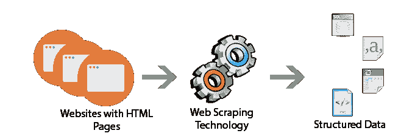

# 蜘蛛网

> 原文:[https://dev.to/japneet121/spidering-the-web](https://dev.to/japneet121/spidering-the-web)

[T2】](https://2.bp.blogspot.com/-wufi5ZCBw_E/Wbtjh0rRpFI/AAAAAAAAByU/O2ph9Y0cSJcRnIi23pNT4PkiFcifJ5RZQCLcBGAs/s1600/web-scraping-services.png)

## 介绍

我们将讨论

*   爬行/刮擦
*   如何用 python 优雅地做到
*   限制和约束

在以前的帖子中，我分享了一些文本挖掘和分析的方法，但在分析之前，最主要和最重要的任务之一是获得我们想要分析的数据。

文本数据以博客、文章、新闻、社交订阅源、帖子等形式存在，其中大部分以 API、RSS 订阅源、批量下载和订阅的形式分发给用户。

一些站点不提供任何以编程方式提取数据的方法，这就是报废的原因。

***注意:**从非免费或不公开的网站上抓取信息会有严重的后果。*

Web 抓取是一种获取 HTML 格式的网页并对其进行解析以获取所需信息的技术。

由于松散的规则和大量的属性，HTML 本身非常复杂。信息可以通过两种方式收集:

*   使用正则表达式手动过滤
*   蟒蛇的方式-美丽的汤

在本帖中，我们将讨论美汤的刮痧方法。

## 美味的汤

根据其[文档](https://www.crummy.com/software/BeautifulSoup/bs4/doc/)中的定义

*[美汤](http://www.crummy.com/software/BeautifulSoup/) 是一个从 HTML 和 XML 文件中抽取数据的 Python 库。它与您喜欢的解析器一起工作，提供导航、搜索和修改解析树的惯用方式。它通常为程序员节省数小时或数天的工作。*

 *T2】*

 *T2】*

如果你曾经尝试过像解析文本和 HTML 文档这样的东西，你就会明白这个模块是如何出色地构建的，并且真的节省了很多程序员的工作和时间。

让我们从美丽的汤开始

### 装置

希望你的系统里安装了 python。要安装漂亮的汤，您可以使用 pip

pip 安装 beautifulsoup4

### 入门指南

问题 1:从一个页面中获取所有的链接。

对于这个问题，我们将使用一个样本 HTML 字符串，它有一些链接，我们的目标是获得所有的链接

```
html_doc  =  """  <html>
<body>
<h1>Sample Links</h1>
<br>
<a href="https://www.google.com">Google</a>
<br>
<a href="https://www.apple.com">Apple</a>
<br>
<a href="https://www.yahoo.com">Yahoo</a>
<br>
<a href="https://www.msdn.com">MSDN</a>
</body>
</html>  """
```

```
#to import the package 
from bs4 import BeautifulSoup

#creating an object of BeautifulSoup and pass 2 parameters
#1)the html t be scanned
#2)the parser to be used(html parser ,lxml parser etc)
soup=BeautifulSoup(html_doc,"html.parser")

#to find all the anchor tags in the html string
#findAll returns a list of tags in thi scase anchors(to get first one we can use find )
anchors=soup.findAll('a')

#getting links from anchor tags
for a in anchor:
    print a.get('href') #get is used to get the attributes of a tags element
    #print a['href'] can also be used to access the attribute of a tag

```

就是这样，只需 5-6 行代码就可以从 html 中获取任何标签，并对其进行迭代，找到一些属性。你能借助正则表达式做到这一点吗？这将是一项艰巨的工作。我们可以想一想这个模块编码得有多好来执行所有这些功能。

谈到解析器(在创建一个漂亮的 Soup 对象时我们已经过了)，我们有多种选择。

下表总结了每个解析器库的优点和缺点:

<colgroup><col width="18%"> <col width="35%"> <col width="26%"> <col width="21%"></colgroup> 
| 解析器 | 典型用法 | 优势 | 缺点 |
| Python 的 html.parser | `BeautifulSoup(markup, "html.parser")` | 

*   Battery Collection
*   passable speed
*   Be lenient (as of Python 2.7.3 and 3.2\. )

 | 

*   is not too loose (before Python 2.7.3 or 3.2.2)

 |
| lxml 的 HTML 解析器 | `BeautifulSoup(markup, "lxml")` | 

*   extremely fast
*   Be lenient

 | 

*   External C dependency

 |
| lxml 的 xml 解析器 | T0`BeautifulSoup(markup, "xml")`T3】 | 

*   Very fast
*   Currently the only supported XML parser

 | 

*   External C dependency

 |
| html5lib | `BeautifulSoup(markup, "html5lib")` | 

*   extremely loose
*   The way to parse the page and the web browser
*   Create a valid HTML5

相同 | 

*   Very slow
*   External Python depends on

 |

### 其他方法和用法

美丽的汤是一个巨大的图书馆，可以用一行代码完成太难的事情。在 HTML 中搜索标签的一些方法有:

```
#finding by ID

soup.find(id='abc')

#finding through a regex

#lmit the return to 2 tags

soup.find_all(re.compile("^a"),limit=2)

#finding multiple tags

soup.find_all(['a','h1'])

#fiind by custom or built in attributes

soup.find_all(attrs={'data':'abc'})

```

### 问题二:

**在上面的例子中，我们使用 HTML 字符串进行解析，现在我们将看到如何点击一个 URL 并获取该页面的 HTML，然后我们可以用与上面的 HTML 字符串相同的方式解析它**

为此将使用 python 的 urllib3 包。它可以通过以下命令轻松安装

```
pip install urllib3
```

urllib3 的文档可以在这里看到[。](https://urllib3.readthedocs.io/en/latest/user-guide.html)

```
import urllib3
http = urllib3.PoolManager()
#hiitng the url 
r = http.request('GET', 'https://en.wikipedia.org/wiki/India')

#creating a soup object using html from the link
soup=BeautifulSoup(r.data,"html.parser")

#getting whole text from the wiki page
text=soup.text

#getting all the links from wiki page
links=soup.find_all('a')

#iterating over the new pages and getting text from them
#this can be done in a recursive fashion to parse large number of pages
for link in links:
    prihref=nt link.get('href')
    new_url='https://en.wikipedia.org'+href
    http = urllib3.PoolManager()
    r_new = http.request('GET', new_url)
    #do something with new page
    new_text=r_new.text

#getting source of all the images
src=soup.find('img').get('src')

```

这只是使用 Python 进行 web 抓取的基本介绍。使用本教程中使用的包可以实现更多的功能。这篇文章可以作为一个起点。

## 要记住的要点

网络抓取对于收集不同用途的数据非常有用，如数据挖掘、知识创造、数据分析等，但是应该小心使用。

作为一个基本的经验法则，我们不应该刮任何付费内容。话虽如此，我们还是要遵从网站的 robots.txt 文件，才能知道哪些区域是可以抓取的。

在刮擦之前研究一下法律含义是非常重要的。T2**T4**T6】

## 希望文章内容翔实。

技术侦察员(JSC)