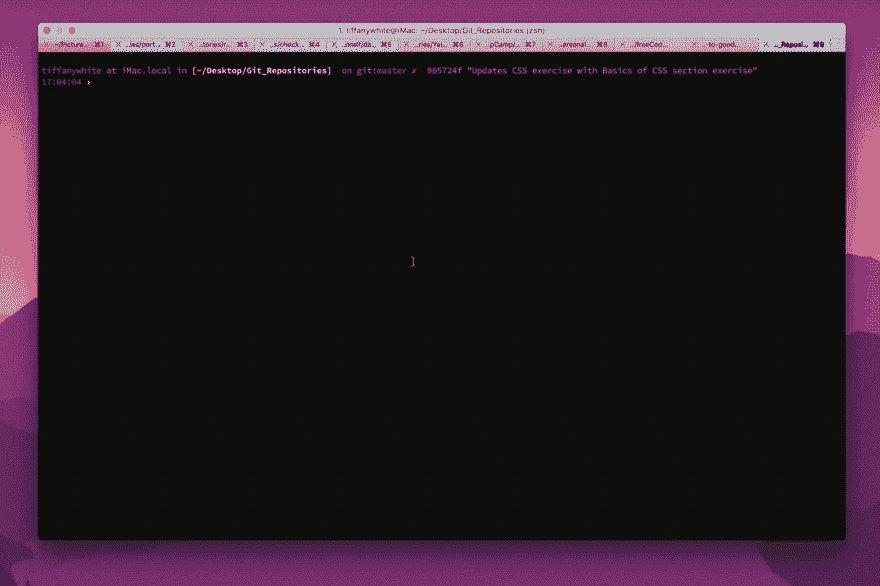
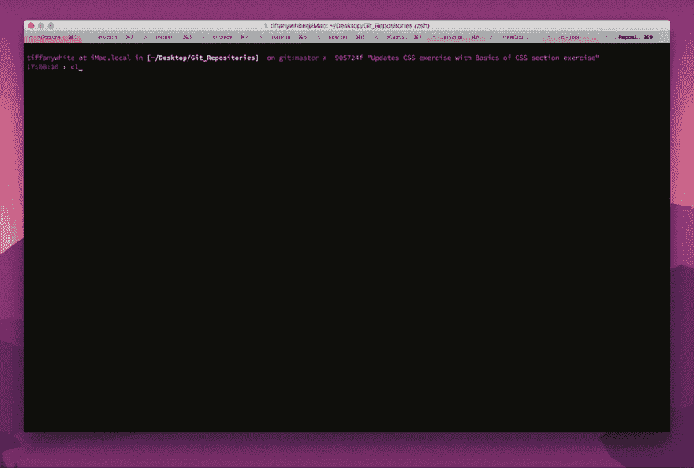

# Map:另一个高阶函数

> 原文：<https://dev.to/tiffany/map-another-higher-order-function>

这篇文章最初发表在我的博客上。

Map 是另一个高阶函数，它遍历一个数组，不丢弃它，而是对它进行变换/变异。

在这里，我想得到一个所有动物名字的数组。

```
const animals = [
  { name: ‘Catticus Finch’,  species: ‘cat’ },
  { name: ‘Peaches’,         species: ‘fish’ },
  { name: ‘Bobby’,           species: ‘dog’ },
  { name: ‘Lucifer’,         species: ‘cat’ },
  { name: ‘Beatrix’,         species: ‘rabbit’ },
  { name: ‘Cerulean’,        species: ‘fish’ }
]; 
```

Enter fullscreen mode Exit fullscreen mode

下面是我们如何用 for 循环来完成这个任务:

```
var names = [];

for (var i = 0; i < animals.length i++) {
  names.push(animals[i].name); 
} 
```

Enter fullscreen mode Exit fullscreen mode

...在这里，我们遍历数组并将`name`属性的值推入空的`animals`数组。

函数`.filter`期望一个布尔值，但是`.map`期望一个回调函数返回一个它将推入一个新数组的转换后的对象。

以代码形式返回每种动物的名称:

在 ES5:

```
var names = animals.map(function() {
  return animal.name;
}); 
```

Enter fullscreen mode Exit fullscreen mode

在 ES6:

```
const names = animals.map((animal) => animal.name ); 
```

Enter fullscreen mode Exit fullscreen mode

[T2】](https://res.cloudinary.com/practicaldev/image/fetch/s--kFeysQ7z--/c_limit%2Cf_auto%2Cfl_progressive%2Cq_66%2Cw_880/https://cdn.tiffanywhite.tech/wp-content/uploads/2017/09/17000752/names_map1.gif)

您可以使用`.map`来返回数组的子集。因为它期望回调返回一个对象，所以我们可以创建新的对象。

在 ES5

```
var names = animals.map(function(animal) {
  return animal.name + ‘ is a ‘ + animal.species;
}); 
```

Enter fullscreen mode Exit fullscreen mode

在 ES6

```
const names = animals.map((animal) => animal.name + ‘ is a ‘ + animal.species ); 
```

Enter fullscreen mode Exit fullscreen mode

[T2】](https://res.cloudinary.com/practicaldev/image/fetch/s--bUFhSl4y--/c_limit%2Cf_auto%2Cfl_progressive%2Cq_66%2Cw_880/https://cdn.tiffanywhite.tech/wp-content/uploads/2017/09/17000807/names_species.gif)

## 用高阶函数更容易进行数组操作

`.map()`和`.filter()`只是两个高阶函数，可以用来操作和迭代数组。

你可以查看[这个链接](http://eloquentjavascript.net/05_higher_order.html)做进一步阅读。