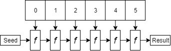

# 折叠函数介绍(又名减少或聚集)

> 原文：<https://dev.to/jreina/intro-to-the-fold-function-aka-reduce-or-aggregate>

*本文最初发表于[我的 Github 页面网站](http://johnnyreina.com/programming/functional/2017/09/16/intro-fold.html)2017 年 9 月 16 日*

这听起来可能有点古怪或可笑，但我现在很少写循环。我发现，几乎每种编程语言都包含一组方法或适用的函数，可以代替我以前编写的每一个循环。这些[高阶函数](https://github.com/hemanth/functional-programming-jargon#higher-order-functions-hof)被称为映射、过滤和折叠。

在前两篇文章中，我们了解了 map 和 filter 函数的强大功能。在这篇文章中，我想讨论迭代函数的主要特点:折叠函数，并希望传达这个函数的重要性。

请记住，在编程语言中，fold 通常不称为 fold。对于 JavaScript 来说也是如此，其中 fold 实际上被称为 reduce。在本文中，我将引用 fold 函数，但示例将显示`Array.prototype.reduce`。JavaScript 中的数组类型被称为是[可折叠的](https://github.com/hemanth/functional-programming-jargon#foldable)，因为它将 fold 实现为`Array.prototype.reduce`。

## 折叠

Fold 接受一个累加器函数，它将该函数应用于数组中的每一项，并将结果传递给累加器的下一次执行。折叠接受一个可选的种子值作为折叠的起点。这个我比较难以用语言表达，所以这里有个图解:

 

这里，`f`是累加器函数。请注意，`f`的每个实例都有两个指向它的箭头。这意味着您提供的累加器函数必须接受两个参数:来自上次执行的值和来自数组的当前值。按照惯例，我倾向于使用`(memo, value)`作为我的参数名。

## 起步慢

我将展示一些基本的例子，并尝试我们的工作方式，一些更重的折叠。