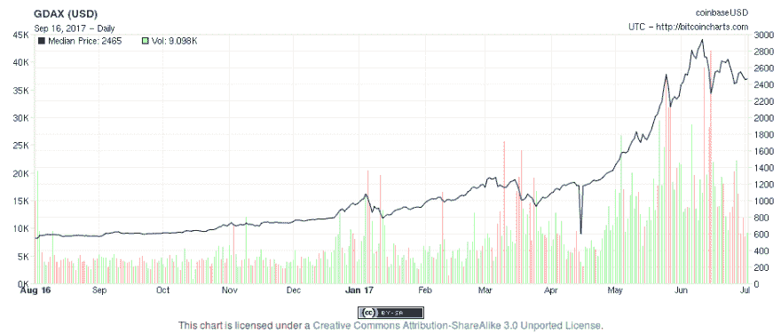
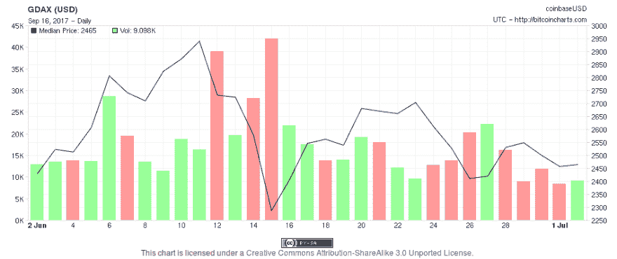

# 比特币交易算法的首次尝试

> 原文:[https://dev . to/mar bru/a-first-attempt-at-bit coin-trading-algorithms](https://dev.to/marbru/a-first-attempt-at-bitcoin-trading-algorithms)

算法交易并不是一个新颖的想法。事实上，这似乎是一个很有研究价值的话题，在网上找到相关资源并不困难。从策略，到代码库，再到人们在 github 上分享算法。

万一，我们想用它投资比特币或其他加密货币。要投资，你需要一个交易所:一个让你买卖比特币以换取“真钱”(如美元或欧元)的地方。在过去的几年中，他们中的几个已经崛起并建立起来，最著名的可能是比特币基地和 T2 和北海巨妖。

最好的消息是——这些交易所提供了一个公共 API，你可以在你的自动交易算法中使用它。太棒了。

### 先模拟

然而，玩交易所本身需要投入真金白银。此外，他们对每笔交易都收取一定的费用，所以在轻率地玩游戏之前，我们应该先找到一个像样的算法，同时在模拟环境中进行测试。因此，我们开始着手这项任务。我们制作了一个小的 python 脚本，它将模拟与股票交易所进行买卖的接口。您可以将一个包含历史汇率的 CSV 文件提供给脚本，这样它就可以重放它。

你只需要搜索谷歌就可以快速找到股票的一些历史数据。对于比特币数据，一个很好的来源是 Bitcoincharts API。

### 算法

在这个玩具环境之上，我们开始构建一些算法，并让它们相互竞争:

*   *简单算法*:始终保持固定的股票投资金额。如果价格上涨，它就提取与原金额的利润差额。如果价格下跌，它会买入新股票，直到达到投资金额。
*   *盗版算法*:基于[这个我们在 github](https://github.com/pirate/bitcoin-trader/) 上找到的算法。它记录了你买入或卖出一点股票的价值。如果价格进一步下跌，它会卖出以避免损失。如果价格上涨，它会追加买入。
*   *静态算法*:全款买入，简单等待。不要大惊小怪的投资！它基本上会产生盈利或亏损，这取决于市场的长期演变。
*   *随机算法*:会随机买入或者卖出固定的数量。

这些不是非常复杂的策略，但它们是一个起点。现在，下一步将是模拟他们根据比特币的历史汇率数据运行，看看如果我们在过去的某个时间设置算法运行，他们是否会为我们赚钱。

### 结果

我们模拟了这些算法在过去一年的比特币历史数据中的运行，投资额超过 1000 美元。由此产生的收益(以美元计)如下:

| 静电 | 简单的 | 海盗 | 随机(三次运行平均值) |
| --- | --- | --- | --- |
| 252.244923 | 486.14863 | -999.957644 | 1204670.35464 |

有趣的是，最佳策略似乎是随机策略，而且差距很大！我们的简单算法比静态的“投资并忘记”策略稍有改进，产生了双倍的收益。盗版算法结果非常令人失望，让我们损失了几乎所有的投资金额。令人惊讶的结果来自随机算法，它产生了 1000 的投资回报率。

那么我们的结论是股票市场的最佳投资策略是随机买卖吗？好吧，我们不要走那么快。考虑到汇率曲线的形状可能有很多原因需要解释。

[T2】](https://res.cloudinary.com/practicaldev/image/fetch/s--LzJqdjdm--/c_limit%2Cf_auto%2Cfl_progressive%2Cq_auto%2Cw_880/http://coconauts.nimg/posts/2017-08-29-bitcoin/DGAX.1y.png)

请注意比特币在过去一年中的指数增长。在这种情况下，无论你做什么，市场都会对你有利。在这种曲线下，不断的盲目买卖当然会让你变得正确，而不是对你的钱更加保守。

让我们看看仅在 6 月份的最后一个月运行相同的算法时会有什么不同，在这一个月里，汇率有很大的波动，但没有明显的差异。

[T2】](https://res.cloudinary.com/practicaldev/image/fetch/s--Ii6u3cpV--/c_limit%2Cf_auto%2Cfl_progressive%2Cq_auto%2Cw_880/http://coconauts.nimg/posts/2017-08-29-bitcoin/GDAX.jun.png)

| 静电 | 简单的 | 海盗 | 随机(三次运行平均值) |
| --- | --- | --- | --- |
| -41.3003 | -31.1976 | -81.3840 | -18.3573 |

比特币的价值确实出现了小幅损失，这在静态策略中有所体现。我们的简单算法在这里不是一个巨大的改进，它设法减轻了一点损失，但不是以一种显著的方式。盗版算法被证明同样可怕，而随机算法现在显示出它的局限性。

### 结论

算法交易很容易实现，但很难想出一个能让你发财的策略。如果存在一种方法，我确信世界上最好的数据科学家已经找到了，并且每个人都在使用它。毕竟，即使对于人类股票交易专家来说，预测何时是买卖的最佳时机也是困难的。

即使只有一种策略，在数量、时间和优化方面还有很多我们在实验中没有尝试过的微调。此外，并非所有股票形状看起来都一样，根据股票类型的特征，不同的算法可能会执行不同的操作。例如，一些股票可能表现出更大的波动性，另一些更稳定，一些股票的价格比其他股票更高，如果你的算法愿意投资更大而不是更小的金额，可能会表现得更好。

即使考虑到这一点，确定能让你赚钱的是选择一个上涨而不是下跌的市场！当价格下跌时，算法不太可能创造利润。最多，它可以试图减轻损失，但选择一只优胜股票是产生收益的唯一途径。

最后但同样重要的是:在我们的设置中，我们没有考虑交换服务的特殊性，即费用。交易所通常会对每笔交易收取费用，因此在设计算法时考虑到这一点是很重要的，否则你可能会因为支付费用而失去任何收入。每种兑换服务的费用都不一样，但通常来说，数量少的话费用会很贵，达到一定水平后费用就会持平。对新手来说更友好、更容易进入的交易所(例如 [coinbase](https://www.coinbase.com/) )也比其他交易所更贵。

你可以在我们的 github 中找到我们的算法和沙盒代码。

*本帖最初发表于[coconauts.net](http://coconauts.net/blog/2017/08/29/bank-holiday-hackday-algorithmic-trading/)T3】*