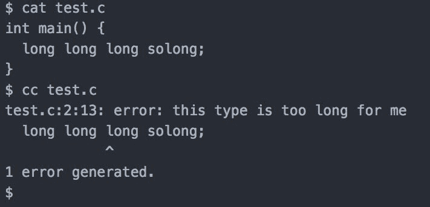

# 16 个最佳源代码宝石[收藏]

> 原文：<https://dev.to/lpasqualis/16-best-source-code-gems-collection>

这篇文章最初发表在 [CoderHood](https://coderhood.com) 上，作为 [16 个最佳源代码宝石【收藏】](https://www.coderhood.com/16-best-source-code-gems-collection/)。CoderHood 是一个致力于软件工程人类层面的博客。

[T2】](https://www.coderhood.com/16-best-source-code-gems-collection/)

开发者的个性以奇怪的方式闪耀。其中之一是(有时)微妙的幽默感、用词和态度，你可以在代码、代码注释和错误消息中找到它们。它常常感觉像是一股意识流，反映了某个时刻的人类现实。

我收集这些宝石，在这里我与你分享一些我最喜欢的。有些是我在自己工作的代码中发现的。其他的，我从各种渠道收集。所有这些都被剥夺了任何可能被视为知识产权的东西。

### 1 -通配符编译器。

```
  /*
   * I don't know why the compiler hates me.
   * I changed this comment many times, and every
   * time it generated the same executable.
   * You should try. It's wild.
   */ 
```

Enter fullscreen mode Exit fullscreen mode

### 2——如果你到了这里。

```
  /*
   * If you get here, I screwed up.
   * If I screwed up, I clearly don't know what I am doing.
   * If I don't know what I am doing, and you are looking at my code...
   *   ...we are both in trouble.
   */ 
```

Enter fullscreen mode Exit fullscreen mode

### 3 -经典，无用的文档。

```
  int  i  =  0;  // Set i to zero. 
```

Enter fullscreen mode Exit fullscreen mode

### 无论你做什么，我都能做得更好。

```
  int  getRandomNumber()  {
      return(rand()+1);  // You have been one-upped
  } 
```

Enter fullscreen mode Exit fullscreen mode

### 5——连试都不试。

```
  /*
   * Don't even try to understand this.
   * I wrote it, and I have no idea why it works.
   * But it does. My subconscious is that good.
   */ 
```

Enter fullscreen mode Exit fullscreen mode

### 6——感觉恶心。

```
 Exception up  =  new  Exception("Something is really wrong.");
 throw  up;Â Â // ha ha 
```

Enter fullscreen mode Exit fullscreen mode

### 7 -崔(影响下的编码)。

```
 // drunk, fix later 
```

Enter fullscreen mode Exit fullscreen mode

### 8 -无可奉告

```
 /*
    * Sorry, I have removed all comments from this code.
    * If you can't understand it, you shoudn't touch it anyway.
    */ 
```

Enter fullscreen mode Exit fullscreen mode

### 9 -真诚地

```
 public  boolean  thisCodeSucks()  {
      return  true;  // sincerely
 } 
```

Enter fullscreen mode Exit fullscreen mode

### 10 -随机数

```
 int  getRandomNumber()  {
      return  4;  // Guaranteed to be random. I used a dice.
    } 
```

Enter fullscreen mode Exit fullscreen mode

### 11 -这么久

不是代码，但仍然很有趣。

[T2】](https://res.cloudinary.com/practicaldev/image/fetch/s--yuCTpDlN--/c_limit%2Cf_auto%2Cfl_progressive%2Cq_auto%2Cw_880/https://thepracticaldev.s3.amazonaws.com/i/l5b0vpmov69xfvfvayfa.jpg)

### 12 -人类的需求

这是取自[苹果象棋引擎代码](https://opensource.apple.com/source/Chess/Chess-311/Sources/MBCEngine.mm.auto.html)。

```
  //
  // Paradoxically enough, moving as quickly as possible is
  // not necessarily desirable. Users tend to get frustrated
  // once they realize how little time their Mac really spends
  // to crush them at low levels. In the interest of promoting
  // harmonious Human - Machine relations, we enforce minimum
  // response times.
  //

  const  NSTimeInterval kInteractiveDelay    =  2.0;
  const  NSTimeInterval kAutomaticDelay  =  4.0; 
```

Enter fullscreen mode Exit fullscreen mode

### 13 -教科书注释

```
  /*
   * Explanation omitted as an exercise for the reader.
   */ 
```

Enter fullscreen mode Exit fullscreen mode

### 14 -过期代码

```
 // If you are reading this after 1/1/2010
 // there's something wrong.
 // This should have been ripped out by then.
 if  (DateTime.Now  >  new  DateTime(2010,  1,  1))  {
     throw  new  Exception("This code is now obsolete");
 } 
```

Enter fullscreen mode Exit fullscreen mode

### 15 位-“临时”代码

```
 // somedev1 -Â Â 6/7/02 Adding temporary tracking of Login screen
 // somedev2 -Â Â 5/22/07 Temporary my ass 
```

Enter fullscreen mode Exit fullscreen mode

### 16 -家庭问题

```
 /*
 * The game of life
 */
 if  (status==SINGLE)  {
      money  =  1;
 }  elsif  (status==DIVORCING)  {
      money  =  money  /  2;
 }  elsif  (status==DIVORCED)  {
      money  =  money *  2;
 }  else  {  // status==MARRIED
      money  =  rand()  *  monthly_salary  +  0;  // Savings is represented by zero.
 } 
```

Enter fullscreen mode Exit fullscreen mode

* * *

### 如果你喜欢这篇文章，请保持联系！

*   在 CoderHood 上找到我所有的帖子。
*   在 LinkedIn 上加入我的职业网络。
*   在推特上关注我。
*   加入我的脸书主页。
*   最后，请在 dev.to 上关注我！