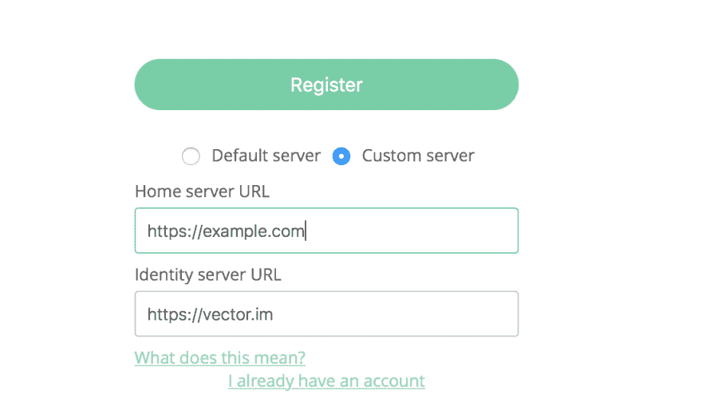

# 带 Docker 的 Matrix homeserver

> 原文:[https://dev.to/joenas/matrix-homeserver-with-docker-5dfn](https://dev.to/joenas/matrix-homeserver-with-docker-5dfn)

[T2】](https://res.cloudinary.com/practicaldev/image/fetch/s--QQ9DjFlZ--/c_limit%2Cf_auto%2Cfl_progressive%2Cq_auto%2Cw_880/https://jonnev.se/conteimg/2017/09/Screen-Shot-2017-09-15-at-12.05.34-1.png)

有很多很好的理由从你现在使用的专有聊天系统转换到 Matrix。正如其他人写的那样，我现在不打算深究。

我是 Docker 的忠实粉丝，所以当我决定安装我自己的 Synapse homeserver 时，我很高兴地发现一个[映像](https://github.com/silvio/docker-matrix)已经可以使用了。我将带您通过 Postgres 和一个让我们加密的证书来设置 Synapse。有了这个设置，添加额外的服务，如机器人或桥梁是很容易的。

在我们开始之前，这里有一些关于矩阵的一般要点。

*   矩阵就是*协议*。
*   有几个[服务器](https://matrix.org/docs/projects/try-matrix-now.html#servers)可用，但 Synapse 是唯一一个(或多或少)准备好生产的。最终会被 Dendrite(用 Go 写的)取代。
*   客户很多，所以你应该能找到一个你喜欢的。我更喜欢 Riot 的桌面版和移动版。
*   还有很多到其他网络的桥梁(称为*应用服务*)，比如 IRC、Slack 和 Gitter 等等。

## 先决条件

本指南假定您对 Linux 有一定的了解，并且您有一台安装了这些服务的服务器:

*   [码头工人](https://docs.docker.com/engine/installation/linux/docker-ce/ubuntu/)
*   [坞站-复合](https://docs.docker.com/compose/install/)
*   让我们加密[证书机器人](https://certbot.eff.org)
*   [nginx](https://nginx.org/en/download.html)
*   托管您的主服务器的域

我用的是 Ubuntu 16.04 ，大部分在其他发行版上应该可以正常工作，但是你知道，YMMV。

如果你要启动一个新的服务器，比如 VPS，我推荐[这个指南](https://plusbryan.com/my-first-5-minutes-on-a-server-or-essential-security-for-linux-servers)给你一些基本的安全措施。

此外，我使用数字海洋来遵循我自己的指南，并确保一切正常。我认为它们很棒，如果你还没有尝试过，请随意使用这个[推荐链接](https://m.do.co/c/37d221e6802a)为你的矩阵服务器:D 获得 10 美元

**编辑**:对于不熟悉`nginx` [武僧](https://twitter.com/MartialLienert)建议[球童](https://caddyserver.com)。我自己没有尝试过，但对于像 Synapse 这样的单一主机来说，它看起来非常简洁。

## 设置

我们将使用`docker-compose`来轻松地改变容器的选项或添加新的服务。默认的数据库是`sqlite`，但是即使是像我这样的小型服务器，我也注意到了`postgres`在响应能力上的巨大差异。如果你计划加入像 [#matrix:matrix.org](https://matrix.to/#/#matrix:matrix.org) 这样的大房间，这是必须的，因为 matrix 会将数据联合到所有服务器，至少有一个用户在一个房间里。因此，在一个有 10000 多个用户的房间里，会有大量的数据库写入。

点击上面的#matrix 链接将显示一个页面，您可以选择一个客户并直接加入。尽管我建议如果你打算运行自己的家庭服务器，不要在 matrix.org T2 创建账户，因为目前还不能进行迁移。

如果你还没有通读 Synapse 的 README，这可能是个好主意。**注意关于使用哪个端口的部分**有点混乱。本指南将按照推荐的方式设置一切，但如果你对细节感兴趣，你应该读一下[这期](https://github.com/matrix-org/synapse/issues/2438)。

### 基础目录

为了将不同的服务组合在一起，并且更易于管理，我们将创建一个基本目录。

```
sudo mkdir /opt/matrix 
```

<svg width="20px" height="20px" viewBox="0 0 24 24" class="highlight-action crayons-icon highlight-action--fullscreen-on"><title>Enter fullscreen mode</title></svg> <svg width="20px" height="20px" viewBox="0 0 24 24" class="highlight-action crayons-icon highlight-action--fullscreen-off"><title>Exit fullscreen mode</title></svg>

### 生成 Synapse 文件

接下来，我们将为 Synapse 生成所需的文件。这将添加一个用于联合的自签名证书、一个`homeserver.yaml`配置文件和一个日志配置。

您需要决定使用什么主机名。可以将 Synapse 托管在一个子域(例如`matrix.example.com`)上，同时仍然让客户端连接到`example.com`，但是这需要一些额外的[设置](https://github.com/matrix-org/synapse#id34)。我建议有一个专门的域名。

```
# This will create /opt/matrix/synapse
docker run -v /opt/matrix/synapse:/data --rm \
    -e SERVER_NAME=example.com -e REPORT_STATS=yes silviof/docker-matrix generate 
```

<svg width="20px" height="20px" viewBox="0 0 24 24" class="highlight-action crayons-icon highlight-action--fullscreen-on"><title>Enter fullscreen mode</title></svg> <svg width="20px" height="20px" viewBox="0 0 24 24" class="highlight-action crayons-icon highlight-action--fullscreen-off"><title>Exit fullscreen mode</title></svg>

☝️ **记住替换命令中的`example.com`。**

**编辑:**经过讨论，我已经把上面的`REPORT_STATS`从`no`改成了，因为我认为以任何可能的方式支持 Matrix 是很重要的。最初，我只是从映像自述文件中复制了该命令，并没有进一步考虑它。如果你对分享的内容感兴趣，看看这里的。(感谢 Rob！)

### 创建码头工人网络

为了让容器彼此对话，并且能够在不将它们包括在`docker-compose.yaml`(例如机器人)中的情况下将其他服务添加到同一网络中，我们将创建一个 docker 网络。

```
docker network create matrix-network
# To see what containers are connected (none atm..)
docker network inspect matrix-network 
```

<svg width="20px" height="20px" viewBox="0 0 24 24" class="highlight-action crayons-icon highlight-action--fullscreen-on"><title>Enter fullscreen mode</title></svg> <svg width="20px" height="20px" viewBox="0 0 24 24" class="highlight-action crayons-icon highlight-action--fullscreen-off"><title>Exit fullscreen mode</title></svg>

### 设置 docker-compose

现在我们用我们的两个服务创建一个`docker-compose.yaml`。这里的一些选项对设置相当重要，所以我在文件中对它们进行了注释。[这里的](https://gist.github.com/joenas/be7e1ca587301b8910c9fd44c3751c08)也是内容的要诀。

```
cd /opt/matrix
sudo nano docker-compose.yaml

version: "2"
services:
  postgres:
    image: postgres:9.6.4
    restart: always

    # I like to be able to use psql on the host to connect to the database 
    # for maintenance. If you already have a postgres running you should remove 
    # the 'ports' section and uncomment 'expose'
    # expose:
    # - 5432

    # Adding 127.0.0.1 ensures the port isn't exposed ON the host
    ports:
      - "127.0.0.1:5432:5432"
    volumes:
     - /opt/matrix/pgdata:/var/lib/postgresql/data

    # These will be used in homeserver.yaml later on
    environment:
     - POSTGRES_PASSWORD=YOUR_PASSWORD_HERE
     - POSTGRES_USER=synapse

  synapse:
    image: silviof/docker-matrix
    # Exposing 8008 (no TLS) on localhost means we can reverse proxy with nginx
    # 8448 is for federation and should be exposed on host
    # 3478 is for TURN (voip calls)
    ports:
     - "127.0.0.1:8008:8008"
     - "8448:8448"
     - "3478:3478"
    volumes:
     - /opt/matrix/synapse:/data

# Our docker network!
networks:
  default:
    external:
      name: matrix-network 
```

<svg width="20px" height="20px" viewBox="0 0 24 24" class="highlight-action crayons-icon highlight-action--fullscreen-on"><title>Enter fullscreen mode</title></svg> <svg width="20px" height="20px" viewBox="0 0 24 24" class="highlight-action crayons-icon highlight-action--fullscreen-off"><title>Exit fullscreen mode</title></svg>

### 编辑 homeserver.yaml

有几个地方我们需要对**进行修改**。我们希望禁用内置的`webclient`，并确保端口`8008`可从主机访问。

```
sudo nano /opt/matrix/synapse/homeserver.yaml

# I've remove default comments and added mine
listeners:
  -
    port: 8448

    bind_addresses:
      - '0.0.0.0'

    type: http
    tls: true

    resources:
      -
        names:
          - client
          #- webclient # I've disabled this
        compress: true

      - names: [federation] # Federation APIs
        compress: false

  # Unsecure HTTP listener,
  - port: 8008
    tls: false

    # Since it's running in a container we need to listen to 0.0.0.0
    # The port is only exposed on the host and put behind reverse proxy
    bind_addresses:
      - '0.0.0.0'

    type: http
    x_forwarded: true
    resources:
      # I've removed webclient here as well
      - names: [client]
        compress: true
      - names: [federation]
        compress: false 
```

<svg width="20px" height="20px" viewBox="0 0 24 24" class="highlight-action crayons-icon highlight-action--fullscreen-on"><title>Enter fullscreen mode</title></svg> <svg width="20px" height="20px" viewBox="0 0 24 24" class="highlight-action crayons-icon highlight-action--fullscreen-off"><title>Exit fullscreen mode</title></svg>

我们使用来自`docker-compose.yaml`的凭证，从默认的`sqlite`数据库更改为`postgres`。

```
# Database configuration
database:
  name: psycopg2
  args:
    user: synapse
    password: YOUR_PASSWORD_HERE
    database: synapse

    # This hostname is accessible through the docker network and is set 
    # by docker-compose. If you change the name of the service it will be different
    host: postgres 
```

<svg width="20px" height="20px" viewBox="0 0 24 24" class="highlight-action crayons-icon highlight-action--fullscreen-on"><title>Enter fullscreen mode</title></svg> <svg width="20px" height="20px" viewBox="0 0 24 24" class="highlight-action crayons-icon highlight-action--fullscreen-off"><title>Exit fullscreen mode</title></svg>

我们将使注册能够测试。您可以在以后更改它。

```
# Enable registration for new users.
enable_registration: True 
```

<svg width="20px" height="20px" viewBox="0 0 24 24" class="highlight-action crayons-icon highlight-action--fullscreen-on"><title>Enter fullscreen mode</title></svg> <svg width="20px" height="20px" viewBox="0 0 24 24" class="highlight-action crayons-icon highlight-action--fullscreen-off"><title>Exit fullscreen mode</title></svg>

☝️ **不要用这个代替整个`homeserver.yaml`，只要确保相应的部分是正确的**。

### 编辑日志配置(可选)

我更喜欢将日志放在一个单独的目录中，所以让我们改变一下。你的`/opt/matrix/synapse`里应该有一个叫`yourhostname.log.config`的文件。编辑一下，改成

```
handlers:
  file:
    filename: /data/log/homeserver.log

# Create the directory
sudo mkdir /opt/matrix/synapse/log 
```

<svg width="20px" height="20px" viewBox="0 0 24 24" class="highlight-action crayons-icon highlight-action--fullscreen-on"><title>Enter fullscreen mode</title></svg> <svg width="20px" height="20px" viewBox="0 0 24 24" class="highlight-action crayons-icon highlight-action--fullscreen-off"><title>Exit fullscreen mode</title></svg>

### 获取加密证书

您需要安装 [certbot](https://certbot.eff.org) ！

```
sudo service nginx stop
sudo letsencrypt certonly --standalone -d yourhostname.com
sudo service nginx start 
```

<svg width="20px" height="20px" viewBox="0 0 24 24" class="highlight-action crayons-icon highlight-action--fullscreen-on"><title>Enter fullscreen mode</title></svg> <svg width="20px" height="20px" viewBox="0 0 24 24" class="highlight-action crayons-icon highlight-action--fullscreen-off"><title>Exit fullscreen mode</title></svg>

### Nginx 配置

这里是[要点](https://gist.github.com/joenas/194af2f7c2ccf2b04b0a8472974c2447)。

```
sudo nano /etc/nginx/sites-available/example.com # or whatever

server {
       listen 80;
       server_name example.com www.example.com;
       return 301 https://$server_name$request_uri;
}

server {
    listen 443 ssl;
    listen [::]:443 ssl;
    server_name example.com;

    ssl_certificate /etc/letsencrypt/live/example.com/fullchain.pem;
    ssl_certificate_key /etc/letsencrypt/live/example.com/privkey.pem;

    # If you don't wanna serve a site, comment this out
    root /var/www/example.com;
    index index.html index.htm;

    location /_matrix {
      proxy_pass http://0.0.0.0:8008;
      proxy_set_header X-Forwarded-For $remote_addr;
    }
 }

sudo ln -s /etc/nginx/sites-available/example.com /etc/nginx/sites-enabled/example.com 
```

<svg width="20px" height="20px" viewBox="0 0 24 24" class="highlight-action crayons-icon highlight-action--fullscreen-on"><title>Enter fullscreen mode</title></svg> <svg width="20px" height="20px" viewBox="0 0 24 24" class="highlight-action crayons-icon highlight-action--fullscreen-off"><title>Exit fullscreen mode</title></svg>

### 启动所有的东西！

现在我们应该准备好了，所以让我们试一试。

```
cd /opt/matrix
docker-compose up -d
docker-compose ps

# Something like this 
matrix_postgres_1 docker-entrypoint.sh postgres Up 127.0.0.1:5432->5432/tcp
matrix_synapse_1 /start.sh start Up 0.0.0.0:3478->3478/tcp, 127.0.0.1:8008->8008/tcp, 0.0.0.0:8448->8448/tcp 
```

<svg width="20px" height="20px" viewBox="0 0 24 24" class="highlight-action crayons-icon highlight-action--fullscreen-on"><title>Enter fullscreen mode</title></svg> <svg width="20px" height="20px" viewBox="0 0 24 24" class="highlight-action crayons-icon highlight-action--fullscreen-off"><title>Exit fullscreen mode</title></svg>

如果一切正常

```
sudo service nginx reload 
```

<svg width="20px" height="20px" viewBox="0 0 24 24" class="highlight-action crayons-icon highlight-action--fullscreen-on"><title>Enter fullscreen mode</title></svg> <svg width="20px" height="20px" viewBox="0 0 24 24" class="highlight-action crayons-icon highlight-action--fullscreen-off"><title>Exit fullscreen mode</title></svg>

### 注册账号并登录

有趣的部分来了！让我们创建一个帐户:)

任何客户端都可以，但这让我们使用 Riot。点击[这里](https://riot.im/app/#/register)，填写您的信息，并将*“自定义服务器”*更改为您新创建的服务器的主机名。添加一个电子邮件是可选的，但是如果你**需要重设密码，没有它你就不能。**

[T2】](https://res.cloudinary.com/practicaldev/image/fetch/s--xoMcQvwV--/c_limit%2Cf_auto%2Cfl_progressive%2Cq_auto%2Cw_880/https://jonnev.se/conteimg/2017/09/Screen-Shot-2017-09-15-at-12.02.19.png)

### 如果一切正常，你应该受到友好的问候`@riot-bot`！

[T2】](https://res.cloudinary.com/practicaldev/image/fetch/s--DvyPTY7a--/c_limit%2Cf_auto%2Cfl_progressive%2Cq_auto%2Cw_880/https://jonnev.se/conteimg/2017/09/Screen-Shot-2017-09-15-at-12.05.34.png)

## 快乐快乐快乐快乐

所以，希望你已经走了这么远，现在有了自己的矩阵服务器。Matrix 有很多好东西要做，我会发布更多相关内容，例如机器人和其他集成。但是现在享受您的令人敬畏的联邦开源聊天，并邀请一些朋友！

如果您发现本指南中有任何错误，或者只是想分享您的赞赏，请给我发电子邮件或发推文:)