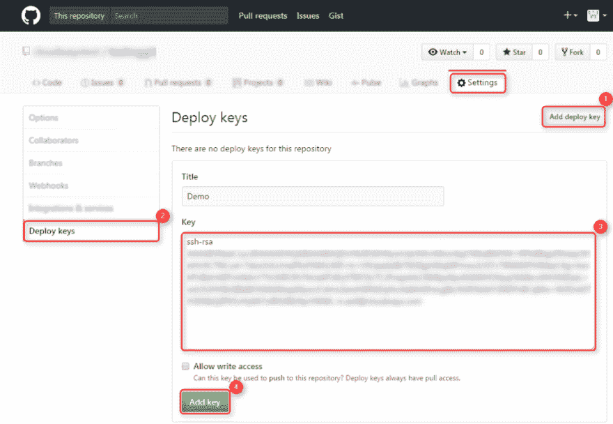
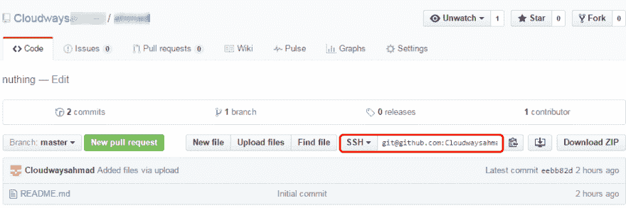
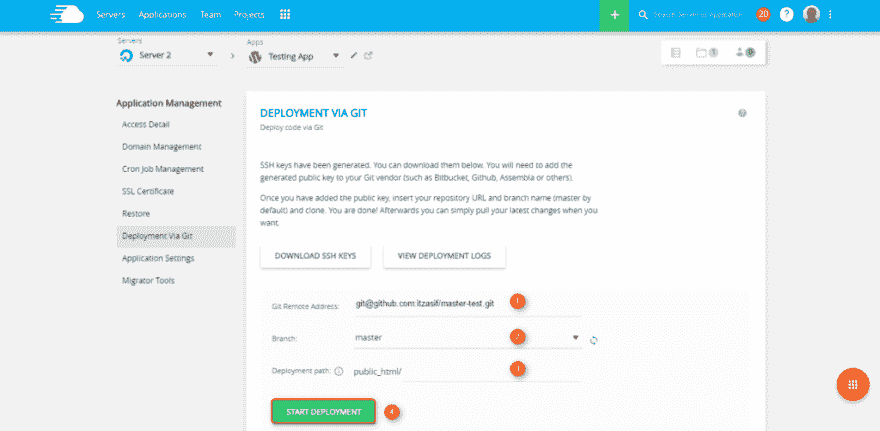

# 使用 Cloudways 在云上轻松部署 Laravel 应用程序

> 原文：<https://dev.to/rizwan_saquib/deploy-laravel-application-on-cloud-easily-with-cloudways>

即使您对此了如指掌，设置和配置专用服务器也是一个耗时的多步骤过程。但是多亏了今天市场上可用的托管解决方案，安装服务器不再是项目任务列表中的主要行动项目。

在云基础设施上部署 Laravel 应用程序从来没有像现在这样简单快捷。有了 Cloudways，您只需点击几下鼠标，就可以部署一个**专用云服务器**和您需要的资源！Cloudways 提供来自五大提供商的服务器基础设施- **亚马逊、数字海洋、Vultr、KYUP 和谷歌计算引擎**。最重要的是，托管平台是专为 Laravel 开发人员优化的！

## Cloudways 为 Laravel

Cloudways 为 Laravel 社区提供了一个不可思议的平台。它使得部署和托管 laravel 应用程序变得容易，这样开发人员可以专注于开发过程，而不是担心部署和服务器级别的问题。

Cloudways 通过以下特性解决了 Laravel 开发人员的托管难题:

*   服务器成本包含在 Cloudways 价格计划中。因此，开发商只需要一个单一的帐户，并收到单一的发票。

*   从 **Github** 或 **Bitbucket** 轻松部署 Laravel 应用。

*   Laravel 应用程序的自动部署。

*   团队协作功能为团队成员分配服务器和应用程序访问权限和角色。

*   简单的服务器管理功能，包括服务器克隆和服务器转移。

*   一键式自动备份，频率从每小时到每周不等。

*   使用 cron 作业管理器配置计划的 cron 作业

*   预配置的防火墙和安全性

*   用**新遗迹**监控系统监控一切。

*   通过轻松的垂直扩展纵向扩展服务器。

*   预装 **Composer 和 Git**

*   云专家提供的全天候实时聊天支持。

## 云路雷阵

Cloudways 有自己的 PHP 堆栈，名为 ThunderStack，由服务器和缓存技术的独特组合组成。在 Cloudways 平台上推出的每台服务器都带有:

*   一种自由操作系统

*   Nginx

*   光泽面

*   街头流氓

*   PHP-FPM

*   MySQL 或 MariaDB

*   雷迪斯

*   Memcached

*   PHP 5.6 或 7.0

Cloudways 支持包括 Laravel、Symfony、Codegniter 和 CakePHP 在内的所有主流 PHP 框架，并允许**一键安装你喜欢的基于 PHP 的 CMS，如 WordPress 和 Bolt。**

让我们来看一个使用 Cloudways 平台在 DigitalOcean 服务器上设置 PHP 7 的例子。

## 部署服务器

要在 Cloudways 的 DigitalOcean 上设置 PHP 7 服务器，只需[在 Cloudways 注册](https://platform.cloudways.com/signup)并登录您的帐户。

转到启动服务器。选择您的 PHP 堆栈 DigitalOcean 作为您的基础设施提供商，并确定您的服务器资源需求以及其他所需的详细信息。

你完了！您的数字海洋服务器将在几分钟内完成部署。

> **使用促销代码** ** PHP15****在您的 Cloudways 帐户中获得****【15 美元免费信用**** 。**

[T2】](https://res.cloudinary.com/practicaldev/image/fetch/s--PPS9Zx2F--/c_limit%2Cf_auto%2Cfl_progressive%2Cq_66%2Cw_880/http://www.cloudways.com/blog/wp-content/uploads/image4-1.gif)

## 从 GitHub 部署您的 Laravel 应用程序

作为一名开发人员，您可能在 GitHub 存储库中有自己的 Laravel 应用程序。您可以在几分钟内轻松地将它部署到您的 Cloudways 服务器上。

要从 Git repo 部署应用程序，首先，在 Platform dashboard 中，单击顶部菜单栏中的' **Applications** '选项卡，并选择您的应用程序。现在，为了部署应用程序，您需要一个 SSH 密钥。

要生成 SSH 密钥，请在“**应用程序管理**区域点击“**通过 Git** 部署”按钮，然后点击“**生成 SSH 密钥**按钮，生成您唯一的 SSH 密钥。要下载这些密钥，只需点击“**下载 SSH 密钥**”。

[T2】](https://res.cloudinary.com/practicaldev/image/fetch/s--OF5iocSL--/c_limit%2Cf_auto%2Cfl_progressive%2Cq_auto%2Cw_880/http://www.cloudways.com/blog/wp-content/uploads/image1-42.png)

现在将' **SSH 公钥'**上传到你的 GitHub 账户。为了做到这一点，登录到你的 GitHub 账户，转到所需的资源库，然后进入“**设置**标签。点击“**添加部署密钥**按钮，添加您从 Cloudways 平台下载的**公共 SSH 密钥* *。点击“**添加键**”按钮完成该过程。

[T2】](https://res.cloudinary.com/practicaldev/image/fetch/s--dDL2vwvb--/c_limit%2Cf_auto%2Cfl_progressive%2Cq_auto%2Cw_880/http://www.cloudways.com/blog/wp-content/uploads/image4-34.png)

现在复制主 GitHub 仪表板顶部面板中显示的'**存储库 SSH 地址**。将该地址复制并粘贴到您的 Cloudways' ' **Git 远程地址**'字段中。

[T2】](https://res.cloudinary.com/practicaldev/image/fetch/s--yIccTnHf--/c_limit%2Cf_auto%2Cfl_progressive%2Cq_auto%2Cw_880/http://www.cloudways.com/blog/wp-content/uploads/image2-42.png)

接下来，您需要输入部署路径并点击' **Start Deployment** '按钮，将您的应用程序代码部署到 Cloudways 平台上！

[T2】](https://res.cloudinary.com/practicaldev/image/fetch/s--h2K3ucDX--/c_limit%2Cf_auto%2Cfl_progressive%2Cq_auto%2Cw_880/http://www.cloudways.com/blog/wp-content/uploads/image5-26.png)

就是这样！Cloudways 使得在您选择的云基础设施上部署您的 Laravel 应用程序变得如此容易。

## 结论

如您所见，您可以轻松地用 Cloudways 部署您的 Laravel 应用程序。它允许您轻松处理一些最重要的 Laravel 应用程序托管问题。从最初设置您的服务器和服务器资源、部署您的应用程序，到管理后端应用程序任务，一切都可以通过 Cloudways 轻松完成！

点击[此处](https://www.cloudways.com/en/)立即开始使用 Cloudways！