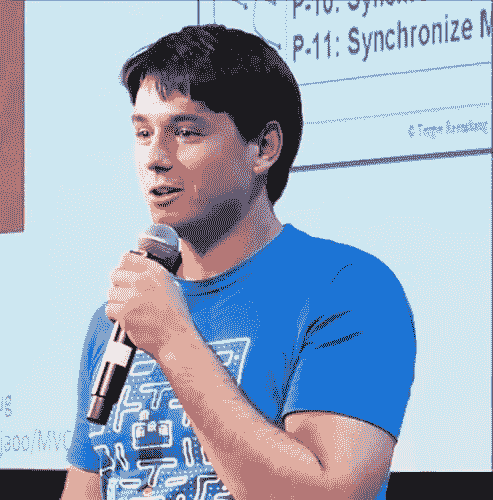

# 科特林的优势和最大的误解——马尔钦·莫斯卡拉访谈

> 原文:[https://dev . to/Ben/the-strength-and-maximum-misconcepts-of-kotlin interview-with-marcin-moskala](https://dev.to/ben/the-strengths-and-biggest-misconceptions-of-kotlininterview-with-marcin-moskala)

有人找过我，让我参加本月 9 月 23 日至 24 日举行的西伯利亚电影节。这听起来很有趣，但要整合起来有点困难。不过，我很想知道发生了什么，于是要求采访一位演讲者。马尔钦·莫斯卡拉是《T2》和科特林《T3》的合著者。

[T2】](https://res.cloudinary.com/practicaldev/image/fetch/s--sLCUrvIr--/c_limit%2Cf_auto%2Cfl_progressive%2Cq_auto%2Cw_880/https://thepracticaldev.s3.amazonaws.com/i/uf3q8tt5et97eaettjys.png)

科特林是一个真正的语言成功的故事。它于 2011 年由 Jetbrains 首次推出，在证明了它是 Java 生态系统中一个可行且广受欢迎的选择后，最近被 Google 所接受。我希望你喜欢和 Marcin 的聊天。

你当初为什么会进入科特林？

我在 JetBrains 网站上找到了它，它如何解决常见的 Java 问题让我着迷。我厌倦了做像空断言这样的事情。Kotlin 是一股新鲜空气，它让我摆脱了 Java 编程。我在业余时间学习它。我使用 Kotlin 的时间越长，我就越兴奋。这就是我决定与科特林合作的原因。这就是我如何进入 Docplanner 并开始每天与 Kotlin 一起工作的原因。

Kotlin 让你兴奋的是什么？

我使用 Kotlin 已经超过 3 年了。在过去的两年里，我几乎每天都在使用它。令人惊讶的是，我仍然有这么多的乐趣使用它。但是我对核心功能不再感兴趣了。我对协程感到兴奋，因为它们谨慎地隐藏了并发的复杂性。我不得不承认，自从上次改变以来，我也对 Kotlin Android 扩展感到兴奋。他们给一些常见的 Android 任务的统一带来了希望。我真的对 Kotlin fullstack 和 Kotlin/Native 感到兴奋，这将允许为 Android 和 iOS 编写通用模块，或在 Kotlin 中进行有效的数据科学。我认为每一件事情都是一个突破——我正在等着看它会给编程的未来带来什么。

关于科特林语有哪些误解？

最大的误解是它与 Java 的互操作性。人们就是不能相信他们可以在 Java 中使用 Kotlin 库，而且一切都会很好。当我告诉他们，他们只能将项目中的单个文件转换成 Kotlin，一切都会好的时候，他们总是很惊讶。他们认为这种合作更像 Scala 或 Groovy——他们可以一起工作，但有一个问题。不，他们不是。它们有很好的互操作性，就好像 Kotlin 会是下一个更好的 Java。

另一件对大多数人来说难以理解的事情是，我们可以制作可以编译成多种语言(Java、JavaScript、C 等等)的模块。).我认为这对于用没有编译成字节码的脚本语言编程的人来说是个问题。他们看代码就像看正在运行的东西，而不是被编译成其他东西的东西。

是什么启发了你写这本书？

当我学习编程 Kotlin 时，我找不到任何书籍或任何其他关于 Kotlin 功能的实际用法的来源来改进 Android 开发。我一直在寻找一本书，它不仅展示了这个特性，还展示了现实生活中的用例——展示了为什么这个特性有意义。我找不到这样的来源，所以我自己想出来的。我想让其他学习 Kotlin 的程序员更容易走上这条路——这就是为什么我想出了在书中分享我的知识和经验的想法。

**你有什么跟上开源并保持领先的技巧？**

保持领先需要很多时间。没有对编程的热情是很难做到的。当你对这个话题感兴趣时，你就有了与时俱进的天然动力。你不需要计划去检查新奇的东西——你只是因为好奇才这么做的。

有一个好消息——你可以让你的激情更强烈。如果你尝试新技术，学习新东西，你会发现新的有趣的特性，你会有更多的编程乐趣，并且更喜欢它。

使用有助于更新的工具也很重要。如今，大多数公告和新想法都发布在博客上。你可以在那里找到几乎所有来自编程世界的新闻，但是如果你想保持联系，你将不得不跟踪数百条新闻。这就是为什么您应该有配置良好 RSS 来通知您实现的情况。我用的是 Feedly——它有 Chrome 扩展功能，只需点击一下就可以将你阅读的博客添加到你的订阅中。我确信有其他选择——去看看吧，找到最适合你的。

这是一个很好的工具，但是它仍然不能代替与其他对编程感兴趣的人的对话。阅读新闻时，为了找到你感兴趣的信息，你必须浏览所有你不需要的东西。与早午餐时的人交谈会让你更容易获得这些信息。更重要的是，你可以交流你的想法和经验。听到新闻的最好地方是聚会或会议。每次参加会议，我都会听到如此多的新闻和想法，以至于接下来的几天我在空闲时间里除了查看它们之外什么也不做。我等不及西伯利亚发展节了，这是一个非常有前途的会议。

最后的关键要素是书籍和课程。这不会帮助你跟上时代，但会给你硬知识，这是你从博客或会议上得不到的。书籍和课程有必要的结构来收集对主题的更深入的理解。如果你想在某方面变得真正优秀，这是必要的。