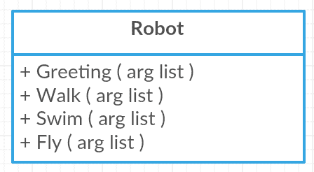
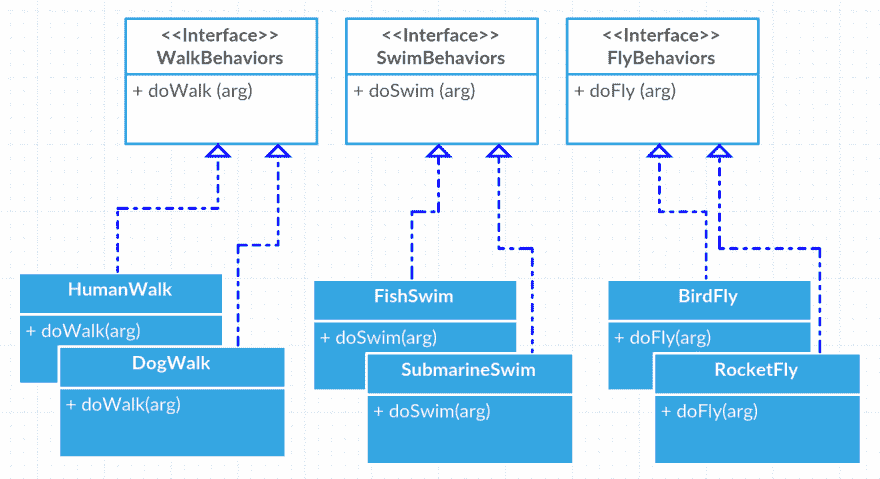
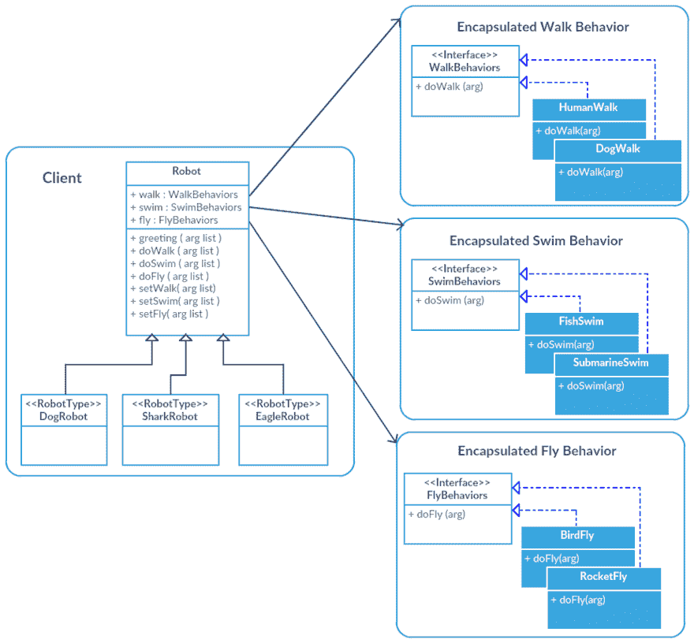

# 设计模式:策略模式

> 原文:[https://dev.to/henriguy/design-patterns-strategy-pattern](https://dev.to/henriguy/design-patterns-strategy-pattern)

*最初发布于我的博客[henricodesjava . blog](https://henricodesjava.blog/)T3】*

你好世界！我目前正在阅读[Head First Design Patterns:A Brain-Friendly Guide](https://www.amazon.com/Head-First-Design-Patterns-Brain-Friendly/dp/0596007124/ref=sr_1_1?ie=UTF8&qid=1505068308&sr=8-1&keywords=head+first+design+patterns)，如果这是你第一次阅读面向对象编程(OOP)中的设计模式，这是一个很好的开始！我不推荐它作为参考指南，因为它有大量的例子、插图和非正式的描述。这是书中介绍的第一种模式。

**策略模式**:*定义了一系列算法，封装了每一个算法，并使它们可以互换。该策略允许算法独立于使用它的客户端而变化。*

听起来令人困惑，但实际上非常简单。该模式基于以下三个原则:

1.  确定应用程序中变化的方面，并将它们与保持不变的方面分开。
2.  编程到接口，而不是实现。
3.  重构图轻继承。

让我试着弄清楚这些原则是什么意思。我将用一个与书中不同的例子。

假设我们正在创建一家机器人公司。比如波士顿动力。我们想制造各种类型的机器人。看看下面的类，它们将被用于我们机器人的所有行为。 

这就是我们应用第一条原则的地方。我们想象中的公司需要能够制造在陆地、空中或水上操作的机器人。我们所有的机器人也需要能够打招呼，“你好，世界！”。问候是保持不变的行为。其他三种行为是机器人之间会发生变化的。因此，我们将把“行走”、“游泳”和“飞行”行为与“问候”行为分开。让我们看看如何。

第二个原则是最好使用接口而不是直接实现。所以我们要做的是为每个有可能改变的行为群体创建界面。通过这种方式，每一种都可以有许多不同的实现，见下文。

[T2】](https://res.cloudinary.com/practicaldev/image/fetch/s--Tc7Z-cBV--/c_limit%2Cf_auto%2Cfl_progressive%2Cq_auto%2Cw_880/https://henricodesjava.files.wordpress.com/2017/09/screen-shot-2017-09-13-at-11-43-18-pm.png)

当需要创建一个机器人的特定实现时，我们将扩展机器人类，并以这种方式访问“问候”行为。问候行为可以在机器人类中编码，因为这对于我们曾经创建的所有机器人都是一样的。然后，当需要向我们的新机器人添加行走、游泳或飞行行为时，它将不会从原始机器人类中继承该行为，而是会有一个分配给它的接口实现，换句话说，它将在运行时合成。这成功地使用接口区分了这些变化的和不变的行为。这样我们就遵循了我们的**第三**设计原则。请看下图，这是一个整体的俯视图，包括三个示例机器人，狗、鲨鱼和鹰机器人。

[T2】](https://res.cloudinary.com/practicaldev/image/fetch/s--x2nVMch1--/c_limit%2Cf_auto%2Cfl_progressive%2Cq_auto%2Cw_880/https://henricodesjava.files.wordpress.com/2017/09/screen-shot-2017-09-14-at-10-40-28-am.png)

Â

原来如此！这是对策略模式的快速介绍。上面你可以看到当我们实现策略模式时，一个完整的类图是什么样子的。感谢你阅读ðÿ'‹ðÿ

(原发于我的个人博客:[https://henricodesjava . blog](https://henricodesjava.blog))