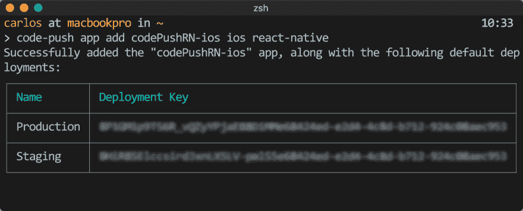
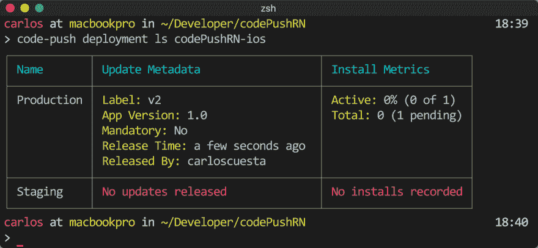
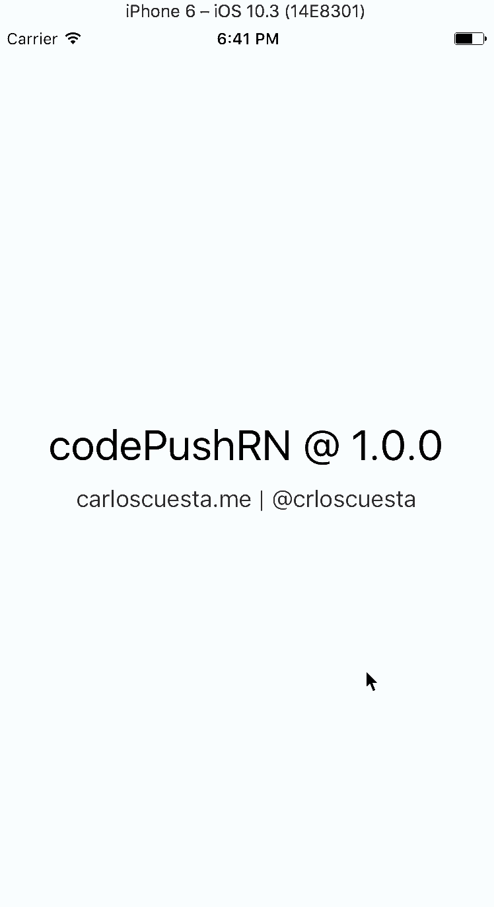

# 反应本机遇到代码推送

> 原文:[https://dev.to/carloscuesta/react-native-meets-codepush](https://dev.to/carloscuesta/react-native-meets-codepush)

*最初发布于 [carloscuesta 的博客](https://carloscuesta.me/blog/react-native-meets-codepush)T3*

[**CodePush**](https://microsoft.github.io/code-push/) 是微软的云服务，它让我们能够即时**推送更新**到一个 react-native 应用程序。**解决**bug**和引入**小特性**的理想**。

### 入门

**安装**[`code-push`](https://www.npmjs.com/package/code-push-cli)命令行工具**创建**账户**。ðÿ'‡** 

```
$ npm i -g code-push-cli
$ code-push register 
```

<svg width="20px" height="20px" viewBox="0 0 24 24" class="highlight-action crayons-icon highlight-action--fullscreen-on"><title>Enter fullscreen mode</title></svg> <svg width="20px" height="20px" viewBox="0 0 24 24" class="highlight-action crayons-icon highlight-action--fullscreen-off"><title>Exit fullscreen mode</title></svg>

#### 创建代码推送应用程序

为了**关联**我们的**应用**和**代码推送**，我们必须**注册**它。这个过程需要在每个平台上进行**一次。** 

```
# code-push app add <appName> <os> <platform>
$ code-push app add codePushRN-ios ios react-native 
```

<svg width="20px" height="20px" viewBox="0 0 24 24" class="highlight-action crayons-icon highlight-action--fullscreen-on"><title>Enter fullscreen mode</title></svg> <svg width="20px" height="20px" viewBox="0 0 24 24" class="highlight-action crayons-icon highlight-action--fullscreen-off"><title>Exit fullscreen mode</title></svg>

[T2】](https://res.cloudinary.com/practicaldev/image/fetch/s--McZ0hxJT--/c_limit%2Cf_auto%2Cfl_progressive%2Cq_auto%2Cw_880/https://res.cloudinary.com/carloscuesta/image/upload/v1505033866/fbvjm5jbshllzoxitknw.png)

话虽如此，如果你搭载 iOS 和 Android，你最终会得到两个 CodePush 应用`codepush-iOS` `codepush-android`，分别拥有自己的部署密钥。ðŸ"'

### 整合

将`react-native-code-push`作为**依赖项**添加到您的项目中，然后将其链接到ðÿ。在**链接** **的时候，你会被要求**提供在 CodePush 上注册你的应用所获得的**部署密钥**。

提供`Production key`如果你不想要`Staging`环境，万一你需要它[设置多部署](http://microsoft.github.io/code-push/docs/react-native.html#link-8)。

```
$ yarn add react-native-code-push
$ react-native link react-native-code-push 
```

<svg width="20px" height="20px" viewBox="0 0 24 24" class="highlight-action crayons-icon highlight-action--fullscreen-on"><title>Enter fullscreen mode</title></svg> <svg width="20px" height="20px" viewBox="0 0 24 24" class="highlight-action crayons-icon highlight-action--fullscreen-off"><title>Exit fullscreen mode</title></svg>

现在是时候对我们的应用程序进行代码推送了。基本上我们必须**用**代码推送** **HOC** 包装**我们的应用**根组件**。
ðÿ

```
import codePush from 'react-native-code-push'

class App extends React.Component {}

App = codePush(App) 
```

<svg width="20px" height="20px" viewBox="0 0 24 24" class="highlight-action crayons-icon highlight-action--fullscreen-on"><title>Enter fullscreen mode</title></svg> <svg width="20px" height="20px" viewBox="0 0 24 24" class="highlight-action crayons-icon highlight-action--fullscreen-off"><title>Exit fullscreen mode</title></svg>

### 发布和部署

一旦你集成了代码推送，最简单的**方式**来**部署**一个**产品构建**，就是使用`code-push release-react`命令:ðÿš€

```
# code-push release-react <appName> <platform> [options]
$ code-push release-react codePushRN-ios ios -d Production 
```

<svg width="20px" height="20px" viewBox="0 0 24 24" class="highlight-action crayons-icon highlight-action--fullscreen-on"><title>Enter fullscreen mode</title></svg> <svg width="20px" height="20px" viewBox="0 0 24 24" class="highlight-action crayons-icon highlight-action--fullscreen-off"><title>Exit fullscreen mode</title></svg>

如果你在`Staging`和`Production`环境下工作，**首先**你需要**运送**ðÿš一个**暂存**发布，然后**提升**到**生产**。

```
$ code-push release-react codePushRN-ios ios
$ code-push promote <appName> Staging Production 
```

<svg width="20px" height="20px" viewBox="0 0 24 24" class="highlight-action crayons-icon highlight-action--fullscreen-on"><title>Enter fullscreen mode</title></svg> <svg width="20px" height="20px" viewBox="0 0 24 24" class="highlight-action crayons-icon highlight-action--fullscreen-off"><title>Exit fullscreen mode</title></svg>

进行部署后，您可以列出更新的安装指标和元数据。ðÿ"ˆ

```
$ code-push deployment ls <appName> 
```

<svg width="20px" height="20px" viewBox="0 0 24 24" class="highlight-action crayons-icon highlight-action--fullscreen-on"><title>Enter fullscreen mode</title></svg> <svg width="20px" height="20px" viewBox="0 0 24 24" class="highlight-action crayons-icon highlight-action--fullscreen-off"><title>Exit fullscreen mode</title></svg>

[T2】](https://res.cloudinary.com/practicaldev/image/fetch/s--CIF4-Smq--/c_limit%2Cf_auto%2Cfl_progressive%2Cq_auto%2Cw_880/https://res.cloudinary.com/carloscuesta/image/upload/v1505066296/yoioqwxipsdlhoriacax.png)

#### 更新和安装策略

通过**默认** , **代码推送**将**在**每个 app 启动**时检查更新**，如果**更新**可用**，则在 **app** 下次**重启**时**会静默下载**并安装**。可以修改检查频率和安装策略。****

 ****##### 演示

我为这篇文章创建了一个**演示应用**，向展示**代码推送是如何工作的**。CodePushRN 以`Release`模式安装到我的 iOS 模拟器中，以便模拟一个真实的用例。

我们第一次打开应用程序时，正如你在 metrics 屏幕截图上看到的，CodePush 会检查更新，然后悄悄地下载一个新的。正如我之前所说，在下一个应用程序开始更新将被安装。ðŸ'

[T2】](https://res.cloudinary.com/practicaldev/image/fetch/s--X8SGoVol--/c_limit%2Cf_auto%2Cfl_progressive%2Cq_66%2Cw_880/https://res.cloudinary.com/carloscuesta/image/upload/v1505066571/vmv0aqiqu0y0l0evthd7.gif)

### 局限性

*   对**原生代码**的修改，如`AppDelegate.m`、`MainActivity.java`等，不能通过代码推送的方式分发。这些变化**需要重新构建二进制文件**。âš'

*   在 iOS 上，随着 CodePush 发布的错误修复和**功能**应该**保持**应用的最初/呈现目的**。苹果开发者协议第 3.3.2 节。********