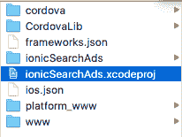
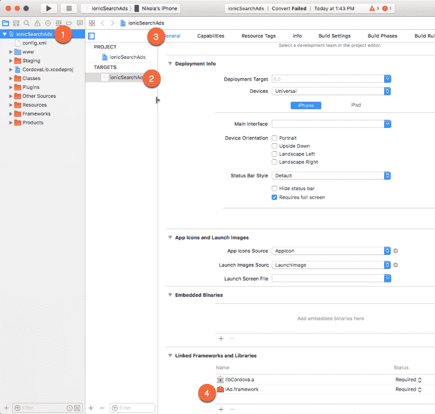
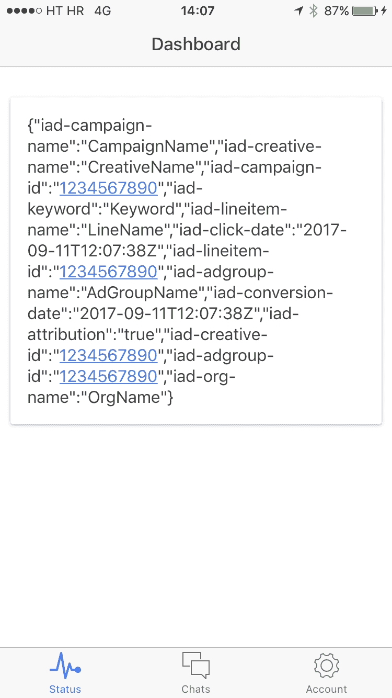

# 用于搜索广告应用属性 API 的 Cordova Ionic 插件

> 原文：<https://dev.to/nikola/cordova-ionic-plugin-for-search-ads-app-attribution-api>

*原载于[我的博客](http://www.nikola-breznjak.com/blog/javascript/ionic/cordova-ionic-plugin-search-ads-app-attribution-api/)*

[T2】](https://res.cloudinary.com/practicaldev/image/fetch/s--iPMBnb_0--/c_limit%2Cf_auto%2Cfl_progressive%2Cq_auto%2Cw_880/http://www.nikola-breznjak.com/blog/wp-content/uploads/2017/09/seo_machine.jpg)

## TL；速度三角形定位法(dead reckoning)

用于在 iOS 10.0+上阅读搜索广告应用属性的 Cordova 插件仅在 iOS 10.0+上使用，并带有展示其用法的 Ionic 演示。

Cordova/Ionic 的搜索广告 API 插件不存在，所以我创建了它。你可以[在 Github](https://github.com/Hitman666/cordova-plugin-searchads) 上查看插件代码，在 Github 上查看 [Ionic 演示应用代码，或者继续阅读如何使用它的示例。](https://github.com/Hitman666/ionicDemoCordovaPluginSearchAds)

> 如果你对ðÿ˜混合解决方案不感兴趣，你也可以查看关于如何创建一个能够读取搜索广告属性 API 信息的本地 iOS 应用的分步指南

## 什么是搜索广告 App 归属地？

来自[苹果的文档](https://searchads.apple.com/help/pdf/attribution-api.pdf):

> 搜索广告应用属性使开发人员能够跟踪和属性来自搜索广告活动的应用下载。有了搜索广告应用归属，iOS 开发者就有能力准确衡量新获得用户的终身价值及其广告活动的有效性。

## 如何使用插件

如果您想在一个空白项目上测试这个，您可以创建一个新的 Ionic 项目，如下所示:

`ionic start ionicSearchAdsDemo tabs`

由于插件已经被添加到 [npm 库](https://www.npmjs.com/package/cordova-plugin-searchads)中，您可以简单地像这样添加它:

`ionic plugin add cordova-plugin-searchads`

在`DashCtrl`控制器下的`controllers.js`文件中添加以下代码:

```
.controller('DashCtrl', function($scope, $ionicPlatform) {
    $scope.data = 'no data';

    $ionicPlatform.ready(function() {
        if (typeof SearchAds !== "undefined") {
            searchAds = new SearchAds();

            searchAds.initialize(function(attribution) {
                console.dir(attribution); // do something with this attribution (send to your server for further processing)
                $scope.data = JSON.stringify(attribution);
            }, function (err) {
                console.dir(err);
            });
        }
    });
}) 
```

将`templates/tab-dash.html`文件的内容替换为:

```
<ion-view view-title="Dashboard">
  <ion-content class="padding">
    <div class="card">
      <div class="item item-text-wrap">
        {{data}}
      </div>
    </div>
  </ion-content>
</ion-view> 
```

通过在终端中执行以下命令来准备项目:

`ionic prepare ios && open platforms/ios`

之后，打开 XCode 项目(`*.xcodeproj`)文件:

[T2】](https://res.cloudinary.com/practicaldev/image/fetch/s--3VUiMJAe--/c_limit%2Cf_auto%2Cfl_progressive%2Cq_auto%2Cw_880/https://i.imgur.com/jqxYHFs.png)

确保`iAd.framework`已经添加到链接的框架和库:

[T2】](https://res.cloudinary.com/practicaldev/image/fetch/s--ZCoPZXr3--/c_limit%2Cf_auto%2Cfl_progressive%2Cq_auto%2Cw_880/https://i.imgur.com/fvRkNQU.png)

当你添加插件时，这应该会自动发生，但是最好确认一下。这里没看到就自己加。

在您的设备上运行该项目，您应该会得到如下结果:

[T2】](https://res.cloudinary.com/practicaldev/image/fetch/s--adjhqNMX--/c_limit%2Cf_auto%2Cfl_progressive%2Cq_auto%2Cw_880/https://i.imgur.com/tdnkgqb.png)

希望这证明是有用的人！ðŸ'