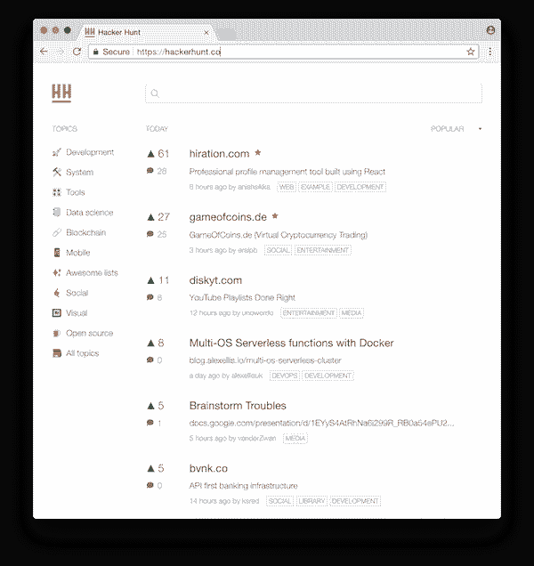
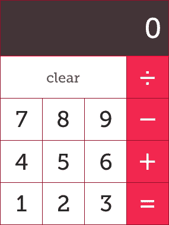
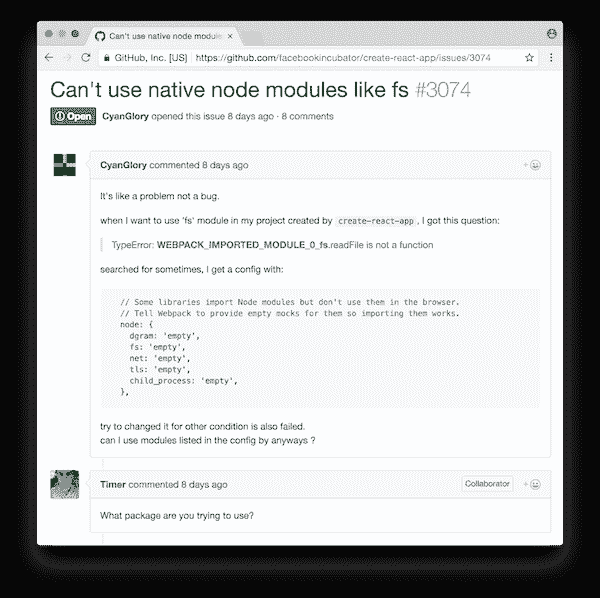

# 5 个帮助你学习反应的项目

> 原文:[https://dev.to/dceddia/5-projects-to-help-you-learn-react](https://dev.to/dceddia/5-projects-to-help-you-learn-react)

在您掌握了 React 的基础知识之后，接下来您会构建什么呢？一个“真正的”项目似乎太大了，但另一个 todo 应用程序不会削减它。你需要一些你能咬进去的东西——需要超过 5 分钟，但不会超过几天的东西。

在这篇文章中，我将向你展示 5 个有趣的项目，可以拓展你的能力，并且不涉及任何待办事项。

## 工装

我建议使用 [Create React App](https://github.com/facebookincubator/create-react-app) 来引导这些项目。

## 社会卡

我们从简单的开始。这更像是一个组件，而不是一个成熟的应用程序，但这是一个很好的起点。

[T2】](https://res.cloudinary.com/practicaldev/image/fetch/s--wkMWO1BA--/c_limit%2Cf_auto%2Cfl_progressive%2Cq_auto%2Cw_880/https://s3.amazonaws.com/daveceddia.cimg/social-card.png)

这种用户界面的变体在网上随处可见——Twitter、脸书、Pinterest、Airbnb、Redfin 等等——它为你想要显示一张图片和一些数据的应用程序提供了坚实的基础。

将 UI 分解成 React 组件也是很好的实践。

一旦你有了一个单独的`SocialCard`组件渲染，试着用一些假数据做一个列表。

## 天气 App

显示 5 天的天气预报，其中每天显示最高和最低温度，以及晴天/下雨/多云/下雪的图像。使用伪造的、硬编码的数据，直到你得到正确的渲染。

[T2】](https://res.cloudinary.com/practicaldev/image/fetch/s--nNxDXM8r--/c_limit%2Cf_auto%2Cfl_progressive%2Cq_auto%2Cw_880/https://s3.amazonaws.com/daveceddia.cimg/weather.png)

你可能会注意到“日子”看起来很像社交卡片...

为了增加练习，这里有一些你可以在应用上扩展的方法:

*   添加点击一天的功能，并查看其每小时的预测。您可以在顶级应用程序状态下维护当前视图。
*   将 React Router 添加到项目中(`npm install react-router`)，并按照快速入门指南[在这里](https://reacttraining.com/react-router/web/guides/quick-start)添加路线，这样`/`显示 5 天的预测，`/[name-of-day]`显示特定一天的每小时预测。
*   从 [Open Weather Map](https://openweathermap.org) 注册一个免费的 API 密匙，获取一个真实的 5 天天气预报，并将数据输入你的应用程序。
*   想变得更有趣吗？添加一个像 [vx](https://vx-demo.now.sh/) 这样的图形库，并按照这里[的例子](https://medium.com/vx-code/getting-started-with-vx-1756bb661410)添加一周或一天的温度图。

你可以看到这个应用程序如何开始简单，但可以随意扩展，以增加挑战和学习。

## 黑客狩猎

Hacker Hunt 是一个分类的黑客新闻故事聚合器，但更重要的是，它是一个为 React 实践而构建的好应用程序。

[T2】](https://res.cloudinary.com/practicaldev/image/fetch/s--ndI7yWfh--/c_limit%2Cf_auto%2Cfl_progressive%2Cq_auto%2Cw_880/https://s3.amazonaws.com/daveceddia.cimg/hackerhunt.png)

有人说过，所有的 web apps 基本上都只是列表。这个应用程序会给你一些比 todos 稍微复杂一点的组件列表的练习。

首先使用静态数据，如果你想要更多的挑战，从他们的 API 中获取故事。从我从 devtools 收集的信息来看，这只是一条路线，[https://hackerhunt.co/api/daily/0](https://hackerhunt.co/api/daily/0)，你可以用不同的页码替换 0。

您可以更进一步，用 React Router 复制它们的路由结构。

## 计算器

[T2】](https://res.cloudinary.com/practicaldev/image/fetch/s--VS5spBZF--/c_limit%2Cf_auto%2Cfl_progressive%2Cq_auto%2Cw_880/https://s3.amazonaws.com/daveceddia.cimg/calculator.png)

你可能已经知道这些是如何工作的。加、减、乘、除...单击数字或操作应该会执行该操作。

对于额外的挑战，响应键盘输入。您不应该需要添加一个`<input>`元素来实现这一点。如果你使用了一个`<input>`，让用户不需要聚焦输入控件来输入。

花一点时间思考国家将如何被代表。您需要存储的不仅仅是显示屏上的数字吗？当您键入一个新数字时，它是用该数字替换显示，还是将其附加到末尾？

用 Jest 添加一些[快照测试来测试计算器是否正常工作。](https://daveceddia.com/snapshot-testing-react-with-jest/)

## Github 问题页面

做一个 Github 问题页面的简化版。[这里有一个例子](https://github.com/facebookincubator/create-react-app/issues)。为了保持范围较小，只需专注于实现问题列表，忽略标题中的内容(搜索、过滤、星号等)。

[T2】](https://res.cloudinary.com/practicaldev/image/fetch/s--KriGV5UK--/c_limit%2Cf_auto%2Cfl_progressive%2Cq_auto%2Cw_880/https://s3.amazonaws.com/daveceddia.cimg/github-issue-list.png)

首先从 [Github 的 API](https://developer.github.com/v3/issues/) 获取未解决的问题，并在列表中显示它们。您也可以为此使用静态数据。

然后添加一个分页控件，以允许在整个问题列表中导航。您可能会发现添加 React Router 也很有用，这样您就可以直接导航到给定页面。

为了增加难度，还实现了问题细节页面。使用类似于 [react-markdown](https://github.com/rexxars/react-markdown) 的东西呈现问题的降价文本及其评论。

[T2】](https://res.cloudinary.com/practicaldev/image/fetch/s--4nFcEcrv--/c_limit%2Cf_auto%2Cfl_progressive%2Cq_auto%2Cw_880/https://s3.amazonaws.com/daveceddia.cimg/github-issue-detail.png)

[这里是一个使用 React、Redux 和 React 路由器的工作示例](https://github.com/dceddia/github-issues-viewer),它实现了上述特性以及更多特性。

## 接下来呢？

希望我已经给了你一些想法来帮助你提高反应技能。关于这方面的更多内容，请阅读关于使用 Copywork 学习[的内容，并在 React](https://daveceddia.com/learn-react-with-copywork/) 中跟随构建一个[节拍器。](https://daveceddia.com/build-metronome-react/)

*最初发布于[daveceddia.com](https://daveceddia.com/react-practice-projects/)。*