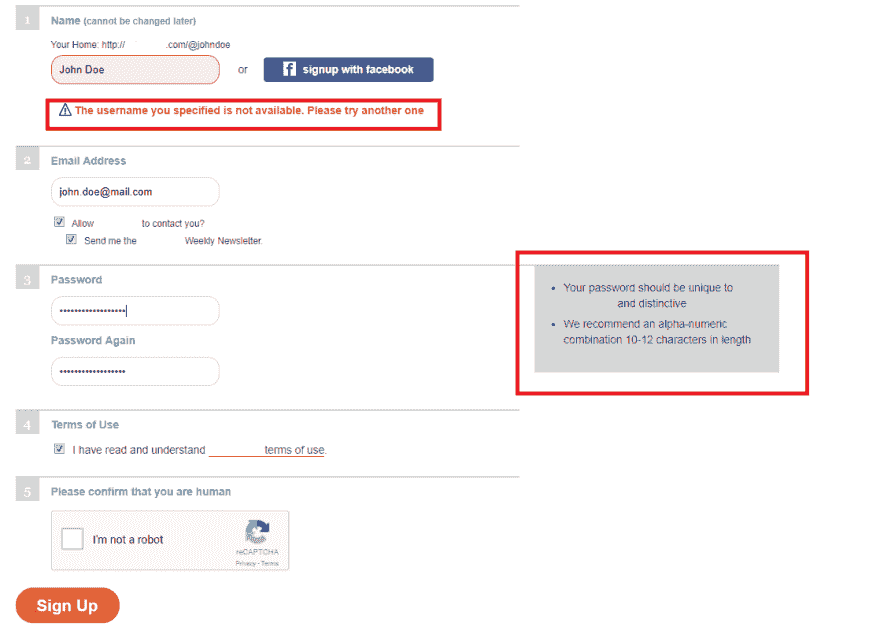
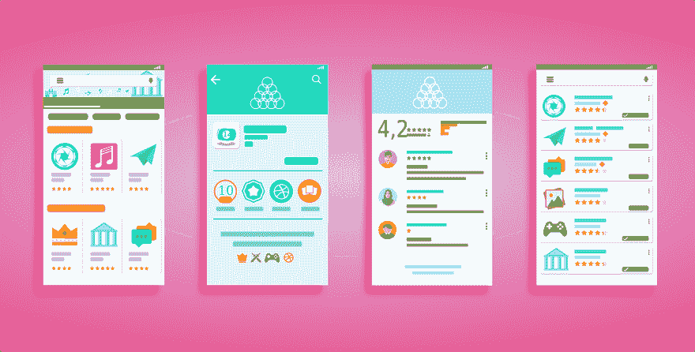
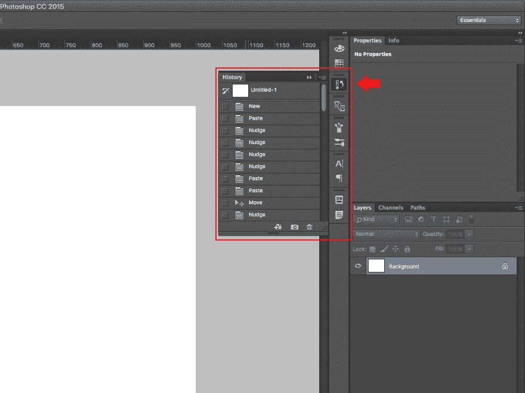

# 优秀用户界面设计的黄金法则

> 原文:[https://dev.to/d8eauchamp/golden-rules-of-great-ui-design](https://dev.to/d8eauchamp/golden-rules-of-great-ui-design)

[T2】](https://res.cloudinary.com/practicaldev/image/fetch/s--vAVfYT3Z--/c_limit%2Cf_auto%2Cfl_progressive%2Cq_auto%2Cw_880/https://thepracticaldev.s3.amazonaws.com/i/kapk4qgi5ldujjc6fdx0.jpg)

不考虑预期的设备和媒介(网站、手机 app、游戏机、ATM 等。界面是成功的一个关键部分，因为它可以决定整个产品的成败。难怪对那些以 UI 设计为谋生手段的专业人士来说，需求一直很大。无论你是一个想要学习这个行业的初学 UI 设计者，还是一个只想为他们的产品制作可用且一致的界面的开发者，这个简短的指南将帮助你做到这一点。

# 反馈

许多人将“反馈”与某种联系方式联系起来。无论如何，给你的应用程序用户和网站访问者发送反馈和建议的机会。这是一个好主意，看看你的设计在现实生活中表现如何，它缺少什么。然而，我说的是另一种反馈—[从系统到用户的反馈](https://www.smashingmagazine.com/2013/02/designing-great-feedback-loops/)。

让你的用户知道正在发生什么。有东西在装吗？数据发送了吗？出了什么问题吗？告诉他们这件事。让系统状态可见–不要让用户猜测。他们不喜欢惊喜。他们希望系统是可预测的，并感觉在控制之中。通过突出显示菜单按钮、显示开/关开关等向他们显示状态。

如果出现任何问题，你的界面必须做出反应，说明原因并提示用户应该做什么，这样交互才能成功。如果注册表无法发送，请将其显示并说明原因。突出显示空的必填字段，并解释您为什么需要此信息。如果用户名/密码无效，让你的用户知道什么是有效的，允许哪些符号，最大长度是多少。

[T2】](https://res.cloudinary.com/practicaldev/image/fetch/s--Xcwkomzv--/c_limit%2Cf_auto%2Cfl_progressive%2Cq_auto%2Cw_880/https://thepracticaldev.s3.amazonaws.com/i/14dfq1uebyhek34h5kef.png)

# 简朴

正如 Martin LeBlank 的名言所说，“用户界面就像一个笑话，如果你必须解释，它并不是那么好”。原创是伟大的，但它不能妨碍理解。花哨的交互、复杂的形状和鲜艳的颜色可能看起来很棒，很艺术，并暗示你的网站(或应用程序)很时尚，很吸引人。然而，如果它们的功能乍一看并不清楚，那么你的设计就没有达到它的主要目的。

当然，快速指南和教程也可以。有些人可能真的需要你收集的整个知识库来说明你的产品的全部功能。我们已经习惯了为主要功能和界面元素提供幻灯片指南的游戏。但是，即使你碰巧第一次注册任何电子邮件服务(Gmail、Yahoo、Outlook ),首先遇到你的是一个教程。

然而，你必须使你的界面简单明了，这样你的用户就可以跳过教程，不用地图就能知道整个过程是如何进行的。

[T2】](https://res.cloudinary.com/practicaldev/image/fetch/s--KvP5HtOq--/c_limit%2Cf_auto%2Cfl_progressive%2Cq_auto%2Cw_880/https://thepracticaldev.s3.amazonaws.com/i/3wk00r3ejo20v9gnzggi.png)

# 与现实世界相符

就像你的界面元素应该符合物理定律一样，其他的一切都必须尽可能接近用户在现实世界中找到的概念。用户必须不知道你的应用程序的算法或过程的技术术语。你的工作是在计算机和人类观众之间建立交流。在你的反馈信息中使用“人类的语言，而不是正式的描述。

选择简单的导航元素(滑块、面包屑、复选框和指示器图标)。搭便车用户的期望来自他们的现实世界的经验。想想存储在文件夹中的文件或 Photoshop 中工具的名称——具有类似功能的真实物体给了他们灵感。这就是让你的设计直观的原因。这种方法将为你节省大量的时间，并最大限度地减少用户的认知负荷，这是一个双赢的局面。苹果的压力感应触控板就是一个很好的例子——它模仿了现实世界的物理特性，因此极大地增强了整体 UX。

# 微交互

你还想把额外的东西带进用户界面，让用户体验不仅仅是“还好”吗？微交互可以发挥这种魔力。当页面上只有一个元素对用户的动作做出反应时，就会发生微交互。例如，包含更多详细信息的下拉菜单，或者当鼠标悬停在图标上时会变成动画的图标。

关键是过渡——任何东西都不应该消失或突然出现。使用动画让它淡出，滑入，变换。适当注意时机:太快不会提供理想的流畅效果，因为用户可能会错过它。当用户必须重复或快速执行某个动作时，太长时间是一种痛苦。这里的经验法则是让你的元素尽可能地接近物理定律，这样它们感觉起来更自然，因此也更优雅。

[T2】](https://res.cloudinary.com/practicaldev/image/fetch/s--cJhHge36--/c_limit%2Cf_auto%2Cfl_progressive%2Cq_auto%2Cw_880/https://thepracticaldev.s3.amazonaws.com/i/0eckd9zv5dlzxgr5nooo.jpeg)

# 了解你的受众

现在，你如何知道你的用户期望什么？除了显而易见的传统事物和普遍知识(绿色勾号表示是，红色 X 表示否，箭头表示方向)，还有其他一些洞察用户期望的来源。

首先，你应该了解你的受众——这一定不会让你感到惊讶，如果你在一个网站上工作，你一定已经知道你的用户是谁。Photoshop 的作者镜像了专业摄影师使用的工具，因为他们是他们最初的目标受众。其中一些对每个人来说都很直观和清晰——橡皮擦、滴管、手、刷子。而其他的对于普通用户来说更难理解，比如曝光、白平衡、减淡、加深。然而，对于软件的主要目标用户，也就是摄影师来说，它们绝对是可以理解的。

第二，你应该理解 UI 是如何融入 UX 的。后者相对于 UI 来说是一个很大的、包罗万象的概念。要创建一个简单、直观的界面，你应该从用户体验的角度来看待你的工作。对用户流量的了解，对品牌和产品的扎实知识，一定是你的出发点。这将为你提供关于你的界面需要解决什么问题以及它在 UX 架构中的位置的重要信息。

# 让你的用户界面变得宽容

这意味着用户必须能够看到他们行为的直接结果，并且能够轻松地撤销它们。提供这样的可能性(不要忘记反馈)。允许你的用户去探索，不要因为好奇或者不知道“这个小东西是做什么的”而惩罚他们。简而言之:为了探索，他们必须确保没有自毁按钮来破坏他们的工作或取消他们之前采取的所有步骤，甚至连通知都没有。

我再举一次 Photoshop 的例子。首先，它们提供了一个清晰的出口，让你摆脱所有混乱的局面。你可以尝试任何晦涩的工具，然后你可以后退一步。还有一个“向前一步”选项——如果你改变了主意，根本不想取消行动。此外，您还有一个历史记录，您可以批量取消许多步骤，或者将几个操作跳回到图像的前一个状态。此外，这两个选项都很容易访问，并且在主菜单中可见，因此即使用户感到恐慌，他们也不能跳过它。

用户形象又多了一道保险。通过点击“保存”，他们不会覆盖原始文件，但可以选择将他们的工作保存为一个新文件。如你所见，Photoshop UI 的创造者创造了一种鼓励探索的宽容的媒介，这是该产品在专业人士和业余爱好者中获得成功的重要原因。

[T2】](https://res.cloudinary.com/practicaldev/image/fetch/s--gYTSd82N--/c_limit%2Cf_auto%2Cfl_progressive%2Cq_auto%2Cw_880/https://thepracticaldev.s3.amazonaws.com/i/rqi03ibt5kh2gbk13i8f.jpg)

# 外卖

*   总是让你的用户知道正在发生什么，他们在哪里
*   让你的界面简单，不要为了艺术表达而牺牲清晰度
*   当有疑问时，模仿现实生活中的互动和因果例子
*   微观互动可以对 UX 产生宏观影响，不要忽视它们
*   了解你的观众，并让它激励你
*   允许你的用户探索和犯错误

对于有一些经验的 UI 设计师来说，这些简单的规则似乎是不言而喻的。然而，作为一名平面设计师，我从艺术的角度进入了界面的领域。我艰难地认识到，UI 与调色板、字体系列和光滑滑块的关系比我想象的要少。这并不意味着它们不重要——[为一个伟大的产品创造一个漂亮的包装是其成功的关键部分。](https://medium.com/@erikdkennedy/7-rules-for-creating-gorgeous-ui-part-1-559d4e805cda)