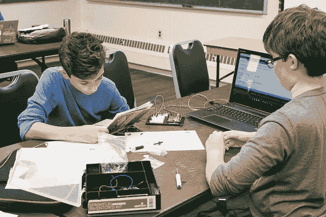

# 生产中的超光子

> 原文：<https://dev.to/inceptioncode/tachyons-in-production>

[T2】](https://res.cloudinary.com/practicaldev/image/fetch/s--Hw8YBtY9--/c_limit%2Cf_auto%2Cfl_progressive%2Cq_auto%2Cw_880/https://thepracticaldev.s3.amazonaws.com/i/ppjuv3za16uinvhovfty.jpg)

# 简介

我首先会说，这将是一个简短的帖子。我的意思是非常短，仅仅五分钟的阅读。不，这篇文章不会深入探究超光速粒子是如何工作的。不，这篇文章不会告诉你如何安装超光速粒子。然而，如果你保持开放的心态，这篇文章可能会说服你使用它，并理解它对你的工作流程有多大的好处。

现在，如果你想知道更多细节和如何安装超光速粒子，请访问超光速粒子的网站。此外，看看一个更好的关于超光速粒子的帖子，它会更深入，如果那是你正在寻找的。作者还在[“用超光速粒子保持你的 CSS 干燥”](https://medium.com/@dakotaleemartinez/keeping-your-css-dry-with-tachyons-bb1c0dc66dce)中给出了更多有用的资源，标题本身就说明了一切。

## 超光速粒子到底是什么？

以下是我根据我的*咳嗽*“初级水平”的理解对那个问题的简短回答。它只是一个 CSS 库。是啊，听起来没什么特别的，对吧？我们已经有了 CSS 的前置处理器，现在还有我喜欢的后置 CSS。一个简单的库能做什么？良好的...简化事情，对吗？我以为所有的图书馆都应该这么做？我是说我说的对吗？

撇开所有的笑话不谈，我认为这是最好的图书馆。我知道好吧，我知道我可能是一个新手，但我遇到了自己的 CSS 问题。就像哦，我不知道，“规范”。是的，我甚至讨厌拼写这个词。我尝试过使用 OOCSS(面向对象的 CSS)的方式来组织和管理 CSS。除了类，我什么也没试过，好家伙，我已经接近解决方案了。

尽管，有人比我更有经验，把课程带到了一个完全不同的水平。

## 哇类？！

如果你已经猜到了，图书馆里只有课程。现在，等等，听听，或者嗯，读读，或者随便什么。根据我的经验，类通常听起来像这样，“文章字体”或“导航风格”。基本上，我们的类声明了一个通用名称，没有其他的。你必须看着元素才能理解它被做了什么。然后你必须深入研究 CSS 中的一个类来理解发生了什么。

为什么不一开始就说发生了什么？让你的类告诉读者“什么”被应用于元素。我保证不再需要在 HTML 和 CSS 文件之间切换了。至少当你忘记了一个类名和真正发生的事情时，你不用再作弊和偷窥你的 CSS。所以，我明白了，你需要一个例子。

```
<h2 class="open-sans ttu tracked f3">10 Questions You Must Ask...</h2> 
```

Enter fullscreen mode Exit fullscreen mode

哇！看那个！很好...简单。标题元素字体系列是 open-sans，oh，文本是大写字母。我知道你可能不会马上理解这个模式。“跟踪”和“f3”可能会令人困惑，但现在忽略这一点。使用这个系统确实包括一个小的学习曲线。一旦你得到它，你将永远不会忘记它。通过阅读 elements 类，元素发生了什么变得显而易见。最后，协作可以变得容易得多，CSS 文件可以不包含太多的混乱和破坏设计的无限可能性。

## 自定义设置

我说过这将是简短的，我注意保持这种方式。这里列出了超光速粒子的好处，这也是我的观点。亲自测试一下。

*   无出血效应
*   一个简单且适应性强的系统。
*   不再需要超大的主 CSS 文件和模块。
*   易于定制和添加类到库中。

我可以详细列出清单，但我想你已经了解了每一项的要点。我要指出的是，一旦你习惯了这个系统或者这些类是如何创建的，你就会创建你自己的。此外，你不会想回到做 CSS 的老方法。我只是说，保持开放的心态，给它一个机会。