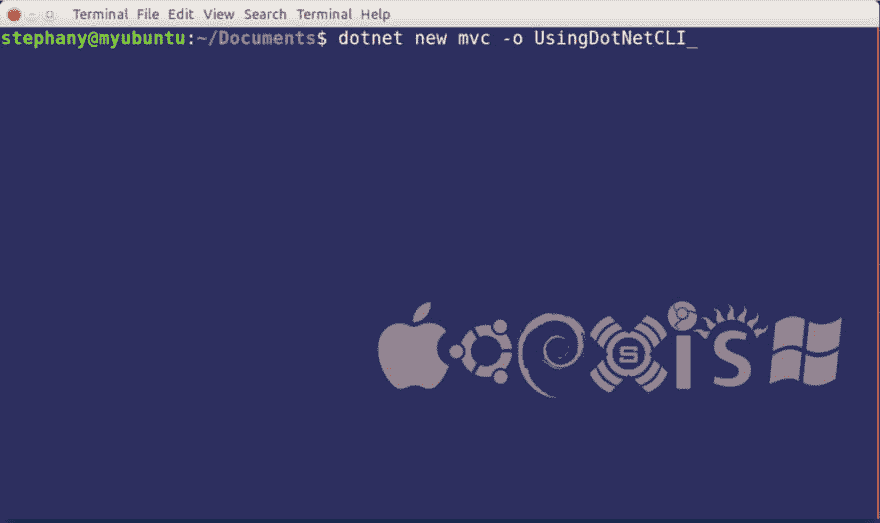
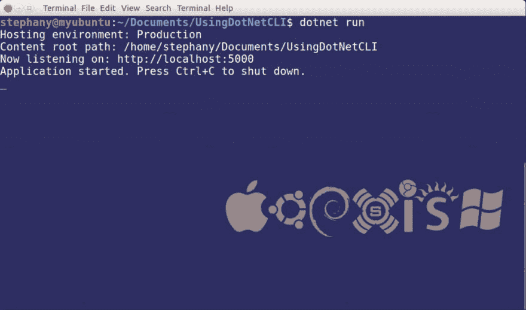
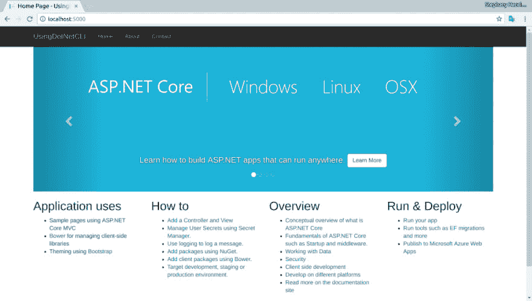

# 。Net 命令行界面(CLI)，通过终端创建项目

> 原文：<https://dev.to/rickab10/net-comand-line-interface-cli-create-a-project-by-terminal>

。Net 命令行界面(CLI)是 ASP.NET 核心开发必不可少的新工具。我说的“基本”是什么意思简单，任何想在微软新平台上开发的人或工具都必须使用这个工具。这是发展的第一层。Visual Studio (VS)使用。Net CLI 来构建，发布，运行等事情。。Net CLI 也是跨平台的，也就是说，它可以在 Windows、Apple 和 Linux 上运行，要开始使用它，您必须将您的发行版下载到您的 so。

你可能会想，“我需要学习这个工具吗？”那些与 VS 一起工作的人不需要，因为在内部 VS 使用。Net CLI。但是当你不使用 VS 时，就需要使用它。记住，现在我可以在 Visual Studio Code、Sublime、Vim 等其他工具中进行开发。所以，了解一下就好！

这可以使人困惑的是，前一段时间使用 DNX 工具，当。Net Core 是 beta。随着 ASP.NET 核心投入生产，DNX 被网络所取代。

使用。Net 命令行接口(CLI)有一个模式，驱动(dotnet) +动词+实参(如果有的话)。下面我解释一下其他命令:

*   “点网恢复”恢复投影所需的所有依赖关系。
*   “点网构建”编译应用程序以验证是否有错误。
*   “dotnet run”运行应用程序。
*   “点网测试”运行应用程序的测试。
*   “dotnet publish”发布应用程序。
*   “dotnet pack”创建一个 Nuget 包。

要执行创建的项目，我们必须执行命令“dotnet run”。

让我们看看一点工作，我用的是 Ubuntu 16.04。因此，在下面的图片中，你可以看到我正在创建一个 web 应用程序并运行它。

[T2】](https://res.cloudinary.com/practicaldev/image/fetch/s--71G830LQ--/c_limit%2Cf_auto%2Cfl_progressive%2Cq_auto%2Cw_880/http://www.stephanybatista.com/wp-content/uploads/2016/06/Selection_004-1024x608.png)

为了创建一个 web 项目，我使用了:

*   "新建"创建一个新项目。
*   “mvc”来创建一个 MVC 模板。
*   "-o "表示项目名称。

[T2】](https://res.cloudinary.com/practicaldev/image/fetch/s--bJNphv2Y--/c_limit%2Cf_auto%2Cfl_progressive%2Cq_auto%2Cw_880/http://www.stephanybatista.com/wp-content/uploads/2016/06/Selection_006-1024x604.png)

创建项目后，我可以访问项目文件夹并运行项目，因为我创建了一个项目模板。

[T2】](https://res.cloudinary.com/practicaldev/image/fetch/s--hqW0BBVm--/c_limit%2Cf_auto%2Cfl_progressive%2Cq_auto%2Cw_880/http://www.stephanybatista.com/wp-content/uploads/2016/06/Home-Page-UsingDotNetCLI-Google-Chrome_009-1024x580.png)

最后，这就是结果。

默认情况下，这些是包含的所有命令，但是您可以创建自己的命令，为此，请访问[。NET 核心 CLI 扩展模型。](https://dotnet.github.io/docs/core-concepts/core-sdk/cli/extensibility.html)

结论

。Net 命令行界面(CLI)是在。Net 平台。通过它，我们可以创建一个新的项目，恢复包，运行和其他。与。Net CLI，代码编辑可以用它进行开发，因为它是跨平台的。在微软的新平台上，在 Windows、Linux 或苹果开发已经没什么区别了。

[。NET 核心命令行工具(CLI)](http://dotnet.github.io/docs/core-concepts/core-sdk/cli/overview.html)

你喜欢这篇文章吗？你会更了解。网芯？我在 Udemy 创建了一个价格便宜的课程。访问[https://www . udemy . com/aspnet-core-20-learn-concepts-and-creating-a-web-app](https://www.udemy.com/aspnet-core-20-learn-concepts-and-creating-an-web-app)