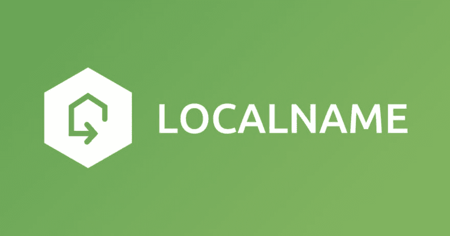
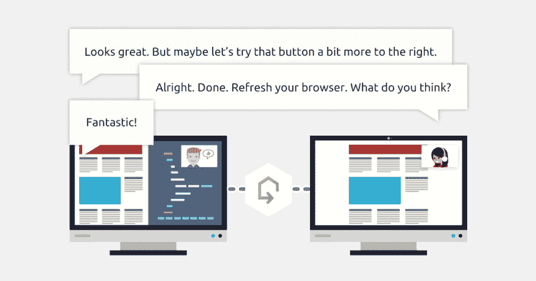

# Localname -保护对本地开发服务器的访问

> 原文：<https://dev.to/bugfenderapp/show-devto-localname---secure-access-to-your-local-development-server>

[T2】](https://res.cloudinary.com/practicaldev/image/fetch/s--vpLKEcbF--/c_limit%2Cf_auto%2Cfl_progressive%2Cq_auto%2Cw_880/https://mobilejazz.com/blog/wp-content/uploads/2017/04/localname-1.jpg)

在 [Mobile Jazz](http://mobilejazz.com/) ，我们总是[创新新的实用程序](https://mobilejazz.com/products/opensource)来帮助我们的客户，以及像 [Bugfender](https://www.bugfender.com/) 这样的工具来帮助世界各地的开发者。今天，我们要向您介绍我们的最新产品， [Localname](http://www.localname.io/) 。

## 什么是 Localname？

Localname 是一个面向开发人员的本地 Mac 应用程序，它创建一个 url 来授予对其本地开发机器的访问权限。

**这是什么意思？**

对于开发人员来说，向客户展示项目的开发进度通常是很有用的。这有时会很棘手，需要复杂的路由器 IP 和端口配置。

Localname 为您完成了艰巨的工作，它提供了一个单一的 url，让您的设计师、客户或项目经理可以查看您的进度。

[T2】](https://res.cloudinary.com/practicaldev/image/fetch/s--TFN2J627--/c_limit%2Cf_auto%2Cfl_progressive%2Cq_auto%2Cw_880/https://mobilejazz.com/blog/wp-content/uploads/2017/04/localname-2.jpg)

## 我们为什么要创造它？

作为一家移动应用和网络开发机构，我们发现帮助协作的工具非常有用，无论是在我们之间还是与客户之间。除了项目评审，我们实际上构建 Localname 时还考虑了一些用例:

**手机应用测试**

由于 Localname 为您的本地开发机器提供了一个安全的隧道，它使您能够从真实设备上轻松测试您的移动应用程序的后端。

**Webhooks**

当您可以提供一个指向您的开发机器的回调 url 时，测试 webhooks 就变得容易多了。

**远程调试**

在电话会议上，Localname 项目评论也是一个很好的现场调试会议。

[T2】](https://res.cloudinary.com/practicaldev/image/fetch/s--zFC_noPv--/c_limit%2Cf_auto%2Cfl_progressive%2Cq_auto%2Cw_880/https://mobilejazz.com/blog/wp-content/uploads/2017/04/localname-3.jpg)

## 它是如何工作的？

Localname 是一个本地 macOS 应用程序。当打开应用程序时，会提示您创建一个 url，Localname 会简单地完成剩下的工作。它将创建一个到本地开发机器的安全通道，允许任何人使用您创建的 url 进行访问。

## 我可以从哪里开始？

要下载，请前往 [localname.io](http://localname.io) 并立即注册。