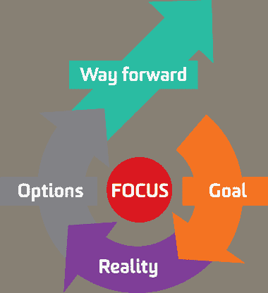

# 黑客攻击人们的成长-第二部分

> 原文：<https://dev.to/joaoflf/hacking-people-growth---part-2>

在本系列的第 1 部分中，我描述了如何通过培养持续反馈的习惯来帮助我的团队成员提高自我意识。这一部分将着重于我如何努力履行我的职责，理解每个人的顾虑和动机，并帮助他们确定自己的成长方向。
我首先对教练模式和流程做了一些研究，发现了成长模式。

### —**成长模式**

约翰·惠特莫尔(John Whitmore)在 1992 年出版的《绩效教练》(Coaching for Performance)一书中提出的成长模型，是一个简单而强大的框架，通过一系列阶段和对话，帮助最大限度地提高和保持个人成就和生产力。GROW 代表目标、现实、选择和前进，这是该框架的四大支柱。

[T2】](https://res.cloudinary.com/practicaldev/image/fetch/s--Ylbrj3WH--/c_limit%2Cf_auto%2Cfl_progressive%2Cq_auto%2Cw_880/https://cdn-images-1.medium.com/max/1600/0%2AFTIiKvvwcBJzScht.png)

第一阶段的重点是提高对个人愿望和广泛目标的认识，之后是对其当前现实的思考，以及为实现这些愿望正在采取或已经采取的步骤。在第三阶段，头脑风暴的目的是发现有效实现个人目标的方法和想法。最后，最后一个阶段致力于将这些想法转化为具体有效的行动。

### **自省会议**

以此模型为基础，我与我的团队成员进行了一系列一对一的会议，尝试围绕 GROW 主题展开讨论。几个会议之后，我整理了一份针对这些话题的问题清单，并开始将它们作为讨论的起点和汇集机制。这让我从这些会议中获得了更多的价值和内容。这些会议成了我开始使用的过程的第一部分，我称之为自省会议

在这些会议中，讨论了目标和现实阶段。以下是我使用的一些问题示例:

**目标**

*   你想长期实现什么？
*   成功是什么样子的？
*   你对自己的目标有多大的个人控制力或影响力？
*   路上的里程碑是什么？
*   这现实吗？
*   这是积极的、有挑战性的、可实现的吗？
*   你希望现在没有发生的事情会发生，或者你希望现在正在发生的事情不会发生？

**现实**

*   现在发生了什么？(内容、地点、时间、人员、数量、频率)。尽可能精确。
*   谁参与其中(直接和间接)？
*   他们的认知是什么？
*   当事情在这个问题上变得糟糕时，你会发生什么？
*   到目前为止，你对此做了些什么？
*   这产生了什么结果？
*   情境中缺少了什么？
*   是什么阻碍了你？

我发现这些会议的最佳持续时间在 20 到 60 分钟之间。它允许有足够的时间来发展和深入研究一些主题，而不会变得太累。在整个过程中，尽可能多地做笔记和记录是很重要的。然而，我意识到我必须这样做，而不能转移别人的注意力，并保持迷人的姿势。有一件事很有帮助，那就是定期与对方一起阅读笔记，以确保一切都被捕捉到，并对部分讨论进行总结。

在本系列的下一部分，我将继续解释我如何利用这些会议的成果来创建有意义的个人发展路径和愿景。