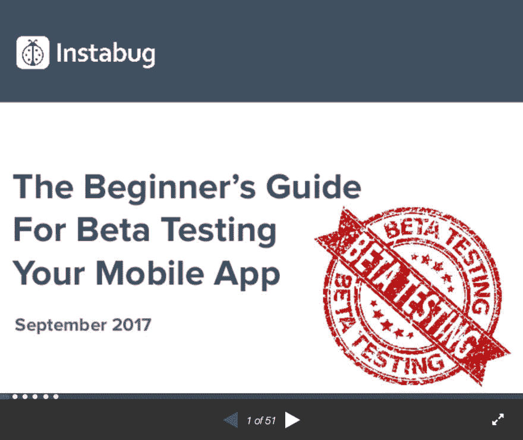

# 测试手机应用的终极初学者指南

> 原文:[https://dev . to/insta bug/the-ultimate-初学者-beta-testing-mobile-apps 指南](https://dev.to/instabug/the-ultimate-beginners-guide-for-beta-testing-mobile-apps)

我们的 15，000 名[客户](https://instabug.com/customers?utm_source=devto&utm_medium=&utm_campaign=post&utm_content=betatestingslides)中的大多数在他们的应用的测试版中使用我们，我们不断收到关于测试版测试的问题。

因此，我们决定编写一份初学者指南，其中包含关于测试手机应用的提示、资源和最常见问题的答案。

[T2】](https://www.slideshare.net/Instabug/the-ultimate-beginners-guide-for-beta-testing-mobile-apps-79634773?utm_source=devto&utm_medium=&utm_campaign=post&utm_content=betatestingslides)

以下是您将从这 50 多张幻灯片中学到的内容:

*   什么是 beta 测试？
*   为什么重要？
*   有哪些类型的测试？
*   测试需要多长时间？
*   分发您的应用程序的最佳位置是哪里？
*   beta 测试人员的职责是什么？
*   有哪些类型的测试人员？
*   你需要多少测试人员？
*   哪里可以找到 beta 测试人员？
*   你应该如何管理 beta 测试人员？
*   你如何激励你的测试人员？
*   在哪里可以了解更多关于 beta 测试的信息？

点击此处查看完整演示:[手机应用测试终极指南](https://www.slideshare.net/Instabug/the-ultimate-beginners-guide-for-beta-testing-mobile-apps-79634773?utm_source=devto&utm_medium=&utm_campaign=post&utm_content=betatestingslides)

我们重视反馈(用户反馈是我们公司的核心！)，我们也很想听听你的。请在[content@instabug.com](mailto:content@instabug.com)与我们分享您的评论和 beta 测试问题，或者在[contactus@instabug.com](mailto:contactus@instabug.com)向我们提问。