# 从理论到实践:表示图形

> 原文:[https://dev . to/vaidehijoshi/from-theory-to-practice-representative-graphs](https://dev.to/vaidehijoshi/from-theory-to-practice-representing-graphs)

在你自己的学习中，你能做的最好的投资是回到你(认为)已经知道的东西，这在计算机科学领域尤其如此。计算中的一切都是建立在*甚至更多抽象层*之上的抽象层；如果世界上所有的行业都是洋葱，那么计算机肯定会是为数不多的几个拥有无数层的行业之一。

所有这些抽象也使得软件如此困难(有时，如此令人生畏)。我们没有人知道所有关于驱动我们世界的软件或硬件如何工作的知识。事实是，我们没有人会真正知道所有的事情。不过没关系！我们学习我们此刻需要学习的东西，我们探索我们有兴趣探索的新事物。通常，这意味着学习更多我们已经熟悉的东西。

这就是为什么我喜欢回到我认为我已经知道的话题，并在表面下挖掘得更深一点——你几乎总是会发现新的东西。在本系列的早些时候，我们深入研究了图论的基础知识。但是关于图表还有很多需要了解的地方！我们知道它们是基本事物的基础，比如社交网络，甚至是我们的浏览器历史，但是它们是如何工作的，我们如何实现它们呢？我们被温和地介绍了图形背后的理论，但是我们如何将该理论付诸实践并在深层次上理解图形，以便我们可以实际使用它们来解决实际问题呢？

为了做所有这些事情，我们需要回到基础。我们需要了解如何表示图表，并将理论转化为更具体的东西。

### 有序对的任何其他名称

既然我们已经熟悉了图背后的理论，我们就不在这里过多地探究它们的历史和应用了。这个故事的简短版本是，图形来自数学，只不过是一种正式表示网络的方式，网络是所有相互连接的对象的集合。

为了解决*表示*图结构的任务，这在计算机科学和网络中经常出现，我们应该确保我们对图的各个部分及其定义感到满意。 ***图*** 是具有两个不同部分的数据结构:一组有限的顶点，也称为节点，和一组有限的边，是从一个顶点到另一个顶点的引用/链接/指针。

<figure>[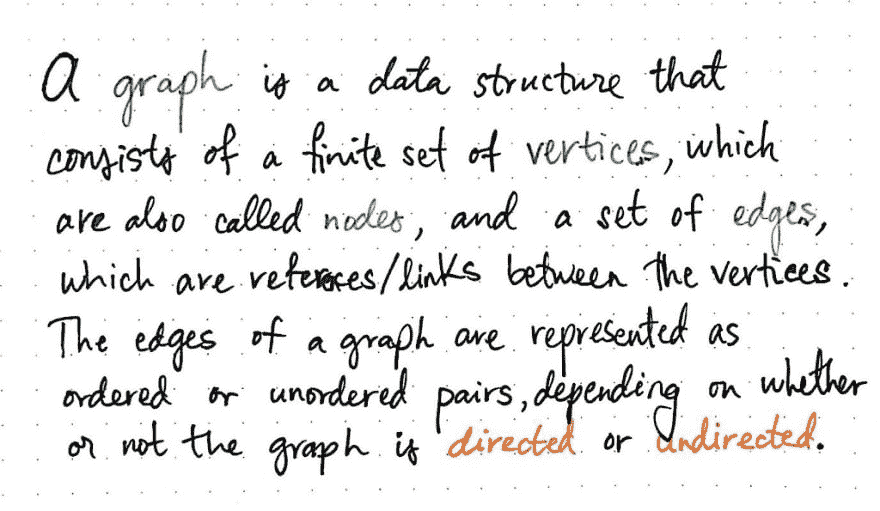](https://res.cloudinary.com/practicaldev/image/fetch/s--IxFSwh78--/c_limit%2Cf_auto%2Cfl_progressive%2Cq_auto%2Cw_880/https://cdn-images-1.medium.com/max/1024/1%2AAieKoYr68sm0GAFJUcNyDg.jpeg) 

<figcaption>图表数据结构:a(复习一)定义</figcaption>

</figure>

一个图是由顶点和边这两个不同的部分定义的。与节点相比，一些图具有许多边，并被定义为 ***密集*** 图，而边与节点比率较小的图被称为 ***稀疏*** 图。同样，如果一个图的边有方向流，那么这个图被定义为 ***有向*** ，而边没有*有向流的图为 ***无向*** 。*

 *> 图的特征与它的顶点和边的外观紧密相关。

能够识别这些特征是非常重要的，因为这直接影响到我们如何表示一个图形。但是，等等——我们如何*表示一个图形！这就是我们要做的，但是我们实际上还没有到那一步，不是吗？既然我们已经有了一些关于图的知识，我们可以在此基础上进行构建！(明白我说的回到我们*认为*我们已经知道的话题是什么意思了吧？)*

我们回想一下，在数学中，图被表示为 ***G = (V，E)*** ，其中 *V* 是顶点的集合， *E* 是边的集合。当我们学习图论时，我们看到有两种方法来表示这组边——根据图的边是有向的还是无向的，可以是无序对，也可以是有序对。

让我们快速回顾一下这在实践中意味着什么。

<figure>[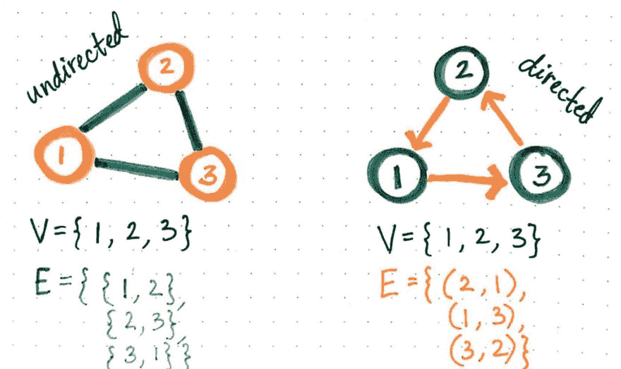](https://res.cloudinary.com/practicaldev/image/fetch/s--oOYHPOqa--/c_limit%2Cf_auto%2Cfl_progressive%2Cq_auto%2Cw_880/https://cdn-images-1.medium.com/max/1024/1%2AJ9U-CK1N6X7WBAnz_m04SQ.jpeg) 

<figcaption>表示有向与无向图中的边</figcaption>

</figure>

在这个例子中，我们将看到无向图的边，由 *E* 表示，没有顺序，因为可以从一个顶点到另一个顶点。然而，在有向图的边集 *E* 中，存在对图的结构很重要的方向流，因此，边集被表示为有序对。

这种图的边的表示是表示图的最简单的方法——我们已经知道了！但是这些简单的有序对在代码和内存中实际上是什么样子的呢？嗯，这是我们还不知道的事情(虽然我们也许能猜到！).答案可能和你想象的一样简单:根据我们使用的语言，转换这组有序对的最快方法是使用列表或数组。

<figure>[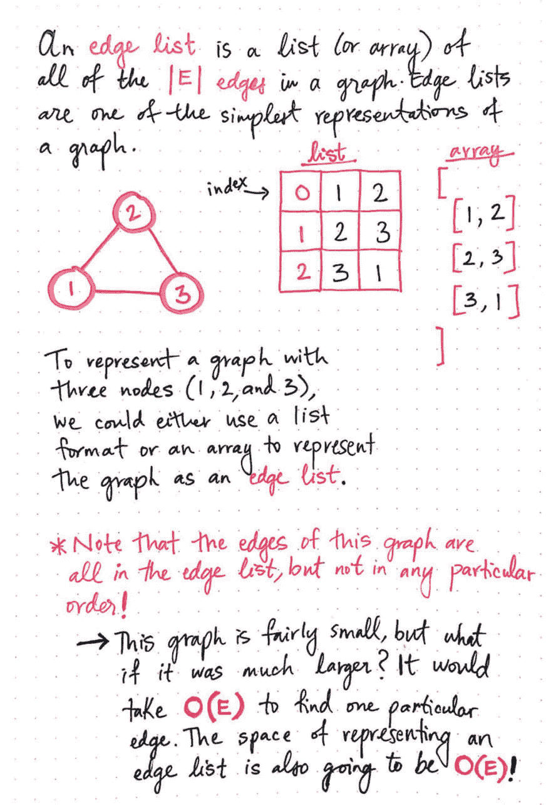](https://res.cloudinary.com/practicaldev/image/fetch/s--ZnESe9ag--/c_limit%2Cf_auto%2Cfl_progressive%2Cq_auto%2Cw_880/https://cdn-images-1.medium.com/max/1024/1%2A9uHj7ONZFgVwZ9OuD-kWbA.jpeg) 

<figcaption>将边缘列表作为一种方式来表示 a 图</figcaption>

</figure>

这个列表(或数组)称为 ***边列表*** ，是图中所有边( *|E|* )的表示。

在这里显示的例子中，我们有一个小图，只有三个节点:1、2 和 3。每条边都有一个索引，表示从一个节点到另一个节点的引用。我们会注意到，边在边列表中的出现没有任何特定的顺序，但是每一条边都必须被表示出来。

对于这个特定的图，边列表看起来像这样:

```
[ 
  [1, 2],
  [2, 3],
  [3, 1]
] 
```

因为边列表实际上只是一个数组，所以在这个数组中查找东西的唯一方法是遍历它。例如，如果我们想知道顶点 1 是否连接到顶点 2，我们需要遍历这个数组并寻找对[1，2]或[2，1]的存在。这对于我们的图来说很好，它只有三个顶点和三条边；遍历这个数组其实没什么大不了的。但是现实地说，大多数图表将会比这张大得多！

想象一下，必须遍历一个巨大的数组来查看数组中是否存在一条特定的边；因为边的列表不必遵循任何特定的顺序，所以边可以在列表的最末尾！或者，它可能根本不在那里，我们*仍然*必须遍历整个东西来检查它。做这项工作不仅会花费*线性*， ***O(E)*** 的时间，其中 *E* 表示图中的所有边——边列表还需要 *O(E)* 的空间量，尽管需要这些空间，但我们能做的事情却相当有限。

让我们记住我们开始时的内容:这是图的最简单的表示。有时候，最简单的版本对我们来说还不够。有些，让我们稍微复杂一点！

### 当名单不够时

对于大多数图来说，边列表不会是最有效的选择。因此，我们可以更进一步，从列表到矩阵——也就是邻接矩阵！

<figure>[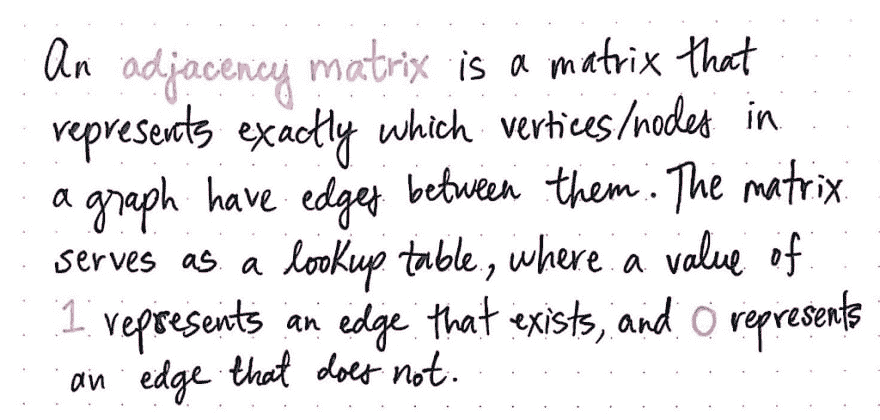](https://res.cloudinary.com/practicaldev/image/fetch/s--LLtg-3_x--/c_limit%2Cf_auto%2Cfl_progressive%2Cq_auto%2Cw_880/https://cdn-images-1.medium.com/max/1024/1%2A7xTtxr7I1Eq510-iDmxOsQ.jpeg) 

<figcaption>一个邻接矩阵:一个定义</figcaption>

</figure>

一个 ***邻接矩阵*** 是图中哪些节点之间包含边的精确*的矩阵表示。这个矩阵有点像一个查找表:一旦我们确定了想要在两个节点之间找到边的两个节点，我们就查看这两个节点的交叉点的值。邻接矩阵中的值类似于布尔标志指示符；他们要么在场，要么不在场。如果值为 1，这意味着两个节点之间有一条边；如果值为 0，这意味着它们之间不存在边。*

让我们看一个例子，让这一点更清楚。我们将使用之前使用过的同一个图，同样只有三个节点(1、2 和 3)。

<figure>[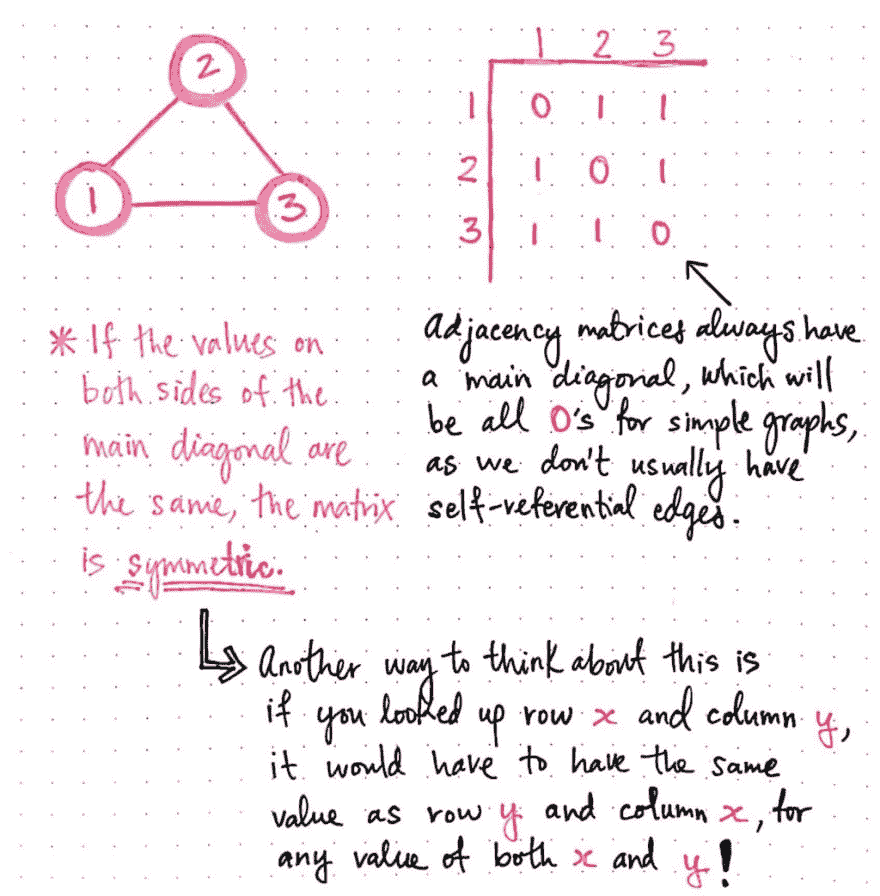](https://res.cloudinary.com/practicaldev/image/fetch/s--GT5EzKXS--/c_limit%2Cf_auto%2Cfl_progressive%2Cq_auto%2Cw_880/https://cdn-images-1.medium.com/max/1024/1%2AbllOr7NiKf4YbNtqg1cEqA.jpeg) 

<figcaption>邻接矩阵内的对称性</figcaption>

</figure>

在这个图中，我们可以看到邻接矩阵总是有一个主对角线，该对角线的值为 0，因为我们处理的大多数图都不是参考图。换句话说，因为节点 2 不能有到它自己的链接，如果我们从列 2 到行 2 画一条线，值将是 0。但是，如果我们想要查看节点 3 是否连接到节点 1，我们可以找到第 3 列第 1 行，并看到值为 1，这意味着这两个节点之间确实有一条边。

关于图的邻接矩阵表示的有趣的事情是，仅仅通过观察它们，我们就可以判断出图是*有向的*还是*无向的*。我们可以根据图的邻接矩阵是否*对称*来确定图的这一特性。如果一个邻接矩阵的主对角线两侧的值相同，则该矩阵是 ***对称的。*** 换句话说，如果我们查找第 x 行第 y 列，它将包含与第 y 行第 x 列相同的值。如果这对于矩阵的所有行和列都成立，那么矩阵将是对称的，这正是我们特殊的图形表示。

在下一节中，矩阵的对称性如何与图的“直接性”联系起来将变得更加清楚。

<figure>[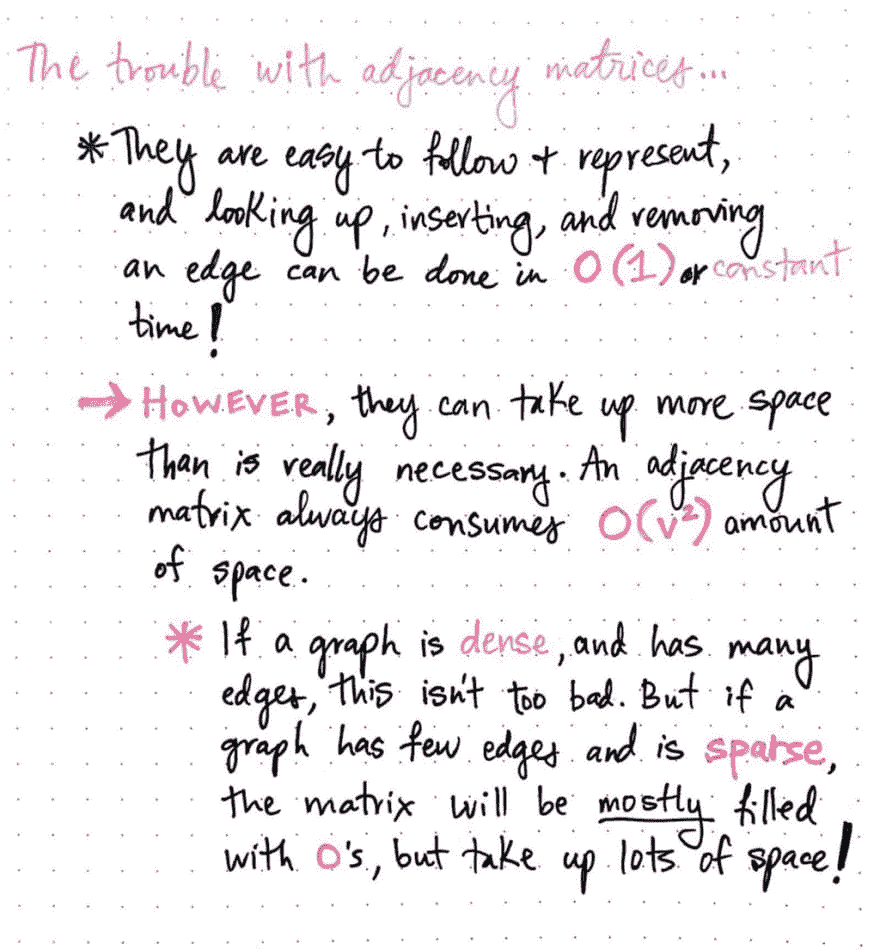](https://res.cloudinary.com/practicaldev/image/fetch/s--T_FVEEBD--/c_limit%2Cf_auto%2Cfl_progressive%2Cq_auto%2Cw_880/https://cdn-images-1.medium.com/max/1024/1%2AawItc9GQX4siLgQAlTQM7A.jpeg) 

<figcaption>邻接矩阵:好的、坏的、难看的</figcaption>

</figure>

邻接矩阵无疑是边列表的一个进步。首先，它们很容易表示；我们的邻接矩阵应该是这样的:

```
[
  [0, 1, 1],
  [1, 0, 1],
  [1, 1, 0]  
] 
```

从图中添加或删除边也很容易使用这种表示，因为查找两个边之间的潜在节点只需要知道这两个节点，为每个节点找到适当的索引，并找到这两个节点之间的交点的值。邻接矩阵上的大部分运算可以在*常数*，或者 ***O(1)*** 时间内完成。

然而，如果我们有一个*稀疏*图，会发生什么？如果我们的图与节点相比只有很少的边，我们的邻接矩阵会是什么样子？嗯，我们甚至不用画出来就可以想象出来:它大部分都是 0 值。但是，由于矩阵的构造方式，我们仍然需要构建整个系统！

邻接矩阵的问题是它们总是需要大量的空间，这取决于我们的图看起来是什么样子，这意味着浪费了大量的空间！因此，尽管邻接矩阵可能很大，但它并不总是一个图的正确表示(特别是如果这个图是稀疏的)。

别担心。谈到图形表示，还有另一种选择——这是所有选项中最有趣的一个！

### 邻接表:混合选择

当边列表和邻接矩阵似乎都让我们失望时，我们该怎么办？为什么，当然是把两者结合在一起！这就是 ***邻接表*** 的确切含义——一个*边列表*和*邻接矩阵*的混合体。邻接表是一个链表的数组，它作为一个图的表示，但是也很容易看出哪些其他顶点与其他*顶点相邻。*

<figure>[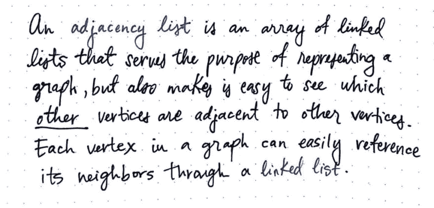](https://res.cloudinary.com/practicaldev/image/fetch/s--y2y7d7X6--/c_limit%2Cf_auto%2Cfl_progressive%2Cq_auto%2Cw_880/https://cdn-images-1.medium.com/max/1024/1%2AXrA9dYM744vLgDzvEohOKQ.jpeg) 

<figcaption>一个邻接表:一个定义</figcaption>

</figure>

邻接表是最流行和最常用的图的表示，因为大多数图的遍历问题(我们将在本系列的后面看到更多)!)要求我们能够很容易地判断出哪些节点是另一个节点的邻居。在大多数图遍历场景中，我们甚至不需要*构建*整个图；我们只需要知道我们可以去哪里——换句话说，节点的邻居是谁。当使用邻接表时，这很容易确定，因为每个节点/顶点都有一个通过*一个相邻链表*指向其所有邻居的引用。

让我们看一个例子，看看这在实践中是什么样子的。

<figure>[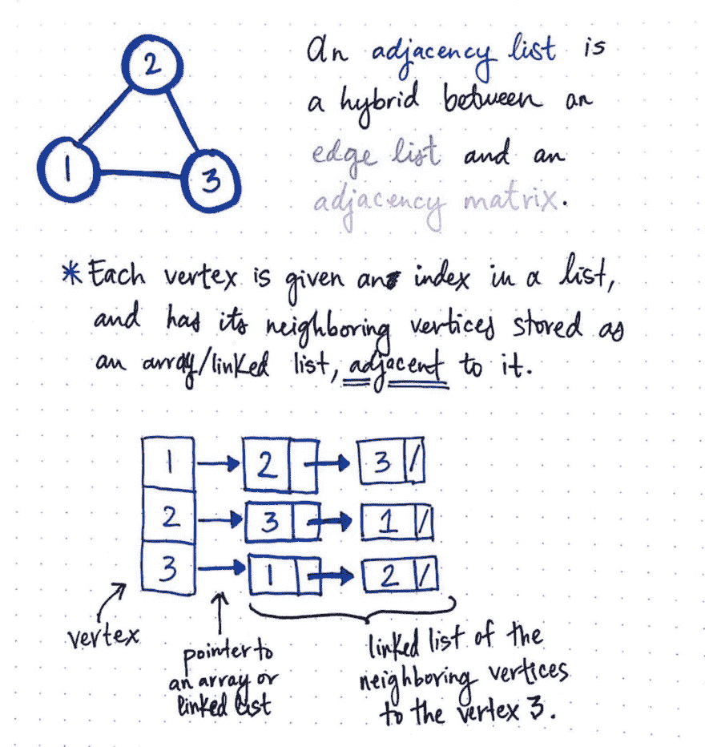](https://res.cloudinary.com/practicaldev/image/fetch/s--axzlWe0F--/c_limit%2Cf_auto%2Cfl_progressive%2Cq_auto%2Cw_880/https://cdn-images-1.medium.com/max/1024/1%2AXPH-Z7fBfBT1mEcN03FOJA.jpeg) 

<figcaption>邻接表是边列表和邻接矩阵</figcaption>

</figure>

的混合体

在此处绘制的插图中，每个顶点在其列表中都有一个索引，并且其所有相邻顶点都存储为一个与之相邻的链表(也可以是一个数组)。例如，列表中的最后一个元素是顶点 3，它有一个指向其邻居的链表的指针。与顶点 3 相邻的链表包含对另外两个顶点的引用:1 和 2，它们是连接到节点 3 的两个节点。因此，只要查找节点 3，我们就可以确定它的邻居是谁，并通过代理，快速识别出它有两条边与之相连。

我们可以看到，由于邻接表的*结构*，确定一个特定顶点的所有邻居非常容易。事实上，检索一个节点的邻居需要花费*常数*、**T5】O(1)**的时间，因为我们真正需要做的只是找到我们正在寻找的节点的索引，并拉出它的相邻顶点列表。

但是，如果我们想要找到一条特定的边，或者检查两个节点之间是否存在边，该怎么办呢？用邻接矩阵很容易做到这一点…但是用邻接表有多容易呢？

<figure>[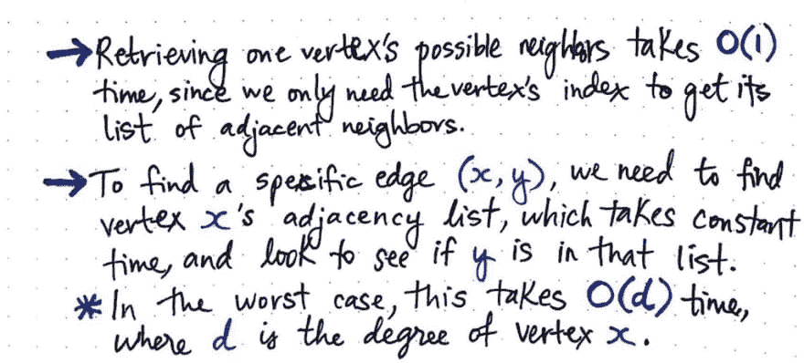](https://res.cloudinary.com/practicaldev/image/fetch/s--A8NiinVy--/c_limit%2Cf_auto%2Cfl_progressive%2Cq_auto%2Cw_880/https://cdn-images-1.medium.com/max/1024/1%2AZSsASthwtg_2iQHsbSkXSw.jpeg) 

<figcaption>后面的实用点使用邻接表</figcaption>

</figure>

好吧，为了找到一条特定的边——例如(x，y)——我们需要在邻接表中找到顶点 x，我们已经知道它需要常数， *O(1)* 时间作为索引来查找。第二步是检查 y 是否在节点 x 的邻接表中。这可以很快完成，特别是如果 y 在列表中是第一个，或者如果它是列表中唯一的*条目。*

但是，最坏的情况是什么呢？嗯，y 可能在链表的*末端* *末端*。或者，它甚至可能不存在！在这种情况下，我们最终会遍历整个链表来检查它，这将花费我们 ***O(d)*** 时间，其中 *d* 是顶点 x 的度数。顶点的 ***度数*** 是它拥有的边的数量，也就是它拥有的相邻节点的数量。

<figure>[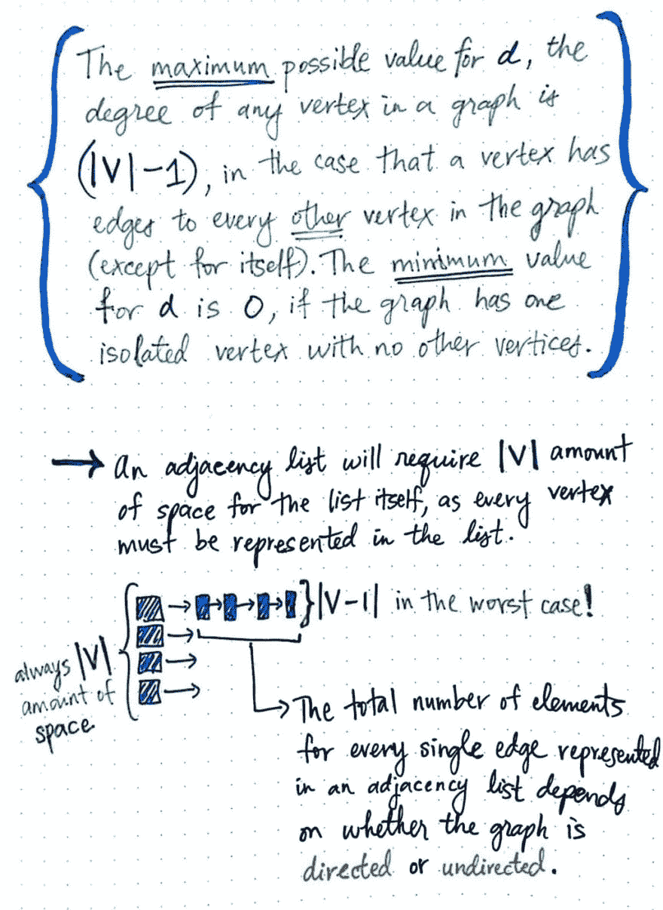](https://res.cloudinary.com/practicaldev/image/fetch/s--ipk0TDZ8--/c_limit%2Cf_auto%2Cfl_progressive%2Cq_auto%2Cw_880/https://cdn-images-1.medium.com/max/1024/1%2A-z8EtJ0BpjWs_ZnToj_wKQ.jpeg) 

<figcaption>邻接表的空间复杂度</figcaption>

</figure>

那么，我们的学位最终可能有多大呢？嗯，一个图中任何顶点的度( *d* )的最大可能值永远不会超过(| V |)，其中 *V* 是图中顶点的总数。如果我们仔细想想，这是有道理的；该节点可能拥有的最大数量的潜在邻居是*图中的每个节点*，除了它自己！ *d* 的最小可能值是 0，因为我们总是有一个只有一个顶点的图，这意味着它有 0 条边和 0 个相邻节点。

好了，现在我们知道了遍历邻接表可能要花多少时间，那么它会占用多少空间呢？

邻接表本身需要 ***|V|*** 的列表空间，因为每个顶点都需要它自己的索引和在列表中的位置。顶点还需要一个指向它的邻居链表/数组的指针，但是指针在内存中占用的空间可以忽略不计。那么链表本身呢？我们已经确定，在最坏的情况下，相邻节点的链表最长可能是 ***(|V|-1)*** 。

但是这里有一个额外的警告:邻接表中每条边的元素总数取决于图是有向的还是无向的。

当我们比较无向图表示和有向图表示时，这开始变得更加明显！所以让我们来看看他们是如何比较的。

<figure>[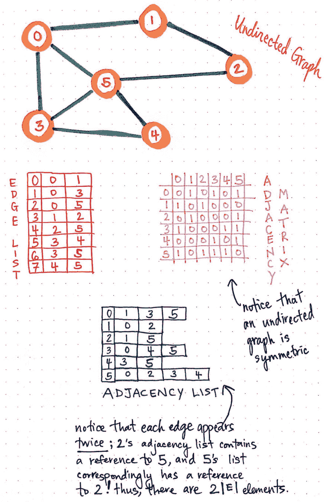](https://res.cloudinary.com/practicaldev/image/fetch/s--RlsnVMNc--/c_limit%2Cf_auto%2Cfl_progressive%2Cq_auto%2Cw_880/https://cdn-images-1.medium.com/max/1024/1%2AOuGzFyh22HxjzqLUyNsHDA.jpeg) 

<figcaption>一个无向图，代表三个方向</figcaption>

</figure>

在这个 ***无向图*** 的例子中，我们有五个节点和八条无向边。

既然我们知道有三种不同的方式来表示这个图表，让我们用这个例子来看看所有这些格式。*边列表*是三个中最简单的:它是八个边的数组，这解释了为什么它的索引范围是从 0 到 7。如果我们查看这个无向图的*邻接矩阵*，我们会注意到它是对称的。考虑无向图中连接到相邻节点的每个单个节点的边都镜像到其相邻节点中；这就是为什么无向图总是有一个对称的邻接矩阵。

现在，回答我们的最后一个问题:我们的*邻接表*的大小是如何根据我们的图的直接性而变化的？如果我们看这个邻接表的例子，我们会注意到每条边出现了两次。例如，顶点 2 的邻接表包含对顶点 5 的引用；类似地，顶点 5 的邻接表包含对顶点 2 的引用。每条边被表示两次，所以我们在邻接表中需要分配空间的元素总数实际上是 ***2(|E|)*** 元素，其中 *E* 是无向图中边的总数。

<figure>[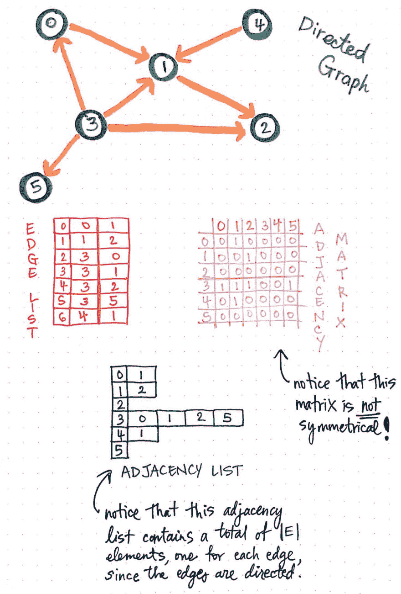](https://res.cloudinary.com/practicaldev/image/fetch/s--efbftJ6---/c_limit%2Cf_auto%2Cfl_progressive%2Cq_auto%2Cw_880/https://cdn-images-1.medium.com/max/1024/1%2AwBqdISORWCjHLqf9qZ_N-A.jpeg) 

<figcaption>一个有向图，代表三个方向</figcaption>

</figure>

既然我们已经看了无向图的所有三种表示，我们可能已经能够猜测一个 ***有向*** 图如何比较。

在这个图中，我们有五个节点和七条边。如我们所料，该图的*边列表*表示有 7 个元素，索引范围从 0 到 6，每个元素对应一条有向边。

我们会注意到，有向图的*邻接矩阵*看起来和我们以前见过的有一点不同！那是因为它的*不是对称的*。如果我们查找(0，1)，我们会看到值是 0，但是如果我们查找(1，0)，我们会看到值是 1！这是因为图中的边是有方向的；不是每个节点都有到相邻节点的双向链接，邻接矩阵的布局很好地显示了这一点。

最后，这个有向图的*邻接表*表示看起来也不同于我们之前在无向图中看到的。我们会注意到这个列表只包含了 ***|E|*** 个元素，其中 *E* 是边的总数。如果我们想得更多一点，这是有道理的；在这个图中，边不是双向的，所以我们不需要为每个节点表示它们两次；相反，它们是节点之间的单向连接，因此我们只需要表示它们一次，无论哪个节点链接到它的邻居。

因此，一个图的表示(以及它占用了多少空间)完全取决于这个图看起来是什么样子，以及我们想要做什么！与计算机科学中的大多数事情一样，对于“我们应该使用哪种表示法？”很字面:*这取决于你想做什么！*

出于本系列和理解图遍历算法和图着色问题的目的，我们最有可能使用邻接表。但是，一如既往，它们只是这项工作的一个工具。然而，最重要的事情——比我们选择使用什么样的表述方式重要得多——是我们*知道*如何将理论转化为实践！

### 资源

理解图论的基础是解开一些最复杂和众所周知的计算机科学问题的基础。但是如果你不能应用这些理论，知道这些理论是没有用的！幸运的是，有很多好的资源展示了如何用编程术语表示一个图。如果你想了解更多，这些是开始的好地方。

1.  [图及其表示法](http://www.geeksforgeeks.org/graph-and-its-representations/)，Geeksforgeeks
2.  [代表图形](https://www.khanacademy.org/computing/computer-science/algorithms/graph-representation/a/representing-graphs)，可汗学院
3.  [表示图形——图形上的算法](https://www.coursera.org/learn/algorithms-on-graphs/lecture/c4W9f/representing-graphs)，Coursera
4.  [图形表示-邻接表](https://www.youtube.com/watch?v=k1wraWzqtvQ&t=2s)，我的描述
5.  [图形可视化](https://visualgo.net/en/graphds)，VisuAlgo

* * *

*本帖最初发表于[medium.com](https://medium.com/basecs/from-theory-to-practice-representing-graphs-cfd782c5be38)T3】**