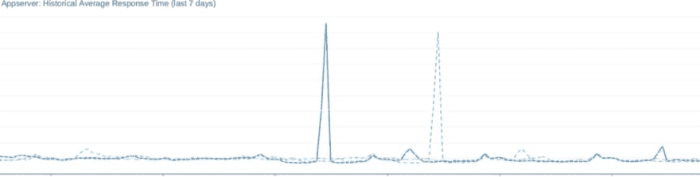

# 为什么使用 REPLACE INTO 可能是个坏主意

> 原文:[https://dev . to/real flow control/why-using-replace-into-may-a-bad-idea-44h 1](https://dev.to/realflowcontrol/why-using-replace-into-might-be-a-bad-idea-44h1)

<figure>[](https://res.cloudinary.com/practicaldev/image/fetch/s--Dm30F6uc--/c_limit%2Cf_auto%2Cfl_progressive%2Cq_auto%2Cw_880/https://cdn-images-1.medium.com/max/1024/1%2AsEoM6RoSC76v2jeFgSoJcw.png) 

<figcaption>TTFB over 所有应用服务器(虚线为前期)</figcaption>

</figure>

在我们的办公室里，我们有一台带性能仪表盘的电视，因此每个人都可以随时看到系统中可能存在的问题。我们在仪表盘上展示了 [TTFB](https://en.wikipedia.org/wiki/Time_To_First_Byte) 以及其他内容。当你正要离开办公室去吃午饭时，这两个尖峰不是你想看到的。

### 发生了什么？

我们开始观察周围的情况，并按顺序发现了以下内容:

*   应用服务器上的工作人员数量急剧上升
*   但是 CPU 消耗没有
*   到数据库的连接数已达到上限
*   但是 CPU 消耗并没有上升(事实上是下降了)
*   最后，我们开始在监控工具中看到以下错误消息:

```
Deadlock found when trying to get lock; try restarting transaction 
```

<svg width="20px" height="20px" viewBox="0 0 24 24" class="highlight-action crayons-icon highlight-action--fullscreen-on"><title>Enter fullscreen mode</title></svg> <svg width="20px" height="20px" viewBox="0 0 24 24" class="highlight-action crayons-icon highlight-action--fullscreen-off"><title>Exit fullscreen mode</title></svg>

*   到那时，系统已经没有反应了
*   我们检查了数据库中的进程列表，看看它在做什么
*   并且在同一个表上发现了大量的`REPLACE INTO`语句和几个大的`DELETE`语句(从分钟开始运行)

### 那张桌子有什么特别之处？

这是一个缓存查找表。每当一个页面被存储在我们的前端缓存中时，我们都会在数据库表中存储一些关于该缓存条目的元信息，主要是对对象数据的依赖。当对象数据发生变化时(例如文章库存)，我们获取依赖于该对象的所有缓存条目，从前端缓存中刷新它们，并通过一个简单的`DELETE`语句从查找表中删除关于它的信息。

该查找表中的新条目不是通过`INSERT`创建的，而是通过`REPLACE INTO`语句创建的。这是因为可能会发生这样的情况:两个请求命中同一个页面，都是缓存未命中，并且都试图在查找表中创建一个条目。简单的解决方案…

### InnoDB 间隙锁

在深入研究我们的死锁问题时，我找到了来自 Percona 的 Jervin Real 的一篇关于 [InnoDB gap lock](https://www.percona.com/blog/2013/12/12/one-more-innodb-gap-lock-to-avoid/) 的文章，他陈述了以下内容:

> 对于一个非`INSERT`写操作，其中`WHERE`子句不匹配任何行，我期望事务不应该持有锁，但是我错了

直到我读到这封信的那一刻，我也是这么想的。但是当你读了 Jervin 的那篇文章和 MySQL bugzilla 中的[老化 bug 报告](https://bugs.mysql.com/bug.php?id=1866)关于 gap lock 的文章，你会明白这完全有道理，并且你开始考虑在这种情况下使用`REPLACE INTO`语句是正确的。

### 我们是如何解决那个问题的？

我们只是用一个`INSERT ON DUPLICATE KEY UPDATE`语句替换了那个`REPLACE INTO`语句，它就是这样做的。如果找到主键，则更新该记录，如果没有找到，则插入该记录。这解决了那种情况下的死锁问题。

你认为`REPLACE INTO`就是这样工作的吗？继续读下去。

### 与`REPLACE INTO`的鲜为人知的问题

你知道`REPLACE INTO`到底是做什么的吗？我们来看看:

```
CREATE TABLE a (
 id INT(1) UNSIGNED NOT NULL PRIMARY KEY,
 data VARCHAR(255) NULL
);

CREATE TABLE b (
 id INT(1) UNSIGNED NOT NULL PRIMARY KEY,
 fk INT(1) UNSIGNED NOT NULL,
 data VARCHAR(255) NULL,
 FOREIGN KEY (fk)
 REFERENCES a(id)
 ON DELETE CASCADE
);

INSERT INTO a VALUES (1, 'test');
INSERT INTO b VALUES (1, 1, 'test');

REPLACE INTO a VALUES (1, 'data'); 
```

<svg width="20px" height="20px" viewBox="0 0 24 24" class="highlight-action crayons-icon highlight-action--fullscreen-on"><title>Enter fullscreen mode</title></svg> <svg width="20px" height="20px" viewBox="0 0 24 24" class="highlight-action crayons-icon highlight-action--fullscreen-off"><title>Exit fullscreen mode</title></svg>

你认为`SELECT * FROM b;`的结果会是什么样的？

没错，桌子是空的。这是因为`REPLACE INTO`首先删除找到的记录(这触发了删除级联),然后创建一个新记录。根据具体情况，这可能是预期的行为，但就我的理解，这通常不是预期的行为，至少这对我来说是新的。