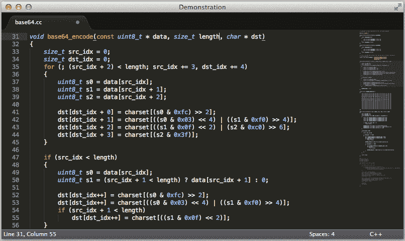
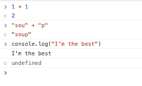
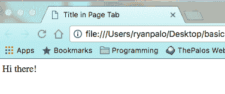
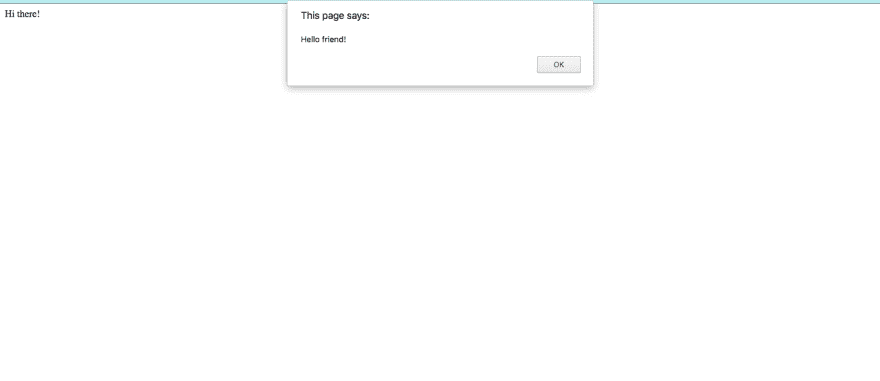
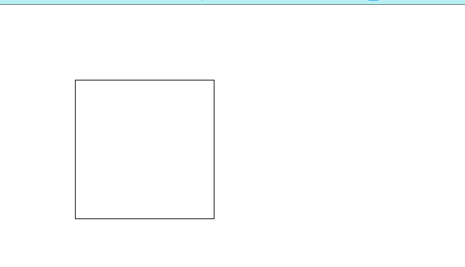
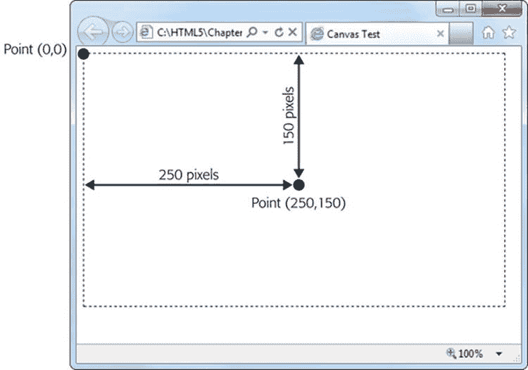
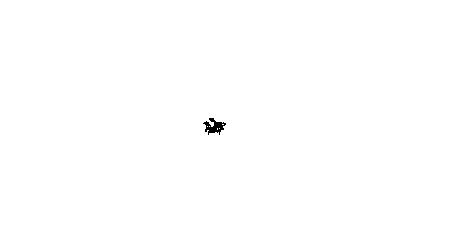

# 学习编码，第 1 部分——随机漫步

> 原文：<https://dev.to/rpalo/learn-to-code-part-1---random-walker>

终于发生了。我妻子让我教她如何编码！或者，至少，让我试演“教她编程的家伙”这个角色。我决定写下我的第一课，以确保一切顺利。公平的警告，这些可能会比我平时的帖子长。我们有很多事要做！如果这一个进展顺利，将会有更多。所以，希望这篇文章是我原创的标题为*学习编码*的系列文章之一。我将从丹·希夫曼的[编码训练](http://thecodingtrain.com/)以及他的书[代码的本质](http://natureofcode.com/)中汲取很多灵感。我强烈建议你尽快检查这两样东西。现在，祝我好运吧！

# 第一课:漫步者

第一课将包括建立一个项目，快速浏览 HTML 和 JS，以及它们是如何结合在一起的，建立“开发环境”(文本编辑器和浏览器，没有包)，并进入其中。最后，我们将建立一个二维的随机漫步机。

## 新手须知

如果你刚刚开始学习编程，让我告诉你一些事情。编程很难。所以请不要感到气馁或愚蠢。本教程移动*真的*快，涵盖*很多*，所以第一遍感觉不知所措或不理解一切是**完全正常**。我在这里的目标是带你体验一下程序员无中生有地创造出动态的、令人敬畏的东西的那种兴奋感。所以，我要问的是。请，即使你卡住了或不明白发生了什么，只是通过和打出代码的例子。到达终点，并建立我们的随机漫步。一旦你让那个小家伙在你的屏幕上游荡，问我你能想到的每一个问题，直到事情变得更有意义。你可以给我发电子邮件或推特信息。链接在我的简历底部。我会和你一起完成作业(因为作业真的有助于巩固一些东西)。只要把头低下，挺过去，不要放弃，不要觉得求助很怪异。如果有些事情没有意义，那不是因为你是个笨蛋，而是因为我写得不够好。现在。这次是真的。让我们开始吧。

## 第一步:设置

我们需要一些东西来开始:一个浏览器(我自己喜欢 Chrome)和一个文本编辑器(我们将使用 [Sublime Text](https://www.sublimetext.com/) 来开始)。

[T2】](https://res.cloudinary.com/practicaldev/image/fetch/s--QEe2s_vx--/c_limit%2Cf_auto%2Cfl_progressive%2Cq_auto%2Cw_880/https://assertnotmagic.com/img/sublime.png)

去把那些安装好。

开始前还有一件事。在 Chrome 中，你可以使用这个叫做**控制台**的东西来测试我们在添加到项目中之前检查的任何代码。打开控制台的方法有很多，但最快的是 Mac 上的`command + option + j`和 Windows/Linux 上的`control + shift + j`。你也可以通过右击并选择`inspect`，或者从 Chrome 下拉菜单中打开开发者工具来获得它。

[T2】](https://res.cloudinary.com/practicaldev/image/fetch/s--kaXqRSwB--/c_limit%2Cf_auto%2Cfl_progressive%2Cq_auto%2Cw_880/https://assertnotmagic.com/img/console.png)

如果你被困住了，这应该会派上用场。

## 第二步:HTML/JS 飞越

我们来简单说一下 HTML。我们不需要马上知道太多。就一点点。首先要知道的是，所有的网站都是由仅仅是文本的文件组成的。一般来说，网页的布局是在一个以`.html`结尾的文本文件中定义的，该文件包含一种特殊的语言和格式。HTML 是超文本标记语言的缩写，但它真正的意思是，它是以一种浏览器可以读取和解析它并将其转换为漂亮的呈现格式的方式编写的文本。我现在要说更多的细节，但是你不要试图去记忆 HTML，这一点非常重要。有太多的小规则和选项需要记住，试图一口气记住所有东西肯定会让任何人不知所措。我建议只挑选概念上的金块，让其余的东西冲刷你，在你前进的过程中有机地挑选东西。随着你越来越多地使用它，你会发现自己记得更多，而不得不谷歌更少。莱格。

### 超级基础知识

HTML 是由叫做**元素**的构建块组成的，看起来像这样:

```
<p>
  Hi there!  'p' stands for Paragraph!
</p> 
```

每个**元素**由它的**标签**定义，标签是尖括号(< >)中的东西。一些**元素**有一个开始和结束**标签**，如上图所示。这是为了让这些元素可以环绕在其他元素的外面，创建这种嵌套层次结构，这在以后会很方便。有些元素是“自闭”的，不需要第二个。一个例子是`<hr>`元素，它在页面上画了一条“水平线”。因为很难在一行中放入任何东西，所以把它作为一个自结束标记是有意义的。

### 结构标签

有一些标签构成了每个页面的基础。每个页面至少应该有这个:

```
<!doctype html>
<html>
  <head>
    Title in Page Tab
    <!-- This is how we comment in HTML.  Nobody sees this but us -->
  </head>
  <body>
    Hi there!
  </body>
</html> 
```

1.  这告诉浏览器它正在查看一个 HTML 文件，以及我们正在使用的 HTML 版本，基于格式。这种简化的格式意味着我们使用的是最新版本:HTML5。
2.  这些标签包含了我们剩下的所有 html。现在，你甚至可以把这些都关了，浏览器足够聪明，可以理解你的意思，但是无论如何，最好确定你有这个。
3.  这一部分不会显示在页面上。它是一个包含许多设置和信息的标题，浏览器、搜索引擎、设备和其他互联网设备需要这些设置和信息来与您的网页进行交互。一旦我们到达那里，我们将把我们的链接放到**样式表**那里，使我们的页面看起来漂亮。
4.  这是你页面的核心部分。正文里的所有东西都会存在你的网页上。如果您将上面的代码片段保存为`basic.html`并双击打开它，您会看到:

[T2】](https://res.cloudinary.com/practicaldev/image/fetch/s--xFLfgMYj--/c_limit%2Cf_auto%2Cfl_progressive%2Cq_auto%2Cw_880/https://assertnotmagic.com/img/basic-html.png)

另一件需要注意的事情是我们如何将`head`和`body`标记嵌套在`html`标记中，我们甚至将`title`标记嵌套在头部！每个网页都是像这样的树状层次结构，有时会非常非常嵌套。还要注意的是，将标签缩进到同一行(每个嵌套缩进 2 或 4 个空格)被认为是最佳实践，以便于阅读。

### 在脚本中添加

现在，我们将添加脚本，允许我们使用更深层次的编程概念，如**变量**、**循环**，等等！有一个特殊的标签叫做`script`标签，它加载诸如 **JavaScript** 文件之类的文件。 **JavaScript** 是当前为你的网页添加代码功能的互联网标准。

> 在我们继续之前，我想做一个记录。这是针对任何有丰富编程经验的人阅读这篇文章。在接下来的几个例子中，我们将涵盖一些不完全是“最佳实践”或“行业标准”的代码。这不是我想做的。我只是想得到一些易于理解和工作的代码。例如，AirBnB 的 JavaScript 风格指南推荐这样定义函数:`var foo = function bar() {};`。他们为你为什么应该这样做提供了很好的理由。很有道理。酪在它看起来不像天书之前，你必须有足够的背景知识。对于一个刚刚起步的人来说，按照我们下面的方法来做更有意义。所以，所有想改正错误的自作聪明的人:现在先别管它。以后会有时间的。

JavaScript 是这样工作的。假设您的当前目录中有上面的`basic.html`文件。谁知道呢，也许你真的有！接下来，在同一个目录中创建一个名为`annoying.js`的文件。

```
// This is how we comment in JavaScript
// Any line that starts with two forward slashes
// doesn't affect the code.  It's for humans!
// Why are comments different in every language?  Who knows.

var message = "Hello friend!";
alert(message); 
```

一定不要忘记每行末尾的分号。JavaScript 慢慢地(希望)不再需要分号，但是现在，我们还在使用分号。我相信我们以后会更多地讨论 JavaScript 的历史和进步。现在，让我们给我们的`basic.html`添加一行。

```
<!doctype html>
<html>
  <head>
    Title in Page Tab
    <!-- This is how we comment in HTML.  Nobody sees this but us -->
  </head>
  <body>
    Hi there!

    <script src="annoying.js"></script>
  </body>
</html> 
```

保存文件，然后在浏览器中重新打开它，或者，如果已经打开，单击刷新。

[T2】](https://res.cloudinary.com/practicaldev/image/fetch/s--3TEvUpS8--/c_limit%2Cf_auto%2Cfl_progressive%2Cq_auto%2Cw_880/https://assertnotmagic.com/img/alert.png)

看看你！你现在已经了解了那些讨厌的、一无是处的垃圾网站创建者所知道的一切。`alert("Your computer may have a virus!");`哈。哈。

最后解释一下，`script`标签的`src=`部分告诉浏览器在哪里寻找要加载的文件。如果你愿意，你可以省略掉那个`src=`部分，只把代码放在`script`标签之间。你放在这些标签之间的任何东西都被认为是 JavaScript。我将向你们展示一个很酷的例子。如果还没有完全理解，也不要担心。

```
<!doctype html>
<html>
  <head>
    Title in Page Tab
    <!-- This is how we comment.  Nobody sees this -->
  </head>
  <body>
    Hi there!

    <script src="annoying.js"></script>
    <script>
      // JavaScript *inside* HTML!
      var bt = document.createElement('p');
      bt.innerHTML = "bottom text";
      document.body.appendChild(bt);
    </script>
  </body>
</html> 
```

在简短的解释中，我创建了一个新的“段落”元素，就像我们上面看到的那样。我将那个`<p>`元素中的文本设置为`"bottom text"`，然后将它附加到`body`标签的底部，在浏览器读取后修改原始代码。如果你右击页面并点击`inspect`，你应该会看到一些 HTML，但是在底部有一个新的`<p>`元素，这是我们的`basic.html`文件中没有的！

[T2】](https://res.cloudinary.com/practicaldev/image/fetch/s--LPJt83w0--/c_limit%2Cf_auto%2Cfl_progressive%2Cq_auto%2Cw_880/https://assertnotmagic.com/img/modified-html.png)

酷吧？好吧，我想我们已经知道了前进所需的一切。

## 第三步:介绍 P5

使用 JavaScript(以及几乎任何其他编程语言)，您可以加载并构建在其他人的工作之上。这太棒了！这很好，因为否则的话，每个想做东西的人都必须写所有的支持/实用程序/框架代码。将会有十亿人编写帮助大写单词和计算平方根的库。加载外部库的一种方法是在自己的代码的`script`标签之前包含相关的`script`标签。因为 HTML 文件是从上到下被读取和处理的，所以最先出现的`script`标签首先被加载，并可供你的代码引用。

还有一点需要注意。之前，我们展示了您可以在`script`标签之间包含代码，就像这样:`<script>alert("Woohoo!");</script>`。我们还展示了您可以像这样加载一个本地文件:`<script src="path/to/the/file.js"></script>`。我没有包括的是`src`也可以是一个网站的路径，所以你可以从网上加载文件！这是加载外部库的一种简单方法，无需下载大量文件或跟踪它们。

Enter: P5.js. P5 是一个动画库，有一个非常简单的界面，它基于一个叫做 [Processing](https://processing.org/) 的早期项目。你可以去 [P5.js 主页](https://p5js.org/)获取更多信息、例子和文档。稍后我们将对此做更多的介绍。我将通过第二个例子向您展示基础知识。创建一个名为`example2`的新文件夹，并在其中创建一个名为`index.html`的文件。(稍后我会详细解释为什么称它为`index`，因为这很重要)。还要创建一个名为`sketch.js`的文件。这是你的`index.html`。

```
<!doctype html>
<html lang="en">
  <head>
    My First P5.js Sketch!
  </head>
  <body>

    <!-- This is the external P5 library we're loading  -->
    <script src="https://cdnjs.cloudflare.com/ajax/libs/p5.js/0.5.14/p5.js"></script>
    <!-- Here's the link to our script -->
    <script src="sketch.js"></script>
  </body>
</html> 
```

就是这样！这实际上将是几乎所有项目的起点，所以请随意将该文件保存在某个地方，以便以后作为起点进行复制。让我们看看你的`sketch.js`档案。

```
function setup() {
  createCanvas(600, 400);
}

function draw() {
  background(255);
  stroke(0);
  fill(255);
  rect(100, 100, 200, 200);
} 
```

那里有许多我们应该谈论的新事物。

### 功能

在编程中，计算机从上到下逐行读取代码。(有一些事情是例外，但现在已经不重要了。)理论上，你可以一个接一个地写每条指令，把所有的东西都打出来。然而，**函数**是我们可以重用的代码块。我们会边走边谈这样做的好处。你可以把微波预设和数学函数结合起来。

### 微波预置

当你按下微波炉上的 Quick Minute 时，它会打开灯，启动转盘，激活微波炉，将计时器设置为 1:00，并开始倒计时。一旦到了 0:00，它就关掉微波炉，关灯，停止转盘，并发出嘟嘟声。如果是那种可怕的微波炉，它每隔 15 秒就会发出哔哔声，直到有人开门。你能想象每一步都要按一个或多个按钮吗？简单地按下 Quick Minute 不是更好吗？如果制造商想要添加一个步骤，在微波炉中启动迪斯科球，他们可以只将该行添加到快速分钟功能中，而不是让您记住在每次按下按钮序列时添加该行。在 JavaScript 中它可能看起来像这样。

```
function quickMinute() {
  lightOn();
  turnTableOn();
  microwaveOn();
  cook(1.0);
  microwaveOff();
  turnTableOff();
  lightOff();
  beep();
  // beepUntilOpened();  Only if you're unlucky...
} 
```

JavaScript 中的函数由单词`function`、名称(在本例中为:`quickMinute`)、括号中的任何函数输入(在本例中为:没有输入)以及{}括号中的函数代码来定义。然后，只要输入函数名和一对括号()，就可以随时调用这个函数，就像这样:`quickMinute()`。在 JavaScript 中，添加这些括号就像一个触发器，意味着“请现在调用这个函数！”

### 数学函数

函数可以接受输入，也可以产生输出！记得括号吗？你可以给你期望的东西命名。可以用单词`return`输出一个值。手表:

```
function multiply(a, b) {
  return a * b;
} 
```

然后，如果您**用输入调用**函数(调用意味着运行)，您将得到预期的输出。

```
multiply(3, 4);
// => results in 12! 
```

但是要小心！用一种有意义的方式给事物命名取决于你。看看这个误导人的函数:

```
function misleadingMultiply(a, b) {
  return "Butt";
}
misleadingMultiply(3, 4);
// => 'Butt' 
```

这是一个优秀程序员的责任之一！好吧！回到`sketch.js`代码。

### 设置和绘制

P5.js 希望您定义两个主要函数。`setup`由 P5 在开始时运行一次。这是个安置东西的好地方。`draw`就是反复运行，一遍又一遍，之后。目前我们没有使用它，但是我们将在本课的最后一个项目中使用它。让我们看看上面定义的`setup`和`draw`。

```
function setup() {
  createCanvas(600, 400);
} 
```

P5 动画(也称为**草图**)出现在画布上(画布是一种特殊的 HTML 元素，您可以在上面绘制形状)。最简单的方法是通过 P5 提供的函数`createCanvas`。你只需要告诉它一个宽度和一个高度(以像素为单位)。在我们的例子中，我们把它做成 600 宽，400 高。这就是我们为此所做的全部设置！

接下来是`draw`。

```
function draw() {
  background(255);
  stroke(0);
  fill(255);
  rect(100, 100, 200, 200);
} 
```

每一次循环，我们都用`background`函数重画背景。有几种方法可以调用这个函数，但是这种方法是用一个 0 到 255 之间的数字(我稍后会解释这个数字的意义)。0 是全黑，255 是全白。这意味着我们正在绘制一个白色背景。接下来，我们为形状的边缘设置笔画或钢笔颜色。你可以看到我们把它设置为黑色。之后，我们将形状的填充颜色设置为白色。最后，我们实际上画了一个矩形。画矩形的时候用`(x-position, y-position, width, height)`调用。我怎么知道括号里需要什么数字？我有魔力，什么都知道。还有，在他们的网站上。查看他们关于`rect`功能的[文档。任何时候你有问题，从文档开始。那里有很多好东西。事实上，这四个都是 P5 提供的功能:](https://p5js.org/reference/#/p5/rect)[背景](https://p5js.org/reference/#/p5/background)、[笔画](https://p5js.org/reference/#/p5/stroke)和[填充](https://p5js.org/reference/#/p5/fill)也都有自己的文档！

好吧！差不多够了！保存文件并在浏览器中打开`index.html`！

[T2】](https://res.cloudinary.com/practicaldev/image/fetch/s--IpPWmlPN--/c_limit%2Cf_auto%2Cfl_progressive%2Cq_auto%2Cw_880/https://assertnotmagic.com/img/a-rectangle.png)

**TADA！**你不激动吗？！在所有这些之后，我们做了…一个长方形。准确地说是正方形。我听到你说:booooooo。好吧自作聪明的家伙。让我们进入这节课的主要项目:随机漫步。

## 项目:乱行者

如果你已经和我呆在一起很久了，在这一点上休息一下，吃点点心什么的可能是个好主意。在这个项目中，我们会学到很多东西。以下是你会遇到的第一次:

*   变量
*   真假
*   比较数字
*   做数学
*   分支(即 if 语句:if `something is true`，做一件事。否则做另一个)
*   像素和事物颠倒的原因

就是这样！敬请关注。要进行设置，创建一个名为`project1`的文件夹，在里面复制你的基线`index.html`并创建一个名为`sketch.js`的新文件。我将把整个项目的代码放在前面，这样你就可以看到我们要去哪里，然后我将一个接一个地解释各个部分，就像我在上一节所做的那样。这是你的`sketch.js`代码。

```
var x, y, rand;

function setup() {
  createCanvas(600, 400);
  x = width/2;
  y = height/2;
  stroke(0);
}

function draw() {
  rand = floor(random(4));
  if (rand === 0) {
    x++;
  } else if (rand === 1) {
    x--;
  } else if (rand === 2) {
    y++;
  } else {
    y--;
  }

  point(x, y);
} 
```

好吧。这里有很多。如果你是一个超级天才，你可以感觉到发生了什么，但我会为像我一样的普通人解释。

### 变量

```
var x, y, rand; 
```

我们在前面声明了变量。很多时候，这不是最佳实践，我们应该尽可能避免。不过，对于我们最初的草图来说，可能没问题。变量就像一个地址或邮箱槽，可以保存一个值。您使用单词`var`告诉 JavaScript 您想要创建新的。如果你和我一样，你会一直忘记写`var`。如果你只写了`var x`，而没有写`var x = 3`之类的，那么`x`的值(至少在你给它赋值之前是这样的，也就是在那个叫做`x`的特殊邮箱里放一个值)就是 JavaScript 概念`undefined`。稍后会详细介绍。希望现在你能看到我们一开始就说，“嘿！我将有三个我关心的值，并希望稍后访问:x，y 和 rand。”不要忘记行尾的分号！

### 设置功能

```
function setup() {
  createCanvas(600, 400);
  x = width/2;
  y = height/2;
  stroke(0);
} 
```

这里实际上没有多少新东西。希望你能从上一个例子中认出`stroke`和`createCanvas`。这里只有两件新东西:

一个是我们最终使用等号(=)将第一个值赋给了`x`和`y`。你可以把这个等号想象成一个指向左边的箭头，意思是，“把你在等号右边得到的任何值放进名为`x`的邮箱里。”P5 为我们提供了一些方便的变量`width`和`height`，它们包含了我们正在工作的画布的宽度和高度。因为我们知道我们创建的是 600 像素宽，400 像素高，希望你能看到这个函数运行后，`x`的值是 300，`y`的值是 200。我想从画布的正中央开始。

### 绘制功能

```
function draw() {
  rand = floor(random(4));
  if (rand === 0) {
    x++;
  } else if (rand === 1) {
    x--;
  } else if (rand === 2) {
    y++;
  } else {
    y--;
  }

  point(x, y);
} 
```

这个函数中有很多新东西。你可以看到我们最终给`rand`赋值，但是它是什么呢？P5 为我们提供了两个有用的函数: [`floor`](https://p5js.org/reference/#/p5/floor) ， [`random`](https://p5js.org/reference/#/p5/random) 。我们使用`random`的方式是，它接受一个可选的最大值，并返回一个介于零和该最大值之间的随机值，不包含(即[0，max，即介于 0 和 3.99999 之间)。`floor`接受任意一个数字并返回四舍五入到最接近的整数(例如 3.4 变成 3，2.9 变成 2)。总之，你是在给`rand`分配一个(0，1，2，3)的随机选择。

#### 比较事物

```
(rand === 0) 
```

这个函数中有很大一部分，括号里有 4 个这样的方程。在 JavaScript 中，三重等于比较两件事。如果左边的东西和右边的一样，那么它的值就是 JavaScript 值`true`。否则它的计算结果为假。

#### 用 IF、ELSE IF、ELSE 语句分支

```
 if (rand === 0) {
    x++;
  } else if (rand === 1) {
    x--;
  } else if (rand === 2) {
    y++;
  } else {
    y--;
  } 
```

这就是所谓的 **if 语句**。它的工作方式是从顶端开始。**如果**括号中的第一个测试结果为`true`，那么括号{}中的代码将运行，其他代码都不会运行。否则，如果，代码移动到下一个**。如果没有一个 **if** 语句最终为真，并且存在一个 **else** 语句，则运行。你可以将你的**if**与**else if**和**else**任意搭配:**

如果语句:
可以省略 **else**

```
if (name === "Jim") {
  alert("Hi Jim!");
} else {
  alert("Hi stranger!");
} 
```

你甚至可以省略 **else** 语句:

```
if (age > 65) {
  alert("Here's your senior discount!");
} else if (age < 12) {
  alert("Here's your child's discount!");
} 
```

如果没有 else，例如，`age`是 29，那么在上面的代码块中什么也不会发生。

所以，让我们回到`draw`函数中的代码，我们正在做的是检查`rand`的每个可能值。如果`rand`是 0，这样做。如果`rand`为 1，这样做。如果`rand`是 2，这样做。否则(我们知道`rand`是 3)，做这个另外的事情。理论上，只运行一个分支，这取决于`rand`的值。

#### 就地修改变量

```
x++; 
```

这是一条捷径。有几种方法可以修改 JavaScript 中的变量。你可以用你以前见过的长格式的方法来做:

```
x = 3 * 7; 
```

你甚至可以在等式的两边都使用这个变量！

```
x = 12;
x = x + 3;
// The right side evaluates to 15, so then
// x gets set to 15 
```

上面的方法有一个简写:

```
x = 12;
x += 3;
// += is short for add the following
// to the current value of x
// Thus, x === 15 now. 
```

如果你想给变量加 1(即增加它)，还有一种更简单的方法。就是上面看到的:

```
x = 12;
x++;
// x === 13 
```

#### 绘制点

最后，P5 提供了一个名为 [`point`](https://p5js.org/reference/#/p5/point) 的函数，在提供的`(x, y)`坐标上放置一个 1px 的点。说到这里:

#### 画布 X 和 Y

在浏览器中，从顶部和左侧参照所有点。事实上，x 和 y 分别是 Top 和 Left 的别名。Top 是某个东西距离窗口顶部的像素数，left 是距离左侧的像素数。这意味着，X 是右边的 x+,但是 Y 是你假设的方向的反方向。Y+向下，意味着 y = 10 几乎在屏幕的顶部，y = 100 更靠近底部。

[T2】](https://res.cloudinary.com/practicaldev/image/fetch/s--QD5A_1vl--/c_limit%2Cf_auto%2Cfl_progressive%2Cq_auto%2Cw_880/https://assertnotmagic.com/img/coordinate-system.jpg)

因此，在上面的代码中，如果`rand`是 0，我们给`x`加 1，导致`point`右移一位。如果`rand`为 1，我们从`x`中减去 1，导致`point`左移一位。如果`rand`是 2，我们给`y`加 1，从而使`point`下移一位。如果`rand`是 3，我们从`y`中减去 1，导致`point`上移一位。总的来说，这段代码使指针随机选择一个方向，并朝那个方向走一步。

### 包装完毕

```
var x, y, rand;

function setup() {
  createCanvas(600, 400);
  x = width/2;
  y = height/2;
  stroke(0);
}

function draw() {
  rand = floor(random(4));
  if (rand === 0) {
    x++;
  } else if (rand === 1) {
    x--;
  } else if (rand === 2) {
    y++;
  } else {
    y--;
  }

  point(x, y);
} 
```

综上所述，记住`setup`运行一次，`draw`运行一次又一次，我们的代码从屏幕中间的`point`开始。每次我们运行`draw`(简称为一个**动画帧**或**帧**)时，`point`随机向四个基本方向之一移动，我们重新绘制该点。保存您的代码并在浏览器中打开`index.html`！如果一切正常，你应该看到我们的小伙伴在画布中间绕圈。

[T2】](https://res.cloudinary.com/practicaldev/image/fetch/s--FLypQLz5--/c_limit%2Cf_auto%2Cfl_progressive%2Cq_66%2Cw_880/https://assertnotmagic.com/img/walker.gif)

有成就感了吗？？你应该。你做得太棒了！(牛逼？)下面是一些作业:

#### 作业

1.  试着让我们的助行器更活跃:让他的步子更大。
2.  让我们的助行器偏向右边。这样，他向上、向下或向左的可能性相等，但向右的可能性稍大一些。(提示:试着用< and >代替===)。
3.  改变我们的步行者的颜色！现在，每一帧改变我们的步行者的颜色。
4.  让我们的随机漫步的步长随机变化一些数量。
5.  这样，如果我们的步行者到达画布的边缘，他/她就会被传送到画布的另一边。(提示:使用非常小的画布以节省测试时间)。
6.  目前，步行者的脚步被保留了下来。这是因为我们不是每次都重新绘制背景。让你看不到步行者之前的脚步。现在让你看不到台阶，而步行者在狂欢中走来走去(也就是随机的背景颜色！).
7.  使用 P5 文档:不画`point`，而是画一个圆。用圆圈的填充颜色做一些有创意的事情。

如果你遇到困难或有任何问题，请告诉我！让我知道我是否解释得混乱或者可以做得更好。

* * *

*原贴于[assert _ 非魔？](https://assertnotmagic.com)T3】*