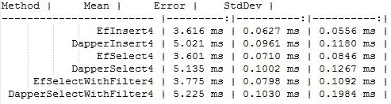

# 实体框架 Core 2.0 更快吗？

> 原文:[https://dev.to/rickab10/is-entity-framework-core-20-faster](https://dev.to/rickab10/is-entity-framework-core-20-faster)

。NET Core 2.0 现已投入生产，相对于。NET Core 1.X .一个这样的改进就是实体框架核心。想到这一点，我决心做一个基准来看看它的表现。

那些不知道衣冠楚楚，我建议看到这个项目。它是一个小 ORM，它不做实体框架和 NHibernate 做的所有事情，但是它的查询非常快。在过去的几年里，经常看到一个项目用 ORM 和 Dapper 来优化查询。

回到 benchmark，我做了一些愚蠢的事情，我创建了产品和类别实体，因为一个产品有一个类别。

一个观察，我不是基准或测量代码性能的专家，但我喜欢这个包来看看性能。这就是为什么我使用一个叫做 benchmarkdotnet 的软件包

这个想法很简单，比较插入、查询和带过滤器的查询。当然，我将实体框架核心 2.0 与 Dapper 进行比较。

下面你会看到完成的结果。

[T2】](https://res.cloudinary.com/practicaldev/image/fetch/s--iZiz8UUg--/c_limit%2Cf_auto%2Cfl_progressive%2Cq_auto%2Cw_880/http://stephanybatista.com/wp-content/uploads/2017/08/benchmark.jpg)

每种方法的解释，

*   EfInsert e DapperInsert:EF 用 e finsert，Dapper 用 Dapper。这些方法插入数据。
*   EfSelect e DapperSelect:EF 使用 EF select，Dapper 使用 Dapper select。该方法查询数据库中的所有实体。
*   EfSeletWithFilter 和 DapperSelectWithFilter:EfSelectWithFilter 由 EF 使用，Dapper 使用 DapperSelectWithFilter。这些方法在数据库中查询类别名称为“游戏”的所有产品。

请注意，在所有演示中，实体框架核心 2.0 胜出。这很好，表明微软团队真的实现了关于带来高性能. Net 核心的承诺。

对于是否使用 Entity Framework Core 2.0 仍有疑问的人，我认为现在它是一个强有力的选择，首先是性能。我创建了一个接近实体框架核心 2.0 的课程，遵循[链接](https://www.udemy.com/aspnet-core-20-learn-concepts-and-creating-an-web-app)。

如果您想分析我的基准并给我反馈，请点击[链接](https://github.com/StephanyBatista/benchmarkef)。

好了，伙计们，我希望能帮到你们，祝你们这周愉快。