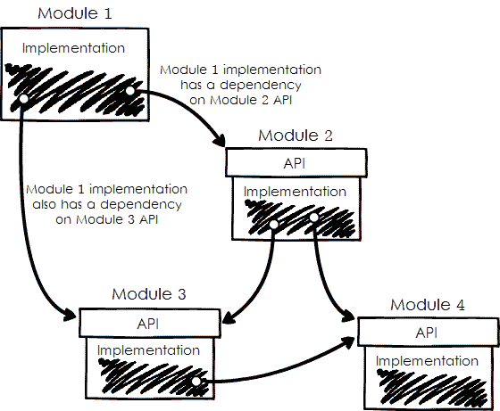
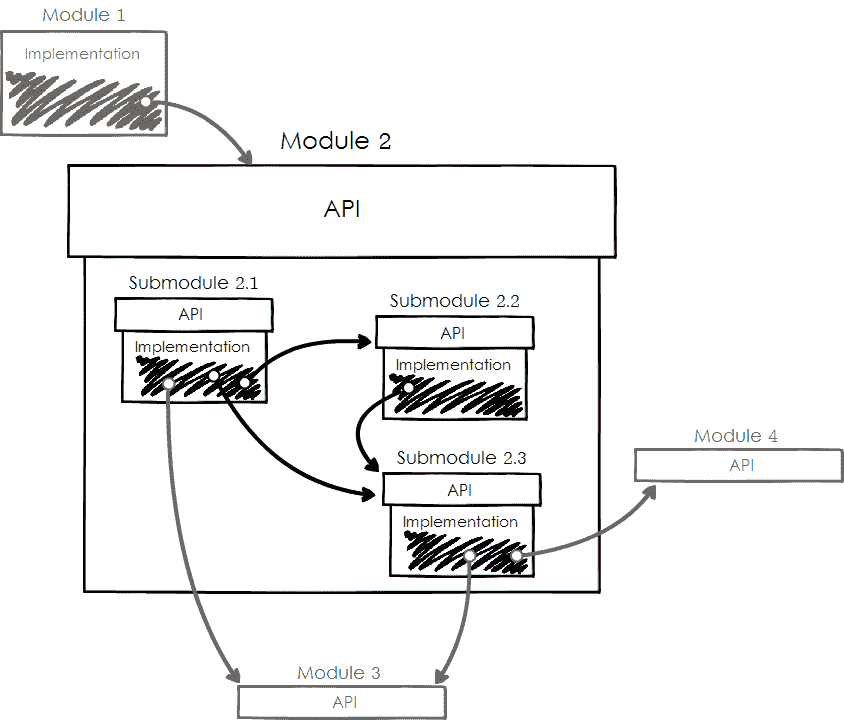
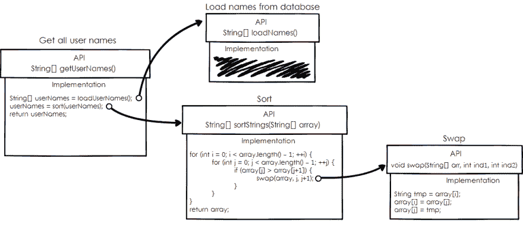
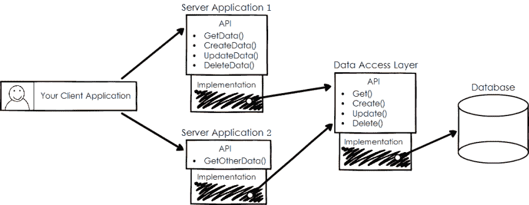

# 模块化和依赖性管理:提高代码质量的三个步骤

> 原文:[https://dev . to/ice _ lenor/modulation-and-dependency-management-three-steps-to-better-code](https://dev.to/ice_lenor/modularization-and-dependency-management-three-steps-to-better-code)

如果你问我，写好代码最重要的一件事是什么，我会回答:“模块化和依赖管理”。

事实上，这是两件事。很抱歉。但是它们是同一个硬币的两面，如果你想让你的代码变得漂亮和干净，就不能缺一不可。

长话短说:模块化代码，让它的每一部分都只服务于一个特定的目的。

这是代码最重要的品质之一:适当的模块化和模块或块之间适当的依赖关系。

# 优秀代码的终极配方

这是一个响亮的标题，但当你想到它时，这些步骤实际上非常简单，甚至可能看起来很明显。

开始了。

* * *

应用程序的任何模块，无论大小，都应该遵循这三个简单的规则:

1.  它应该有一个具体的责任。
2.  如果其他块要使用它，它们必须使用它的 API。他们不能接触或了解这个街区的内部情况。
3.  如果它使用其他块，它应该使用它们的 API——它不能使用或依赖它们的任何内部组件。

* * *

# 什么是依赖和 API？

API 是给定服务的接口或协议，它允许您使用该服务。

该服务的实现细节就是它内部让它完成工作的一切。齿轮和轮子。

例如，如果我们谈论一个大型 web 应用程序，服务 a 可以调用服务 B 的 REST API。在这种情况下，服务 B 的 API 就是 REST API——服务 B 提供的所有这些漂亮的 POST、PUT、GET 和 DELETE 方法，如其文档中所述。(你有文档吧？)

当然，它也可以是 SOAP API，或者任何其他种类的 API。关键是要有一堆定义好的端点，你可以调用它们，这样就可以要求服务做一些事情。

在任何情况下，我们都可以说服务 A *依赖于，*或*依赖于*服务 B。可能这被称为“依赖”,因为没有 B 的帮助，A 无法完成工作。

如果我们谈论类，这意味着类 A 调用另一个类 B 的方法。那么这个类 B 的 API 就是它的公共方法。类 B 的内部是它的受保护的和私有的方法，类 A 和类 A 的开发者不应该知道任何关于它们的事情。

如果是关于函数，那就是一个函数 A 调用另一个函数 b。函数的 API 就是它的定义:名称、参数和返回类型。函数的内部是它的具体实现。

一般来说，如果一个模块需要另一个模块的帮助来完成它的工作，这就是依赖。

# 带矩形和箭头的图表

我们来看看下面这张图。这里的模块有非常清楚的依赖关系，而且数量很少，所以整个画面非常容易理解。还要注意，一个模块依赖于另一个模块的 API，而不是依赖于它的实现细节。

 模块及其依赖关系

而且，虽然它没有反映在这张抽象的图片上，但是每个模块都有自己的工作要做。它不会同时做两件或三件事。不要一心多用。

### 我们需要更深入！

你会注意到你可以更深入地递归，每个更大的块有更小的部分，它们有自己小的，但是明确定义的职责。

让我们从上一张图放大到模块 2。它由更小的模块组成，我称之为子模块。子模块也相互依赖，并且依赖于模块 2 之外的其他更大的模块。

 模块二深入

但是他们仍然遵循我们的三个原则:他们使用彼此的 API，他们不炫耀他们的内部，他们谦虚地不窥视其他模块的内部。

当然，您可以更深入地绘制任何子模块的图表。如果处理得当，本质上是一样的。

这些原则在任何层面上都很重要。

# 有什么帮助？

首先，遵循我们三个规则的代码很容易理解。这些规则使代码具有可读性，你可以遵循它并理解它做什么。你可以深入细节，或者后退一步，看看更大的图景。在任何层面上，你都会发现同样整洁的结构。

你可以向别人解释。你甚至可以很容易地画出一张图来，展示给你的同事看。

其次，如果容易理解，需要的时候就容易改。

第三，您可以本地化您的更改，这样您将只编辑需要更改的部分。如果您已经准备好了 API，那么您只需更改实现，所有依赖的模块都将安然无恙。

##### 关于建筑的大讨论

你可以很容易地向你的同事解释任何细节。如果您正在与您的经理交谈或在会议中发言，您将绘制一个包含最大块的图表，例如，数据库、服务器应用程序和客户端应用程序。每个人都会很快理解你的系统，当然，也会在你的天才面前肃然起敬！:)

有没有注意到关于大系统架构的文章和讨论中的图片有非常相似的表述:通常是块和箭头，就像本文中的这里？

注意到箭头总是朝着一个方向吗？

这是因为这个原则适用于软件开发中的任何抽象层次。

##### 闲聊小事情

如果一个开发伙伴向你解释他们刚刚实现的特性的细节，他们可能会谈论小块。它可能是几个有五个函数的类。类和函数将相互依赖，就像数据库和服务器一样。如果你试图画出它们的图表来更好地理解它们，它看起来还是一样的。

### 重构

现在，如果你想重写一段代码，会发生什么？让我们从那张图中你想改进*子模块 2.3* .但是*子模块 2.1* 和 *2.2* 依赖于它！触摸它是明智的吗？其他的不会碎吗？

最棒的是——除了 2.3 子模块之外，没有人关心它里面有什么！所有使用它的模块只知道 API。这意味着你可以随心所欲地改变它的内部。

更大的模块也是如此。*模块 1* 依赖于*模块 2* 的 API。它对*模块 2* 的内部一无所知。它不关心任何子模块及其依赖项，只关心自己的子模块。

现在，如果你发现整个*模块 2* 无效，想要重写，会发生什么？你猜对了！你只是以你喜欢的任何方式改变*模块 2* 的内部，但是所有其他模块不会注意到。您可以完成它，因为您正确地模块化了代码并正确地管理了依赖关系。恭喜你！

同样，这适用于所有层面。

##### 一个小型重构的例子

比方说，您有一个方法，它从数据库中加载用户名，对它们进行排序，然后返回它们以显示在用户界面的某个位置。

很有可能你的带有模块和依赖关系的小图会是这样的。

[T2】](https://res.cloudinary.com/practicaldev/image/fetch/s--kAZxLMzy--/c_limit%2Cf_auto%2Cfl_progressive%2Cq_auto%2Cw_880/http://smartpuffin.com/wp-content/uploads/2017/05/New-Mockup-4.png)

注意到我们在这里使用冒泡排序了吗？当你有五个用户名时，一切都很好。多了就成问题了。

所以，你可能想要重写你的 *swap()* 函数来使它更有效，然后你所有的其他代码保持完全相同！您只需改变 *swap()* 函数的内部结构，而 *sort()* 方法仍然有效。并且 *getUserNames()* 也可以工作。以及显示结果的代码-get usernames()。

或者，也许你想把 bubblesort 换成更有效的东西。然后您将更改 *sort()* 函数的实现，但是*get username()*不会注意到。

看到了吗？您只对必要的代码部分进行更改，但是依赖于它的所有其他部分可以保持不变。整洁！

##### 大规模重构的例子

在更大的范围内，管理单独的块甚至比在更小的范围内更重要！

假设您有一个包含两个服务器端应用程序、一个客户端和一个数据库的应用程序。架构图可能如下所示:

 客户端应用依赖于两个服务器应用，它们既依赖于数据访问层，又依赖于数据库

现在，假设它已经工作了一段时间，一切都很好，但现在业务增长了，您想要优化服务器应用程序。如果你想重写服务器，你只需要保持它的 API 不变。那么所有其他部分都将保持不变，因为您很好地维护了 API。

通过保持 API 不变，您有几个优势:

*   你不需要改变客户端代码，你已经隔离了部分工作，你不需要做更多的工作。那很好，不是吗？
*   您不必为每个人提供更新的客户端应用程序。这并不总是可能的。假设您的应用程序是一个桌面或智能手机应用程序。不是每个人都在开发者发布新版本的时候更新应用程序！

# 为什么它在更大的范围内非常非常重要

为什么模块化和管理依赖性在更大范围内非常重要？因为改正错误更难。

如果你犯了一个错误，在一个类中的两个私有函数之间把依赖结系得比需要的更紧，那不是一个大问题。十分钟就能解开。简单。

如果有两个类绑在一起，那么就有一个循环依赖，你可能需要花几个小时来理解发生了什么，以及如何解开它们。也许，你必须引入第三个类来解决这个问题，也许还要写一些测试。尽管如此，热还是很难解决。

但是如果你用你的建筑尺度的积木做了什么错事，那就不再是一件小事了！如果你忘记了将你的代码分成服务器端和客户端库，你将会花费大量的时间来整理、清理、生气和咒骂。

如果在开发架构的时候，没有在一开始就这样做，那么随着时间的推移，情况只会越来越糟。新开发人员不会理解整个画面，他们会引入越来越多的——糟糕的模块化、高度依赖的代码，这将变得一团糟。

这种状态被著名地称为*“意大利面条代码”*，当所有的模块被捆绑在一起，混合在一起，就像盘子里的意大利面条。

新功能的开发将会放缓，并且会随着时间的推移而不断放缓。漏洞会越来越多，修复它们会变得越来越困难。

在某一点上，开发过程可能会完全停止。

为了帮助你避免这种纠结的地狱，这里有一个简单的食谱:

# 优秀代码的终极秘诀——再一次

应用程序的任何模块，无论大小，都应该遵循这三个简单的规则:

1.  它应该有一个具体的责任。
2.  如果其他块要使用它，它们必须使用它的 API。他们不能接触或了解这个街区的内部情况。
3.  如果它使用其他块，它应该使用它们的 API——它不能使用或依赖它们的任何内部组件。