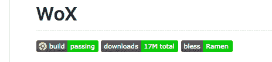

# 你最喜欢的无用回购/包/网站/等是什么？

> 原文:[https://dev . to/Andy/whats-your-favorite-unused-repopackagewebsite 等](https://dev.to/andy/whats-your-favorite-useless-repopackagewebsiteetc)

所以我正试图通过考虑决定完全放弃我的鼠标，只用键盘来治疗我的腕管。我浏览了最近一个关于 T1 的讨论帖子，发现了 T2 的 Wox 回购。它基本上是从 Windows 中启动的/。太棒了，今晚有个好的开始。

## 然后我注意到这一点:

[T2】](https://res.cloudinary.com/practicaldev/image/fetch/s--r9mjq4zU--/c_limit%2Cf_auto%2Cfl_progressive%2Cq_auto%2Cw_880/https://thepracticaldev.s3.amazonaws.com/i/6idersjpprxwqt45yzcb.png)

等等，什么？`bless | Ramen`？？？

原来是[一个祝福你代码](https://github.com/LunaGao/BlessYourCodeTag)的包。这太令人惊讶了，因为当我们努力工作(通常)为世界开发有用的工具时，有人花时间让 ramen 祝福我们的代码成为可能，这让我内心感觉很好。

所以我们在这里，在一个星期四的晚上:我，问你你最喜欢的无用编程是什么，而你，希望给我展示一个全新的世界。