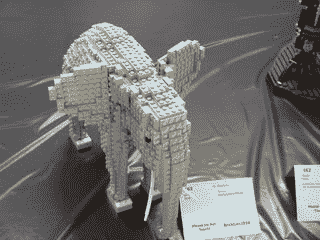

# 将您的意大利面条式代码转化为函数，第 2 部分

> 原文：<https://dev.to/monknomo/turn-your-spaghetti-code-into-functions-part-2>

先看[第一部分，](http://www.gunnargissel.com/turn-your-spaghetti-code-into-functions-part-1.html)。

在第 1 部分中，我们从[开始，这是一个常见业务逻辑代码的例子，](https://github.com/monknomo/If-Else-Block-Refactoring/blob/master/src/main/java/com/gunnargissel/suemez/businessrulerefactorexample/BusinessRulesEngine.java)和一个基于将大象塞进智能汽车的类比。我们做了一些重构来解开嵌套的 if/else 块，但在我们完成将大象塞进智能汽车后，我们离开了。

[T2】](https://res.cloudinary.com/practicaldev/image/fetch/s--YNLbFAlJ--/c_limit%2Cf_auto%2Cfl_progressive%2Cq_auto%2Cw_880/http://i.imgur.com/xfmb1Bs.png)

在许多方面，它感觉“足够好”，但如果我告诉你我们可以得到更好的呢？Java 8 给我们带来了一个新工具来包含和使用一个`if`语句中的逻辑——谓词。在大象驾驶汽车方面，我们可以让它驾驶一辆时尚的敞篷车。

所以你有很多条件逻辑，你发现自己从一个逻辑块复制粘贴条件到另一个逻辑块。很简单，很诱人，但是不对。复制粘贴是容易出错和额外的工作！如果你像我一样，你尽量少工作——那是计算机的工作。Java 8 提供了一个新的工具来防止复制粘贴并保持你的代码干燥。

使用谓词允许我们将逻辑封装为变量。这产生了两个特别强大的特性

1.  变量名传达了逻辑的意图
2.  逻辑是可重用的和可单独测试的

## 和现在，用谓语

在 Java 8 之前，我并不了解函数式编程的世界。我记得上一次听说谓语是在学校，当时我忽略了一节语法课。事实证明，在编程时，谓词确实可以改进您的代码。

[T2】](https://res.cloudinary.com/practicaldev/image/fetch/s--8U5l0UVJ--/c_limit%2Cf_auto%2Cfl_progressive%2Cq_auto%2Cw_880/https://i.imgur.com/jgs74pKm.jpg)

在这里，我们将通过在它们所代表的逻辑之外创建谓词来使`if/else`块更具可读性。谓词可以被命名，这允许开发人员以一种甚至允许与非技术用户进行清楚讨论的方式来命名规则。

```
static final Predicate<WidgetTransfer> suffientAmount = trans -> trans.getTransferer().getAccount(trans.getFromAccount()).getBalance().compareTo(trans.getAmount()) > 0;

static final Predicate<String> isPartner = ttc -> ttc.equals("200");

static final Predicate<String> isFriendsAndFamily = ttc -> ttc.equals("710");

static final Predicate<String> isFriendAndFamilyDiscountLegal = ac -> ac.matches("574|213|363|510");

static final Predicate<String> isPartneringArea = ac -> ac.matches("907|412|213");

static final Predicate<String> isDirigibleArea = ac -> ac.matches("213");

static final Predicate<String> isDirigibleCategory = cat -> cat.equals("D");

static final Predicate<String> isInternal = tc -> tc.equals("I");

public static final String checkWidgetTransfer(WidgetTransfer transfer){
String businessRuleErrors = " "；

```
String transferTypeCode = transfer.getTransferTypeCode();
String areaCode = transfer.getAreaCode();
String category = transfer.getTransferer().getCategory();
String typeCode = transfer.getTypeCode();

if (suffientAmount.test(transfer)) {
    businessRuleErrors += "Insufficient balance to transfer ; ";
}

if (isPartner.test(transferTypeCode)
        &amp;&amp; isPartneringArea.negate().test(areaCode)) {
    businessRuleErrors += "This area is not a transfer eligible area. ; ";
}

if (isPartner.test(transferTypeCode)
        &amp;&amp; isDirigibleArea.test(areaCode)
        &amp;&amp; isDirigibleCategory.test(category)) {
    businessRuleErrors += "D Category Transferer can only be transferred in transfer area 213\. ; ";
}

if (isFriendsAndFamily.test(transferTypeCode)
        &amp;&amp; isFriendAndFamilyDiscountLegal.negate().test(areaCode)) {
    businessRuleErrors += "This area is not an eligible area. ; ";

}

if (isInternal.negate().test(typeCode)
        &amp;&amp; !isBlockSize(transfer)) {
    businessRuleErrors += "Amount is too small for I type transfer. ; ";
}

if (isInternal.negate().test(typeCode)
        &amp;&amp; isTotalOverCap(transfer)) {
    businessRuleErrors += "This transfer is too large. ; ";
}

return businessRuleErrors; 
```

    Enter fullscreen mode 

    Exit fullscreen mode 

} 
```

Enter fullscreen mode Exit fullscreen mode

### 
  
好人

*   每个`if`块都是可读的，有点像“商务英语”
*   规则被定义为谓词
    *   这些规则是可移植和可重用的。
    *   这些规则也是可单独测试的，不需要一次测试每个分支

### 坏了

*   这种技术仍然使用`&&`,这对于 Java 中的函数来说并不习惯
    *   我们被迫使用`&&`,因为谓词采用不同类型的对象，所以我们不能将它们链接在一起
*   虽然组成规则的谓词是可移植的，但是规则本身是由多个谓词组成的，并且是不可移植的
*   没有什么是用普通方法做不到的
    *   美好的旧时光就够了
*   我们仍然需要创建所有这些属性变量，以便为我们的谓词获取适当的值

## 谓词链接

让我们修正前一个例子中“坏”列表上的一些东西。

我们可以去掉`&&`,方法是使用多一点的函数接口，并重构谓词，使它们都采用相同类型的对象，在本例中是一个`WidgetTransfer`对象。目标是让我们的谓词像乐高积木一样——互锁和可互换。

[T2】](https://res.cloudinary.com/practicaldev/image/fetch/s--O6uLK00---/c_limit%2Cf_auto%2Cfl_progressive%2Cq_auto%2Cw_880/https://i.imgur.com/OfJVe6hm.jpg)

```
static final Predicate<WidgetTransfer> suffientAmount = trans -> trans.getTransferer().getAccount(trans.getFromAccount()).getBalance().compareTo(trans.getAmount()) > 0;

static final Predicate<WidgetTransfer> isPartner = trans -> trans.getTransferTypeCode().equals("200");

static final Predicate<WidgetTransfer> isFriendsAndFamily = trans -> trans.getTransferTypeCode().equals("710");

static final Predicate<WidgetTransfer> isFriendAndFamilyDiscountLegal = trans -> trans.getAreaCode().matches("574|213|363|510");

static final Predicate<WidgetTransfer> isPartneringArea = trans -> trans.getAreaCode().matches("907|412|213");

static final Predicate<WidgetTransfer> isDirigibleArea = trans -> trans.getAreaCode().matches("213");

static final Predicate<WidgetTransfer> isDirigibleCategory = trans -> trans.getTransferer().getCategory().equals("D");

static final Predicate<WidgetTransfer> isInternal = trans -> trans.getTypeCode().equals("I");

static final Predicate<WidgetTransfer> isBlockSize = trans -> isBlockSize(trans);

static final Predicate<WidgetTransfer> isTotalOverCap = trans -> isTotalOverCap(trans);

public static final String checkWidgetTransfer(WidgetTransfer transfer){
String businessRuleErrors = " "；

```
if (suffientAmount.test(transfer)) {
    businessRuleErrors += "Insufficient balance to transfer ; ";
}

if (isPartner.and(isPartneringArea.negate()).test(transfer)) {
    businessRuleErrors += "This area is not a transfer eligible area. ; ";
}

if (isPartner.and(isDirigibleArea).and(isDirigibleCategory).test(transfer)) {
    businessRuleErrors += "D Category Transferer can only be transferred in transfer area 213\. ; ";
}

if (isFriendsAndFamily.and(isFriendAndFamilyDiscountLegal.negate()).test(transfer)) {
    businessRuleErrors += "This area is not an eligible area. ; ";
}

if (isInternal.negate().and(isBlockSize.negate()).test(transfer)) {
    businessRuleErrors += "Amount is too small for I type transfer. ; ";
}

if (isInternal.negate().and(isTotalOverCap.negate()).test(transfer)) {
    businessRuleErrors += "This transfer is too large. ; ";
}

return businessRuleErrors; 
```

    Enter fullscreen mode 

    Exit fullscreen mode 

} 
```

Enter fullscreen mode Exit fullscreen mode

### 
  
好人

*   我们去掉了保存来自`WidgetTransfer`对象的字符串值的额外变量
*   我们在保持可读性的同时压缩了我们的`if`块
*   我们只评估一种类型的对象

### 坏了

这个重构点没有什么不好。这些条件句都很容易读懂。很清楚每个规则是什么，以及哪个分支。如果我不知道我对下一篇文章有什么计划，我会满意地停在这里。

## 下一步

[T2】](https://res.cloudinary.com/practicaldev/image/fetch/s--2PCz-rg2--/c_limit%2Cf_auto%2Cfl_progressive%2Cq_auto%2Cw_880/https://i.imgur.com/N5Xf1IB.png)

我们所有的规则都是谓词，并且每个规则都接受相同类型的对象，一个`WidgetTransfer`。这使得我们的规则可以按照上面演示的方式组合，但是我们可以对如何组合业务规则进行一些改进。

第一个改进是将小规则组合成更大的规则——我们在条件语句中这样做，但在谓词中也一样容易。我们还可以创建一个`Validator`对象来创建业务规则和错误消息的集合。一个`Validator`免除了创建一个复杂的嵌套 if/else 逻辑结构的需要，并且是一个可以共享、重用和测试的业务逻辑的具体单元。

[注册我的电子邮件列表，以获得关于后续系列更新的通知，以及有趣的编程和技术领导文章的每月摘要](http://www.gunnargissel.com/pages/email-signup-1.html)

我们将在即将编写的*把你的面条式代码变成函数，第三部分*中使用`Validators`

## 学分

*感谢 [roebot](https://www.flickr.com/photos/roebot/) 的[朝左智能车](https://flic.kr/p/73uXD3)T5】*

*感谢[奥利佛·多德](https://www.flickr.com/photos/oliverdodd/)给了[大象](https://flic.kr/p/8N681r)T5】*

*谢谢[菲利普·佩萨尔](https://www.flickr.com/photos/southbeachcars/)的[敞篷车](https://flic.kr/p/dvLhLi)T5】*

*感谢 JPL 和美国国家航空航天局/太空望远镜科学研究所拍摄的边缘星系图片*

*感谢 [Philip Sheldrak](https://www.flickr.com/photos/philip_sheldrake/) 的[文法学校](https://flic.kr/p/8AaePC)T5】*