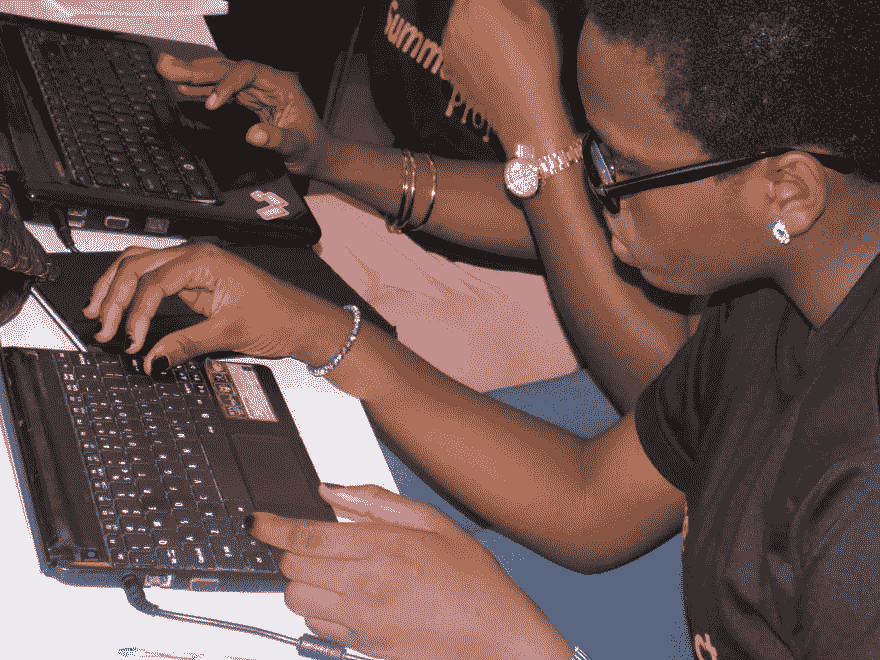
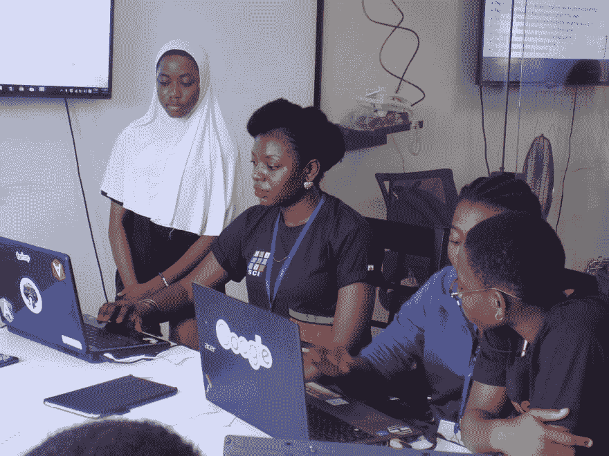
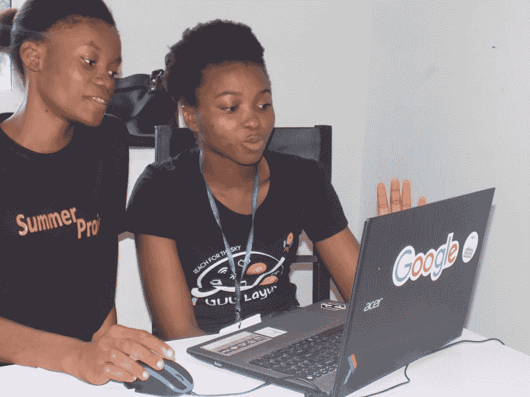
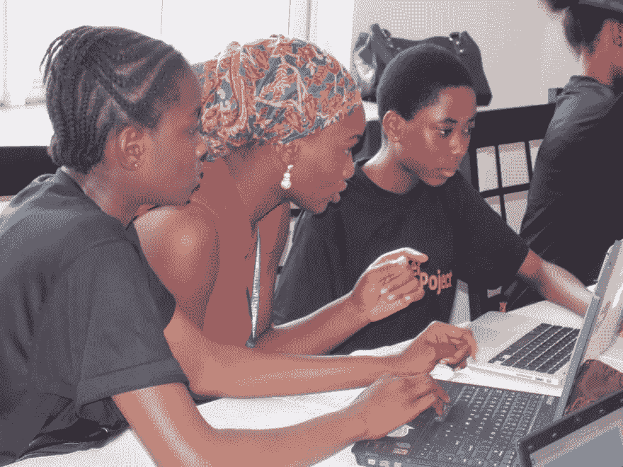
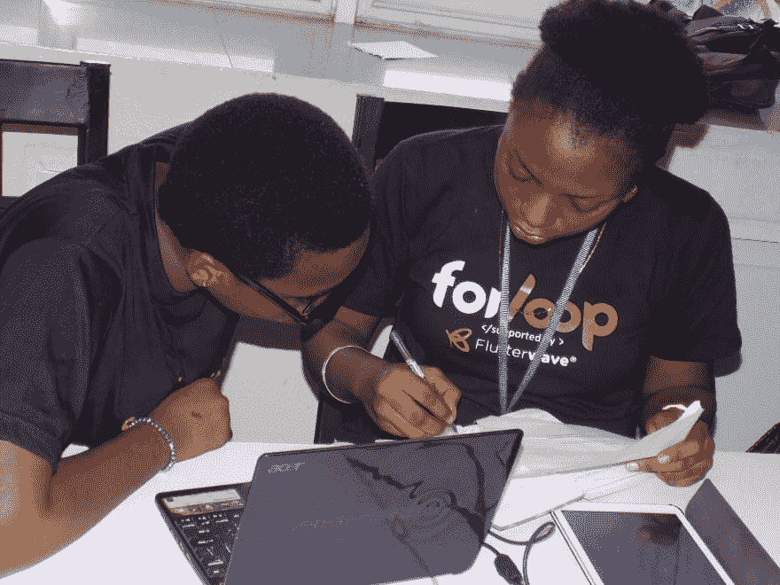
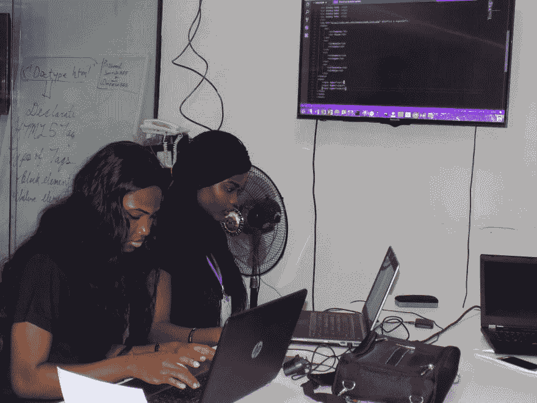

# 教中学女生编程——我的经验

> 原文:[https://dev . to/kolokodess/teaching-second-school-girls-code-my-experience](https://dev.to/kolokodess/teaching-secondary-school-girls-to-code---my-experience)

2017 年初，我制定了一个为期一年的目标，其中一个目标是能够通过影响我周围年轻女孩的生活来回馈科技社区。

作为女孩技术教育和女性技术的倡导者，加上我对编写代码的热爱，我参加了以女性技术为重点的活动(作为参与者和组织者)，并经营我的组织“她编码非洲”。我选择从一个目标(如上所述)开始，教和指导年轻女孩(免费)从中学开始写代码。

我特别选择了中学类别，因为我觉得他们在归类为“草根”的群体中占了更大的一部分，给他们一个在年轻时学习编程的机会，给他们在学院/大学选择 STEM 相关课程的更大和更高的机会，并在未来让他们在 STEM 领域承担更多的角色，并最终弥合技术中的性别差距。我决定将我的项目命名为“夏季项目”,因为它将贯穿整个暑假。

话不多说，我将分享培训中的一些图片:

[T22】](https://res.cloudinary.com/practicaldev/image/fetch/s--yPemwDyF--/c_limit%2Cf_auto%2Cfl_progressive%2Cq_auto%2Cw_880/https://thepracticaldev.s3.amazonaws.com/i/z2l38n2g0pjjn0kgxvj7.JPG)

要了解更多关于活动进展、我的经历、教训以及对女士们的整体影响，请点击[此处](https://medium.com/@kolokodess/teaching-secondary-school-girls-to-code-my-experience-a4d1e7052f89)

我希望把这变成一个季度活动，有更多的赞助商和更大的团队，扩展到尼日利亚和非洲的更多中心，我一直对赞助谈判持开放态度，如果你需要更多关于下一次活动的信息或你可以如何帮助，请在下面留下评论，我将非常高兴与你联系。