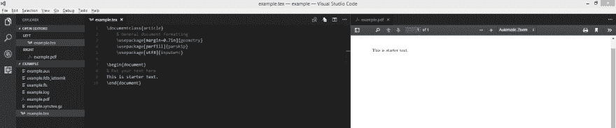

# 还是用乳胶吧！

> 原文：<https://dev.to/nickymarino/lets-use-latex>

*这篇文章最初发表在我的博客[这里](http://nickymarino.com/2017/09/07/lets-use-latex/)。*

LaTeX 是一个漂亮的文档系统。它类似于 Markdown，但有更多的功能，通常用于需要大量方程的学术论文和其他出版物。在这个快速操作指南中，我们将介绍如何安装 LaTeX 以及如何将 Visual Studio 代码用作编辑器/预览器。

# 安装乳胶

我推荐下载 Windows/Linux 的 [TeX Live](https://www.tug.org/texlive/) ，macOS 的 [MacTex](https://www.tug.org/mactex/) 。

# 设置我们的编辑器

如果你还没有，安装 [Visual Studio 代码](https://code.visualstudio.com/)并浏览[教程](https://code.visualstudio.com/docs/introvideos/basics)。然后，我们需要为 LaTeX 本身安装扩展。前往[乳胶车间](https://marketplace.visualstudio.com/items?itemName=James-Yu.latex-workshop)，点击安装。

# 使用乳胶

现在我们已经设置了编辑器，我们可以编写我们的第一个项目了。所有 LaTeX 文档都有一个以`.tex`结尾的(非空白)文件，它是包含文档所有文本的“主”文件。因为 LaTeX 通常会生成更多的文件(比如。日志等。)在构建文档时，建议您要编写的每个文档都有自己的文件夹。

首先，创建一个名为`example.tex` :
的文件

```
\documentclass{article}
    % General document formatting
    \usepackage[margin=0.7in]{geometry}
    \usepackage[parfill]{parskip}
    \usepackage[utf8]{inputenc}

\begin{document}
% Put your text here
This is starter text.
\end{document} 
```

Enter fullscreen mode Exit fullscreen mode

按下`Ctrl-Alt-B`构建你的项目(或者使用命令面板)，然后按下`Ctrl-Alt-T`在一个新标签中查看 pdf。最终结果应该是这样的:

[T2】](https://res.cloudinary.com/practicaldev/image/fetch/s--EuobviiX--/c_limit%2Cf_auto%2Cfl_progressive%2Cq_auto%2Cw_880/https://thepracticaldev.s3.amazonaws.com/i/h7udmn31hzf8cdc3zcwb.PNG)

# 结论

LaTeX 和 VSCode 是一个很好的组合，可以用来编写漂亮的报告和论文。查看一个[教程](https://www.latex-tutorial.com/tutorials/)或[两个](http://www.rpi.edu/dept/arc/training/latex/class-slides-pc.pdf)来了解 LaTeX 提供的全部体验。

*编辑:[范妮](https://dev.to/fannyvieira)推荐另一个[很棒的教程](https://github.com/LewisVo/Begin-Latex-in-minutes)。*
*编辑 2:修复了一个教程链接。*