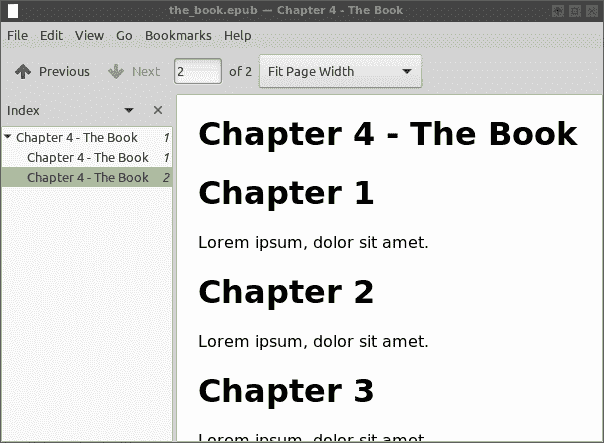
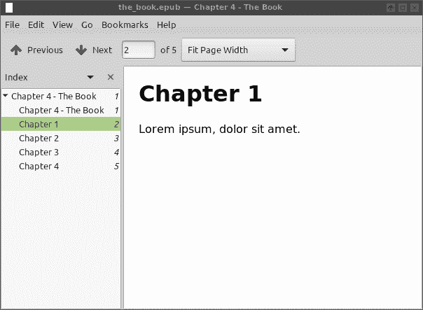
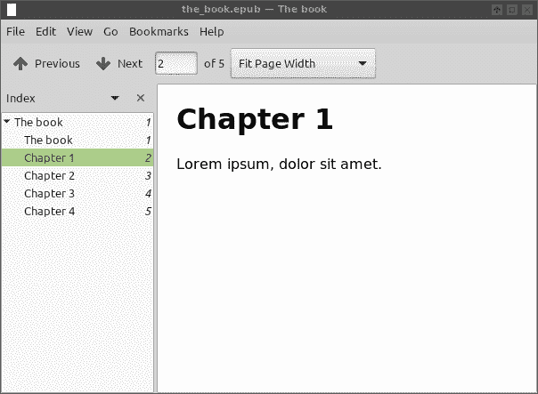

# 帮助 pandoc 从 HTML 输入生成正确的目录

> 原文:[https://dev . to/brthanmathwoag/helping-pandoc-generate-a-correct-table-of-contents-from-html-input-27im](https://dev.to/brthanmathwoag/helping-pandoc-generate-a-correct-table-of-contents-from-html-input-27im)

**TL；博士:**

*   **pandoc 希望章节标题直接放在`body`节点中。不允许使用`<div>`包装。**
*   **pandoc 在其看到的最后一个`<title>`标签后设置图书标题(例如命令行上的最后一个文件)。**

自从我上次不得不将 HTML 电子书转换成 EPUB 以来，已经有很长时间了。上次我做的时候，我无法让 calibre 将章节按照正确的顺序排列，我非常生气，以至于我试图用 [bash 和一堆 regexen](https://github.com/brthanmathwoag/ebooks/) 手工制作这个文件。这当然是一个有趣的实验，在这个过程中我学到了很多关于 EPUB 内部的东西。我还了解到，虽然[可以用 regex](https://stackoverflow.com/questions/1732348/regex-match-open-tags-except-xhtml-self-contained-tags#answer-1733489) 解析有限的已知 HTML 集合，但是使用实际的 HTML 解析器要方便得多。

从那时起，我就爱上了 pandoc，并在各种项目中广泛使用它，比如 T2 2 T3。所以当我最近想在我的 Kindle 上阅读 [F#编程 Wikibook](https://dev.to/brthanmathwoag/f-programming-wikibook-in-epub-and-mobi-formats-temp-slug-7806038) 时，我知道我会使用 pandoc 进行转换。

当我检查生成的文件，发现生成的目录只包含一个条目，并以本书的最后一章命名时，我的热情有所下降。这不仅仅是导航中断的问题。

EPUB 文件本质上是一个 zip 存档文件，其中的章节存储在单独的 HTML 文件中。由于这一点，电子书阅读器可以一个一个地打开它们，这意味着更快的加载时间和更低的内存占用。因为 pandoc 不知道如何将这本书分成章节，所以它将它们都放在一个文件中，所以我的读者必须在显示任何内容之前啧啧有声地格式化整个文本——每次打开这本书都要停顿一分钟以上。

对于 HTML 输入，pandoc 应该从`<h1>`、`<h2>`、...`<h6>`加价。经过一些试验，结果是 **pandoc 希望章节标题直接放在`body`节点**内。虽然这对于为打包成 EPUB 的唯一目的而编写的文档来说是有意义的，但对于互联网上的 HTML 页面来说却很少如此，在那里你经常会发现实际内容被包装在几层`div`中(或者是表格，如果你不幸漫游在这样危险的、被上帝遗忘的地方)。

这里有一个测试案例。比如说，我们有一本名为*的书*，它由四章组成:

```
seq 1 4 | while read idx; do
    > "ch$idx.html" <<EOF
<html>
    <head>
        <title>Chapter $idx - The Book</title>
    </head>
    <body>
        <div>
            <div>
                <div id="content">
                    <h1>Chapter $idx</h1>
                    <p>Lorem ipsum, dolor sit amet.</p>
                </div>
            </div>
        </div>
    </body>
</html>    
EOF

done 
```

<svg width="20px" height="20px" viewBox="0 0 24 24" class="highlight-action crayons-icon highlight-action--fullscreen-on"><title>Enter fullscreen mode</title></svg> <svg width="20px" height="20px" viewBox="0 0 24 24" class="highlight-action crayons-icon highlight-action--fullscreen-off"><title>Exit fullscreen mode</title></svg>

当我们将它们提供给 pandoc 时，我们得到一个带有标题页和单个章节的破碎的 TOC，跨越所有的输入文件:

```
pandoc -o the_book.epub ch*.html 
```

<svg width="20px" height="20px" viewBox="0 0 24 24" class="highlight-action crayons-icon highlight-action--fullscreen-on"><title>Enter fullscreen mode</title></svg> <svg width="20px" height="20px" viewBox="0 0 24 24" class="highlight-action crayons-icon highlight-action--fullscreen-off"><title>Exit fullscreen mode</title></svg>

[T2】](https://res.cloudinary.com/practicaldev/image/fetch/s--iI9b18mw--/c_limit%2Cf_auto%2Cfl_progressive%2Cq_auto%2Cw_880/https://blog.tznvy.eu/i/pandoc-chapters1.png)

为了修复目录，我们必须帮助 pandoc 一点，将`<h1>`移到树的上方，直到它们成为`body`的子节点。下面是我们如何用 Python 和[美汤](https://www.crummy.com/software/BeautifulSoup/)做到这一点:

**fix.py:**

```
import bs4

filenames = [
    'ch1.html', 'ch2.html', 'ch3.html', 'ch4.html'
]

for filename in filenames:
    with open(filename, 'r') as f:
        soup = bs4.BeautifulSoup(f, 'lxml')

    current = soup.find(id='content')
    while current.name != 'body':
        parent = current.parent
        current.unwrap()
        current = parent

    out_filename = filename.replace('.', '-flat.')
    with open(out_filename, 'w') as f:
        f.write(soup.prettify()) 
```

<svg width="20px" height="20px" viewBox="0 0 24 24" class="highlight-action crayons-icon highlight-action--fullscreen-on"><title>Enter fullscreen mode</title></svg> <svg width="20px" height="20px" viewBox="0 0 24 24" class="highlight-action crayons-icon highlight-action--fullscreen-off"><title>Exit fullscreen mode</title></svg>

对于每个指定的文件，脚本创建 DOM 并找到具有实际内容的节点——在本例中，是具有`content` ID 的节点(如果您的 div 没有分配 ID，但它有一个特定的类，您可以使用`soup.find(class_='...')`来获取它)。对`unwrap`方法的调用用它的子节点替换了节点，我们沿着树向上移动到被删除节点的父节点。重复该代码，直到到达`body`节点。最后，DOM 被保存到一个文件名后附加了`-flat`的文件中。

```
python fix.py

pandoc \
    -o the_book.epub \
    ch1-flat.html \
    ch2-flat.html \
    ch3-flat.html \
    ch4-flat.html 
```

<svg width="20px" height="20px" viewBox="0 0 24 24" class="highlight-action crayons-icon highlight-action--fullscreen-on"><title>Enter fullscreen mode</title></svg> <svg width="20px" height="20px" viewBox="0 0 24 24" class="highlight-action crayons-icon highlight-action--fullscreen-off"><title>Exit fullscreen mode</title></svg>

[T2】](https://res.cloudinary.com/practicaldev/image/fetch/s--BjdXnCE6--/c_limit%2Cf_auto%2Cfl_progressive%2Cq_auto%2Cw_880/https://blog.tznvy.eu/i/pandoc-chapters2.png)

那更好。章节被正确地检测和分割，但是最上面的两个条目，应该是书名，却被错误地标注为*第 4 章——书*。您可能已经注意到，这是命令行上最后一个文件的`<title>`中的文本。

**pandoc 在`<title>`节点的内容后设置书名。当用多个输入文件调用并且有不止一个`<title>`标记时，pandoc 使用最后看到的一个。**但是对于跨越几个 HTML 文档的电子书来说，`<title>`通常表示章节名称，不应该影响书名。

为了解决这个问题，我们必须再次深入 HTML<sup>3</sup>，确保在我们的输入文件中只有一个`<title>`标签，并且它被设置为想要的书名:

```
actual_title = 'The Book'

title_node = soup.find('title')
if filename == filenames[0]:
    title_node.string = actual_title
else:
    title_node.extract() 
```

<svg width="20px" height="20px" viewBox="0 0 24 24" class="highlight-action crayons-icon highlight-action--fullscreen-on"><title>Enter fullscreen mode</title></svg> <svg width="20px" height="20px" viewBox="0 0 24 24" class="highlight-action crayons-icon highlight-action--fullscreen-off"><title>Exit fullscreen mode</title></svg>

最后，目录看起来和预期的一样:

```
pandoc \
    -o the_book.epub \
    ch1-flat.html \
    ch2-flat.html \
    ch3-flat.html \
    ch4-flat.html 
```

<svg width="20px" height="20px" viewBox="0 0 24 24" class="highlight-action crayons-icon highlight-action--fullscreen-on"><title>Enter fullscreen mode</title></svg> <svg width="20px" height="20px" viewBox="0 0 24 24" class="highlight-action crayons-icon highlight-action--fullscreen-off"><title>Exit fullscreen mode</title></svg>

[T2】](https://res.cloudinary.com/practicaldev/image/fetch/s--lveER6fI--/c_limit%2Cf_auto%2Cfl_progressive%2Cq_auto%2Cw_880/https://blog.tznvy.eu/i/pandoc-chapters3.png)

* * *

这应该是由 Preferences→Plugins→HTML to ZIP plugin 中的[广度优先顺序开关控制的，但是设置它似乎没有任何效果。↩](https://manual.calibre-ebook.com/faq.html#how-do-i-convert-a-collection-of-html-files-in-a-specific-order)

我的论文是显而易见的，但也是静态网站生成——这个博客和 [ninjastyles.tznvy.eu](https://ninjastyles.tznvy.eu) 都运行在 pandoc 和一些 Python 魔术上。↩

这实际上听起来像是正则表达式的一个很好的用例。或者`$EDITOR`，如果只有几个文件的话。但是为了保持一致，我们还是用 Python 来做吧。↩

*本帖原载于[blog . tznvy . eu](https://blog.tznvy.eu/2017-09-07-why-does-pandoc-generate-broken-toc-from-html-input)T3】*