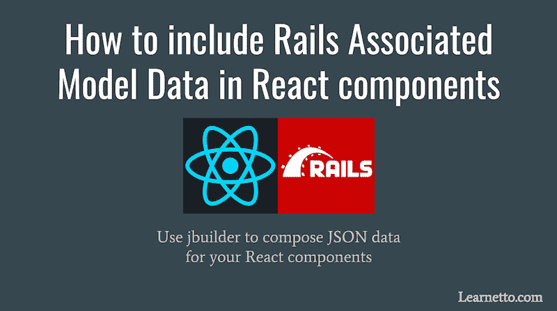

# 如何在 React 组件中包含 Rails 关联的模型数据

> 原文:[https://dev . to/learnetto/how-to-include-rails-associated-model-data-in-react-components](https://dev.to/learnetto/how-to-include-rails-associated-model-data-in-react-components)

[T2】](https://res.cloudinary.com/practicaldev/image/fetch/s--yUxy0fbX--/c_limit%2Cf_auto%2Cfl_progressive%2Cq_auto%2Cw_880/https://thepracticaldev.s3.amazonaws.com/i/llktezafpkhw58bxc8st.png)

*最初发表于[Learnetto.com](https://learnetto.com/blog/how-to-include-rails-associated-model-data-in-react-components)T3。*

当您开始在 Rails 中使用 React 时，您很快会遇到的一个令人沮丧的问题是试图从 React 组件中访问相关的模型数据。

假设我们正在用 Rails 和 React 构建一个聊天应用。我们有三个模型，聊天室，消息和用户，它们之间的关系如下:

```
class Chatroom < ApplicationRecord
  has_many :messages, dependent: :destroy
end

class Message < ApplicationRecord
  belongs_to :chatroom
  belongs_to :user
end

class User < ApplicationRecord
  has_many :messages, dependent: :destroy
end 
```

<svg width="20px" height="20px" viewBox="0 0 24 24" class="highlight-action crayons-icon highlight-action--fullscreen-on"><title>Enter fullscreen mode</title></svg> <svg width="20px" height="20px" viewBox="0 0 24 24" class="highlight-action crayons-icon highlight-action--fullscreen-off"><title>Exit fullscreen mode</title></svg>

我们有一个[消息组件](https://github.com/learnetto/reactchat/blob/master/client/app/bundles/Chatroom/components/Message.jsx)，用于呈现单个消息:

```
import React from 'react'

const Message = ({message}) => 

    {message.user.name}: {message.body}

export default Message 
```

<svg width="20px" height="20px" viewBox="0 0 24 24" class="highlight-action crayons-icon highlight-action--fullscreen-on"><title>Enter fullscreen mode</title></svg> <svg width="20px" height="20px" viewBox="0 0 24 24" class="highlight-action crayons-icon highlight-action--fullscreen-off"><title>Exit fullscreen mode</title></svg>

除了消息正文之外，我们还希望显示用户名。

如果您使用的是标准的 Rails ERB 或 Haml 视图模板，您可以简单地编写如下代码:

```
<%= @message.user.name %> 
```

<svg width="20px" height="20px" viewBox="0 0 24 24" class="highlight-action crayons-icon highlight-action--fullscreen-on"><title>Enter fullscreen mode</title></svg> <svg width="20px" height="20px" viewBox="0 0 24 24" class="highlight-action crayons-icon highlight-action--fullscreen-off"><title>Exit fullscreen mode</title></svg>

即使您没有在控制器的数据库查询中包含用户数据，这也是可行的。

然而，与 Rails 视图不同，如果我们在 React 组件内部调用`message.user.name`,而没有在发送给组件的属性中明确包含该数据，它将抛出一个错误

虽然 Rails 模板实际上能够动态地调用模型并获得它没有的数据，但 React 却没有这种能力。

我们需要用相关的用户模型数据显式地组合 JSON，因为 React 组件只能访问我们提供给它的 JSON 数据。

有许多方法可以包含关联的模型数据，包括在控制器中手动组成 JSON，在模型上定义 custom*as _ JSON*method 或者使用[activemodelserializer](https://github.com/rails-api/active_model_serializers)。

最干净和最灵活的方法之一是使用—[jbuilder](https://github.com/rails/jbuilder),它为您提供了一种简单的领域特定语言(DSL)来声明 JSON 结构。jbuilder gem 包含在 Rails 中。

在上面的例子中，我们可以将用户数据包含在消息 JSON 中，方法是在一个 [_message.json.jbuilder](https://github.com/learnetto/reactchat/blob/master/app/views/messages/_message.json.jbuilder) 文件中定义它，如下所示:

```
json.(message, :body, :id)
json.user do
  json.extract! message.user, :id, :name, :image
end 
```

<svg width="20px" height="20px" viewBox="0 0 24 24" class="highlight-action crayons-icon highlight-action--fullscreen-on"><title>Enter fullscreen mode</title></svg> <svg width="20px" height="20px" viewBox="0 0 24 24" class="highlight-action crayons-icon highlight-action--fullscreen-off"><title>Exit fullscreen mode</title></svg>

jbuilder DSL 非常强大，允许您对数据进行各种定制。

例如，假设我们希望将特定聊天室的所有消息和用户数据按时间顺序发送到一个聊天室组件。我们可以这样定义[聊天室 JSON](https://github.com/learnetto/reactchat/blob/master/app/views/chatrooms/_chatroom.json.jbuilder)—

```
json.(chatroom, :name, :id)
json.messages(chatroom.messages
                .sort_by{|m| m[:created_at]}) do |message|
  json.extract! message, :id, :body
  json.user do
    json.extract! message.user, :id, :name, :image
  end
end 
```

<svg width="20px" height="20px" viewBox="0 0 24 24" class="highlight-action crayons-icon highlight-action--fullscreen-on"><title>Enter fullscreen mode</title></svg> <svg width="20px" height="20px" viewBox="0 0 24 24" class="highlight-action crayons-icon highlight-action--fullscreen-off"><title>Exit fullscreen mode</title></svg>

查看 jbuilder 文档,了解更多关于它的特性。

聊天应用的完整代码在 Github 上[，这里有一个](https://github.com/learnetto/reactchat)[现场演示在运行](https://reactrooms.herokuapp.com)。

你也可以在这个分为两部分的视频教程中学习如何自己构建它——如何用 Rails 5.1 ActionCable 和 React.js 构建一个聊天应用第一部分和[第二部分](https://learnetto.com/tutorials/how-to-build-a-chat-app-with-rails-5-1-actioncable-and-react-js-part-2)。