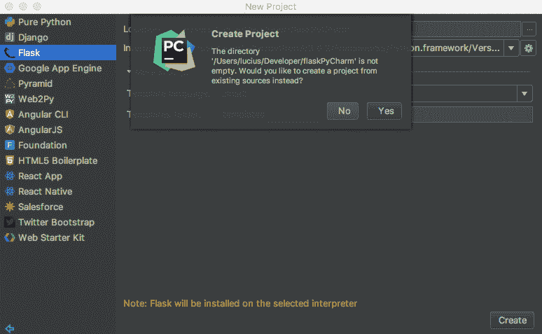
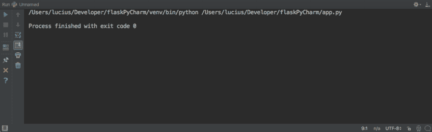

# 烧瓶和 PyCharm 的问题

> 原文:[https://dev . to/kurzgedanke/problems-with-flask-and-py charm-8 C1](https://dev.to/kurzgedanke/problems-with-flask-and-pycharm-8c1)

我开始了一个新的 Flask 项目，并用 VisualCode 和一个终端进行编码。因此，我设置了我的虚拟环境，安装了 Flask，并在 [Flask Quistart](http://flask.pocoo.org/docs/0.12/quickstart/) 之后开始编码。

代码是这样的:

```
from flask import Flask
app = Flask( __name__ )

@app.route('/')
def hello_world():
    return 'Hello, World!' 
```

<svg width="20px" height="20px" viewBox="0 0 24 24" class="highlight-action crayons-icon highlight-action--fullscreen-on"><title>Enter fullscreen mode</title></svg> <svg width="20px" height="20px" viewBox="0 0 24 24" class="highlight-action crayons-icon highlight-action--fullscreen-off"><title>Exit fullscreen mode</title></svg>

然后我用
运行这个应用

```
$ export FLASK_APP=hello.py
$ flask run
 * Running on http://127.0.0.1:5000/ 
```

<svg width="20px" height="20px" viewBox="0 0 24 24" class="highlight-action crayons-icon highlight-action--fullscreen-on"><title>Enter fullscreen mode</title></svg> <svg width="20px" height="20px" viewBox="0 0 24 24" class="highlight-action crayons-icon highlight-action--fullscreen-off"><title>Exit fullscreen mode</title></svg>

由于对 Web 应用程序的强大支持，我决定改用 PyCharm。我将项目导入 PyCharm，将解释器设置为 virtualenv，但是当它运行时什么也没发生…

如果你有同样的问题:感到受欢迎，我有解决办法！

创建一个新项目，选择 flask 模板并选择您现有的 Flask 项目文件夹。对要求您从现有源代码创建项目的弹出窗口说`yes`。

[T2】](https://res.cloudinary.com/practicaldev/image/fetch/s--oRSC3VsG--/c_limit%2Cf_auto%2Cfl_progressive%2Cq_auto%2Cw_880/https://kurzgedanke.de/img/flaskPyCharm/newProject.png)

你的项目现在应该打开了，你可以在设置中将你的解释器改成你想要的样子。

如果您现在尝试运行该应用程序，您应该会看到类似这样的内容:

[T2】](https://res.cloudinary.com/practicaldev/image/fetch/s--_svcwV_g--/c_limit%2Cf_auto%2Cfl_progressive%2Cq_auto%2Cw_880/https://kurzgedanke.de/img/flaskPyCharm/nothing.png)

我尝试了所有的方法，但是解决方案非常简单…把这个加到你代码的末尾:

```
if __name__ == ' __main__':
    app.run() 
```

<svg width="20px" height="20px" viewBox="0 0 24 24" class="highlight-action crayons-icon highlight-action--fullscreen-on"><title>Enter fullscreen mode</title></svg> <svg width="20px" height="20px" viewBox="0 0 24 24" class="highlight-action crayons-icon highlight-action--fullscreen-off"><title>Exit fullscreen mode</title></svg>

并且你的控制台应该输出`* Running on http://127.0.0.1:5000/ (Press CTRL+C to quit)`。

如果你想了解更多关于`if __name__ == ' __main__':`系列的信息，我可以推荐[科里·斯查费](https://www.youtube.com/watch?v=sugvnHA7ElY&feature=youtu.be)的这个视频。

感谢您的阅读！