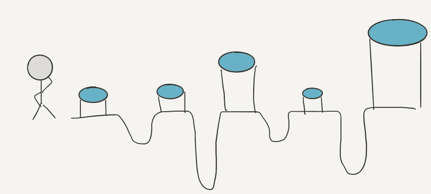
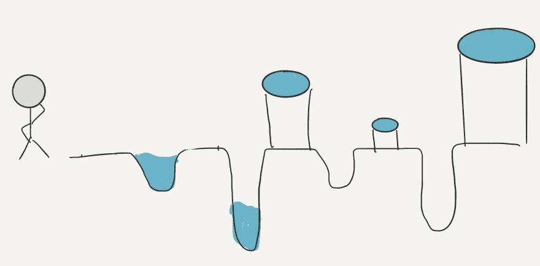
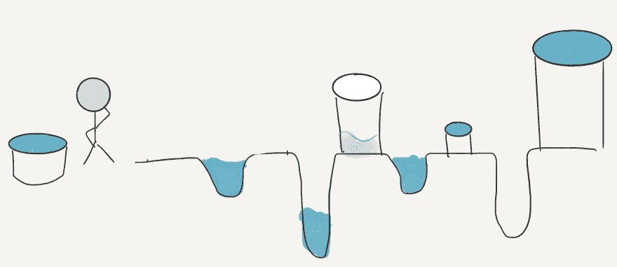
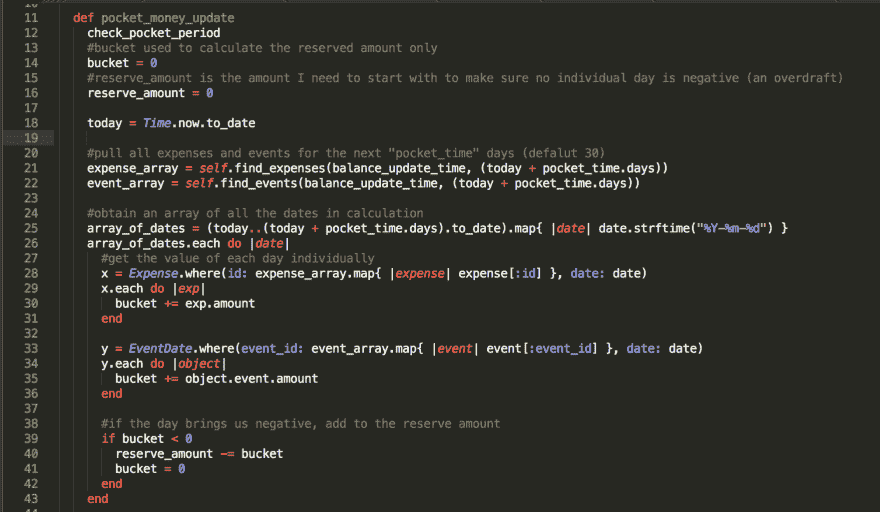
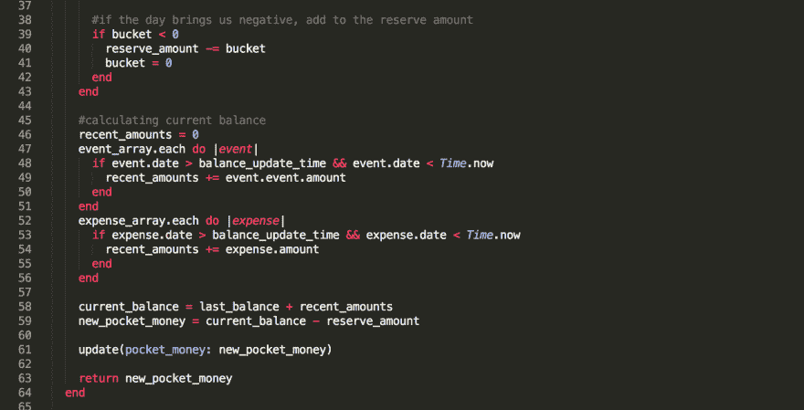

# 我的零花钱算法

> 原文:[https://dev.to/jhiatt/my-pocketmoney-algorithm](https://dev.to/jhiatt/my-pocketmoney-algorithm)

当我制作第一个全功能的 Ruby on Rails 应用程序时(在 GitHub 上[这里](https://github.com/jhiatt/pocket-money-app/blob/master/app/models/account.rb)，我想创建一个强大的应用程序，可以回答现实世界的问题。我希望它回答的问题是:“我现在能花多少钱？或者换句话说“我口袋里有多少钱？(看到我在那里做了什么吗？)
得到这个答案比我最初预想的要复杂一些。我有用户的经常性费用；我知道会有哪些账单，以及会有多少钱进来，我可以算出他们会有多少非固定支出。我还可以计算出他们现在在银行有多少存款，因为我有他们自上次给我银行余额以来的所有非固定支出。起初，我认为计算他们现在可以花多少钱很简单:

1.  计算他们现在银行里有多少钱
2.  计算他们那个月还有多少没有花掉的零花钱

然后我停下来想了想，我意识到还有另一个问题。如果你的月薪是 3000 美元。开始时 1500 美元，中间 1500 美元，你这个月的总支出只有 2500 美元，但你的租金和汽车付款都应在这个月的第一周支付，共计 1800 美元。过了这个月的第一周，你就会没钱了。挑战在于找出上个月末你必须持有的最低金额，以满足你本月的账单。

## 斗和坑

为了得到这个数字，我想出了一个叫做水桶和坑的寓言。想象有一个农民，名叫**农民**，和许多农民一样，他非常自觉地节约用水。他有一个装满水的水库，沿着他的农场，地面上有几个洞，因为一些特殊和非常重要的原因，需要装满水。除了蓄水池，他还在每个洞旁边放了雨水桶，里面可能有水，也可能没有水。当然，由于他耕作方法的复杂性，坑和桶大小不一，很少相互匹配。

[T2】](https://res.cloudinary.com/practicaldev/image/fetch/s--mbZKQYI---/c_limit%2Cf_auto%2Cfl_progressive%2Cq_auto%2Cw_880/https://thepracticaldev.s3.amazonaws.com/i/rgqunigeb6duy36295pf.jpg)

所以，如果你和我一起到目前为止，希望你正在描绘一个男人站在一系列装满水的桶和不同大小的空坑前。农民是一个有点古怪的有条不紊的人，他拒绝来回多次去水库，所以他一次去一个坑，看看他需要带多少水。

[T2】](https://res.cloudinary.com/practicaldev/image/fetch/s--94H97vc8--/c_limit%2Cf_auto%2Cfl_progressive%2Cq_auto%2Cw_880/https://thepracticaldev.s3.amazonaws.com/i/if75fvghkx42td2gyt79.jpg)

他把第一桶水倒在第一个坑里，看到它匹配得很好，既没有多余的水，也没有漏水。他移动到第二个坑，并意识到他错过了相当多的水。你可能已经猜到，也可能没有猜到，这个寓言中的每一对一桶一坑在我的代码中代表一天。水是收入，坑是支出。稍后你会看到这些集合在一起代表变量**桶**。
因为他很古怪，**农民**拒绝将第三个坑上的水桶用于第二个坑，所以他回去装满了一个更大的水桶，他的**储备**，刚好装满他需要的 2 号坑的水。然后他继续前进，意识到 3 号坑的水比 3 号坑需要的多得多，所以他把多余的水留在了 4 号坑。

[T2】](https://res.cloudinary.com/practicaldev/image/fetch/s--4_YLj32f--/c_limit%2Cf_auto%2Cfl_progressive%2Cq_auto%2Cw_880/https://thepracticaldev.s3.amazonaws.com/i/c6s80pzlnhxfnfn7r0a8.jpg)

到目前为止你和我在一起吗？**农民**拒绝在任何一个矿坑用完水(就像你的银行账户拒绝在不触发透支的情况下用完钱一样),所以他仔细检查并精确计算他需要带多少水作为**储备**,这样就不会发生这种情况。他不在乎最后剩下多少水，但他希望开始时储备的水越少越好。

## 从寓言走向现实生活

现在让我们看看代码。我将跳过引入事务等的方法(如果您想查看完整的模型，请单击此处)。让我们一步一步来。

[T2】](https://res.cloudinary.com/practicaldev/image/fetch/s--alNc4V5y--/c_limit%2Cf_auto%2Cfl_progressive%2Cq_auto%2Cw_880/https://thepracticaldev.s3.amazonaws.com/i/2asy194slkl7p56qqeje.png)

1.  让我们把一天中所有的积极和消极的交易加在一起。我们称之为**桶**。我们在第 26 行循环计算每一天，然后在第 29 行和第 34 行分别循环计算当天的相关费用(x)和固定费用/收入(y)。
2.  让我们看看今天的桶是正的还是负的(第 39 行)。如果是正数(或零)，我们可以将**桶**中的金额转移到第二天。如果是负数，我们需要将正数金额添加到我们的**储备** (reserve_amount)并将**桶**余额设置为零，因为我们已经考虑了储备中的不足。
3.  一旦我们完成了所有的日子，我们就精确地计算出我们现在在银行里有多少钱(即水库，在第 45-58 行中计算),并从我们的当前余额中减去**储备**金额。这就变成了我们的零花钱，也就是我们今天可以花掉而将来不会拖欠账单的钱。

[T2】](https://res.cloudinary.com/practicaldev/image/fetch/s--OjoBEOn3--/c_limit%2Cf_auto%2Cfl_progressive%2Cq_auto%2Cw_880/https://thepracticaldev.s3.amazonaws.com/i/qlwo7ivtp42loouufl1v.png)

记住，就像**农民**不在乎自己最后的水多不多一样，我们也不在乎自己最后一桶里有没有多余的钱，只要一路上没有用完。bucket 变量(只能是正数)中剩下的任何东西都不会影响我们的零花钱余额。
我希望你喜欢我的小算法。这是一个充满压力的喜悦，我为此感到自豪。但是，因为 GitHub 保留了历史，并且作品从未真正丢失，所以我很乐意用更好的来替换它。让我知道你的想法！
一如既往，如果您在代码中发现任何错误或发现可疑之处，也请告诉我。我一直在寻求改进，不幸的是，我在 TDD 方面的实验没有扩展到应用程序的这一部分(见我的[文章](https://dev.to/jhiatt/when-to-tdd-test-driven-develop-a-newbies-story))。也许有一天！